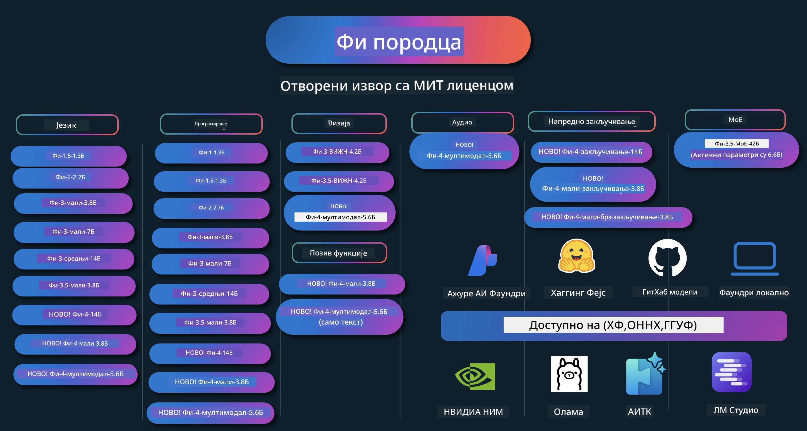

# Phi Cookbook: Практични примери са Phi моделима компаније Microsoft

[](https://codespaces.new/microsoft/phicookbook)
[](https://vscode.dev/redirect?url=vscode://ms-vscode-remote.remote-containers/cloneInVolume?url=https://github.com/microsoft/phicookbook)

[](https://GitHub.com/microsoft/phicookbook/graphs/contributors/?WT.mc_id=aiml-137032-kinfeylo)
[](https://GitHub.com/microsoft/phicookbook/issues/?WT.mc_id=aiml-137032-kinfeylo)
[](https://GitHub.com/microsoft/phicookbook/pulls/?WT.mc_id=aiml-137032-kinfeylo)
[](http://makeapullrequest.com?WT.mc_id=aiml-137032-kinfeylo)

[](https://GitHub.com/microsoft/phicookbook/watchers/?WT.mc_id=aiml-137032-kinfeylo)
[](https://GitHub.com/microsoft/phicookbook/network/?WT.mc_id=aiml-137032-kinfeylo)
[](https://GitHub.com/microsoft/phicookbook/stargazers/?WT.mc_id=aiml-137032-kinfeylo)

[](https://discord.com/invite/ByRwuEEgH4)

Phi је серија open source AI модела које је развио Microsoft.

Phi је тренутно најмоћнији и исплативи мали језички модел (SLM), са веома добрим референтним вредностима у вишејезичним окружењима, резоновању, генерисању текста/чута, кодирању, сликама, аудију и другим сценаријима.

Можете да примените Phi у облаку или на уређајима на ивици мреже, и лако можете изградити апликације генеративне вештачке интелигенције са ограниченом рачунарском снагом.

Пратите ове кораке да бисте започели коришћење ових ресурса:
1. **Направите форк репозиторијума**: Кликните [](https://GitHub.com/microsoft/phicookbook/network/?WT.mc_id=aiml-137032-kinfeylo)
2. **Преузмите репозиторијум**: `git clone https://github.com/microsoft/PhiCookBook.git`
3. [**Придружите се Microsoft AI Discord заједници и упознајте експерте и друге програмере**](https://discord.com/invite/ByRwuEEgH4?WT.mc_id=aiml-137032-kinfeylo)



### 🌐 Подршка за више језика

#### Подржана преко GitHub Action (Аутоматски и увек ажурирано)

<!-- CO-OP TRANSLATOR LANGUAGES TABLE START -->
[Arabic](../ar/README.md) | [Bengali](../bn/README.md) | [Bulgarian](../bg/README.md) | [Burmese (Myanmar)](../my/README.md) | [Chinese (Simplified)](../zh-CN/README.md) | [Chinese (Traditional, Hong Kong)](../zh-HK/README.md) | [Chinese (Traditional, Macau)](../zh-MO/README.md) | [Chinese (Traditional, Taiwan)](../zh-TW/README.md) | [Croatian](../hr/README.md) | [Czech](../cs/README.md) | [Danish](../da/README.md) | [Dutch](../nl/README.md) | [Estonian](../et/README.md) | [Finnish](../fi/README.md) | [French](../fr/README.md) | [German](../de/README.md) | [Greek](../el/README.md) | [Hebrew](../he/README.md) | [Hindi](../hi/README.md) | [Hungarian](../hu/README.md) | [Indonesian](../id/README.md) | [Italian](../it/README.md) | [Japanese](../ja/README.md) | [Kannada](../kn/README.md) | [Korean](../ko/README.md) | [Lithuanian](../lt/README.md) | [Malay](../ms/README.md) | [Malayalam](../ml/README.md) | [Marathi](../mr/README.md) | [Nepali](../ne/README.md) | [Nigerian Pidgin](../pcm/README.md) | [Norwegian](../no/README.md) | [Persian (Farsi)](../fa/README.md) | [Polish](../pl/README.md) | [Portuguese (Brazil)](../pt-BR/README.md) | [Portuguese (Portugal)](../pt-PT/README.md) | [Punjabi (Gurmukhi)](../pa/README.md) | [Romanian](../ro/README.md) | [Russian](../ru/README.md) | [Serbian (Cyrillic)](./README.md) | [Slovak](../sk/README.md) | [Slovenian](../sl/README.md) | [Spanish](../es/README.md) | [Swahili](../sw/README.md) | [Swedish](../sv/README.md) | [Tagalog (Filipino)](../tl/README.md) | [Tamil](../ta/README.md) | [Telugu](../te/README.md) | [Thai](../th/README.md) | [Turkish](../tr/README.md) | [Ukrainian](../uk/README.md) | [Urdu](../ur/README.md) | [Vietnamese](../vi/README.md)

> **Више волите да клонирате локално?**
>
> Овај репозиторијум укључује преводе на преко 50 језика што знатно повећава величину преузимања. Да бисте клонирали без превода, користите sparse checkout:
>
> **Bash / macOS / Linux:**
> ```bash
> git clone --filter=blob:none --sparse https://github.com/microsoft/PhiCookBook.git
> cd PhiCookBook
> git sparse-checkout set --no-cone '/*' '!translations' '!translated_images'
> ```
>
> **CMD (Windows):**
> ```cmd
> git clone --filter=blob:none --sparse https://github.com/microsoft/PhiCookBook.git
> cd PhiCookBook
> git sparse-checkout set --no-cone "/*" "!translations" "!translated_images"
> ```
>
> Ово вам даје све што вам је потребно да завршите курс са знатно бржим преузимањем.
<!-- CO-OP TRANSLATOR LANGUAGES TABLE END -->

## Садржај

- Увод
  - [Добродошли у Phi породицу](./md/01.Introduction/01/01.PhiFamily.md)
  - [Подешавање вашег окружења](./md/01.Introduction/01/01.EnvironmentSetup.md)
  - [Разумевање кључних технологија](./md/01.Introduction/01/01.Understandingtech.md)
  - [Безбедност AI за Phi моделе](./md/01.Introduction/01/01.AISafety.md)
  - [Подршка за Phi хардвер](./md/01.Introduction/01/01.Hardwaresupport.md)
  - [Phi модели и доступност на платформама](./md/01.Introduction/01/01.Edgeandcloud.md)
  - [Коришћење Guidance-ai и Phi](./md/01.Introduction/01/01.Guidance.md)
  - [GitHub Marketplace модели](https://github.com/marketplace/models)
  - [Azure AI каталог модела](https://ai.azure.com)

- Инференција Phi у различитим окружењима
    -  [Hugging face](./md/01.Introduction/02/01.HF.md)
    -  [GitHub модели](./md/01.Introduction/02/02.GitHubModel.md)
    -  [Microsoft Foundry каталог модела](./md/01.Introduction/02/03.AzureAIFoundry.md)
    -  [Ollama](./md/01.Introduction/02/04.Ollama.md)
    -  [AI Toolkit VSCode (AITK)](./md/01.Introduction/02/05.AITK.md)
    -  [NVIDIA NIM](./md/01.Introduction/02/06.NVIDIA.md)
    -  [Foundry Local](./md/01.Introduction/02/07.FoundryLocal.md)

- Инференција Phi породице
    - [Инференција Phi на iOS-у](./md/01.Introduction/03/iOS_Inference.md)
    - [Инференција Phi на Android-у](./md/01.Introduction/03/Android_Inference.md)
    - [Инференција Phi на Jetson-у](./md/01.Introduction/03/Jetson_Inference.md)
    - [Инференција Phi на AI PC-у](./md/01.Introduction/03/AIPC_Inference.md)
    - [Инференција Phi са Apple MLX Framework-ом](./md/01.Introduction/03/MLX_Inference.md)
    - [Инференција Phi на локалном серверу](./md/01.Introduction/03/Local_Server_Inference.md)
    - [Инференција Phi на удаљеном серверу користећи AI Toolkit](./md/01.Introduction/03/Remote_Interence.md)
    - [Инференција Phi са Rust-ом](./md/01.Introduction/03/Rust_Inference.md)
    - [Инференција Phi--Vision локално](./md/01.Introduction/03/Vision_Inference.md)
    - [Инференција Phi са Kaito AKS, Azure Containers (званична подршка)](./md/01.Introduction/03/Kaito_Inference.md)
-  [Квантификовање Phi породице](./md/01.Introduction/04/QuantifyingPhi.md)
    - [Квантизација Phi-3.5 / 4 помоћу llama.cpp](./md/01.Introduction/04/UsingLlamacppQuantifyingPhi.md)
    - [Квантизација Phi-3.5 / 4 помоћу Генеративних AI екстензија за onnxruntime](./md/01.Introduction/04/UsingORTGenAIQuantifyingPhi.md)
    - [Квантизација Phi-3.5 / 4 помоћу Intel OpenVINO](./md/01.Introduction/04/UsingIntelOpenVINOQuantifyingPhi.md)
    - [Квантизација Phi-3.5 / 4 помоћу Apple MLX Framework-а](./md/01.Introduction/04/UsingAppleMLXQuantifyingPhi.md)

-  Евалуација Phi
    - [Одговорни AI](./md/01.Introduction/05/ResponsibleAI.md)
    - [Microsoft Foundry за евалуацију](./md/01.Introduction/05/AIFoundry.md)
    - [Коришћење Promptflow за евалуацију](./md/01.Introduction/05/Promptflow.md)
 
- RAG са Azure AI претрагом
    - [Како користити Phi-4-mini и Phi-4-multimodal(RAG) са Azure AI претрагом](https://github.com/microsoft/PhiCookBook/blob/main/code/06.E2E/E2E_Phi-4-RAG-Azure-AI-Search.ipynb)

- Примери развоја Phi апликација
  - Текстуалне и чаt апликације
    - Phi-4 примери 🆕
      - [📓] [Чат са Phi-4-mini ONNX моделом](./md/02.Application/01.TextAndChat/Phi4/ChatWithPhi4ONNX/README.md)
      - [Чат са Phi-4 локалним ONNX моделом у .NET-у](../../md/04.HOL/dotnet/src/LabsPhi4-Chat-01OnnxRuntime)
      - [Чат .NET конзолна апликација са Phi-4 ONNX користећи Semantic Kernel](../../md/04.HOL/dotnet/src/LabsPhi4-Chat-02SK)
    - Phi-3 / 3.5 примери
      - [Локални чатбот у прегледачу користећи Phi3, ONNX Runtime Web и WebGPU](https://github.com/microsoft/onnxruntime-inference-examples/tree/main/js/chat)
      - [OpenVino Чат](./md/02.Application/01.TextAndChat/Phi3/E2E_OpenVino_Chat.md)
      - [Мулти Модел - Интерактивни Phi-3-mini и OpenAI Whisper](./md/02.Application/01.TextAndChat/Phi3/E2E_Phi-3-mini_with_whisper.md)
      - [MLFlow - Израда wrapper-а и коришћење Phi-3 са MLFlow](./md//02.Application/01.TextAndChat/Phi3/E2E_Phi-3-MLflow.md)
      - [Оптимизација модела - Како оптимизовати Phi-3-min модел за ONNX Runtime Web са Olive](https://github.com/microsoft/Olive/tree/main/examples/phi3)
      - [WinUI3 апликација са Phi-3 mini-4k-instruct-onnx](https://github.com/microsoft/Phi3-Chat-WinUI3-Sample/)
      -[WinUI3 Мулти Модел AI Powered Notes апликација пример](https://github.com/microsoft/ai-powered-notes-winui3-sample)
      - [Фине-тјунирање и интеграција прилагођених Phi-3 модела са Prompt flow](./md/02.Application/01.TextAndChat/Phi3/E2E_Phi-3-FineTuning_PromptFlow_Integration.md)
      - [Фине-тјунирање и интеграција прилагођених Phi-3 модела са Prompt flow у Microsoft Foundry](./md/02.Application/01.TextAndChat/Phi3/E2E_Phi-3-FineTuning_PromptFlow_Integration_AIFoundry.md)
      - [Процена фине-тјунираног Phi-3 / Phi-3.5 модела у Microsoft Foundry фокусирано на Microsoft-ове принципе одговорног AI](./md/02.Application/01.TextAndChat/Phi3/E2E_Phi-3-Evaluation_AIFoundry.md)
      - [📓] [Phi-3.5-mini-instruct пример језичке предикције (кинески/енглески)](./md/02.Application/01.TextAndChat/Phi3/phi3-instruct-demo.ipynb)
      - [Phi-3.5-Instruct WebGPU RAG Чатбот](./md/02.Application/01.TextAndChat/Phi3/WebGPUWithPhi35Readme.md)
      - [Коришћење Windows GPU за креирање Prompt flow решења са Phi-3.5-Instruct ONNX](./md/02.Application/01.TextAndChat/Phi3/UsingPromptFlowWithONNX.md)
      - [Коришћење Microsoft Phi-3.5 tflite за креирање Android апликације](./md/02.Application/01.TextAndChat/Phi3/UsingPhi35TFLiteCreateAndroidApp.md)
      - [Q&A .NET пример коришћењем локалног ONNX Phi-3 модела са Microsoft.ML.OnnxRuntime](../../md/04.HOL/dotnet/src/LabsPhi301)
      - [Конзолна чат .NET апликација са Semantic Kernel и Phi-3](../../md/04.HOL/dotnet/src/LabsPhi302)

  - Azure AI Inference SDK Примери засновани на коду
    - Phi-4 Примери 🆕
      - [📓] [Генериши код пројекта користећи Phi-4-мултимодал](./md/02.Application/02.Code/Phi4/GenProjectCode/README.md)
    - Phi-3 / 3.5 Примери
      - [Направи свој Visual Studio Code GitHub Copilot Chat са Microsoft Phi-3 породицом](./md/02.Application/02.Code/Phi3/VSCodeExt/README.md)
      - [Направи свој Visual Studio Code Chat Copilot агент са Phi-3.5 помоћу GitHub модела](/md/02.Application/02.Code/Phi3/CreateVSCodeChatAgentWithGitHubModels.md)

  - Напредни разложни приступи
    - Phi-4 Примери 🆕
      - [📓] [Phi-4-mini-разложни или Phi-4-разложни Примери](./md/02.Application/03.AdvancedReasoning/Phi4/AdvancedResoningPhi4mini/README.md)
      - [📓] [Фине-тјунирање Phi-4-mini-разложног са Microsoft Olive](./md/02.Application/03.AdvancedReasoning/Phi4/AdvancedResoningPhi4mini/olive_ft_phi_4_reasoning_with_medicaldata.ipynb)
      - [📓] [Фине-тјунирање Phi-4-mini-разложног са Apple MLX](./md/02.Application/03.AdvancedReasoning/Phi4/AdvancedResoningPhi4mini/mlx_ft_phi_4_reasoning_with_medicaldata.ipynb)
      - [📓] [Phi-4-mini-разложни са GitHub моделима](./md/02.Application/02.Code/Phi4r/github_models_inference.ipynb)
      - [📓] [Phi-4-mini-разложни са Microsoft Foundry моделима](./md/02.Application/02.Code/Phi4r/azure_models_inference.ipynb)
  - Демо
      - [Phi-4-mini демо на Hugging Face Spaces](https://huggingface.co/spaces/microsoft/phi-4-mini?WT.mc_id=aiml-137032-kinfeylo)
      - [Phi-4-мултимодал демо на Hugginge Face Spaces](https://huggingface.co/spaces/microsoft/phi-4-multimodal?WT.mc_id=aiml-137032-kinfeylo)
  - Vizuelni Примери
    - Phi-4 Примери 🆕
      - [📓] [Користи Phi-4-мултимодал за читање слика и генерисање кода](./md/02.Application/04.Vision/Phi4/CreateFrontend/README.md) 
    - Phi-3 / 3.5 Примери
      -  [📓][Phi-3-vision-Слика текст у текст](./md/02.Application/04.Vision/Phi3/E2E_Phi-3-vision-image-text-to-text-online-endpoint.ipynb)
      - [Phi-3-vision-ONNX](https://onnxruntime.ai/docs/genai/tutorials/phi3-v.html)
      - [📓][Phi-3-vision CLIP уграђивање](./md/02.Application/04.Vision/Phi3/E2E_Phi-3-vision-image-text-to-text-online-endpoint.ipynb)
      - [DEMO: Phi-3 Рециклажa](https://github.com/jennifermarsman/PhiRecycling/)
      - [Phi-3-vision - Визуелни језички асистент - са Phi3-Визион и OpenVINO](https://docs.openvino.ai/nightly/notebooks/phi-3-vision-with-output.html)
      - [Phi-3 Визион Nvidia NIM](./md/02.Application/04.Vision/Phi3/E2E_Nvidia_NIM_Vision.md)
      - [Phi-3 Визион OpenVino](./md/02.Application/04.Vision/Phi3/E2E_OpenVino_Phi3Vision.md)
      - [📓][Phi-3.5 Визион мулти-рам или мулти-слика пример](./md/02.Application/04.Vision/Phi3/phi3-vision-demo.ipynb)
      - [Phi-3 Визион Локални ONNX модел коришћењем Microsoft.ML.OnnxRuntime .NET](../../md/04.HOL/dotnet/src/LabsPhi303)
      - [Мени базирани Phi-3 Визион Локални ONNX модел коришћењем Microsoft.ML.OnnxRuntime .NET](../../md/04.HOL/dotnet/src/LabsPhi304)

  - Примери за математику
    -  Phi-4-Mini-Flash-Reasoning-Instruct Примери 🆕 [Математички Демо са Phi-4-Mini-Flash-Reasoning-Instruct](./md/02.Application/09.Math/MathDemo.ipynb)

  - Примери звука
    - Phi-4 Примери 🆕
      - [📓] [Извлачење аудио транскрипата користећи Phi-4-мултимодал](./md/02.Application/05.Audio/Phi4/Transciption/README.md)
      - [📓] [Phi-4-мултимодал аудио пример](./md/02.Application/05.Audio/Phi4/Siri/demo.ipynb)
      - [📓] [Phi-4-мултимодал говорни превод пример](./md/02.Application/05.Audio/Phi4/Translate/demo.ipynb)
      - [.NET конзолна апликација коришћењем Phi-4-мултимодал аудио за анализу аудио фајла и генерисање транскрипта](../../md/04.HOL/dotnet/src/LabsPhi4-MultiModal-02Audio)

  - MOE Примери
    - Phi-3 / 3.5 Примери
      - [📓] [Phi-3.5 Мешавина експерата (MoEs) пример на друштвеним мрежама](./md/02.Application/06.MoE/Phi3/phi3_moe_demo.ipynb)
      - [📓] [Изградња Retrieval-Augmented Generation (RAG) процеса са NVIDIA NIM Phi-3 MOE, Azure AI Search и LlamaIndex](./md/02.Application/06.MoE/Phi3/azure-ai-search-nvidia-rag.ipynb)
      - 
  - Примери коришћења позивања функција
    - Phi-4 Примери 🆕
      -  [📓] [Коришћење позивања функција са Phi-4-mini](./md/02.Application/07.FunctionCalling/Phi4/FunctionCallingBasic/README.md)
      -  [📓] [Коришћење позивања функција за креирање више агената са Phi-4-mini](./md/02.Application/07.FunctionCalling/Phi4/Multiagents/Phi_4_mini_multiagent.ipynb)
      -  [📓] [Коришћење позивања функција са Ollama](./md/02.Application/07.FunctionCalling/Phi4/Ollama/ollama_functioncalling.ipynb)
      -  [📓] [Коришћење позивања функција са ONNX](./md/02.Application/07.FunctionCalling/Phi4/ONNX/onnx_parallel_functioncalling.ipynb)
  - Примери мултимодалног мешања
    - Phi-4 Примери 🆕
      -  [📓] [Коришћење Phi-4-мултимодал као технолошки новинар](./md/02.Application/08.Multimodel/Phi4/TechJournalist/phi_4_mm_audio_text_publish_news.ipynb)
      - [.NET конзолна апликација користећи Phi-4-мултимодал за анализу слика](../../md/04.HOL/dotnet/src/LabsPhi4-MultiModal-01Images)

- Фине-тјунирање Phi Примера
  - [Сценарији фине-тјунирања](./md/03.FineTuning/FineTuning_Scenarios.md)
  - [Фине-тјунирање против RAG](./md/03.FineTuning/FineTuning_vs_RAG.md)
  - [Фине-тјунирање: Нека Phi-3 постане индустријски експерт](./md/03.FineTuning/LetPhi3gotoIndustriy.md)
  - [Фине-тјунирање Phi-3 са AI Toolkit за VS Code](./md/03.FineTuning/Finetuning_VSCodeaitoolkit.md)
  - [Фине-тјунирање Phi-3 са Azure Machine Learning Service](./md/03.FineTuning/Introduce_AzureML.md)
  - [Фине-тјунирање Phi-3 са Lora](./md/03.FineTuning/FineTuning_Lora.md)
  - [Фине-тјунирање Phi-3 са QLora](./md/03.FineTuning/FineTuning_Qlora.md)
  - [Фине-тјунирање Phi-3 са Microsoft Foundry](./md/03.FineTuning/FineTuning_AIFoundry.md)
  - [Фине-тјунирање Phi-3 са Azure ML CLI/SDK](./md/03.FineTuning/FineTuning_MLSDK.md)
  - [Фине-тјунирање са Microsoft Olive](./md/03.FineTuning/FineTuning_MicrosoftOlive.md)
  - [Радна лабораторија за фине-тјунирање са Microsoft Olive](./md/03.FineTuning/olive-lab/readme.md)
  - [Фине-тјунирање Phi-3-vision са Weights and Bias](./md/03.FineTuning/FineTuning_Phi-3-visionWandB.md)
  - [Фине-тјунирање Phi-3 са Apple MLX Framework](./md/03.FineTuning/FineTuning_MLX.md)
  - [Фине-тјунирање Phi-3-vision (званична подршка)](./md/03.FineTuning/FineTuning_Vision.md)
  - [Фине-тјунирање Phi-3 са Kaito AKS, Azure Containers (званична подршка)](./md/03.FineTuning/FineTuning_Kaito.md)
  - [Фине-тјунирање Phi-3 и 3.5 Vision](https://github.com/2U1/Phi3-Vision-Finetune)

- Радне лабораторије
  - [Истраживање најсавременијих модела: LLMs, SLMs, локални развој и још](https://github.com/microsoft/aitour-exploring-cutting-edge-models)
  - [Отključавање потенцијала НЛП: Фине-тјунирање са Microsoft Olive](https://github.com/azure/Ignite_FineTuning_workshop)
- Академски истраживачки радови и публикације
  - [Учебници су све што вам треба II: технички извештај phi-1.5](https://arxiv.org/abs/2309.05463)
  - [Технички извештај Phi-3: Висококвалитетан језички модел локално на вашем телефону](https://arxiv.org/abs/2404.14219)
  - [Технички извештај Phi-4](https://arxiv.org/abs/2412.08905)
  - [Технички извештај Phi-4-Mini: Компактни али моћни мултимодални језички модели преко Mixture-of-LoRAs](https://arxiv.org/abs/2503.01743)
  - [Оптимизација малих језичких модела за позивање функција у возилу](https://arxiv.org/abs/2501.02342)
  - [(WhyPHI) Финетјунинг PHI-3 за решавање питања са више одговора: Методологија, резултати и изазови](https://arxiv.org/abs/2501.01588)
  - [Технички извештај Phi-4-размишљање](https://www.microsoft.com/en-us/research/wp-content/uploads/2025/04/phi_4_reasoning.pdf)
  - [Технички извештај Phi-4-mini-размишљање](https://huggingface.co/microsoft/Phi-4-mini-reasoning/blob/main/Phi-4-Mini-Reasoning.pdf)

## Коришћење Phi модела

### Phi на Microsoft Foundry

Можете научити како да користите Microsoft Phi и како да изградите E2E решења на различитим хардверским уређајима. Да бисте сами испробали Phi, почните играјући се са моделима и прилагођавајући Phi за своје сценарије користећи [Microsoft Foundry Azure AI Model Catalog](https://aka.ms/phi3-azure-ai). Више о томе можете сазнати у почетном водичу за [Microsoft Foundry](/md/02.QuickStart/AzureAIFoundry_QuickStart.md).

**Игралиште**
Сваком моделу је додељено посебно игралиште за тестирање модела [Azure AI Playground](https://aka.ms/try-phi3).

### Phi на GitHub моделима

Можете научити како да користите Microsoft Phi и како да изградите E2E решења на различитим хардверским уређајима. Да бисте сами испробали Phi, почните играјући се са моделом и прилагођавајући Phi за своје сценарије коришћењем [GitHub Model Catalog](https://github.com/marketplace/models?WT.mc_id=aiml-137032-kinfeylo). Више о томе можете сазнати у почетном водичу за [GitHub Model Catalog](/md/02.QuickStart/GitHubModel_QuickStart.md).

**Игралиште**
Сваком моделу је додељено посебно [игралиште за тестирање модела](/md/02.QuickStart/GitHubModel_QuickStart.md).

### Phi на Hugging Face

Модел такође можете пронаћи на [Hugging Face](https://huggingface.co/microsoft).

**Игралиште**
 [Hugging Chat игралиште](https://huggingface.co/chat/models/microsoft/Phi-3-mini-4k-instruct)

## 🎒 Други курсеви

Наш тим производи и друге курсеве! Погледајте:

<!-- CO-OP TRANSLATOR OTHER COURSES START -->
### LangChain
[](https://aka.ms/langchain4j-for-beginners)
[](https://aka.ms/langchainjs-for-beginners?WT.mc_id=m365-94501-dwahlin)
[](https://github.com/microsoft/langchain-for-beginners?WT.mc_id=m365-94501-dwahlin)
---

### Azure / Edge / MCP / Агенти
[](https://github.com/microsoft/AZD-for-beginners?WT.mc_id=academic-105485-koreyst)
[](https://github.com/microsoft/edgeai-for-beginners?WT.mc_id=academic-105485-koreyst)
[](https://github.com/microsoft/mcp-for-beginners?WT.mc_id=academic-105485-koreyst)
[](https://github.com/microsoft/ai-agents-for-beginners?WT.mc_id=academic-105485-koreyst)

---
 
### Сериија генеративне вештачке интелигенције
[](https://github.com/microsoft/generative-ai-for-beginners?WT.mc_id=academic-105485-koreyst)
[-9333EA?style=for-the-badge&labelColor=E5E7EB&color=9333EA)](https://github.com/microsoft/Generative-AI-for-beginners-dotnet?WT.mc_id=academic-105485-koreyst)
[-C084FC?style=for-the-badge&labelColor=E5E7EB&color=C084FC)](https://github.com/microsoft/generative-ai-for-beginners-java?WT.mc_id=academic-105485-koreyst)
[-E879F9?style=for-the-badge&labelColor=E5E7EB&color=E879F9)](https://github.com/microsoft/generative-ai-with-javascript?WT.mc_id=academic-105485-koreyst)

---
 
### Основно учење
[](https://aka.ms/ml-beginners?WT.mc_id=academic-105485-koreyst)
[](https://aka.ms/datascience-beginners?WT.mc_id=academic-105485-koreyst)
[](https://aka.ms/ai-beginners?WT.mc_id=academic-105485-koreyst)
[](https://github.com/microsoft/Security-101?WT.mc_id=academic-96948-sayoung)
[](https://aka.ms/webdev-beginners?WT.mc_id=academic-105485-koreyst)
[](https://aka.ms/iot-beginners?WT.mc_id=academic-105485-koreyst)
[](https://github.com/microsoft/xr-development-for-beginners?WT.mc_id=academic-105485-koreyst)

---
 
### Сериија Copilot
[](https://aka.ms/GitHubCopilotAI?WT.mc_id=academic-105485-koreyst)
[](https://github.com/microsoft/mastering-github-copilot-for-dotnet-csharp-developers?WT.mc_id=academic-105485-koreyst)
[](https://github.com/microsoft/CopilotAdventures?WT.mc_id=academic-105485-koreyst)
<!-- CO-OP TRANSLATOR OTHER COURSES END -->

## Одговорна Вештачка Интелигенција

Microsoft је посвећен помагању нашим корисницима да одговорно користе наше вештачке интелигенцијске производе, делећи наша сазнања и градећи партнерства заснована на поверењу кроз алате као што су Ноте о транспарентности и Процене утицаја. Многи од ових ресурса могу се пронаћи на [https://aka.ms/RAI](https://aka.ms/RAI).
Microsoft-ов приступ одговорној ВИ заснива се на нашим принципима ВИ који укључују праведност, поузданост и безбедност, приватност и сигурност, инклузивност, транспарентност и одговорност.

Велики модели природног језика, слика и говора – као они који су коришћени у овом примеру – могу потенцијално да се понашају на начине који су неправедни, непоуздани или увредљиви, што може довести до штетних последица. Молимо вас да консултујете [Напомена о транспарентности услуге Azure OpenAI](https://learn.microsoft.com/legal/cognitive-services/openai/transparency-note?tabs=text) како бисте били информисани о ризицима и ограничењима.

Препоручени приступ за ублажавање ових ризика јесте укључивање безбедносног система у вашу архитектуру који може да открива и спречава штетно понашање. [Azure AI Content Safety](https://learn.microsoft.com/azure/ai-services/content-safety/overview) пружа независни слој заштите, способан да открије штетни садржај креиран од стране корисника и вештачке интелигенције у апликацијама и услугама. Azure AI Content Safety укључује текстуалне и сликовне API-је који вам омогућавају да откријете штетни материјал. У оквиру Microsoft Foundry, сервис Content Safety вам омогућава да прегледате, истражујете и испробате пример кода за детекцију штетног садржаја у различитим модалитетима. Следећа [документација за брз почетак](https://learn.microsoft.com/azure/ai-services/content-safety/quickstart-text?tabs=visual-studio%2Clinux&pivots=programming-language-rest) води вас кроз кораке прављења захтева према сервису.
Још један аспект који треба узети у обзир је укупна перформанса апликације. Код мултимодалних и мултимоделских апликација, перформансе посматрамо као способност система да функционише онако како ви и ваши корисници очекујете, укључујући и то да не генерише штетне излазне податке. Важно је проценити перформансе целокупне апликације користећи [Performance and Quality and Risk and Safety evaluators](https://learn.microsoft.com/azure/ai-studio/concepts/evaluation-metrics-built-in). Такође, имате могућност да креирате и процењујете уз помоћ [custom evaluators](https://learn.microsoft.com/azure/ai-studio/how-to/develop/evaluate-sdk#custom-evaluators).

Своју AI апликацију можете оценити у развојном окружењу користећи [Azure AI Evaluation SDK](https://microsoft.github.io/promptflow/index.html). Узимајући у обзир или тест скуп података или циљ, ваши генерисани резултати генеративне AI апликације квантитативно се мере уз коришћење уграђених или прилагођених оцењивача по вашем избору. За почетак рада са azure ai evaluation sdk да бисте проценили свој систем, можете пратити [quickstart guide](https://learn.microsoft.com/azure/ai-studio/how-to/develop/flow-evaluate-sdk). Када извршите покретање процене, можете [визуализовати резултате у Microsoft Foundry](https://learn.microsoft.com/azure/ai-studio/how-to/evaluate-flow-results).

## Трговачке марки

Овај пројекат може садржати трговачке марке или логотипе за пројекте, производе или услуге. Овлашћена употреба Microsoft трговачких марки или логотипа подлеже и мора пратити [Microsoft's Trademark & Brand Guidelines](https://www.microsoft.com/legal/intellectualproperty/trademarks/usage/general).
Употреба Microsoft трговачких марки или логотипа у модификованим верзијама овог пројекта не сме да доведе до конфузије или да имплицира спонзорство Microsoft-а. Свако коришћење трговачких марки или логотипа трећих страна подлеже правилима тих трећих страна.

## Помоћ

Ако запнеш или имаш било каквих питања о прављењу AI апликација, придружи се:

[](https://aka.ms/foundry/discord)

Уколико имаш повратне информације о производу или грешке током израде, посети:

[](https://aka.ms/foundry/forum)

---

<!-- CO-OP TRANSLATOR DISCLAIMER START -->
**Одрицање од одговорности**:
Овај документ је преведен коришћењем AI сервиса за превођење [Co-op Translator](https://github.com/Azure/co-op-translator). Иако се трудимо да превод буде тачан, имајте у виду да аутоматски преводи могу садржати грешке или нетачности. Изворни документ на његовом матерњем језику треба сматрати ауторитетним извором. За критичне информације препоручује се професионални људски превод. Не сносмо одговорност за било какве неспоразуме или погрешна тумачења настала коришћењем овог превода.
<!-- CO-OP TRANSLATOR DISCLAIMER END -->