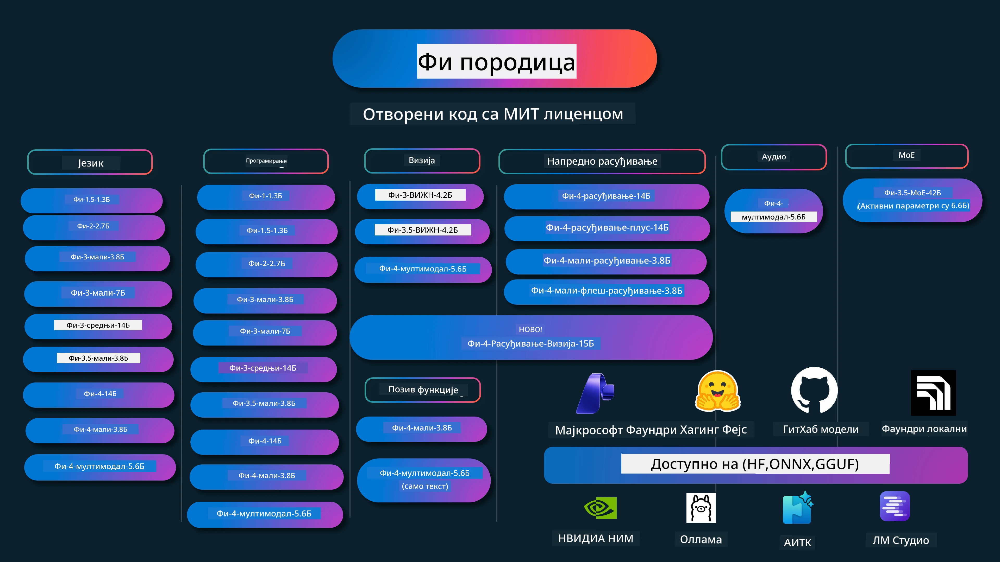

# Phi Cookbook: Практични примери са Мицрософтовим Phi моделима

[](https://codespaces.new/microsoft/phicookbook)
[](https://vscode.dev/redirect?url=vscode://ms-vscode-remote.remote-containers/cloneInVolume?url=https://github.com/microsoft/phicookbook)

[](https://GitHub.com/microsoft/phicookbook/graphs/contributors/?WT.mc_id=aiml-137032-kinfeylo)
[](https://GitHub.com/microsoft/phicookbook/issues/?WT.mc_id=aiml-137032-kinfeylo)
[](https://GitHub.com/microsoft/phicookbook/pulls/?WT.mc_id=aiml-137032-kinfeylo)
[](http://makeapullrequest.com?WT.mc_id=aiml-137032-kinfeylo)

[](https://GitHub.com/microsoft/phicookbook/watchers/?WT.mc_id=aiml-137032-kinfeylo)
[](https://GitHub.com/microsoft/phicookbook/network/?WT.mc_id=aiml-137032-kinfeylo)
[](https://GitHub.com/microsoft/phicookbook/stargazers/?WT.mc_id=aiml-137032-kinfeylo)

[](https://discord.com/invite/ByRwuEEgH4)

Phi је серија отворених AI модела развијених од стране Microsoft-а.

Phi је тренутно најмоћнији и најефтинији мали језички модел (SLM), са одличним резултатима у вишејезичности, резоновању, генерисању текста/ћаскању, кодирању, сликама, звуку и другим сценаријима.

Можете да покренете Phi у облаку или на уређајима на ивици мреже, а такође можете једноставно направити генеративне AI апликације са ограниченом рачунарском снагом.

Пратите ове кораке да бисте започели коришћење ових ресурса:
1. **Форкујте Репозиторијум**: Кликните [](https://GitHub.com/microsoft/phicookbook/network/?WT.mc_id=aiml-137032-kinfeylo)
2. **Клонирајте Репозиторијум**: `git clone https://github.com/microsoft/PhiCookBook.git`
3. [**Придружите се Microsoft AI Discord заједници и упознајте стручњаке и колеге програмере**](https://discord.com/invite/ByRwuEEgH4?WT.mc_id=aiml-137032-kinfeylo)



### 🌐 Подршка за више језика

#### Подржано преко GitHub Action (аутоматизовано и увек ажурирано)

<!-- CO-OP TRANSLATOR LANGUAGES TABLE START -->
[Arabic](../ar/README.md) | [Bengali](../bn/README.md) | [Bulgarian](../bg/README.md) | [Burmese (Myanmar)](../my/README.md) | [Chinese (Simplified)](../zh-CN/README.md) | [Chinese (Traditional, Hong Kong)](../zh-HK/README.md) | [Chinese (Traditional, Macau)](../zh-MO/README.md) | [Chinese (Traditional, Taiwan)](../zh-TW/README.md) | [Croatian](../hr/README.md) | [Czech](../cs/README.md) | [Danish](../da/README.md) | [Dutch](../nl/README.md) | [Estonian](../et/README.md) | [Finnish](../fi/README.md) | [French](../fr/README.md) | [German](../de/README.md) | [Greek](../el/README.md) | [Hebrew](../he/README.md) | [Hindi](../hi/README.md) | [Hungarian](../hu/README.md) | [Indonesian](../id/README.md) | [Italian](../it/README.md) | [Japanese](../ja/README.md) | [Kannada](../kn/README.md) | [Khmer](../km/README.md) | [Korean](../ko/README.md) | [Lithuanian](../lt/README.md) | [Malay](../ms/README.md) | [Malayalam](../ml/README.md) | [Marathi](../mr/README.md) | [Nepali](../ne/README.md) | [Nigerian Pidgin](../pcm/README.md) | [Norwegian](../no/README.md) | [Persian (Farsi)](../fa/README.md) | [Polish](../pl/README.md) | [Portuguese (Brazil)](../pt-BR/README.md) | [Portuguese (Portugal)](../pt-PT/README.md) | [Punjabi (Gurmukhi)](../pa/README.md) | [Romanian](../ro/README.md) | [Russian](../ru/README.md) | [Serbian (Cyrillic)](./README.md) | [Slovak](../sk/README.md) | [Slovenian](../sl/README.md) | [Spanish](../es/README.md) | [Swahili](../sw/README.md) | [Swedish](../sv/README.md) | [Tagalog (Filipino)](../tl/README.md) | [Tamil](../ta/README.md) | [Telugu](../te/README.md) | [Thai](../th/README.md) | [Turkish](../tr/README.md) | [Ukrainian](../uk/README.md) | [Urdu](../ur/README.md) | [Vietnamese](../vi/README.md)

> **Више волите локално клонирање?**
>
> Овај репозиторијум укључује преводе на преко 50 језика што знатно повећава величину преузимања. За клонирање без превода, користите sparse checkout:
>
> **Bash / macOS / Linux:**
> ```bash
> git clone --filter=blob:none --sparse https://github.com/microsoft/PhiCookBook.git
> cd PhiCookBook
> git sparse-checkout set --no-cone '/*' '!translations' '!translated_images'
> ```
>
> **CMD (Windows):**
> ```cmd
> git clone --filter=blob:none --sparse https://github.com/microsoft/PhiCookBook.git
> cd PhiCookBook
> git sparse-checkout set --no-cone "/*" "!translations" "!translated_images"
> ```
>
> Ово вам даје све што вам је потребно за завршетак курса уз много бржу преузимање.
<!-- CO-OP TRANSLATOR LANGUAGES TABLE END -->

## Садржај таблице
- Увод - [Добродошли у Phi породицу](./md/01.Introduction/01/01.PhiFamily.md) - [Подешавање вашег окружења](./md/01.Introduction/01/01.EnvironmentSetup.md) - [Разумевање кључних технологија](./md/01.Introduction/01/01.Understandingtech.md) - [AI безбедност за Phi моделе](./md/01.Introduction/01/01.AISafety.md) - [Phi хардверска подршка](./md/01.Introduction/01/01.Hardwaresupport.md) - [Phi модели и доступност на различитим платформама](./md/01.Introduction/01/01.Edgeandcloud.md) - [Коришћење Guidance-ai и Phi](./md/01.Introduction/01/01.Guidance.md) - [GitHub Marketplace модели](https://github.com/marketplace/models) - [Azure AI каталог модела](https://ai.azure.com) - Извођење Phi у различитим окружењима - [Hugging face](./md/01.Introduction/02/01.HF.md) - [GitHub модели](./md/01.Introduction/02/02.GitHubModel.md) - [Microsoft Foundry каталог модела](./md/01.Introduction/02/03.AzureAIFoundry.md) - [Ollama](./md/01.Introduction/02/04.Ollama.md) - [AI алатке за VSCode (AITK)](./md/01.Introduction/02/05.AITK.md) - [NVIDIA NIM](./md/01.Introduction/02/06.NVIDIA.md) - [Foundry локално](./md/01.Introduction/02/07.FoundryLocal.md) - Извођење Phi породице - [Извођење Phi на iOS-у](./md/01.Introduction/03/iOS_Inference.md) - [Извођење Phi на Android-у](./md/01.Introduction/03/Android_Inference.md) - [Извођење Phi на Jetson-у](./md/01.Introduction/03/Jetson_Inference.md) - [Извођење Phi на AI PC-у](./md/01.Introduction/03/AIPC_Inference.md) - [Извођење Phi са Apple MLX оквиром](./md/01.Introduction/03/MLX_Inference.md) - [Извођење Phi на локалном серверу](./md/01.Introduction/03/Local_Server_Inference.md) - [Извођење Phi на удаљеном серверу користећи AI Toolkit](./md/01.Introduction/03/Remote_Interence.md) - [Извођење Phi са Rust-ом](./md/01.Introduction/03/Rust_Inference.md) - [Извођење Phi--Vision локално](./md/01.Introduction/03/Vision_Inference.md) - [Извођење Phi са Kaito AKS, Azure контејнерима (службена подршка)](./md/01.Introduction/03/Kaito_Inference.md) - [Квантификовање Phi породице](./md/01.Introduction/04/QuantifyingPhi.md) - [Квантизација Phi-3.5 / 4 користећи llama.cpp](./md/01.Introduction/04/UsingLlamacppQuantifyingPhi.md) - [Квантизација Phi-3.5 / 4 користећи Generative AI проширења за onnxruntime](./md/01.Introduction/04/UsingORTGenAIQuantifyingPhi.md) - [Квантизација Phi-3.5 / 4 користећи Intel OpenVINO](./md/01.Introduction/04/UsingIntelOpenVINOQuantifyingPhi.md) - [Квантизација Phi-3.5 / 4 користећи Apple MLX оквир](./md/01.Introduction/04/UsingAppleMLXQuantifyingPhi.md) - Евалуација Phi - [Одговорни AI](./md/01.Introduction/05/ResponsibleAI.md) - [Microsoft Foundry за евалуацију](./md/01.Introduction/05/AIFoundry.md) - [Коришћење Promptflow за евалуацију](./md/01.Introduction/05/Promptflow.md) - RAG са Azure AI Pretraživanjem - [Како користити Phi-4-mini и Phi-4-мултимодални (RAG) са Azure AI претрагом](https://github.com/microsoft/PhiCookBook/blob/main/code/06.E2E/E2E_Phi-4-RAG-Azure-AI-Search.ipynb) - Узoри развоја Phi апликација - Текст и чет апликације - Phi-4 узорци - [📓] [Ћаскање са Phi-4-mini ONNX моделом](./md/02.Application/01.TextAndChat/Phi4/ChatWithPhi4ONNX/README.md) - [Ћаскање са Phi-4 локалним ONNX моделом .NET](../../md/04.HOL/dotnet/src/LabsPhi4-Chat-01OnnxRuntime) - [Конзолна апликација за ћаскање у .NET са Phi-4 ONNX користећи Semantic Kernel](../../md/04.HOL/dotnet/src/LabsPhi4-Chat-02SK) - Phi-3 / 3.5 узорци - [Локални четбот у прегледачу користећи Phi3, ONNX Runtime Web и WebGPU](https://github.com/microsoft/onnxruntime-inference-examples/tree/main/js/chat) - [OpenVino чет](./md/02.Application/01.TextAndChat/Phi3/E2E_OpenVino_Chat.md) - [Мулти модел - Интерактивни Phi-3-mini и OpenAI Whisper](./md/02.Application/01.TextAndChat/Phi3/E2E_Phi-3-mini_with_whisper.md) - [MLFlow - Креирање омотача и коришћење Phi-3 са MLFlow](./md//02.Application/01.TextAndChat/Phi3/E2E_Phi-3-MLflow.md) - [Оптимизација модела - Како оптимизовати Phi-3-mini модел за ONNX Runtime Web са Olive](https://github.com/microsoft/Olive/tree/main/examples/phi3) - [WinUI3 апликација са Phi-3 mini-4k-instruct-onnx](https://github.com/microsoft/Phi3-Chat-WinUI3-Sample/) -[WinUI3 мулти модел AI покретана апликација за белешке](https://github.com/microsoft/ai-powered-notes-winui3-sample) - [Фино подешавање и интеграција прилагођених Phi-3 модела са Prompt flow](./md/02.Application/01.TextAndChat/Phi3/E2E_Phi-3-FineTuning_PromptFlow_Integration.md) - [Фино подешавање и интеграција прилагођених Phi-3 модела са Prompt flow у Microsoft Foundry](./md/02.Application/01.TextAndChat/Phi3/E2E_Phi-3-FineTuning_PromptFlow_Integration_AIFoundry.md) - [Евалуација фино подешеног Phi-3 / Phi-3.5 модела у Microsoft Foundry са фокусом на Microsoft-ове принципе одговорног AI](./md/02.Application/01.TextAndChat/Phi3/E2E_Phi-3-Evaluation_AIFoundry.md) - [📓] [Phi-3.5-mini-instruct узорак језичке предикције (кинески/енглески)](./md/02.Application/01.TextAndChat/Phi3/phi3-instruct-demo.ipynb) - [Phi-3.5-Instruct WebGPU RAG четбот](./md/02.Application/01.TextAndChat/Phi3/WebGPUWithPhi35Readme.md) - [Коришћење Windows GPU за креирање Prompt flow решења са Phi-3.5-Instruct ONNX](./md/02.Application/01.TextAndChat/Phi3/UsingPromptFlowWithONNX.md) - [Креирање Android апликације користећи Microsoft Phi-3.5 tflite](./md/02.Application/01.TextAndChat/Phi3/UsingPhi35TFLiteCreateAndroidApp.md) - [Q&A .NET пример користећи локални ONNX Phi-3 модел и Microsoft.ML.OnnxRuntime](../../md/04.HOL/dotnet/src/LabsPhi301) - [Конзолна апликација за ћаскање .NET са Semantic Kernel и Phi-3](../../md/04.HOL/dotnet/src/LabsPhi302) - Azure AI Inference SDK кодни узорци - Phi-4 узорци - [📓] [Генерисање кода пројекта користећи Phi-4-мултимодални](./md/02.Application/02.Code/Phi4/GenProjectCode/README.md) - Phi-3 / 3.5 узорци - [Креирајте свој Visual Studio Code GitHub Copilot Chat са Microsoft Phi-3 породицом](./md/02.Application/02.Code/Phi3/VSCodeExt/README.md) - [Креирајте свог Visual Studio Code Chat Copilot агента са Phi-3.5 и GitHub моделима](/md/02.Application/02.Code/Phi3/CreateVSCodeChatAgentWithGitHubModels.md) - Напредни узорци резоновања - Phi-4 узорци - [📓] [Phi-4-mini-резоновање или Phi-4-резоновање узорци](./md/02.Application/03.AdvancedReasoning/Phi4/AdvancedResoningPhi4mini/README.md) - [📓] [Фино подешавање Phi-4-mini-резоновања са Microsoft Olive](./md/02.Application/03.AdvancedReasoning/Phi4/AdvancedResoningPhi4mini/olive_ft_phi_4_reasoning_with_medicaldata.ipynb) - [📓] [Фино подешавање Phi-4-mini-резоновања са Apple MLX](./md/02.Application/03.AdvancedReasoning/Phi4/AdvancedResoningPhi4mini/mlx_ft_phi_4_reasoning_with_medicaldata.ipynb) - [📓] [Phi-4-mini-резоновање са GitHub моделима](./md/02.Application/02.Code/Phi4r/github_models_inference.ipynb) - [📓] [Phi-4-mini-резоновање са Microsoft Foundry моделима](./md/02.Application/02.Code/Phi4r/azure_models_inference.ipynb) -
Демоси - [Phi-4-mini демоси хостирани на Hugging Face Spaces](https://huggingface.co/spaces/microsoft/phi-4-mini?WT.mc_id=aiml-137032-kinfeylo) - [Phi-4-мултимодал демоси хостирани на Hugging Face Spaces](https://huggingface.co/spaces/microsoft/phi-4-multimodal?WT.mc_id=aiml-137032-kinfeylo) - Визуелни узорци - Phi-4 узорци - [📓] [Користите Phi-4-мултимодал за читање слика и генерисање кода](./md/02.Application/04.Vision/Phi4/CreateFrontend/README.md) - Phi-3 / 3.5 узорци - [📓][Phi-3-vision-Слика текст у текст](./md/02.Application/04.Vision/Phi3/E2E_Phi-3-vision-image-text-to-text-online-endpoint.ipynb) - [Phi-3-vision-ONNX](https://onnxruntime.ai/docs/genai/tutorials/phi3-v.html) - [📓][Phi-3-vision CLIP уградња](./md/02.Application/04.Vision/Phi3/E2E_Phi-3-vision-image-text-to-text-online-endpoint.ipynb) - [ДЕМО: Phi-3 Рециклажа](https://github.com/jennifermarsman/PhiRecycling/) - [Phi-3-vision - Визуелни језички асистент - са Phi3-Vision и OpenVINO](https://docs.openvino.ai/nightly/notebooks/phi-3-vision-with-output.html) - [Phi-3 Vision Nvidia NIM](./md/02.Application/04.Vision/Phi3/E2E_Nvidia_NIM_Vision.md) - [Phi-3 Vision OpenVino](./md/02.Application/04.Vision/Phi3/E2E_OpenVino_Phi3Vision.md) - [📓][Phi-3.5 Vision мулти-фрејм или мулти-слика узорак](./md/02.Application/04.Vision/Phi3/phi3-vision-demo.ipynb) - [Phi-3 Vision локални ONNX модел користећи Microsoft.ML.OnnxRuntime .NET](../../md/04.HOL/dotnet/src/LabsPhi303) - [Мену заснован Phi-3 Vision локални ONNX модел користећи Microsoft.ML.OnnxRuntime .NET](../../md/04.HOL/dotnet/src/LabsPhi304) - Разумевање-Визија узорци - Phi-4-Reasoning-Vision-15B - [📓] [Коришћење Phi-4-Reasoning-Vision-15B за детекцију преласка пешачког прелаза ван пешачког](./md/02.Application/10.ReasoningVision/Phi_4_reasoning_vision_15b_Jaywalking.ipynb) - [📓] [Коришћење Phi-4-Reasoning-Vision-15B за математику](./md/02.Application/10.ReasoningVision/Phi_4_reasoning_vision_15b_Math.ipynb) - [📓] [Коришћење Phi-4-Reasoning-Vision-15B за детекцију корисничког интерфејса](./md/02.Application/10.ReasoningVision/Phi_4_reasoning_vision_15b_ui.ipynb) - Математички узорци - Phi-4-Mini-Flash-Reasoning-Instruct узорци [Математички демо са Phi-4-Mini-Flash-Reasoning-Instruct](./md/02.Application/09.Math/MathDemo.ipynb) - Аудио узорци - Phi-4 узорци - [📓] [Издвајање транскрипта аудио записа користећи Phi-4-мултимодал](./md/02.Application/05.Audio/Phi4/Transciption/README.md) - [📓] [Phi-4-мултимодал аудио узорак](./md/02.Application/05.Audio/Phi4/Siri/demo.ipynb) - [📓] [Phi-4-мултимодал аудио превод узорак](./md/02.Application/05.Audio/Phi4/Translate/demo.ipynb) - [.NET конзолна апликација користећи Phi-4-мултимодал аудио за анализу аудио фајла и генерисање транскрипта](../../md/04.HOL/dotnet/src/LabsPhi4-MultiModal-02Audio) - MOE узорци - Phi-3 / 3.5 узорци - [📓] [Phi-3.5 Микс експерата (MoEs) узорак за друштвене мреже](./md/02.Application/06.MoE/Phi3/phi3_moe_demo.ipynb) - [📓] [Изградња Retrieval-Augmented Generation (RAG) Пејплајна са NVIDIA NIM Phi-3 MOE, Azure AI Search и LlamaIndex](./md/02.Application/06.MoE/Phi3/azure-ai-search-nvidia-rag.ipynb) - - Функције позива узорци - Phi-4 узорци 🆕 - [📓] [Коришћење Function Calling са Phi-4-mini](./md/02.Application/07.FunctionCalling/Phi4/FunctionCallingBasic/README.md) - [📓] [Коришћење Function Calling за креирање више агената са Phi-4-mini](./md/02.Application/07.FunctionCalling/Phi4/Multiagents/Phi_4_mini_multiagent.ipynb) - [📓] [Коришћење Function Calling са Оллама](./md/02.Application/07.FunctionCalling/Phi4/Ollama/ollama_functioncalling.ipynb) - [📓] [Коришћење Function Calling са ONNX](./md/02.Application/07.FunctionCalling/Phi4/ONNX/onnx_parallel_functioncalling.ipynb) - Мултимодални мешавина узораци - Phi-4 узорци 🆕 - [📓] [Коришћење Phi-4-мултимодал као технолошког новинара](./md/02.Application/08.Multimodel/Phi4/TechJournalist/phi_4_mm_audio_text_publish_news.ipynb) - [.NET конзолна апликација користећи Phi-4-мултимодал за анализу слика](../../md/04.HOL/dotnet/src/LabsPhi4-MultiModal-01Images) - Фино подешавање Phi узорци - [Сценарији фино подешавања](./md/03.FineTuning/FineTuning_Scenarios.md) - [Фино подешавање у односу на RAG](./md/03.FineTuning/FineTuning_vs_RAG.md) - [Фино подешавање да Phi-3 постане индустријски експерт](./md/03.FineTuning/LetPhi3gotoIndustriy.md) - [Фино подешавање Phi-3 са AI Tools за VS Code](./md/03.FineTuning/Finetuning_VSCodeaitoolkit.md) - [Фино подешавање Phi-3 са Azure Machine Learning сервисом](./md/03.FineTuning/Introduce_AzureML.md) - [Фино подешавање Phi-3 са Лора](./md/03.FineTuning/FineTuning_Lora.md) - [Фино подешавање Phi-3 са QLora](./md/03.FineTuning/FineTuning_Qlora.md) - [Фино подешавање Phi-3 са Microsoft Foundry](./md/03.FineTuning/FineTuning_AIFoundry.md) - [Фино подешавање Phi-3 са Azure ML CLI/SDK](./md/03.FineTuning/FineTuning_MLSDK.md) - [Фино подешавање са Microsoft Olive](./md/03.FineTuning/FineTuning_MicrosoftOlive.md) - [Фино подешавање са Microsoft Olive Hands-On Lab](./md/03.FineTuning/olive-lab/readme.md) - [Фино подешавање Phi-3-vision са Weights and Bias](./md/03.FineTuning/FineTuning_Phi-3-visionWandB.md) - [Фино подешавање Phi-3 са Apple MLX Framework](./md/03.FineTuning/FineTuning_MLX.md) - [Фино подешавање Phi-3-vision (званична подршка)](./md/03.FineTuning/FineTuning_Vision.md) - [Фино подешавање Phi-3 са Kaito AKS, Azure Containers (званична подршка)](./md/03.FineTuning/FineTuning_Kaito.md) - [Фино подешавање Phi-3 и 3.5 Vision](https://github.com/2U1/Phi3-Vision-Finetune) - Практична лабoраторија - [Истраживање најсавременијих модела: LLMs, SLMs, локални развој и још](https://github.com/microsoft/aitour-exploring-cutting-edge-models) - [Откључавање потенцијала НЛП: Фино подешавање са Microsoft Olive](https://github.com/azure/Ignite_FineTuning_workshop) - Академски истраживачки радови и публикације - [Textbooks Are All You Need II: phi-1.5 технички извештај](https://arxiv.org/abs/2309.05463) - [Phi-3 технички извештај: Високо способан језички модел локално на вашем телефону](https://arxiv.org/abs/2404.14219) - [Phi-4 технички извештај](https://arxiv.org/abs/2412.08905) - [Phi-4-Mini технички извештај: Компактни али моћни мултимодални језички модели преко Mixture-of-LoRAs](https://arxiv.org/abs/2503.01743) - [Оптимизација малих језичких модела за позив функција у возилу](https://arxiv.org/abs/2501.02342) - [(WhyPHI) Фино подешавање PHI-3 за решавање питања са вишеструким избором: Методологија, резултати и изазови](https://arxiv.org/abs/2501.01588) - [Phi-4-разумевање технички извештај](https://www.microsoft.com/en-us/research/wp-content/uploads/2025/04/phi_4_reasoning.pdf)
- [Phi-4-mini-извештај о техничком разматрању](https://huggingface.co/microsoft/Phi-4-mini-reasoning/blob/main/Phi-4-Mini-Reasoning.pdf)
# Phi Cookbook: Примери за рад са Phi моделима компаније Microsoft

[](https://codespaces.new/microsoft/phicookbook)
[](https://vscode.dev/redirect?url=vscode://ms-vscode-remote.remote-containers/cloneInVolume?url=https://github.com/microsoft/phicookbook)

[](https://GitHub.com/microsoft/phicookbook/graphs/contributors/?WT.mc_id=aiml-137032-kinfeylo)
[](https://GitHub.com/microsoft/phicookbook/issues/?WT.mc_id=aiml-137032-kinfeylo)
[](https://GitHub.com/microsoft/phicookbook/pulls/?WT.mc_id=aiml-137032-kinfeylo)
[](http://makeapullrequest.com?WT.mc_id=aiml-137032-kinfeylo)

[](https://GitHub.com/microsoft/phicookbook/watchers/?WT.mc_id=aiml-137032-kinfeylo)
[](https://GitHub.com/microsoft/phicookbook/network/?WT.mc_id=aiml-137032-kinfeylo)
[](https://GitHub.com/microsoft/phicookbook/stargazers/?WT.mc_id=aiml-137032-kinfeylo)

[](https://discord.com/invite/ByRwuEEgH4)

Phi је серија отворених AI модела које је развио Microsoft.

Phi је тренутно најмоћнији и најисплативији мали језички модел (SLM), са веома добрим резултатима у вишезначним језицима, резоновању, генерисању текста/ћаскања, програмирању, сликама, звуку и другим сценаријима.

Можете распоредити Phi у облак или на крајње уређаје, и лако правити генеративне AI апликације са ограниченом рачунарском снагом.

Пратите ове кораке да бисте почели да користите ове ресурсе:
1. **Направите форк репозиторијума**: Кликните [](https://GitHub.com/microsoft/phicookbook/network/?WT.mc_id=aiml-137032-kinfeylo)
2. **Клонирајте репозиторијум**:   `git clone https://github.com/microsoft/PhiCookBook.git`
3. [**Придружите се Microsoft AI Discord заједници и упознајте стручњаке и друге програмере**](https://discord.com/invite/ByRwuEEgH4?WT.mc_id=aiml-137032-kinfeylo)


### 🌐 Мултијезичка подршка

#### Подржано путем GitHub Action (Аутоматизовано и увек ажурирано)

<!-- CO-OP TRANSLATOR LANGUAGES TABLE START -->
[Arabic](../ar/README.md) | [Bengali](../bn/README.md) | [Bulgarian](../bg/README.md) | [Burmese (Myanmar)](../my/README.md) | [Chinese (Simplified)](../zh-CN/README.md) | [Chinese (Traditional, Hong Kong)](../zh-HK/README.md) | [Chinese (Traditional, Macau)](../zh-MO/README.md) | [Chinese (Traditional, Taiwan)](../zh-TW/README.md) | [Croatian](../hr/README.md) | [Czech](../cs/README.md) | [Danish](../da/README.md) | [Dutch](../nl/README.md) | [Estonian](../et/README.md) | [Finnish](../fi/README.md) | [French](../fr/README.md) | [German](../de/README.md) | [Greek](../el/README.md) | [Hebrew](../he/README.md) | [Hindi](../hi/README.md) | [Hungarian](../hu/README.md) | [Indonesian](../id/README.md) | [Italian](../it/README.md) | [Japanese](../ja/README.md) | [Kannada](../kn/README.md) | [Khmer](../km/README.md) | [Korean](../ko/README.md) | [Lithuanian](../lt/README.md) | [Malay](../ms/README.md) | [Malayalam](../ml/README.md) | [Marathi](../mr/README.md) | [Nepali](../ne/README.md) | [Nigerian Pidgin](../pcm/README.md) | [Norwegian](../no/README.md) | [Persian (Farsi)](../fa/README.md) | [Polish](../pl/README.md) | [Portuguese (Brazil)](../pt-BR/README.md) | [Portuguese (Portugal)](../pt-PT/README.md) | [Punjabi (Gurmukhi)](../pa/README.md) | [Romanian](../ro/README.md) | [Russian](../ru/README.md) | [Serbian (Cyrillic)](./README.md) | [Slovak](../sk/README.md) | [Slovenian](../sl/README.md) | [Spanish](../es/README.md) | [Swahili](../sw/README.md) | [Swedish](../sv/README.md) | [Tagalog (Filipino)](../tl/README.md) | [Tamil](../ta/README.md) | [Telugu](../te/README.md) | [Thai](../th/README.md) | [Turkish](../tr/README.md) | [Ukrainian](../uk/README.md) | [Urdu](../ur/README.md) | [Vietnamese](../vi/README.md)

> **Волите да клонирате локално?**
>
> Овај репозиторијум укључује више од 50 превода језика што значајно повећава величину преузимања. Да бисте клонирали без превода, користите sparse checkout:
>
> **Bash / macOS / Linux:**
> ```bash
> git clone --filter=blob:none --sparse https://github.com/microsoft/PhiCookBook.git
> cd PhiCookBook
> git sparse-checkout set --no-cone '/*' '!translations' '!translated_images'
> ```
>
> **CMD (Windows):**
> ```cmd
> git clone --filter=blob:none --sparse https://github.com/microsoft/PhiCookBook.git
> cd PhiCookBook
> git sparse-checkout set --no-cone "/*" "!translations" "!translated_images"
> ```
>
> Ово вам даје све што вам треба за завршетак курса уз много брже преузимање.
<!-- CO-OP TRANSLATOR LANGUAGES TABLE END -->

## Садржај

## Коришћење Phi модела

### Phi на Microsoft Foundry

Можете научити како да користите Microsoft Phi и како изградити E2E решења на својим различитим хардверским уређајима. Да бисте сами испробали Phi, започните играњем са моделима и прилагођавањем Phi за своје сценарије користећи [Microsoft Foundry Azure AI Model Catalog](https://aka.ms/phi3-azure-ai). Више о томе можете сазнати у Увод у [Microsoft Foundry](/md/02.QuickStart/AzureAIFoundry_QuickStart.md)

**Плаигроунд**
Сваки модел има посебан плаигроунд за тестирање модела [Azure AI Playground](https://aka.ms/try-phi3).

### Phi на GitHub Models

Можете научити како да користите Microsoft Phi и како изградити E2E решења на својим различитим хардверским уређајима. Да бисте сами испробали Phi, започните играњем са моделом и прилагођавањем Phi за своје сценарије користећи [GitHub Model Catalog](https://github.com/marketplace/models?WT.mc_id=aiml-137032-kinfeylo). Више о томе можете сазнати у Увод у [GitHub Model Catalog](/md/02.QuickStart/GitHubModel_QuickStart.md)

**Плаигроунд**
Сваки модел има посебан [плаигроунд за тестирање модела](/md/02.QuickStart/GitHubModel_QuickStart.md).

### Phi на Hugging Face

Модел такође можете пронаћи на [Hugging Face](https://huggingface.co/microsoft)

**Плаигроунд**
 [Hugging Chat плаигроунд](https://huggingface.co/chat/models/microsoft/Phi-3-mini-4k-instruct)

 ## 🎒 Остали курсеви

Наш тим производи и друге курсеве! Погледајте:

<!-- CO-OP TRANSLATOR OTHER COURSES START -->
### LangChain
[](https://aka.ms/langchain4j-for-beginners)
[](https://aka.ms/langchainjs-for-beginners?WT.mc_id=m365-94501-dwahlin)
[](https://github.com/microsoft/langchain-for-beginners?WT.mc_id=m365-94501-dwahlin)
---

### Azure / Edge / MCP / Agents
[](https://github.com/microsoft/AZD-for-beginners?WT.mc_id=academic-105485-koreyst)
[](https://github.com/microsoft/edgeai-for-beginners?WT.mc_id=academic-105485-koreyst)
[](https://github.com/microsoft/mcp-for-beginners?WT.mc_id=academic-105485-koreyst)
[](https://github.com/microsoft/ai-agents-for-beginners?WT.mc_id=academic-105485-koreyst)

---
 
### Серия генеративног AI
[](https://github.com/microsoft/generative-ai-for-beginners?WT.mc_id=academic-105485-koreyst)
[-9333EA?style=for-the-badge&labelColor=E5E7EB&color=9333EA)](https://github.com/microsoft/Generative-AI-for-beginners-dotnet?WT.mc_id=academic-105485-koreyst)
[-C084FC?style=for-the-badge&labelColor=E5E7EB&color=C084FC)](https://github.com/microsoft/generative-ai-for-beginners-java?WT.mc_id=academic-105485-koreyst)
[-E879F9?style=for-the-badge&labelColor=E5E7EB&color=E879F9)](https://github.com/microsoft/generative-ai-with-javascript?WT.mc_id=academic-105485-koreyst)

---
 
### Основно учење
[](https://aka.ms/ml-beginners?WT.mc_id=academic-105485-koreyst)
[](https://aka.ms/datascience-beginners?WT.mc_id=academic-105485-koreyst)
[](https://aka.ms/ai-beginners?WT.mc_id=academic-105485-koreyst)
[](https://github.com/microsoft/Security-101?WT.mc_id=academic-96948-sayoung)
[](https://aka.ms/webdev-beginners?WT.mc_id=academic-105485-koreyst)
[](https://aka.ms/iot-beginners?WT.mc_id=academic-105485-koreyst)
[](https://github.com/microsoft/xr-development-for-beginners?WT.mc_id=academic-105485-koreyst)

---
 
### Copilot серија
[](https://aka.ms/GitHubCopilotAI?WT.mc_id=academic-105485-koreyst)
[](https://github.com/microsoft/mastering-github-copilot-for-dotnet-csharp-developers?WT.mc_id=academic-105485-koreyst)
[](https://github.com/microsoft/CopilotAdventures?WT.mc_id=academic-105485-koreyst)
<!-- CO-OP TRANSLATOR OTHER COURSES END -->

## Одговорни вештачка интелигенција

Microsoft је посвећен помагању нашим корисницима да користе наше AI производе одговорно, делећи наша сазнања и градећи партнерства заснована на поверењу кроз алате као што су Ноте о транспарентности и Процене утицаја. Многи од ових ресурса могу се наћи на [https://aka.ms/RAI](https://aka.ms/RAI).
Приступ Microsoft-а одговорној вештачкој интелигенцији заснован је на нашим AI принципима правичности, поузданости и безбедности, приватности и сигурности, инклузивности, транспарентности и одговорности.

Модели великог обима за природни језик, слике и говор - као што су они коришћени у овом примеру - потенцијално могу имати нефер, непоуздано или увредљиво понашање, што може довести до штете. Молимо погледајте [Белешку о транспарентности Azure OpenAI услуге](https://learn.microsoft.com/legal/cognitive-services/openai/transparency-note?tabs=text) да бисте се информисали о ризицима и ограничењима.

Препоручени приступ за ублажавање ових ризика је укључивање система безбедности у вашу архитектуру који може детектовати и спречити штетно понашање. [Azure AI Content Safety](https://learn.microsoft.com/azure/ai-services/content-safety/overview) пружа независни слој заштите, у стању да детектује штетни кориснички и AI генерисани садржај у апликацијама и сервисима. Azure AI Content Safety укључује текстуалне и сликовне API-је који вам омогућавају да откријете штетни материјал. Унутар Microsoft Foundry-а, сервис Content Safety вам омогућава да прегледате, истражујете и испробате примерке кода за детекцију штетног садржаја у различитим модалитетима. Следећа [документација за брз почетак](https://learn.microsoft.com/azure/ai-services/content-safety/quickstart-text?tabs=visual-studio%2Clinux&pivots=programming-language-rest) води вас кроз прављење захтева према сервису.

Још један аспект који треба узети у обзир је укупна перформанса апликације. Са мулти-модалним и мулти-модел апликацијама, перформанса подразумева да систем ради онако како ви и ваши корисници очекујете, укључујући негенерисање штетних резултата. Важно је проценити перформансе ваше укупне апликације користећи [процењиваче перформанси и квалитета и процене ризика и безбедности](https://learn.microsoft.com/azure/ai-studio/concepts/evaluation-metrics-built-in). Такође имате могућност да креирате и оцените помоћу [прилагођених процењивача](https://learn.microsoft.com/azure/ai-studio/how-to/develop/evaluate-sdk#custom-evaluators).

Можете оценити своју AI апликацију у свом развојном окружењу користећи [Azure AI Evaluation SDK](https://microsoft.github.io/promptflow/index.html). Користећи било тестни скуп података или циљ, генерисања ваше генеративне AI апликације се квантитативно мере уграђеним или прилагођеним процењивачима по вашем избору. За почетак коришћења azure ai evaluation sdk да процените свој систем, можете пратити [водич за брз почетак](https://learn.microsoft.com/azure/ai-studio/how-to/develop/flow-evaluate-sdk). Када извршите извођење процене, можете [визуализовати резултате у Microsoft Foundry](https://learn.microsoft.com/azure/ai-studio/how-to/evaluate-flow-results).

## Заштитни знакови

Овај пројекат може садржати заштитне знакове или логотипе пројеката, производа или услуга. Овлашћена употреба Microsoft-ових заштитних знакова или логотипа подлеже и мора се придржавати [Упутстава за употребу заштитних знакова и бренда компаније Microsoft](https://www.microsoft.com/legal/intellectualproperty/trademarks/usage/general).
Употреба Microsoft-ових заштитних знакова или логотипа у измењеним верзијама овог пројекта не сме изазвати забуну или сугерисати да Microsoft спонзорише. Свако коришћење заштитних знакова или логотипа трећих страна подлеже политикама тих трећих страна.

## Добијање помоћи

Ако се заглавите или имате било каквих питања о прављењу AI апликација, придружите се:

[](https://aka.ms/foundry/discord)

Ако имате повратне информације о производу или грешке током прављења, посетите:

[](https://aka.ms/foundry/forum)

---

<!-- CO-OP TRANSLATOR DISCLAIMER START -->
**Одрицање одговорности**:  
Овај документ је преведен помоћу AI услуге за превођење [Co-op Translator](https://github.com/Azure/co-op-translator). Иако тежимо ка прецизности, молимо имајте у виду да аутоматски преводи могу садржати грешке или нетачности. Изворни документ на његовом изворном језику треба сматрати ауторитетим извором. За критичне информације препоручује се професионални људски превод. Нисмо одговорни за било каква непорумијевања или погрешна тумачења настала коришћењем овог превода.
<!-- CO-OP TRANSLATOR DISCLAIMER END -->