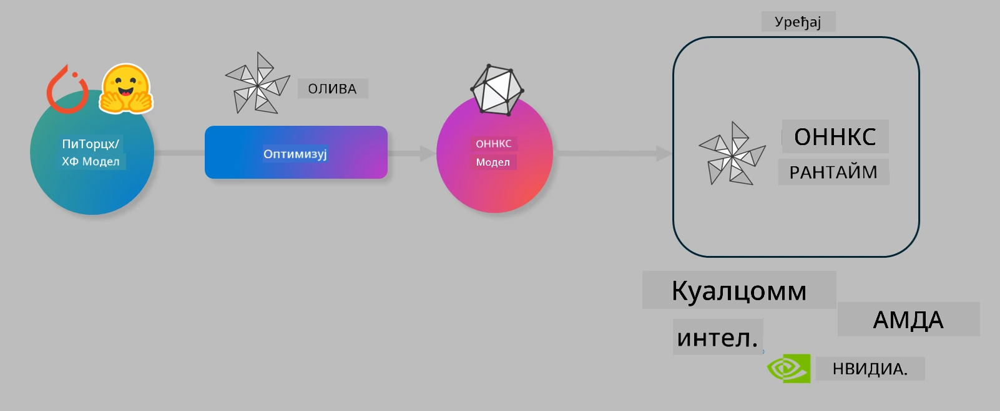

# Лаб. Оптимизација AI модела за извршавање на уређају

## Увод

> [!IMPORTANT]
> За ову лабораторију је потребна **Nvidia A10 или A100 GPU** са одговарајућим драјверима и инсталираним CUDA алатима (верзија 12+).

> [!NOTE]
> Ово је **35-минутна** лабораторија која ће вам пружити практичан увод у основне концепте оптимизације модела за извршавање на уређају користећи OLIVE.

## Циљеви учења

На крају ове лабораторије моћи ћете да користите OLIVE за:

- Квантизацију AI модела користећи AWQ методу квантизације.
- Фино подешавање AI модела за специфичан задатак.
- Генерисање LoRA адаптера (фино подешеног модела) за ефикасно извршавање на уређају помоћу ONNX Runtime-а.

### Шта је Olive

Olive (*O*NNX *live*) је алат за оптимизацију модела са пратећим CLI-јем који вам омогућава да испоручите моделе за ONNX runtime +++https://onnxruntime.ai+++ са квалитетом и перформансама.



Улаз у Olive је обично PyTorch или Hugging Face модел, а излаз је оптимизован ONNX модел који се извршава на уређају (целна платформа за имплементацију) који користи ONNX runtime. Olive оптимизује модел за AI акцелератор целне платформе (NPU, GPU, CPU) који обезбеђује произвођач хардвера као што су Qualcomm, AMD, Nvidia или Intel.

Olive извршава *радни ток* који је уређен низ појединачних задатака оптимизације модела названих *passes* – примери passes укључују: компресију модела, снимање графа, квантизацију, оптимизацију графа. Сваки pass има скуп параметара који се могу подесити да би се постигли најбољи резултати, као што су тачност и латенција, које процењује одговарајући евалуатор. Olive користи стратегију претраге која примењује алгоритам претраге за аутоматско подешавање сваког pass-а појединачно или групе pass-ева заједно.

#### Предности Olive

- **Смањује фрустрацију и време** ручног експериментисања методом покушаја и грешке са различитим техникама оптимизације графа, компресије и квантизације. Дефинишите своје захтеве за квалитет и перформансе и дозволите Olive-у да аутоматски пронађе најбољи модел за вас.
- **Више од 40 уграђених компоненти за оптимизацију модела** које покривају најсавременије технике у квантизацији, компресији, оптимизацији графа и финој подешавању.
- **Једноставан CLI** за уобичајене задатке оптимизације модела. На пример, olive quantize, olive auto-opt, olive finetune.
- Уграђено паковање и имплементација модела.
- Подршка за генерисање модела за **Multi LoRA сервирање**.
- Конструисање радних токова коришћењем YAML/JSON за оркестрацију задатака оптимизације и имплементације модела.
- Интеграција са **Hugging Face** и **Azure AI**.
- Уграђени механизам за **кејсинг** ради **штедње трошкова**.

## Упутства за лабораторију

> [!NOTE]
> Проверите да ли сте обезбедили свој Azure AI Hub и пројекат и подесили A100 рачунар као у Лабораторији 1.

### Корак 0: Повежите се на Azure AI Compute

Повежите се на Azure AI compute користећи удаљену функцију у **VS Code**.

1. Отворите **VS Code** десктоп апликацију:
1. Отворите **command palette** помоћу  **Shift+Ctrl+P**
1. У command palette-у потражите **AzureML - remote: Connect to compute instance in New Window**.
1. Пратите упутства на екрану да се повежете на Compute. Биће потребно да изаберете своју Azure претплату, Resource Group, пројекат и име Compute-а које сте подесили у Лабораторији 1.
1. Када се повежете на Azure ML Compute чвор, то ће бити приказано у **доњем левом углу Visual Code-а** као `><Azure ML: Compute Name`

### Корак 1: Клонирајте овај репозиторијум

У VS Code-у отворите нови терминал помоћу **Ctrl+J** и клонирајте овај репозиторијум:

У терминалу ћете видети позив

```
azureuser@computername:~/cloudfiles/code$ 
```  
Клонирајте решење

```bash
cd ~/localfiles
git clone https://github.com/microsoft/phi-3cookbook.git
```

### Корак 2: Отворите фасциклу у VS Code-у

Да бисте отворили VS Code у релевантној фасцикли, извршите следећу команду у терминалу, што ће отворити нови прозор:

```bash
code phi-3cookbook/code/04.Finetuning/Olive-lab
```

Алтернативно, фасциклу можете отворити избором **File** > **Open Folder**.

### Корак 3: Зависности

Отворите терминал у VS Code-у на вашем Azure AI Compute инстанци (пречица: **Ctrl+J**) и извршите следеће команде за инсталацију зависности:

```bash
conda create -n olive-ai python=3.11 -y
conda activate olive-ai
pip install -r requirements.txt
az extension remove -n azure-cli-ml
az extension add -n ml
```

> [!NOTE]
> Инсталација свих зависности трајаће око 5 минута.

У овој лабораторији ћете преузимати и отпремати моделе у Azure AI Model каталог. Да бисте приступили каталогу модела, потребно је да се пријавите у Azure користећи:

```bash
az login
```

> [!NOTE]
> При пријављивању биће затражено да изаберете претплату. Обавезно изаберите претплату која је обезбеђена за ову лабораторију.

### Корак 4: Извршавање Olive команди

Отворите терминал у VS Code-у на вашем Azure AI Compute инстанци (пречица: **Ctrl+J**) и уверите се да је активиран `olive-ai` conda енвиронмент:

```bash
conda activate olive-ai
```

Затим извршите следеће Olive команде у командној линији.

1. **Погледајте податке:** У овом примеру ћете фино подесити Phi-3.5-Mini модел тако да буде специјализован за одговарање на питања везана за путовања. Код испод приказује првих неколико записа из скупа података, који су у JSON lines формату:

    ```bash
    head data/data_sample_travel.jsonl
    ```

1. **Квантизујте модел:** Пре тренинга модела, прво га квантизујте помоћу следеће команде која користи технику Active Aware Quantization (AWQ) +++https://arxiv.org/abs/2306.00978+++. AWQ квантизује тежине модела узимајући у обзир активације које се јављају током извршавања. То значи да процес квантизације узима у обзир стварну дистрибуцију података у активацијама, што доводи до бољег очувања тачности модела у поређењу са традиционалним методама квантизације тежина.

    ```bash
    olive quantize \
       --model_name_or_path microsoft/Phi-3.5-mini-instruct \
       --trust_remote_code \
       --algorithm awq \
       --output_path models/phi/awq \
       --log_level 1
    ```

    Квантизација AWQ траје око **8 минута** и **смањује величину модела са око 7.5GB на око 2.5GB**.

    У овој лабораторији показујемо како да унесете моделе са Hugging Face-а (на пример: `microsoft/Phi-3.5-mini-instruct`). Међутим, Olive вам такође омогућава да унесете моделе из Azure AI каталога тако што ћете аргумент `model_name_or_path` ажурирати на Azure AI asset ID (на пример: `azureml://registries/azureml/models/Phi-3.5-mini-instruct/versions/4`).

1. **Тренирајте модел:** Следећа команда `olive finetune` фино подешава квантизовани модел. Квантизација модела *пре* фино подешавања, уместо након, даје бољу тачност јер процес фино подешавања враћа део губитка изазваног квантизацијом.

    ```bash
    olive finetune \
        --method lora \
        --model_name_or_path models/phi/awq \
        --data_files "data/data_sample_travel.jsonl" \
        --data_name "json" \
        --text_template "<|user|>\n{prompt}<|end|>\n<|assistant|>\n{response}<|end|>" \
        --max_steps 100 \
        --output_path ./models/phi/ft \
        --log_level 1
    ```

    Фино подешавање траје око **6 минута** (са 100 корака).

1. **Оптимизујте:** Када је модел обучен, сада га оптимизујете помоћу Olive команде `auto-opt`, која ће снимити ONNX граф и аутоматски извршити низ оптимизација ради побољшања перформанси модела за CPU компримовањем и фузијама. Важно је напоменути да можете оптимизовати и за друге уређаје као што су NPU или GPU једноставном променом аргумената `--device` и `--provider` – али за потребе ове лабораторије користићемо CPU.

    ```bash
    olive auto-opt \
       --model_name_or_path models/phi/ft/model \
       --adapter_path models/phi/ft/adapter \
       --device cpu \
       --provider CPUExecutionProvider \
       --use_ort_genai \
       --output_path models/phi/onnx-ao \
       --log_level 1
    ```

    Оптимизација траје око **5 минута**.

### Корак 5: Брзи тест извршавања модела

Да бисте тестирали извршавање модела, направите Python фајл у вашој фасцикли под именом **app.py** и копирајте следећи код:

```python
import onnxruntime_genai as og
import numpy as np

print("loading model and adapters...", end="", flush=True)
model = og.Model("models/phi/onnx-ao/model")
adapters = og.Adapters(model)
adapters.load("models/phi/onnx-ao/model/adapter_weights.onnx_adapter", "travel")
print("DONE!")

tokenizer = og.Tokenizer(model)
tokenizer_stream = tokenizer.create_stream()

params = og.GeneratorParams(model)
params.set_search_options(max_length=100, past_present_share_buffer=False)
user_input = "what is the best thing to see in chicago"
params.input_ids = tokenizer.encode(f"<|user|>\n{user_input}<|end|>\n<|assistant|>\n")

generator = og.Generator(model, params)

generator.set_active_adapter(adapters, "travel")

print(f"{user_input}")

while not generator.is_done():
    generator.compute_logits()
    generator.generate_next_token()

    new_token = generator.get_next_tokens()[0]
    print(tokenizer_stream.decode(new_token), end='', flush=True)

print("\n")
```

Извршите код помоћу:

```bash
python app.py
```

### Корак 6: Отпремите модел у Azure AI

Отпремање модела у Azure AI репозиторијум омогућава дељење модела са другим члановима вашег развојног тима и такође управља контролом верзија модела. Да бисте отпремили модел, покрените следећу команду:

> [!NOTE]
> Ажурирајте места означена са `{}` именом ваше resource group и Azure AI Project-а.

Да бисте пронашли своју resource group `"resourceGroup"` и Azure AI Project име, покрените следећу команду

```
az ml workspace show
```

Или посетите +++ai.azure.com+++ и изаберите **management center** > **project** > **overview**

Ажурирајте места означена са `{}` именом ваше resource group и Azure AI Project-а.

```bash
az ml model create \
    --name ft-for-travel \
    --version 1 \
    --path ./models/phi/onnx-ao \
    --resource-group {RESOURCE_GROUP_NAME} \
    --workspace-name {PROJECT_NAME}
```

Затим можете видети отпремљени модел и имплементирати га на https://ml.azure.com/model/list

**Одрицање од одговорности**:  
Овај документ је преведен коришћењем AI сервиса за превођење [Co-op Translator](https://github.com/Azure/co-op-translator). Иако тежимо прецизности, молимо вас да имате у виду да аутоматски преводи могу садржати грешке или нетачности. Оригинални документ на његовом изворном језику треба сматрати ауторитетним извором. За критичне информације препоручује се професионални људски превод. Нисмо одговорни за било каква неспоразума или погрешна тумачења која произилазе из коришћења овог превода.