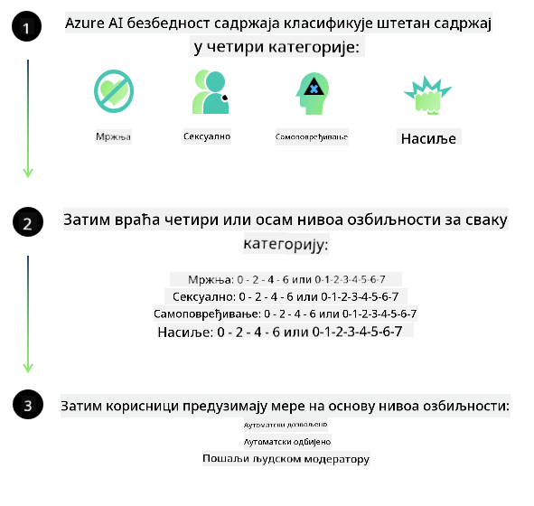

<!--
CO_OP_TRANSLATOR_METADATA:
{
  "original_hash": "c8273672cc57df2be675407a1383aaf0",
  "translation_date": "2025-07-16T17:53:41+00:00",
  "source_file": "md/01.Introduction/01/01.AISafety.md",
  "language_code": "sr"
}
-->
# Безбедност вештачке интелигенције за Phi моделе  
Породица Phi модела развијена је у складу са [Microsoft Responsible AI Standard](https://query.prod.cms.rt.microsoft.com/cms/api/am/binary/RE5cmFl), што је скуп захтева на нивоу компаније заснован на следећих шест принципа: одговорност, транспарентност, праведност, поузданост и безбедност, приватност и сигурност, као и инклузивност, који чине [Microsoft-ове принципе одговорне вештачке интелигенције](https://www.microsoft.com/ai/responsible-ai).

Као и претходни Phi модели, примењен је вишеслојни приступ процени безбедности и безбедносној обуци након тренинга, уз додатне мере које узимају у обзир мултијезичке могућности овог издања. Наш приступ обуци и процени безбедности, укључујући тестирање на више језика и категорија ризика, описан је у [Phi Safety Post-Training Paper](https://arxiv.org/abs/2407.13833). Иако Phi модели имају користи од овог приступа, програмери треба да примењују најбоље праксе одговорне вештачке интелигенције, укључујући мапирање, мерење и ублажавање ризика повезаних са њиховом конкретном применом и културним и језичким контекстом.

## Најбоље праксе

Као и други модели, Phi породица модела може потенцијално да се понаша на начине који нису праведни, поуздани или који могу бити увредљиви.

Неки од ограничења у понашању SLM и LLM модела на које треба обратити пажњу укључују:

- **Квалитет услуге:** Phi модели су углавном тренирани на енглеском тексту. Језици осим енглеског ће имати слабије перформансе. Варијанте енглеског језика које су мање заступљене у тренинг подацима могу имати слабије резултате у односу на стандардни амерички енглески.
- **Презентација штете и одржавање стереотипа:** Ови модели могу претерано или недовољно представљати одређене групе људи, избрисати представу неких група или појачати понижавајуће или негативне стереотипе. Упркос безбедносној обуци након тренинга, ова ограничења могу и даље постојати због различитих нивоа заступљености различитих група или учесталости примера негативних стереотипа у тренинг подацима који одражавају стварне светске обрасце и друштвене предрасуде.
- **Неодговарајући или увредљив садржај:** Ови модели могу генерисати и друге врсте неодговарајућег или увредљивог садржаја, што може учинити њихову примену неприкладном у осетљивим контекстима без додатних мера ублажавања које су специфичне за конкретну примену.
- **Поузданост информација:** Језички модели могу генерисати бесмислен садржај или измишљати информације које могу звучати разумно, али су нетачне или застареле.
- **Ограничен опсег за код:** Већина тренинг података за Phi-3 базирана је на Python-у и користи уобичајене пакете као што су "typing, math, random, collections, datetime, itertools". Ако модел генерише Python скрипте које користе друге пакете или скрипте на другим језицима, топло препоручујемо корисницима да ручно провере све употребе API-ја.

Програмери треба да примењују најбоље праксе одговорне вештачке интелигенције и одговорни су за обезбеђивање да конкретна примена буде у складу са релевантним законима и прописима (нпр. приватност, трговина и сл.).

## Разматрања одговорне вештачке интелигенције

Као и други језички модели, Phi серија модела може потенцијално да се понаша на начине који нису праведни, поуздани или који могу бити увредљиви. Неки од ограничења на која треба обратити пажњу укључују:

**Квалитет услуге:** Phi модели су углавном тренирани на енглеском тексту. Језици осим енглеског ће имати слабије перформансе. Варијанте енглеског језика које су мање заступљене у тренинг подацима могу имати слабије резултате у односу на стандардни амерички енглески.

**Презентација штете и одржавање стереотипа:** Ови модели могу претерано или недовољно представљати одређене групе људи, избрисати представу неких група или појачати понижавајуће или негативне стереотипе. Упркос безбедносној обуци након тренинга, ова ограничења могу и даље постојати због различитих нивоа заступљености различитих група или учесталости примера негативних стереотипа у тренинг подацима који одражавају стварне светске обрасце и друштвене предрасуде.

**Неодговарајући или увредљив садржај:** Ови модели могу генерисати и друге врсте неодговарајућег или увредљивог садржаја, што може учинити њихову примену неприкладном у осетљивим контекстима без додатних мера ублажавања које су специфичне за конкретну примену.  
Поузданост информација: Језички модели могу генерисати бесмислен садржај или измишљати информације које могу звучати разумно, али су нетачне или застареле.

**Ограничен опсег за код:** Већина тренинг података за Phi-3 базирана је на Python-у и користи уобичајене пакете као што су "typing, math, random, collections, datetime, itertools". Ако модел генерише Python скрипте које користе друге пакете или скрипте на другим језицима, топло препоручујемо корисницима да ручно провере све употребе API-ја.

Програмери треба да примењују најбоље праксе одговорне вештачке интелигенције и одговорни су за обезбеђивање да конкретна примена буде у складу са релевантним законима и прописима (нпр. приватност, трговина и сл.). Важна подручја за разматрање укључују:

**Расподела:** Модели можда нису погодни за сценарије који могу имати значајан утицај на правни статус или расподелу ресурса или животних могућности (нпр. становање, запослење, кредит и сл.) без додатних процена и техника за смањење пристрасности.

**Сценарији високог ризика:** Програмери треба да процене прикладност коришћења модела у сценаријима високог ризика где неправедни, непоуздани или увредљиви резултати могу бити изузетно скупи или довести до штете. Ово укључује пружање савета у осетљивим или стручним областима где су тачност и поузданост кључни (нпр. правни или здравствени савети). Додатне мере заштите треба применити на нивоу апликације у складу са контекстом примене.

**Дезинформације:** Модели могу производити нетачне информације. Програмери треба да прате најбоље праксе транспарентности и обавесте крајње кориснике да комуницирају са AI системом. На нивоу апликације, програмери могу изградити механизме повратних информација и процесе који осигуравају да одговори буду засновани на специфичним, контекстуалним информацијама за примену, техника позната као Retrieval Augmented Generation (RAG).

**Генерисање штетног садржаја:** Програмери треба да процене излазне резултате у контексту и користе доступне класификаторе безбедности или прилагођена решења која су одговарајућа за њихову примену.

**Злоупотреба:** Други облици злоупотребе као што су превара, спам или производња малвера могу бити могући, и програмери треба да обезбеде да њихове апликације не крше важеће законе и прописе.

### Фино подешавање и безбедност AI садржаја

Након фино подешавања модела, топло препоручујемо коришћење мера [Azure AI Content Safety](https://learn.microsoft.com/azure/ai-services/content-safety/overview) за праћење садржаја који модели генеришу, идентификовање и блокирање потенцијалних ризика, претњи и проблема са квалитетом.

[Azure AI Content Safety](https://learn.microsoft.com/azure/ai-services/content-safety/overview) подржава и текстуални и сликовни садржај. Може се користити у облаку, у изолованим контејнерима и на уређајима на ивици мреже/уграђеним уређајима.

## Преглед Azure AI Content Safety

Azure AI Content Safety није решење које одговара свима; може се прилагодити да буде у складу са специфичним политикама предузећа. Поред тога, његови мултијезички модели омогућавају разумевање више језика истовремено.

- **Azure AI Content Safety**  
- **Microsoft Developer**  
- **5 видео записа**

Azure AI Content Safety сервис детектује штетни садржај који корисници или AI генеришу у апликацијама и услугама. Обухвата текстуалне и сликовне API-је који омогућавају детекцију штетног или неодговарајућег материјала.

[AI Content Safety Playlist](https://www.youtube.com/playlist?list=PLlrxD0HtieHjaQ9bJjyp1T7FeCbmVcPkQ)

**Одрицање одговорности**:  
Овај документ је преведен коришћењем AI услуге за превођење [Co-op Translator](https://github.com/Azure/co-op-translator). Иако се трудимо да превод буде тачан, молимо вас да имате у виду да аутоматски преводи могу садржати грешке или нетачности. Оригинални документ на његовом изворном језику треба сматрати ауторитетним извором. За критичне информације препоручује се професионални људски превод. Нисмо одговорни за било каква неспоразума или погрешна тумачења која произилазе из коришћења овог превода.