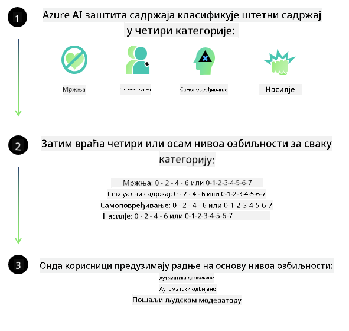
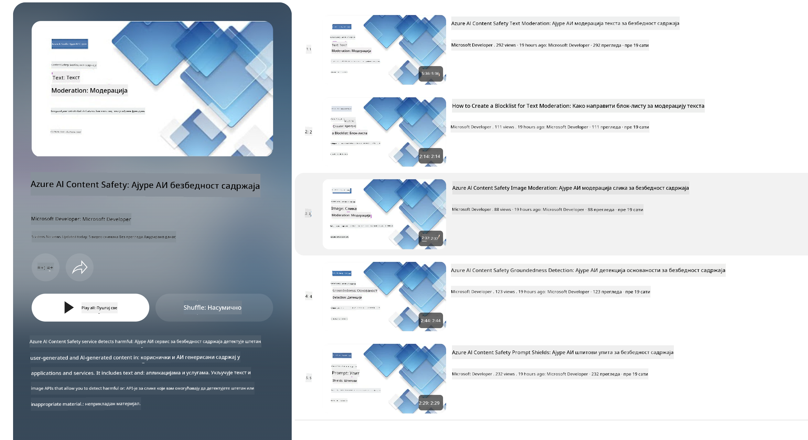

<!--
CO_OP_TRANSLATOR_METADATA:
{
  "original_hash": "c8273672cc57df2be675407a1383aaf0",
  "translation_date": "2025-05-09T06:26:19+00:00",
  "source_file": "md/01.Introduction/01/01.AISafety.md",
  "language_code": "sr"
}
-->
# AI bezbednost za Phi modele  
Phi porodica modela razvijena je u skladu sa [Microsoft Responsible AI Standard](https://query.prod.cms.rt.microsoft.com/cms/api/am/binary/RE5cmFl), što je skup zahteva kompanije zasnovan na sledećih šest principa: odgovornost, transparentnost, pravičnost, pouzdanost i bezbednost, privatnost i sigurnost, kao i inkluzivnost, koji čine [Microsoft-ove Responsible AI principe](https://www.microsoft.com/ai/responsible-ai).  

Kao i kod prethodnih Phi modela, primenjen je višeslojni pristup evaluaciji bezbednosti i post-trening bezbednosnim merama, uz dodatne korake kako bi se uzele u obzir višejezične mogućnosti ovog izdanja. Naš pristup treniranju i evaluaciji bezbednosti, uključujući testiranje na više jezika i u različitim kategorijama rizika, opisan je u [Phi Safety Post-Training Paper](https://arxiv.org/abs/2407.13833). Iako Phi modeli imaju koristi od ovog pristupa, programeri treba da primenjuju najbolje prakse odgovornog AI, uključujući mapiranje, merenje i ublažavanje rizika povezanih sa njihovim konkretnim slučajem upotrebe i kulturnim i jezičkim kontekstom.  

## Najbolje prakse  

Kao i drugi modeli, Phi porodica modela može potencijalno da se ponaša na načine koji nisu pravični, pouzdani ili koji mogu biti uvredljivi.  

Neki od ograničavajućih obrazaca ponašanja SLM i LLM modela na koje treba obratiti pažnju uključuju:  

- **Kvalitet usluge:** Phi modeli su primarno trenirani na tekstu na engleskom jeziku. Jezici osim engleskog mogu imati lošije performanse. Varijante engleskog jezika sa manjim zastupanjem u trening podacima mogu imati lošije rezultate u poređenju sa standardnim američkim engleskim.  
- **Predstavljanje štete i održavanje stereotipa:** Ovi modeli mogu preuveličavati ili potcenjivati grupe ljudi, brisati zastupljenost određenih grupa ili pojačavati ponižavajuće ili negativne stereotipe. Uprkos post-trening bezbednosnim merama, ove slabosti i dalje mogu postojati zbog različitih nivoa zastupljenosti grupa ili učestalosti primera negativnih stereotipa u trening podacima, koji odražavaju stvarne obrasce i društvene pristrasnosti.  
- **Neprimeren ili uvredljiv sadržaj:** Ovi modeli mogu generisati različite vrste neprimerenog ili uvredljivog sadržaja, zbog čega njihova primena u osetljivim kontekstima može biti neodgovarajuća bez dodatnih mera zaštite specifičnih za konkretan slučaj upotrebe.  
- **Pouzdanost informacija:** Jezički modeli mogu generisati besmislene sadržaje ili izmišljati informacije koje mogu zvučati uverljivo, ali su netačne ili zastarele.  
- **Ograničen opseg za kod:** Većina trening podataka za Phi-3 zasnovana je na Python-u i koristi uobičajene pakete kao što su "typing, math, random, collections, datetime, itertools". Ukoliko model generiše Python skripte koje koriste druge pakete ili skripte na drugim jezicima, snažno preporučujemo korisnicima da ručno provere svaku upotrebu API-ja.  

Programeri treba da primenjuju najbolje prakse odgovornog AI i odgovorni su za to da konkretan slučaj upotrebe bude u skladu sa relevantnim zakonima i propisima (npr. privatnost, trgovina itd.).  

## Razmatranja odgovornog AI  

Kao i drugi jezički modeli, Phi serija modela može potencijalno da se ponaša na načine koji nisu pravični, pouzdani ili koji mogu biti uvredljivi. Neki od ograničavajućih obrazaca ponašanja na koje treba obratiti pažnju uključuju:  

**Kvalitet usluge:** Phi modeli su primarno trenirani na tekstu na engleskom jeziku. Jezici osim engleskog mogu imati lošije performanse. Varijante engleskog jezika sa manjim zastupanjem u trening podacima mogu imati lošije rezultate u poređenju sa standardnim američkim engleskim.  

**Predstavljanje štete i održavanje stereotipa:** Ovi modeli mogu preuveličavati ili potcenjivati grupe ljudi, brisati zastupljenost određenih grupa ili pojačavati ponižavajuće ili negativne stereotipe. Uprkos post-trening bezbednosnim merama, ove slabosti i dalje mogu postojati zbog različitih nivoa zastupljenosti grupa ili učestalosti primera negativnih stereotipa u trening podacima, koji odražavaju stvarne obrasce i društvene pristrasnosti.  

**Neprimeren ili uvredljiv sadržaj:** Ovi modeli mogu generisati različite vrste neprimerenog ili uvredljivog sadržaja, zbog čega njihova primena u osetljivim kontekstima može biti neodgovarajuća bez dodatnih mera zaštite specifičnih za konkretan slučaj upotrebe.  
Pouzdanost informacija: Jezički modeli mogu generisati besmislene sadržaje ili izmišljati informacije koje mogu zvučati uverljivo, ali su netačne ili zastarele.  

**Ograničen opseg za kod:** Većina trening podataka za Phi-3 zasnovana je na Python-u i koristi uobičajene pakete kao što su "typing, math, random, collections, datetime, itertools". Ukoliko model generiše Python skripte koje koriste druge pakete ili skripte na drugim jezicima, snažno preporučujemo korisnicima da ručno provere svaku upotrebu API-ja.  

Programeri treba da primenjuju najbolje prakse odgovornog AI i odgovorni su za to da konkretan slučaj upotrebe bude u skladu sa relevantnim zakonima i propisima (npr. privatnost, trgovina itd.). Važne oblasti za razmatranje uključuju:  

**Raspodela:** Modeli možda nisu pogodni za scenarije koji mogu imati značajan uticaj na pravni status ili raspodelu resursa ili životnih prilika (npr. stanovanje, zapošljavanje, kredit itd.) bez dodatnih procena i tehnika za smanjenje pristrasnosti.  

**Visokorizični scenariji:** Programeri treba da procene prikladnost korišćenja modela u visokorizičnim situacijama gde nepravični, nepouzdani ili uvredljivi rezultati mogu imati velike posledice ili dovesti do štete. Ovo uključuje davanje saveta u osetljivim ili stručnim oblastima gde su tačnost i pouzdanost ključni (npr. pravni ili zdravstveni saveti). Dodatne mere zaštite treba implementirati na nivou aplikacije u skladu sa kontekstom primene.  

**Dezinformacije:** Modeli mogu proizvoditi netačne informacije. Programeri treba da slede najbolje prakse transparentnosti i da obaveste krajnje korisnike da komuniciraju sa AI sistemom. Na nivou aplikacije, programeri mogu napraviti mehanizme za povratne informacije i tokove podataka koji povezuju odgovore sa specifičnim, kontekstualnim informacijama za slučaj upotrebe, tehnikom poznatom kao Retrieval Augmented Generation (RAG).  

**Generisanje štetnog sadržaja:** Programeri treba da procene izlaze u njihovom kontekstu i koriste dostupne klasifikatore bezbednosti ili prilagođena rešenja koja su odgovarajuća za njihov slučaj upotrebe.  

**Zloupotreba:** Druge forme zloupotrebe, kao što su prevara, spam ili proizvodnja malvera, mogu biti moguće, te programeri treba da osiguraju da njihove aplikacije ne krše važeće zakone i propise.  

### Fino podešavanje i bezbednost AI sadržaja  

Nakon fino podešavanja modela, toplo preporučujemo korišćenje mera [Azure AI Content Safety](https://learn.microsoft.com/azure/ai-services/content-safety/overview) za praćenje sadržaja generisanog od strane modela, identifikovanje i blokiranje potencijalnih rizika, pretnji i problema sa kvalitetom.  

  

[Azure AI Content Safety](https://learn.microsoft.com/azure/ai-services/content-safety/overview) podržava i tekstualni i slikovni sadržaj. Može se implementirati u oblaku, u izolovanim kontejnerima i na edge/ugrađenim uređajima.  

## Pregled Azure AI Content Safety  

Azure AI Content Safety nije rešenje koje odgovara svima; može se prilagoditi kako bi bilo usklađeno sa specifičnim politikama preduzeća. Pored toga, njegovi višejezični modeli omogućavaju razumevanje više jezika istovremeno.  

  

- **Azure AI Content Safety**  
- **Microsoft Developer**  
- **5 video snimaka**  

Azure AI Content Safety servis detektuje štetan sadržaj koji korisnici i AI generišu u aplikacijama i uslugama. Uključuje tekstualne i slikovne API-je koji omogućavaju detekciju štetnog ili neprimerenog materijala.  

[AI Content Safety Playlist](https://www.youtube.com/playlist?list=PLlrxD0HtieHjaQ9bJjyp1T7FeCbmVcPkQ)

**Одрицање од одговорности**:  
Овај документ је преведен коришћењем AI сервиса за превођење [Co-op Translator](https://github.com/Azure/co-op-translator). Иако тежимо прецизности, молимо имајте у виду да аутоматизовани преводи могу садржати грешке или нетачности. Оригинални документ на његовом изворном језику треба сматрати ауторитетним извором. За критичне информације препоручује се професионални људски превод. Нисмо одговорни за било каква неспоразума или погрешна тумачења која могу настати коришћењем овог превода.