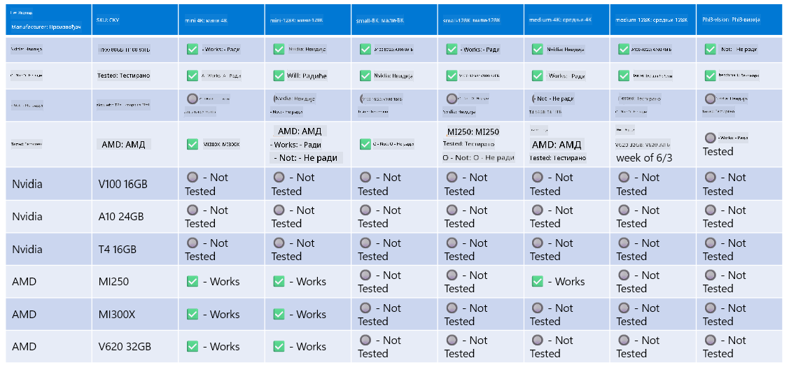

<!--
CO_OP_TRANSLATOR_METADATA:
{
  "original_hash": "8cdc17ce0f10535da30b53d23fe1a795",
  "translation_date": "2025-05-09T07:54:26+00:00",
  "source_file": "md/01.Introduction/01/01.Hardwaresupport.md",
  "language_code": "sr"
}
-->
# Phi Hardverska podrška

Microsoft Phi je optimizovan za ONNX Runtime i podržava Windows DirectML. Radi dobro na različitim vrstama hardvera, uključujući GPU-ove, CPU-ove, pa čak i mobilne uređaje.

## Hardver uređaja  
Konkretno, podržani hardver uključuje:

- GPU SKU: RTX 4090 (DirectML)
- GPU SKU: 1 A100 80GB (CUDA)
- CPU SKU: Standard F64s v2 (64 vCPU-a, 128 GiB memorije)

## Mobilni SKU

- Android - Samsung Galaxy S21
- Apple iPhone 14 ili noviji sa A16/A17 procesorom

## Specifikacija Phi hardvera

- Minimalna potrebna konfiguracija.
- Windows: GPU sposoban za DirectX 12 i najmanje 4GB ukupne RAM memorije

CUDA: NVIDIA GPU sa Compute Capability >= 7.02



## Pokretanje onnxruntime na više GPU-ova

Trenutno dostupni Phi ONNX modeli su namenjeni samo za 1 GPU. Moguće je podržati multi-gpu za Phi model, ali ORT sa 2 GPU-a ne garantuje veću propusnost u poređenju sa 2 instance ort-a. Za najnovije informacije pogledajte [ONNX Runtime](https://onnxruntime.ai/).

Na [Build 2024 GenAI ONNX tim](https://youtu.be/WLW4SE8M9i8?si=EtG04UwDvcjunyfC) je najavio da su omogućili multi-instance umesto multi-gpu za Phi modele.

Trenutno to omogućava da pokrenete jednu onnxruntime ili onnxruntime-genai instancu sa promenljivom okruženja CUDA_VISIBLE_DEVICES na sledeći način.

```Python
CUDA_VISIBLE_DEVICES=0 python infer.py
CUDA_VISIBLE_DEVICES=1 python infer.py
```

Slobodno istražite Phi detaljnije u [Azure AI Foundry](https://ai.azure.com)

**Одрицање од одговорности**:  
Овај документ је преведен коришћењем AI преводилачке услуге [Co-op Translator](https://github.com/Azure/co-op-translator). Иако настојимо да превод буде прецизан, имајте у виду да аутоматизовани преводи могу садржати грешке или нетачности. Оригинални документ на његовом изворном језику треба сматрати ауторитетним извором. За критичне информације препоручује се професионални људски превод. Нисмо одговорни за било каква неспоразума или погрешне тумачења настала употребом овог превода.