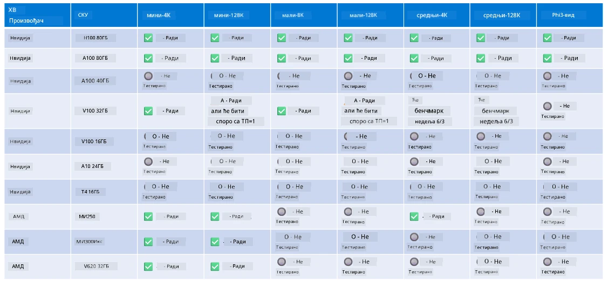

<!--
CO_OP_TRANSLATOR_METADATA:
{
  "original_hash": "8cdc17ce0f10535da30b53d23fe1a795",
  "translation_date": "2025-07-16T18:27:20+00:00",
  "source_file": "md/01.Introduction/01/01.Hardwaresupport.md",
  "language_code": "sr"
}
-->
# Phi подршка за хардвер

Microsoft Phi је оптимизован за ONNX Runtime и подржава Windows DirectML. Добро ради на различитим типовима хардвера, укључујући GPU-ове, CPU-ове, па чак и мобилне уређаје.

## Хардвер уређаја  
Конкретно, подржани хардвер укључује:

- GPU SKU: RTX 4090 (DirectML)
- GPU SKU: 1 A100 80GB (CUDA)
- CPU SKU: Standard F64s v2 (64 vCPU-а, 128 GiB меморије)

## Мобилни SKU

- Android - Samsung Galaxy S21
- Apple iPhone 14 или новији са A16/A17 процесором

## Спецификација Phi хардвера

- Минимална потребна конфигурација.
- Windows: GPU који подржава DirectX 12 и минимум 4GB укупне RAM меморије

CUDA: NVIDIA GPU са Compute Capability >= 7.02



## Покретање onnxruntime-а на више GPU-ова

Тренутно доступни Phi ONNX модели су намењени само за 1 GPU. Могуће је подржати више GPU-ова за Phi модел, али ORT са 2 GPU-а не гарантује већу пропусност у односу на 2 инстанце ORT-а. За најновија ажурирања погледајте [ONNX Runtime](https://onnxruntime.ai/).

На [Build 2024 догађају, GenAI ONNX тим](https://youtu.be/WLW4SE8M9i8?si=EtG04UwDvcjunyfC) је најавио да су омогућили мулти-инстанцу уместо мулти-GPU за Phi моделе.

Тренутно вам ово омогућава да покренете једну onnxruntime или onnxruntime-genai инстанцу са CUDA_VISIBLE_DEVICES променљивом окружења на следећи начин.

```Python
CUDA_VISIBLE_DEVICES=0 python infer.py
CUDA_VISIBLE_DEVICES=1 python infer.py
```

Слободно истражите Phi даље у [Azure AI Foundry](https://ai.azure.com)

**Одрицање од одговорности**:  
Овај документ је преведен коришћењем AI сервиса за превођење [Co-op Translator](https://github.com/Azure/co-op-translator). Иако се трудимо да превод буде тачан, молимо вас да имате у виду да аутоматски преводи могу садржати грешке или нетачности. Оригинални документ на његовом изворном језику треба сматрати ауторитетним извором. За критичне информације препоручује се професионални људски превод. Нисмо одговорни за било каква неспоразума или погрешна тумачења настала коришћењем овог превода.