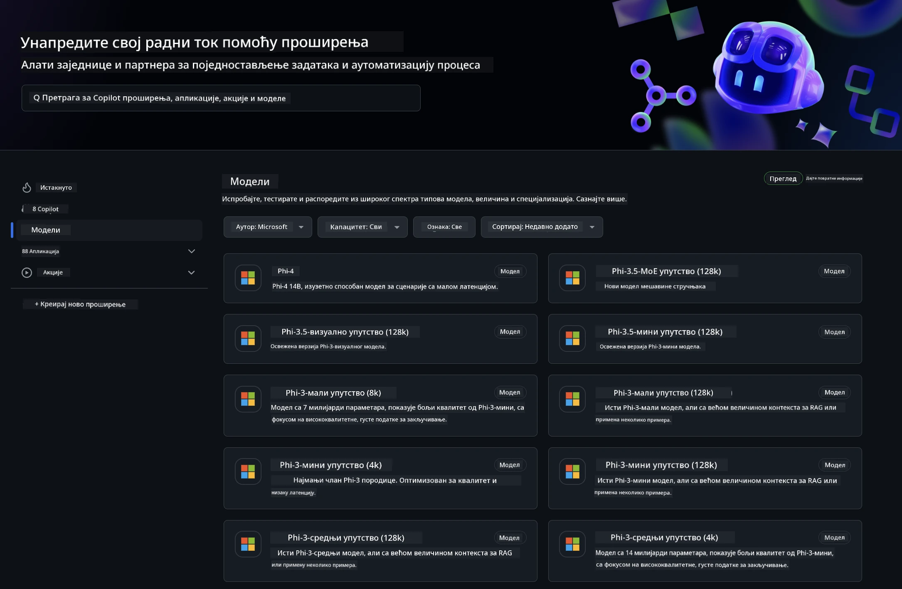
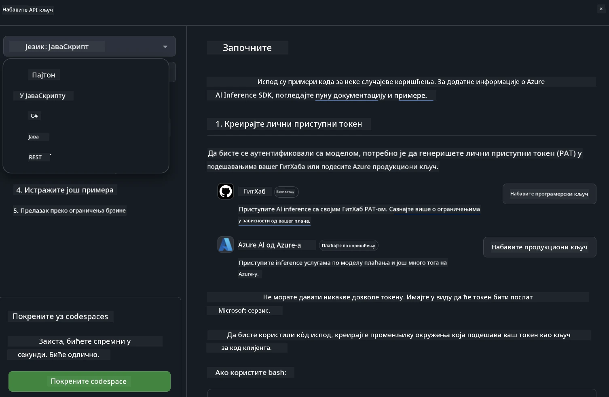
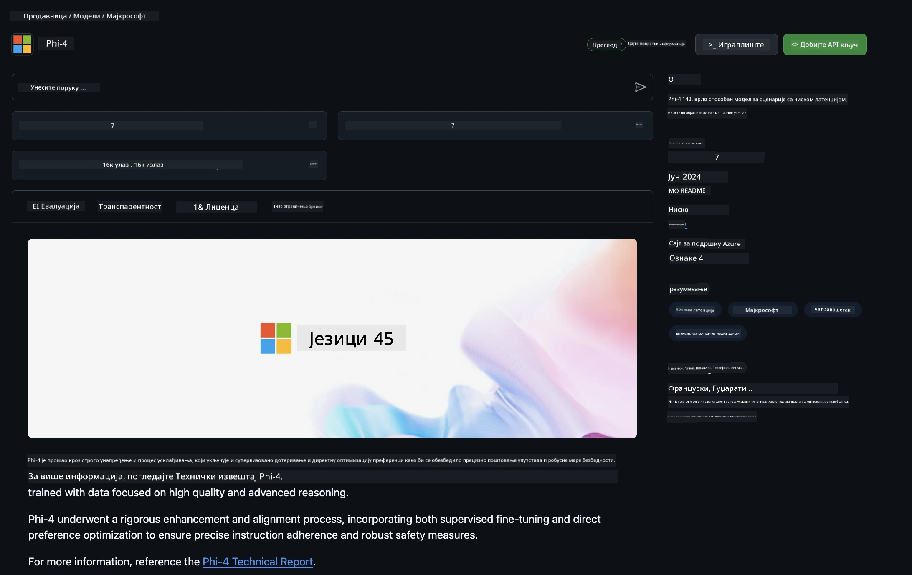

<!--
CO_OP_TRANSLATOR_METADATA:
{
  "original_hash": "fb67a08b9fc911a10ed58081fadef416",
  "translation_date": "2025-07-16T19:04:57+00:00",
  "source_file": "md/01.Introduction/02/02.GitHubModel.md",
  "language_code": "sr"
}
-->
## Phi породица у GitHub моделима

Добродошли у [GitHub Models](https://github.com/marketplace/models)! Све је спремно за вас да истражите AI моделе који се налазе на Azure AI.



За више информација о моделима доступним на GitHub Models, погледајте [GitHub Model Marketplace](https://github.com/marketplace/models)

## Доступни модели

Сваки модел има посебан playground и пример кода


### Phi породица у GitHub каталогу модела

- [Phi-4](https://github.com/marketplace/models/azureml/Phi-4)

- [Phi-3.5-MoE instruct (128k)](https://github.com/marketplace/models/azureml/Phi-3-5-MoE-instruct)

- [Phi-3.5-vision instruct (128k)](https://github.com/marketplace/models/azureml/Phi-3-5-vision-instruct)

- [Phi-3.5-mini instruct (128k)](https://github.com/marketplace/models/azureml/Phi-3-5-mini-instruct)

- [Phi-3-Medium-128k-Instruct](https://github.com/marketplace/models/azureml/Phi-3-medium-128k-instruct)

- [Phi-3-medium-4k-instruct](https://github.com/marketplace/models/azureml/Phi-3-medium-4k-instruct)

- [Phi-3-mini-128k-instruct](https://github.com/marketplace/models/azureml/Phi-3-mini-128k-instruct)

- [Phi-3-mini-4k-instruct](https://github.com/marketplace/models/azureml/Phi-3-mini-4k-instruct)

- [Phi-3-small-128k-instruct](https://github.com/marketplace/models/azureml/Phi-3-small-128k-instruct)

- [Phi-3-small-8k-instruct](https://github.com/marketplace/models/azureml/Phi-3-small-8k-instruct)

## Почетак рада

Постоји неколико основних примера који су спремни за покретање. Можете их пронаћи у директоријуму samples. Ако желите да одмах пређете на свој омиљени језик, примере можете наћи у следећим језицима:

- Python  
- JavaScript  
- C#  
- Java  
- cURL  

Постоји и посебно Codespaces окружење за покретање примера и модела.



## Пример кода

Испод су примери кода за неколико случајева употребе. За додатне информације о Azure AI Inference SDK, погледајте пуну документацију и примере.

## Подешавање

1. Креирајте personal access token  
Није потребно да додељујете никакве дозволе токену. Имајте на уму да ће токен бити послат Microsoft сервису.

Да бисте користили примере кода испод, креирајте environment variable и подесите свој токен као кључ за client код.

Ако користите bash:  
```
export GITHUB_TOKEN="<your-github-token-goes-here>"
```  
Ако сте у powershell:  

```
$Env:GITHUB_TOKEN="<your-github-token-goes-here>"
```  

Ако користите Windows command prompt:  

```
set GITHUB_TOKEN=<your-github-token-goes-here>
```  

## Python пример

### Инсталирање зависности  
Инсталирајте Azure AI Inference SDK помоћу pip-а (Захтева: Python >=3.8):  

```
pip install azure-ai-inference
```  
### Покрени основни пример кода

Овај пример показује основни позив chat completion API-ју. Користи GitHub AI model inference endpoint и ваш GitHub токен. Позив је синхрони.

```python
import os
from azure.ai.inference import ChatCompletionsClient
from azure.ai.inference.models import SystemMessage, UserMessage
from azure.core.credentials import AzureKeyCredential

endpoint = "https://models.inference.ai.azure.com"
model_name = "Phi-4"
token = os.environ["GITHUB_TOKEN"]

client = ChatCompletionsClient(
    endpoint=endpoint,
    credential=AzureKeyCredential(token),
)

response = client.complete(
    messages=[
        UserMessage(content="I have $20,000 in my savings account, where I receive a 4% profit per year and payments twice a year. Can you please tell me how long it will take for me to become a millionaire? Also, can you please explain the math step by step as if you were explaining it to an uneducated person?"),
    ],
    temperature=0.4,
    top_p=1.0,
    max_tokens=2048,
    model=model_name
)

print(response.choices[0].message.content)
```

### Покрени разговор са више корака

Овај пример показује разговор са више корака са chat completion API-јем. Када користите модел за chat апликацију, потребно је да пратите историју разговора и шаљете најновије поруке моделу.

```
import os
from azure.ai.inference import ChatCompletionsClient
from azure.ai.inference.models import AssistantMessage, SystemMessage, UserMessage
from azure.core.credentials import AzureKeyCredential

token = os.environ["GITHUB_TOKEN"]
endpoint = "https://models.inference.ai.azure.com"
# Replace Model_Name
model_name = "Phi-4"

client = ChatCompletionsClient(
    endpoint=endpoint,
    credential=AzureKeyCredential(token),
)

messages = [
    SystemMessage(content="You are a helpful assistant."),
    UserMessage(content="What is the capital of France?"),
    AssistantMessage(content="The capital of France is Paris."),
    UserMessage(content="What about Spain?"),
]

response = client.complete(messages=messages, model=model_name)

print(response.choices[0].message.content)
```

### Стримовање излаза

За боље корисничко искуство, препоручује се стримовање одговора модела тако да први токен буде видљив раније и да се избегне дуго чекање на одговор.

```
import os
from azure.ai.inference import ChatCompletionsClient
from azure.ai.inference.models import SystemMessage, UserMessage
from azure.core.credentials import AzureKeyCredential

token = os.environ["GITHUB_TOKEN"]
endpoint = "https://models.inference.ai.azure.com"
# Replace Model_Name
model_name = "Phi-4"

client = ChatCompletionsClient(
    endpoint=endpoint,
    credential=AzureKeyCredential(token),
)

response = client.complete(
    stream=True,
    messages=[
        SystemMessage(content="You are a helpful assistant."),
        UserMessage(content="Give me 5 good reasons why I should exercise every day."),
    ],
    model=model_name,
)

for update in response:
    if update.choices:
        print(update.choices[0].delta.content or "", end="")

client.close()
```

## БЕСПЛАТНА употреба и ограничења за GitHub моделе



[rate limits for the playground and free API usage](https://docs.github.com/en/github-models/prototyping-with-ai-models#rate-limits) су осмишљени да вам помогну да експериментишете са моделима и направите прототип своје AI апликације. За коришћење изван тих ограничења, и за скалирање апликације, морате обезбедити ресурсе преко Azure налога и аутентификовати се преко њега уместо преко свог GitHub personal access token-а. Не морате мењати ништа друго у свом коду. Користите овај линк да сазнате како да пређете преко бесплатних ограничења у Azure AI.

### Обавештења

Имајте на уму да када радите са моделом, експериментишете са AI-јем, па су могуће грешке у садржају.

Ова функција има различита ограничења (укључујући број захтева по минуту, по дану, број токена по захтеву и истовремене захтеве) и није намењена за продукцијске случајеве.

GitHub Models користи Azure AI Content Safety. Ови филтери се не могу искључити у оквиру GitHub Models искуства. Ако одлучите да користите моделе преко плаћене услуге, молимо вас да конфигуришете филтере садржаја према својим потребама.

Ова услуга је под GitHub Pre-release Terms.

**Одрицање одговорности**:  
Овај документ је преведен коришћењем AI услуге за превођење [Co-op Translator](https://github.com/Azure/co-op-translator). Иако се трудимо да превод буде тачан, молимо вас да имате у виду да аутоматски преводи могу садржати грешке или нетачности. Оригинални документ на његовом изворном језику треба сматрати ауторитетним извором. За критичне информације препоручује се професионални људски превод. Нисмо одговорни за било каква неспоразума или погрешна тумачења која произилазе из коришћења овог превода.