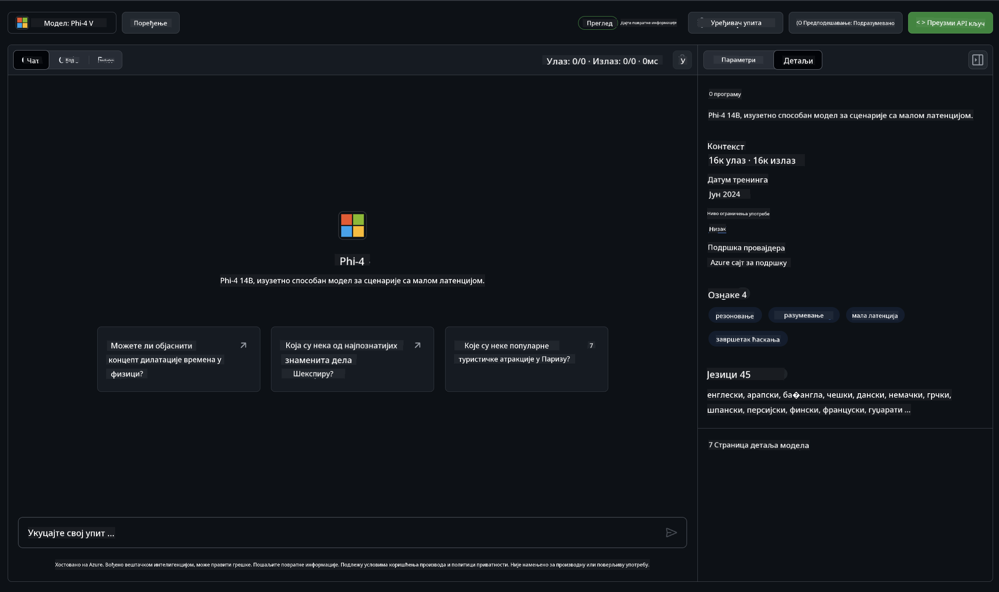

<!--
CO_OP_TRANSLATOR_METADATA:
{
  "original_hash": "fb67a08b9fc911a10ed58081fadef416",
  "translation_date": "2025-05-09T09:00:33+00:00",
  "source_file": "md/01.Introduction/02/02.GitHubModel.md",
  "language_code": "sr"
}
-->
## Phi porodica u GitHub Models

Dobrodošli na [GitHub Models](https://github.com/marketplace/models)! Sve je spremno za vas da istražite AI modele hostovane na Azure AI.


Za više informacija o modelima dostupnim na GitHub Models, pogledajte [GitHub Model Marketplace](https://github.com/marketplace/models)

## Dostupni modeli

Svaki model ima svoj prostor za testiranje i primer koda



### Phi porodica u GitHub Model katalogu

- [Phi-4](https://github.com/marketplace/models/azureml/Phi-4)

- [Phi-3.5-MoE instruct (128k)](https://github.com/marketplace/models/azureml/Phi-3-5-MoE-instruct)

- [Phi-3.5-vision instruct (128k)](https://github.com/marketplace/models/azureml/Phi-3-5-vision-instruct)

- [Phi-3.5-mini instruct (128k)](https://github.com/marketplace/models/azureml/Phi-3-5-mini-instruct)

- [Phi-3-Medium-128k-Instruct](https://github.com/marketplace/models/azureml/Phi-3-medium-128k-instruct)

- [Phi-3-medium-4k-instruct](https://github.com/marketplace/models/azureml/Phi-3-medium-4k-instruct)

- [Phi-3-mini-128k-instruct](https://github.com/marketplace/models/azureml/Phi-3-mini-128k-instruct)

- [Phi-3-mini-4k-instruct](https://github.com/marketplace/models/azureml/Phi-3-mini-4k-instruct)

- [Phi-3-small-128k-instruct](https://github.com/marketplace/models/azureml/Phi-3-small-128k-instruct)

- [Phi-3-small-8k-instruct](https://github.com/marketplace/models/azureml/Phi-3-small-8k-instruct)

## Početak rada

Postoji nekoliko osnovnih primera spremnih za pokretanje. Možete ih pronaći u direktorijumu samples. Ako želite da odmah pređete na omiljeni jezik, primere možete naći u sledećim jezicima:

- Python
- JavaScript
- C#
- Java
- cURL

Takođe postoji poseban Codespaces okruženje za pokretanje primera i modela.


## Primer koda

Ispod su primeri koda za nekoliko upotreba. Za dodatne informacije o Azure AI Inference SDK, pogledajte kompletnu dokumentaciju i primere.

## Podešavanje

1. Napravite personal access token  
Nije potrebno davati nikakve dozvole tokenu. Imajte na umu da će token biti poslat Microsoft servisu.

Da biste koristili primere koda ispod, napravite promenljivu okruženja i postavite vaš token kao ključ za klijentski kod.

Ako koristite bash:  
```
export GITHUB_TOKEN="<your-github-token-goes-here>"
```  
Ako ste u powershell-u:  

```
$Env:GITHUB_TOKEN="<your-github-token-goes-here>"
```  

Ako koristite Windows command prompt:  

```
set GITHUB_TOKEN=<your-github-token-goes-here>
```  

## Python primer

### Instalirajte zavisnosti  
Instalirajte Azure AI Inference SDK koristeći pip (zahteva: Python >=3.8):

```
pip install azure-ai-inference
```  
### Pokrenite osnovni primer koda

Ovaj primer prikazuje osnovni poziv chat completion API-ja. Koristi GitHub AI model inference endpoint i vaš GitHub token. Poziv je sinhron.

```python
import os
from azure.ai.inference import ChatCompletionsClient
from azure.ai.inference.models import SystemMessage, UserMessage
from azure.core.credentials import AzureKeyCredential

endpoint = "https://models.inference.ai.azure.com"
model_name = "Phi-4"
token = os.environ["GITHUB_TOKEN"]

client = ChatCompletionsClient(
    endpoint=endpoint,
    credential=AzureKeyCredential(token),
)

response = client.complete(
    messages=[
        UserMessage(content="I have $20,000 in my savings account, where I receive a 4% profit per year and payments twice a year. Can you please tell me how long it will take for me to become a millionaire? Also, can you please explain the math step by step as if you were explaining it to an uneducated person?"),
    ],
    temperature=0.4,
    top_p=1.0,
    max_tokens=2048,
    model=model_name
)

print(response.choices[0].message.content)
```

### Pokrenite višekratni razgovor

Ovaj primer pokazuje višekratni razgovor sa chat completion API-jem. Kada koristite model za chat aplikaciju, potrebno je da upravljate istorijom razgovora i šaljete najnovije poruke modelu.

```
import os
from azure.ai.inference import ChatCompletionsClient
from azure.ai.inference.models import AssistantMessage, SystemMessage, UserMessage
from azure.core.credentials import AzureKeyCredential

token = os.environ["GITHUB_TOKEN"]
endpoint = "https://models.inference.ai.azure.com"
# Replace Model_Name
model_name = "Phi-4"

client = ChatCompletionsClient(
    endpoint=endpoint,
    credential=AzureKeyCredential(token),
)

messages = [
    SystemMessage(content="You are a helpful assistant."),
    UserMessage(content="What is the capital of France?"),
    AssistantMessage(content="The capital of France is Paris."),
    UserMessage(content="What about Spain?"),
]

response = client.complete(messages=messages, model=model_name)

print(response.choices[0].message.content)
```

### Strimovanje izlaza

Za bolje korisničko iskustvo, poželećete da strimujete odgovor modela tako da se prvi token prikaže brzo i da ne čekate dugo na odgovor.

```
import os
from azure.ai.inference import ChatCompletionsClient
from azure.ai.inference.models import SystemMessage, UserMessage
from azure.core.credentials import AzureKeyCredential

token = os.environ["GITHUB_TOKEN"]
endpoint = "https://models.inference.ai.azure.com"
# Replace Model_Name
model_name = "Phi-4"

client = ChatCompletionsClient(
    endpoint=endpoint,
    credential=AzureKeyCredential(token),
)

response = client.complete(
    stream=True,
    messages=[
        SystemMessage(content="You are a helpful assistant."),
        UserMessage(content="Give me 5 good reasons why I should exercise every day."),
    ],
    model=model_name,
)

for update in response:
    if update.choices:
        print(update.choices[0].delta.content or "", end="")

client.close()
```

## BESPLATNA upotreba i ograničenja za GitHub Models


[Ograničenja za playground i besplatnu API upotrebu](https://docs.github.com/en/github-models/prototyping-with-ai-models#rate-limits) su namenjena da vam pomognu da eksperimentišete sa modelima i napravite prototip AI aplikacije. Za korišćenje izvan tih ograničenja, i za skaliranje aplikacije, morate obezbediti resurse preko Azure naloga i autentifikovati se preko njega umesto preko GitHub personal access tokena. Ne morate menjati ništa drugo u svom kodu. Koristite ovaj link da saznate kako da pređete besplatna ograničenja u Azure AI.

### Napomene

Zapamtite da kada komunicirate sa modelom, eksperimentišete sa AI, tako da su moguće greške u sadržaju.

Ova funkcija ima različita ograničenja (uključujući broj zahteva po minutu, po danu, tokene po zahtevu i istovremene zahteve) i nije namenjena za produkcijsku upotrebu.

GitHub Models koristi Azure AI Content Safety. Ovi filteri se ne mogu isključiti kao deo GitHub Models iskustva. Ako odlučite da koristite modele kroz plaćenu uslugu, podesite filtere sadržaja prema vašim potrebama.

Ova usluga je u skladu sa GitHub Pre-release uslovima.

**Одрицање од одговорности**:  
Овај документ је преведен коришћењем AI услуге за превођење [Co-op Translator](https://github.com/Azure/co-op-translator). Иако тежимо прецизности, имајте у виду да аутоматски преводи могу садржати грешке или нетачности. Изворни документ на његовом оригиналном језику треба сматрати ауторитетним извором. За критичне информације препоручује се професионални људски превод. Нисмо одговорни за било каква неспоразума или погрешне интерпретације које произилазе из коришћења овог превода.