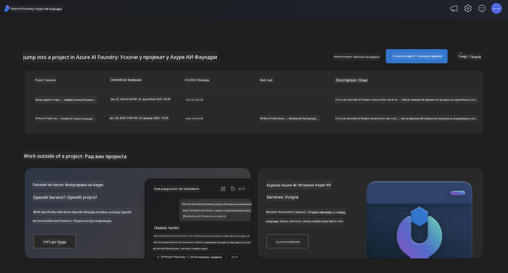
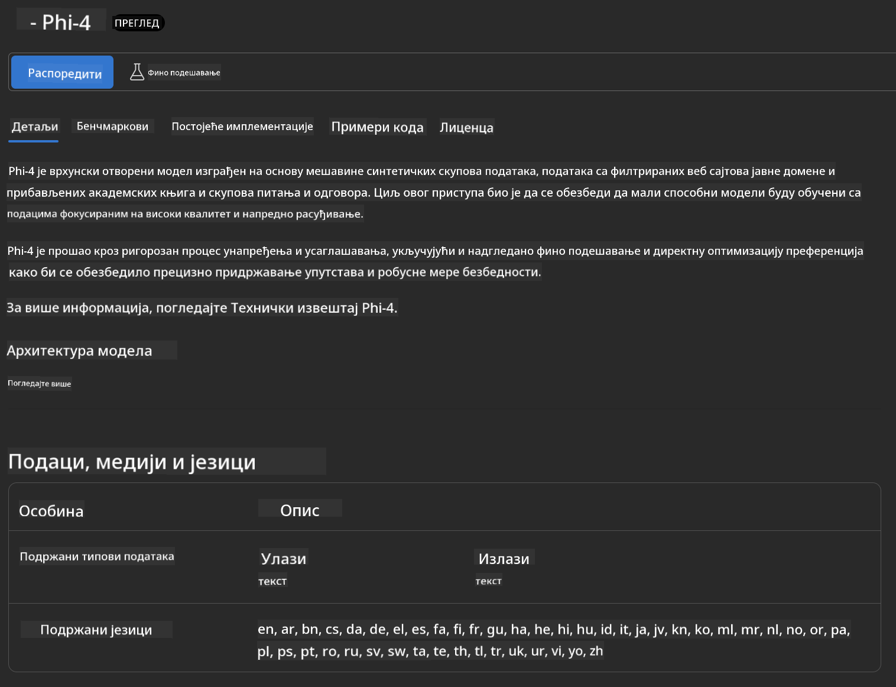

<!--
CO_OP_TRANSLATOR_METADATA:
{
  "original_hash": "3ae21dc5554e888defbe57946ee995ee",
  "translation_date": "2025-07-16T19:11:28+00:00",
  "source_file": "md/01.Introduction/02/03.AzureAIFoundry.md",
  "language_code": "sr"
}
-->
## Phi Family у Azure AI Foundry

[Azure AI Foundry](https://ai.azure.com) је поуздана платформа која омогућава програмерима да покрећу иновације и обликују будућност уз помоћ вештачке интелигенције на безбедан, сигуран и одговоран начин.

[Azure AI Foundry](https://ai.azure.com) је дизајниран за програмере да:

- Креирају генеративне AI апликације на платформи корпоративног нивоа.
- Истражују, граде, тестирају и имплементирају користећи најсавременије AI алате и ML моделе, засноване на одговорним AI праксама.
- Сарађују у тиму током целог животног циклуса развоја апликација.

Са Azure AI Foundry, можете истражити широк спектар модела, сервиса и могућности, и почети са развојем AI апликација које најбоље одговарају вашим циљевима. Платформа Azure AI Foundry олакшава скалабилност за трансформацију прототипа у потпуно развијене производне апликације без напора. Континуирано праћење и усавршавање подржавају дугорочни успех.



Поред коришћења Azure AOAI Service у Azure AI Foundry, можете користити и моделе трећих страна из Azure AI Foundry Model Catalog-а. Ово је добар избор ако желите да користите Azure AI Foundry као платформу за вашу AI решење.

Можемо брзо имплементирати Phi Family моделе преко Model Catalog-а у Azure AI Foundry

[Microsoft Phi Models у Azure AI Foundry Models](https://ai.azure.com/explore/models/?selectedCollection=phi)


### **Имплементација Phi-4 у Azure AI Foundry**



### **Тестирање Phi-4 у Azure AI Foundry Playground**


### **Покретање Python кода за позив Azure AI Foundry Phi-4**

```python

import os  
import base64
from openai import AzureOpenAI  
from azure.identity import DefaultAzureCredential, get_bearer_token_provider  
        
endpoint = os.getenv("ENDPOINT_URL", "Your Azure AOAI Service Endpoint")  
deployment = os.getenv("DEPLOYMENT_NAME", "Phi-4")  
      
token_provider = get_bearer_token_provider(  
    DefaultAzureCredential(),  
    "https://cognitiveservices.azure.com/.default"  
)  
  
client = AzureOpenAI(  
    azure_endpoint=endpoint,  
    azure_ad_token_provider=token_provider,  
    api_version="2024-05-01-preview",  
)  
  

chat_prompt = [
    {
        "role": "system",
        "content": "You are an AI assistant that helps people find information."
    },
    {
        "role": "user",
        "content": "can you introduce yourself"
    }
] 
    
# Include speech result if speech is enabled  
messages = chat_prompt 

completion = client.chat.completions.create(  
    model=deployment,  
    messages=messages,
    max_tokens=800,  
    temperature=0.7,  
    top_p=0.95,  
    frequency_penalty=0,  
    presence_penalty=0,
    stop=None,  
    stream=False  
)  
  
print(completion.to_json())  

```

**Одрицање од одговорности**:  
Овај документ је преведен коришћењем AI услуге за превођење [Co-op Translator](https://github.com/Azure/co-op-translator). Иако се трудимо да превод буде тачан, молимо вас да имате у виду да аутоматски преводи могу садржати грешке или нетачности. Оригинални документ на његовом изворном језику треба сматрати ауторитетним извором. За критичне информације препоручује се професионални људски превод. Нисмо одговорни за било каква неспоразума или погрешна тумачења која произилазе из коришћења овог превода.