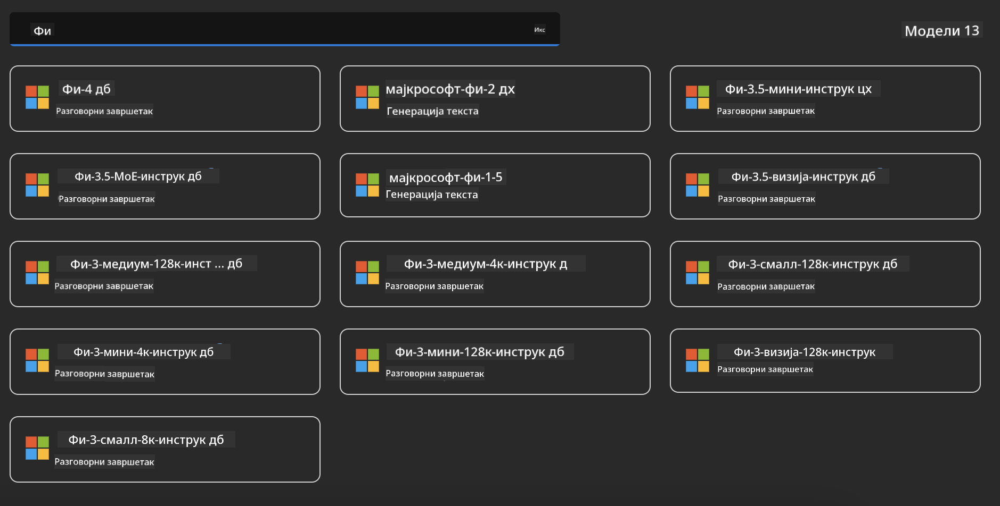
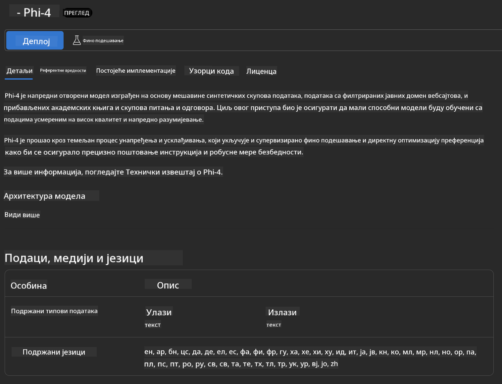
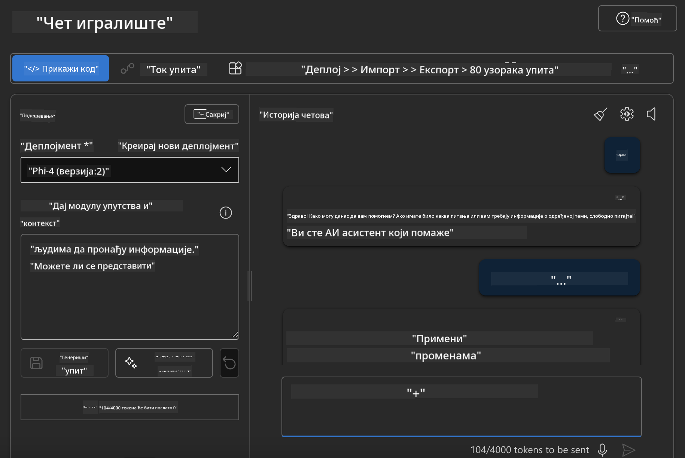

<!--
CO_OP_TRANSLATOR_METADATA:
{
  "original_hash": "3ae21dc5554e888defbe57946ee995ee",
  "translation_date": "2025-05-09T09:10:26+00:00",
  "source_file": "md/01.Introduction/02/03.AzureAIFoundry.md",
  "language_code": "sr"
}
-->
## Phi porodica u Azure AI Foundry

[Azure AI Foundry](https://ai.azure.com) je pouzdana platforma koja omogućava programerima da pokreću inovacije i oblikuju budućnost koristeći AI na siguran, bezbedan i odgovoran način.

[Azure AI Foundry](https://ai.azure.com) je namenjen programerima da:

- Prave generativne AI aplikacije na platformi enterprise nivoa.
- Istražuju, prave, testiraju i implementiraju koristeći najsavremenije AI alate i ML modele, zasnovane na principima odgovornog AI.
- Sarađuju u timu kroz ceo životni ciklus razvoja aplikacije.

Sa Azure AI Foundry, možete istražiti širok spektar modela, servisa i mogućnosti, i započeti razvoj AI aplikacija koje najbolje odgovaraju vašim ciljevima. Platforma Azure AI Foundry omogućava skalabilnost za jednostavnu transformaciju prototipova u potpuno funkcionalne produkcione aplikacije. Kontinuirano praćenje i usavršavanje podržavaju dugoročni uspeh.


Pored korišćenja Azure AOAI Service u Azure AI Foundry, možete koristiti i modele trećih strana iz Azure AI Foundry Model Catalog-a. Ovo je dobar izbor ako želite da koristite Azure AI Foundry kao svoju AI platformu za rešenja.

Modeli iz Phi porodice se brzo mogu implementirati preko Model Catalog-a u Azure AI Foundry

[Microsoft Phi Models in Azure AI Foundry Models](https://ai.azure.com/explore/models/?selectedCollection=phi)



### **Implementacija Phi-4 u Azure AI Foundry**



### **Testiranje Phi-4 u Azure AI Foundry Playground**



### **Pokretanje Python koda za pozivanje Azure AI Foundry Phi-4**

```python

import os  
import base64
from openai import AzureOpenAI  
from azure.identity import DefaultAzureCredential, get_bearer_token_provider  
        
endpoint = os.getenv("ENDPOINT_URL", "Your Azure AOAI Service Endpoint")  
deployment = os.getenv("DEPLOYMENT_NAME", "Phi-4")  
      
token_provider = get_bearer_token_provider(  
    DefaultAzureCredential(),  
    "https://cognitiveservices.azure.com/.default"  
)  
  
client = AzureOpenAI(  
    azure_endpoint=endpoint,  
    azure_ad_token_provider=token_provider,  
    api_version="2024-05-01-preview",  
)  
  

chat_prompt = [
    {
        "role": "system",
        "content": "You are an AI assistant that helps people find information."
    },
    {
        "role": "user",
        "content": "can you introduce yourself"
    }
] 
    
# Include speech result if speech is enabled  
messages = chat_prompt 

completion = client.chat.completions.create(  
    model=deployment,  
    messages=messages,
    max_tokens=800,  
    temperature=0.7,  
    top_p=0.95,  
    frequency_penalty=0,  
    presence_penalty=0,
    stop=None,  
    stream=False  
)  
  
print(completion.to_json())  

```

**Одрицање од одговорности**:  
Овај документ је преведен коришћењем AI преводилачке услуге [Co-op Translator](https://github.com/Azure/co-op-translator). Иако тежимо прецизности, имајте у виду да аутоматски преводи могу садржати грешке или нетачности. Оригинални документ на његовом изворном језику треба сматрати ауторитетним извором. За критичне информације препоручује се професионални људски превод. Нисмо одговорни за било какве неспоразуме или погрешне тумачења која произилазе из коришћења овог превода.