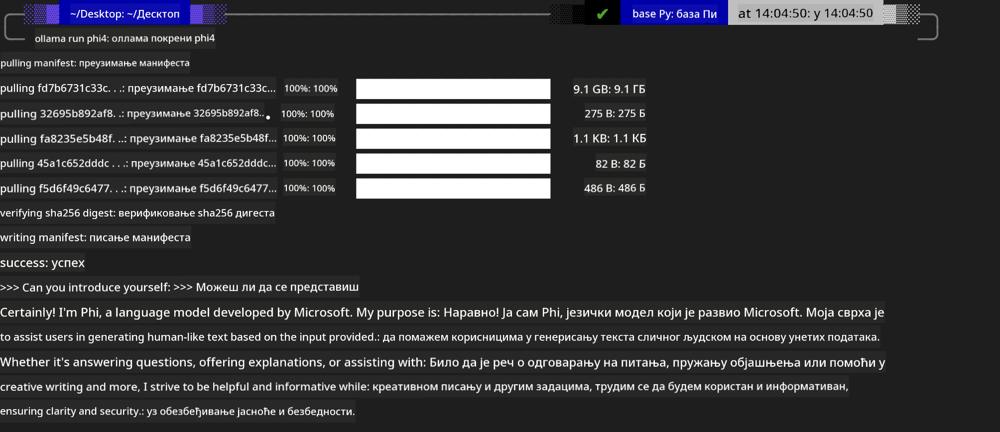
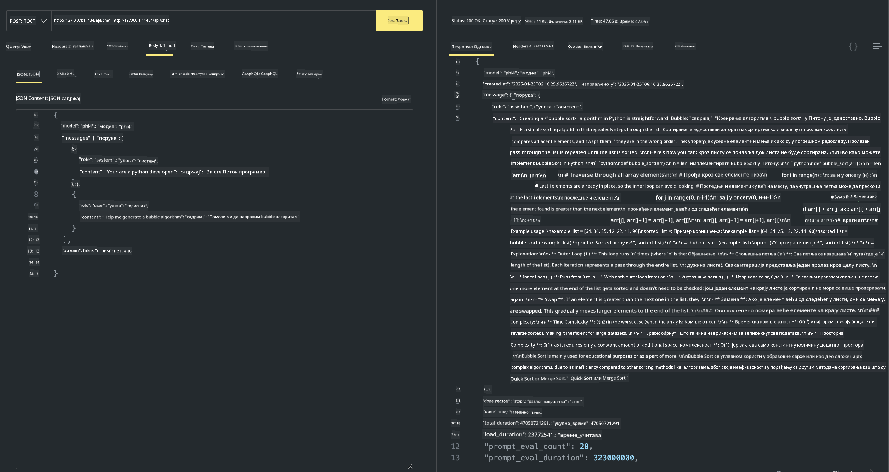

<!--
CO_OP_TRANSLATOR_METADATA:
{
  "original_hash": "0b38834693bb497f96bf53f0d941f9a1",
  "translation_date": "2025-07-16T19:19:14+00:00",
  "source_file": "md/01.Introduction/02/04.Ollama.md",
  "language_code": "sr"
}
-->
## Phi породица у Ollama

[Ollama](https://ollama.com) омогућава већем броју људи да директно покрећу open source LLM или SLM преко једноставних скрипти, а такође може да изгради API-је који помажу у локалним Copilot апликационим сценаријима.

## **1. Инсталација**

Ollama подржава рад на Windows, macOS и Linux оперативним системима. Можете инсталирати Ollama преко овог линка ([https://ollama.com/download](https://ollama.com/download)). Након успешне инсталације, можете директно користити Ollama скрипту за позивање Phi-3 преко терминал прозора. Можете видети све [доступне библиотеке у Ollama](https://ollama.com/library). Ако отворите овај репозиторијум у Codespace-у, Ollama ће већ бити инсталиран.

```bash

ollama run phi4

```

> [!NOTE]
> Модел ће бити преузет при првом покретању. Наравно, можете и директно назначити већ преузети Phi-4 модел. Као пример користимо WSL за извршавање команде. Након што се модел успешно преузме, можете директно комуницирати преко терминала.



## **2. Позивање phi-4 API-ја из Ollama**

Ако желите да позовете Phi-4 API који генерише Ollama, можете користити ову команду у терминалу да покренете Ollama сервер.

```bash

ollama serve

```

> [!NOTE]
> Ако користите MacOS или Linux, имајте у виду да се може појавити следећа грешка **"Error: listen tcp 127.0.0.1:11434: bind: address already in use"**. Ову грешку можете добити приликом покретања команде. Можете је игнорисати јер обично значи да сервер већ ради, или можете зауставити и поново покренути Ollama:

**macOS**

```bash

brew services restart ollama

```

**Linux**

```bash

sudo systemctl stop ollama

```

Ollama подржава два API-ја: generate и chat. Можете позивати модел API који пружа Ollama у складу са вашим потребама, слањем захтева локалној услузи која ради на порту 11434.

**Chat**

```bash

curl http://127.0.0.1:11434/api/chat -d '{
  "model": "phi3",
  "messages": [
    {
      "role": "system",
      "content": "Your are a python developer."
    },
    {
      "role": "user",
      "content": "Help me generate a bubble algorithm"
    }
  ],
  "stream": false
  
}'

This is the result in Postman



## Additional Resources

Check the list of available models in Ollama in [their library](https://ollama.com/library).

Pull your model from the Ollama server using this command

```bash
ollama pull phi4
```

Run the model using this command

```bash
ollama run phi4
```

***Note:*** Visit this link [https://github.com/ollama/ollama/blob/main/docs/api.md](https://github.com/ollama/ollama/blob/main/docs/api.md) to learn more

## Calling Ollama from Python

You can use `requests` or `urllib3` to make requests to the local server endpoints used above. However, a popular way to use Ollama in Python is via the [openai](https://pypi.org/project/openai/) SDK, since Ollama provides OpenAI-compatible server endpoints as well.

Here is an example for phi3-mini:

```python
import openai

client = openai.OpenAI(
    base_url="http://localhost:11434/v1",
    api_key="nokeyneeded",
)

response = client.chat.completions.create(
    model="phi4",
    temperature=0.7,
    n=1,
    messages=[
        {"role": "system", "content": "You are a helpful assistant."},
        {"role": "user", "content": "Write a haiku about a hungry cat"},
    ],
)

print("Response:")
print(response.choices[0].message.content)
```

## Calling Ollama from JavaScript 

```javascript
// Пример резимирања фајла са Phi-4
script({
    model: "ollama:phi4",
    title: "Резимирање са Phi-4",
    system: ["system"],
})

// Пример резимирања
const file = def("FILE", env.files)
$`Summarize ${file} in a single paragraph.`
```

## Calling Ollama from C#

Create a new C# Console application and add the following NuGet package:

```bash
dotnet add package Microsoft.SemanticKernel --version 1.34.0
```

Then replace this code in the `Program.cs` file

```csharp
using Microsoft.SemanticKernel;
using Microsoft.SemanticKernel.ChatCompletion;

// додавање chat completion сервиса користећи локални Ollama сервер
#pragma warning disable SKEXP0001, SKEXP0003, SKEXP0010, SKEXP0011, SKEXP0050, SKEXP0052
builder.AddOpenAIChatCompletion(
    modelId: "phi4",
    endpoint: new Uri("http://localhost:11434/"),
    apiKey: "non required");

// позив једноставног упита ка chat сервису
string prompt = "Write a joke about kittens";
var response = await kernel.InvokePromptAsync(prompt);
Console.WriteLine(response.GetValue<string>());
```

Run the app with the command:

```bash
dotnet run

**Одрицање одговорности**:  
Овај документ је преведен коришћењем AI услуге за превођење [Co-op Translator](https://github.com/Azure/co-op-translator). Иако се трудимо да превод буде тачан, молимо вас да имате у виду да аутоматски преводи могу садржати грешке или нетачности. Оригинални документ на његовом изворном језику треба сматрати ауторитетним извором. За критичне информације препоручује се професионални људски превод. Нисмо одговорни за било каква неспоразума или погрешна тумачења која произилазе из коришћења овог превода.