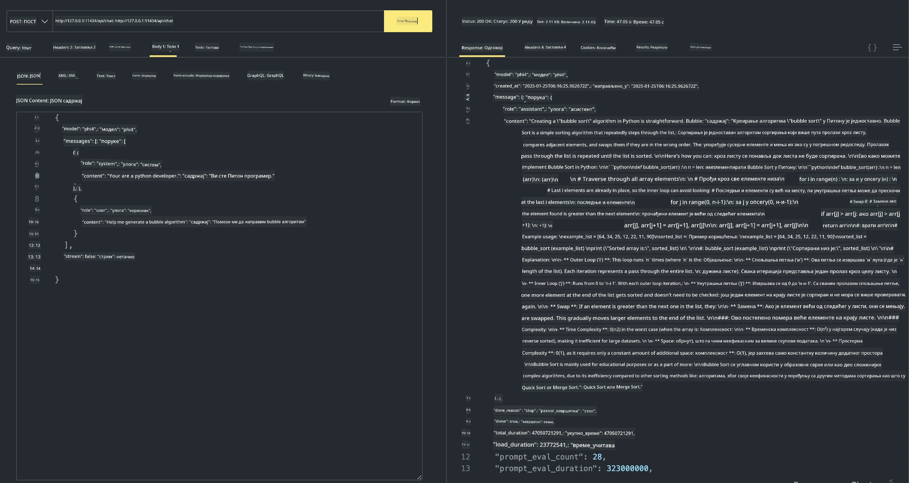

<!--
CO_OP_TRANSLATOR_METADATA:
{
  "original_hash": "2aa35f3c8b437fd5dc9995d53909d495",
  "translation_date": "2025-12-21T13:49:55+00:00",
  "source_file": "md/01.Introduction/02/04.Ollama.md",
  "language_code": "sr"
}
-->
## Phi породица у Ollama


[Ollama](https://ollama.com) омогућава већем броју људи да директно развргавају open source LLM или SLM преко једноставних скрипти, а такође може и да гради API-је за помоћ у локалним сценаријима апликација Copilot.

## **1. Инсталација**

Ollama подржава покретање на Windows, macOS и Linux. Можете инсталирати Ollama преко овог линка ([https://ollama.com/download](https://ollama.com/download)). Након успешне инсталације, можете директно користити Ollama скрипту да позовете Phi-3 преко терминал прозора. Можете видети све [доступне библиотеке у Ollama](https://ollama.com/library). Ако отворите овај репозиторијум у Codespace-у, он ће већ имати инсталиран Ollama.

```bash

ollama run phi4

```

> [!NOTE]
> Модел ће бити преузет при првом покретању. Наравно, можете и директно назначити већ преузети Phi-4 модел. Узимамо WSL као пример за покретање команде. Након што се модел успешно преузме, можете директно интерагирати у терминалу.


## **2. Позив phi-4 API-а из Ollama**

Ако желите да позовете Phi-4 API генерисан од стране ollama, можете користити ову команду у терминалу да покренете Ollama сервер.

```bash

ollama serve

```

> [!NOTE]
> Ако покрећете MacOS или Linux, имајте у виду да се може појавити следећа грешка **"Error: listen tcp 127.0.0.1:11434: bind: address already in use"**. Можда ћете добити ову грешку приликом покретања команде. Можете или занемарити ту грешку, јер обично указује да сервер већ ради, или можете зауставити и поново покренути Ollama:

**macOS**

```bash

brew services restart ollama

```

**Linux**

```bash

sudo systemctl stop ollama

```

Ollama подржава два API-ја: generate и chat. Можете позивати модел API који Ollama пружа у складу са вашим потребама, слањем захтева локалној услузи која ради на порту 11434.

**Chat**

```bash

curl http://127.0.0.1:11434/api/chat -d '{
  "model": "phi3",
  "messages": [
    {
      "role": "system",
      "content": "Your are a python developer."
    },
    {
      "role": "user",
      "content": "Help me generate a bubble algorithm"
    }
  ],
  "stream": false
  
}'
```

Ово је резултат у Postman-у



## Додатни ресурси

Погледајте листу доступних модела у Ollama на [њиховој библиотеци](https://ollama.com/library).

Повуците ваш модел са Ollama сервера коришћењем ове команде

```bash
ollama pull phi4
```

Покрените модел користећи ову команду

```bash
ollama run phi4
```

***Напомена:*** Посетите овај линк [https://github.com/ollama/ollama/blob/main/docs/api.md](https://github.com/ollama/ollama/blob/main/docs/api.md) да бисте сазнали више

## Позивање Ollama из Python-а

Можете користити `requests` или `urllib3` за слање захтева на локалне endpoint-ове сервера коришћене изнад. Међутим, популаран начин за коришћење Ollama у Python-у је преко [openai](https://pypi.org/project/openai/) SDK-а, пошто Ollama такође пружа OpenAI-компатибилне серверске endpoint-ове.

Ево примера за phi3-mini:

```python
import openai

client = openai.OpenAI(
    base_url="http://localhost:11434/v1",
    api_key="nokeyneeded",
)

response = client.chat.completions.create(
    model="phi4",
    temperature=0.7,
    n=1,
    messages=[
        {"role": "system", "content": "You are a helpful assistant."},
        {"role": "user", "content": "Write a haiku about a hungry cat"},
    ],
)

print("Response:")
print(response.choices[0].message.content)
```

## Позивање Ollama из JavaScript-а

```javascript
// Пример сажимања датотеке помоћу Phi-4
script({
    model: "ollama:phi4",
    title: "Summarize with Phi-4",
    system: ["system"],
})

// Пример сажимања
const file = def("FILE", env.files)
$`Summarize ${file} in a single paragraph.`
```

## Позивање Ollama из C#

Креирајте нову C# Console апликацију и додате следећи NuGet пакет:

```bash
dotnet add package Microsoft.SemanticKernel --version 1.34.0
```

Затим замените овај код у фајлу `Program.cs`

```csharp
using Microsoft.SemanticKernel;
using Microsoft.SemanticKernel.ChatCompletion;

// add chat completion service using the local ollama server endpoint
#pragma warning disable SKEXP0001, SKEXP0003, SKEXP0010, SKEXP0011, SKEXP0050, SKEXP0052
builder.AddOpenAIChatCompletion(
    modelId: "phi4",
    endpoint: new Uri("http://localhost:11434/"),
    apiKey: "non required");

// invoke a simple prompt to the chat service
string prompt = "Write a joke about kittens";
var response = await kernel.InvokePromptAsync(prompt);
Console.WriteLine(response.GetValue<string>());
```

Покрените апликацију командом:

```bash
dotnet run
```

---

<!-- CO-OP TRANSLATOR DISCLAIMER START -->
**Одрицање одговорности**:
Овај документ је преведен коришћењем услуге за превођење помоћу вештачке интеленције [Co-op Translator](https://github.com/Azure/co-op-translator). Иако се трудимо да превод буде тачан, имајте у виду да аутоматизовани преводи могу садржати грешке или нетачности. Изворни документ на његовом оригиналном језику треба сматрати ауторитетним извором. За критичне информације препоручује се професионални људски превод. Не сносимо одговорност за било какве неспоразуме или погрешна тумачења која произилазе из употребе овог превода.
<!-- CO-OP TRANSLATOR DISCLAIMER END -->