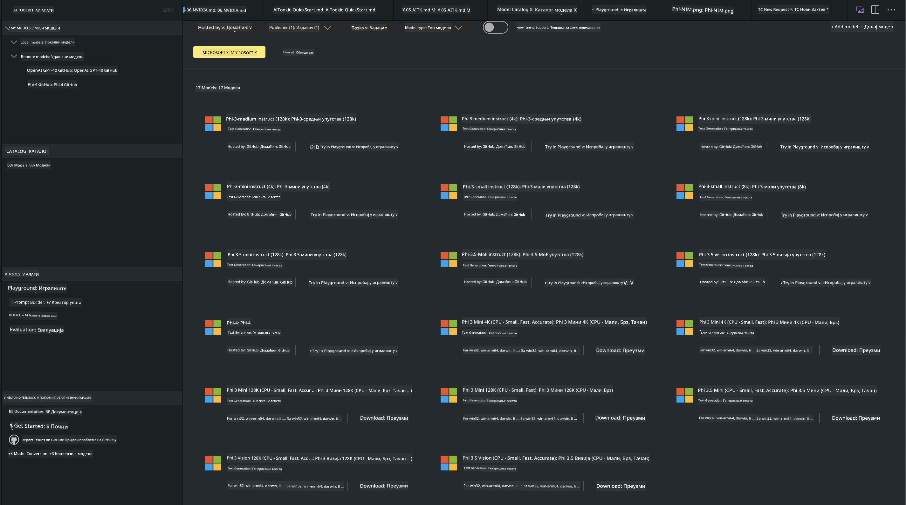
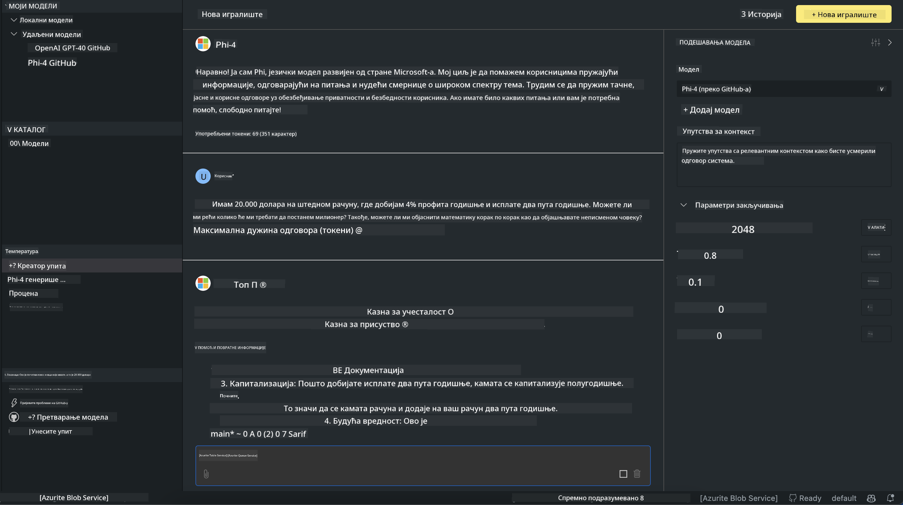

<!--
CO_OP_TRANSLATOR_METADATA:
{
  "original_hash": "4951d458c0b60c02cd1e751b40903877",
  "translation_date": "2025-07-16T19:30:49+00:00",
  "source_file": "md/01.Introduction/02/05.AITK.md",
  "language_code": "sr"
}
-->
# Phi Family in AITK

[AI Toolkit for VS Code](https://marketplace.visualstudio.com/items?itemName=ms-windows-ai-studio.windows-ai-studio) поједностављује развој генеративних AI апликација тако што окупља најсавременије алате за развој AI и моделе из Azure AI Foundry каталога и других каталога као што је Hugging Face. Бићете у могућности да прегледате каталог AI модела који покрећу GitHub Models и Azure AI Foundry Model Catalogs, преузмете их локално или на даљину, фино подешавате, тестирате и користите у својој апликацији.

AI Toolkit Preview ради локално. Локална инференција или фино подешавање, у зависности од изабраног модела, може захтевати GPU као што је NVIDIA CUDA GPU. Можете покретати GitHub Models директно и преко AITK.

## Почетак рада

[Сазнајте више о инсталацији Windows подсистема за Linux](https://learn.microsoft.com/windows/wsl/install?WT.mc_id=aiml-137032-kinfeylo)

и [промену подразумеване дистрибуције](https://learn.microsoft.com/windows/wsl/install#change-the-default-linux-distribution-installed).

[AI Toolkit GitHub репозиторијум](https://github.com/microsoft/vscode-ai-toolkit/)

- Windows, Linux, macOS

- За фино подешавање на Windows и Linux, потребан вам је Nvidia GPU. Поред тога, **Windows** захтева подсистем за Linux са Ubuntu дистрибуцијом 18.4 или новијом. [Сазнајте више о инсталацији Windows подсистема за Linux](https://learn.microsoft.com/windows/wsl/install) и [промену подразумеване дистрибуције](https://learn.microsoft.com/windows/wsl/install#change-the-default-linux-distribution-installed).

### Инсталација AI Toolkit-а

AI Toolkit се испоручује као [Visual Studio Code екстензија](https://code.visualstudio.com/docs/setup/additional-components#_vs-code-extensions), па је прво потребно да инсталирате [VS Code](https://code.visualstudio.com/docs/setup/windows?WT.mc_id=aiml-137032-kinfeylo), а затим преузмете AI Toolkit са [VS Marketplace](https://marketplace.visualstudio.com/items?itemName=ms-windows-ai-studio.windows-ai-studio).  
[AI Toolkit је доступан у Visual Studio Marketplace-у](https://marketplace.visualstudio.com/items?itemName=ms-windows-ai-studio.windows-ai-studio) и може се инсталирати као и свака друга VS Code екстензија.

Ако нисте упознати са инсталацијом VS Code екстензија, пратите ове кораке:

### Пријава

1. У Activity Bar-у у VS Code изаберите **Extensions**  
1. У траци за претрагу екстензија укуцајте "AI Toolkit"  
1. Изаберите "AI Toolkit for Visual Studio code"  
1. Кликните на **Install**

Сада сте спремни да користите екстензију!

Бићете упитани да се пријавите на GitHub, па кликните "Allow" да наставите. Бићете преусмерени на страницу за пријаву на GitHub.

Пријавите се и пратите кораке процеса. Након успешног завршетка, бићете враћени у VS Code.

Када се екстензија инсталира, икона AI Toolkit-а ће се појавити у вашем Activity Bar-у.

Хајде да истражимо доступне акције!

### Доступне акције

Примарна бочна трака AI Toolkit-а организована је у  

- **Models**  
- **Resources**  
- **Playground**  
- **Fine-tuning**  
- **Evaluation**

Доступне су у одељку Resources. За почетак изаберите **Model Catalog**.

### Преузимање модела из каталога

Када покренете AI Toolkit из VS Code бочне траке, можете изабрати из следећих опција:



- Пронађите подржани модел у **Model Catalog** и преузмите га локално  
- Тестирајте инференцију модела у **Model Playground**  
- Фино подешавајте модел локално или на даљину у **Model Fine-tuning**  
- Деплојујте фино подешене моделе у облак преко командне палете за AI Toolkit  
- Евалуација модела

> [!NOTE]
>  
> **GPU против CPU**  
>  
> Приметићете да картице модела приказују величину модела, платформу и тип акцелератора (CPU, GPU). За оптималне перформансе на **Windows уређајима који имају бар један GPU**, изаберите верзије модела које су намењене само Windows-у.  
>  
> Ово осигурава да имате модел оптимизован за DirectML акцелератор.  
>  
> Имена модела су у формату  
>  
> - `{model_name}-{accelerator}-{quantization}-{format}`.  
>  
>Да бисте проверили да ли имате GPU на свом Windows уређају, отворите **Task Manager** и изаберите картицу **Performance**. Ако имате GPU, биће наведени под именима као што су "GPU 0" или "GPU 1".

### Покретање модела у playground-у

Када су сви параметри подешени, кликните **Generate Project**.

Када се модел преузме, изаберите **Load in Playground** на картици модела у каталогу:

- Покрените преузимање модела  
- Инсталирајте све предуслове и зависности  
- Креирајте VS Code радни простор



### Коришћење REST API-ја у вашој апликацији

AI Toolkit долази са локалним REST API веб сервером **на порту 5272** који користи [OpenAI chat completions формат](https://platform.openai.com/docs/api-reference/chat/create).

Ово вам омогућава да тестирате своју апликацију локално без ослањања на cloud AI сервис. На пример, следећи JSON фајл показује како да конфигуришете тело захтева:

```json
{
    "model": "Phi-4",
    "messages": [
        {
            "role": "user",
            "content": "what is the golden ratio?"
        }
    ],
    "temperature": 0.7,
    "top_p": 1,
    "top_k": 10,
    "max_tokens": 100,
    "stream": true
}
```

REST API можете тестирати користећи (на пример) [Postman](https://www.postman.com/) или CURL (Client URL) алат:

```bash
curl -vX POST http://127.0.0.1:5272/v1/chat/completions -H 'Content-Type: application/json' -d @body.json
```

### Коришћење OpenAI клијент библиотеке за Python

```python
from openai import OpenAI

client = OpenAI(
    base_url="http://127.0.0.1:5272/v1/", 
    api_key="x" # required for the API but not used
)

chat_completion = client.chat.completions.create(
    messages=[
        {
            "role": "user",
            "content": "what is the golden ratio?",
        }
    ],
    model="Phi-4",
)

print(chat_completion.choices[0].message.content)
```

### Коришћење Azure OpenAI клијент библиотеке за .NET

Додајте [Azure OpenAI клијент библиотеку за .NET](https://www.nuget.org/packages/Azure.AI.OpenAI/) у свој пројекат преко NuGet-а:

```bash
dotnet add {project_name} package Azure.AI.OpenAI --version 1.0.0-beta.17
```

Додајте C# фајл под називом **OverridePolicy.cs** у свој пројекат и налепите следећи код:

```csharp
// OverridePolicy.cs
using Azure.Core.Pipeline;
using Azure.Core;

internal partial class OverrideRequestUriPolicy(Uri overrideUri)
    : HttpPipelineSynchronousPolicy
{
    private readonly Uri _overrideUri = overrideUri;

    public override void OnSendingRequest(HttpMessage message)
    {
        message.Request.Uri.Reset(_overrideUri);
    }
}
```

Затим налепите следећи код у свој **Program.cs** фајл:

```csharp
// Program.cs
using Azure.AI.OpenAI;

Uri localhostUri = new("http://localhost:5272/v1/chat/completions");

OpenAIClientOptions clientOptions = new();
clientOptions.AddPolicy(
    new OverrideRequestUriPolicy(localhostUri),
    Azure.Core.HttpPipelinePosition.BeforeTransport);
OpenAIClient client = new(openAIApiKey: "unused", clientOptions);

ChatCompletionsOptions options = new()
{
    DeploymentName = "Phi-4",
    Messages =
    {
        new ChatRequestSystemMessage("You are a helpful assistant. Be brief and succinct."),
        new ChatRequestUserMessage("What is the golden ratio?"),
    }
};

StreamingResponse<StreamingChatCompletionsUpdate> streamingChatResponse
    = await client.GetChatCompletionsStreamingAsync(options);

await foreach (StreamingChatCompletionsUpdate chatChunk in streamingChatResponse)
{
    Console.Write(chatChunk.ContentUpdate);
}
```


## Фино подешавање са AI Toolkit-ом

- Почните са проналажењем модела и playground-ом.  
- Фино подешавање и инференција модела користећи локалне рачунарске ресурсе.  
- Удаљено фино подешавање и инференција користећи Azure ресурсе

[Фино подешавање са AI Toolkit-ом](../../03.FineTuning/Finetuning_VSCodeaitoolkit.md)

## AI Toolkit Q&A ресурси

Погледајте нашу [Q&A страницу](https://github.com/microsoft/vscode-ai-toolkit/blob/main/archive/QA.md) за најчешће проблеме и решења

**Одрицање од одговорности**:  
Овај документ је преведен коришћењем AI преводилачке услуге [Co-op Translator](https://github.com/Azure/co-op-translator). Иако се трудимо да превод буде тачан, молимо вас да имате у виду да аутоматски преводи могу садржати грешке или нетачности. Оригинални документ на његовом изворном језику треба сматрати ауторитетним извором. За критичне информације препоручује се професионални људски превод. Нисмо одговорни за било каква неспоразума или погрешна тумачења која произилазе из коришћења овог превода.