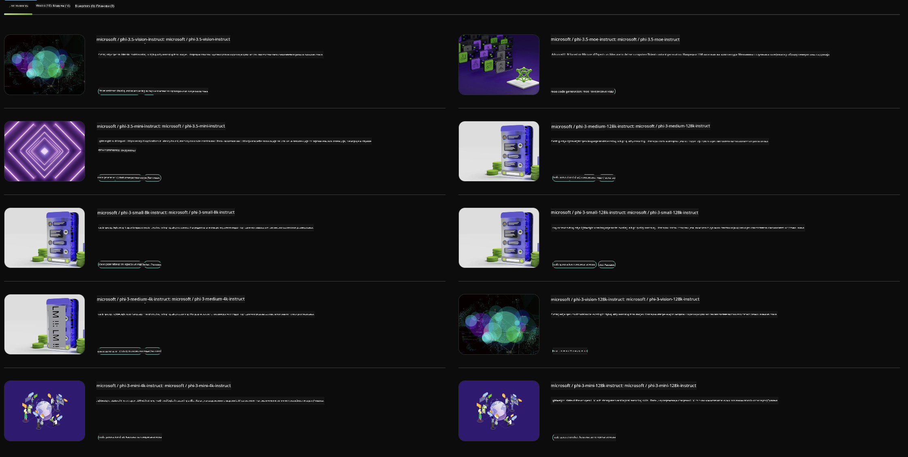

<!--
CO_OP_TRANSLATOR_METADATA:
{
  "original_hash": "7b08e277df2a9307f861ae54bc30c772",
  "translation_date": "2025-05-09T10:04:00+00:00",
  "source_file": "md/01.Introduction/02/06.NVIDIA.md",
  "language_code": "sr"
}
-->
## Phi Family u NVIDIA NIM

NVIDIA NIM je skup jednostavnih mikroservisa dizajniranih da ubrzaju implementaciju generativnih AI modela u oblaku, data centrima i radnim stanicama. NIM-ovi su kategorizovani po porodici modela i po pojedinačnom modelu. Na primer, NVIDIA NIM za velike jezičke modele (LLM) donosi moć najsavremenijih LLM-ova u enterprise aplikacije, pružajući nenadmašne mogućnosti obrade i razumevanja prirodnog jezika.

NIM olakšava IT i DevOps timovima da samostalno hostuju velike jezičke modele (LLM) u sopstvenim kontrolisanim okruženjima, a istovremeno programerima omogućava korišćenje industrijskih API-ja koji im pomažu da kreiraju moćne kopilote, čatbotove i AI asistente koji mogu transformisati njihov biznis. Koristeći NVIDIA-inu vrhunsku GPU akceleraciju i skalabilnu implementaciju, NIM pruža najbrži put do inferencije sa neuporedivim performansama.

Možete koristiti NVIDIA NIM za inferenciju Phi Family modela



### **Primeri - Phi-3-Vision u NVIDIA NIM**

Zamislite da imate sliku (`demo.png`) i želite da generišete Python kod koji obrađuje tu sliku i sačuva novu verziju (`phi-3-vision.jpg`).

Kod iznad automatizuje ovaj proces tako što:

1. Postavlja okruženje i neophodne konfiguracije.
2. Kreira prompt koji uputstvom modela traži generisanje potrebnog Python koda.
3. Šalje prompt modelu i prikuplja generisani kod.
4. Izvlači i izvršava generisani kod.
5. Prikazuje originalnu i obrađenu sliku.

Ovaj pristup koristi snagu AI za automatizaciju zadataka obrade slika, čineći postizanje ciljeva lakšim i bržim.

[Primer rešenja koda](../../../../../code/06.E2E/E2E_Nvidia_NIM_Phi3_Vision.ipynb)

Hajde da korak po korak objasnimo šta ceo kod radi:

1. **Instaliraj potrebni paket**:
    ```python
    !pip install langchain_nvidia_ai_endpoints -U
    ```
    Ova komanda instalira paket `langchain_nvidia_ai_endpoints`, vodeći računa da je verzija najnovija.

2. **Uvezi neophodne module**:
    ```python
    from langchain_nvidia_ai_endpoints import ChatNVIDIA
    import getpass
    import os
    import base64
    ```
    Ovi importi donose module za interakciju sa NVIDIA AI endpointima, sigurnu obradu lozinki, rad sa operativnim sistemom i kodiranje/dekodiranje u base64 formatu.

3. **Postavi API ključ**:
    ```python
    if not os.getenv("NVIDIA_API_KEY"):
        os.environ["NVIDIA_API_KEY"] = getpass.getpass("Enter your NVIDIA API key: ")
    ```
    Ovaj kod proverava da li je okruženjska promenljiva `NVIDIA_API_KEY` postavljena. Ako nije, traži od korisnika da unese svoj API ključ na siguran način.

4. **Definiši model i putanju do slike**:
    ```python
    model = 'microsoft/phi-3-vision-128k-instruct'
    chat = ChatNVIDIA(model=model)
    img_path = './imgs/demo.png'
    ```
    Ovde se postavlja model koji će se koristiti, kreira se instanca `ChatNVIDIA` sa izabranim modelom i definiše putanja do fajla slike.

5. **Kreiraj tekstualni prompt**:
    ```python
    text = "Please create Python code for image, and use plt to save the new picture under imgs/ and name it phi-3-vision.jpg."
    ```
    Ovaj deo definiše tekstualni prompt koji modelu daje instrukcije da generiše Python kod za obradu slike.

6. **Kodiraj sliku u Base64**:
    ```python
    with open(img_path, "rb") as f:
        image_b64 = base64.b64encode(f.read()).decode()
    image = f''
    ```
    Ovaj kod učitava sliku, kodira je u base64 format i pravi HTML tag za sliku sa kodiranim podacima.

7. **Kombinuj tekst i sliku u jedan prompt**:
    ```python
    prompt = f"{text} {image}"
    ```
    Ovde se tekstualni prompt i HTML tag sa slikom spajaju u jedan string.

8. **Generiši kod koristeći ChatNVIDIA**:
    ```python
    code = ""
    for chunk in chat.stream(prompt):
        print(chunk.content, end="")
        code += chunk.content
    ```
    Ovaj deo šalje prompt u `ChatNVIDIA` i prima generisani kod kao string.

9. **Izvuci Python kod iz generisanog sadržaja**:
    ```python
    begin = code.index('```python') + 9
    code = code[begin:]
    end = code.index('```')
    code = code[:end]
    ```
    Ovim se iz generisanog sadržaja izvlači čist Python kod uklanjanjem markdown formata.

10. **Pokreni generisani kod**:
    ```python
    import subprocess
    result = subprocess.run(["python", "-c", code], capture_output=True)
    ```
    Ovaj deo izvršava izvučeni Python kod kao podproces i hvata njegov izlaz.

11. **Prikaži slike**:
    ```python
    from IPython.display import Image, display
    display(Image(filename='./imgs/phi-3-vision.jpg'))
    display(Image(filename='./imgs/demo.png'))
    ```
    Ove linije prikazuju slike koristeći `IPython.display` modul.

**Одрицање од одговорности**:  
Овај документ је преведен помоћу АИ преводилачке услуге [Co-op Translator](https://github.com/Azure/co-op-translator). Иако тежимо прецизности, имајте у виду да аутоматски преводи могу садржати грешке или нетачности. Оригинални документ на његовом изворном језику треба сматрати ауторитетним извором. За критичне информације препоручује се професионални превод од стране људског преводиоца. Нисмо одговорни за било каква неспоразума или погрешна тумачења настала употребом овог превода.