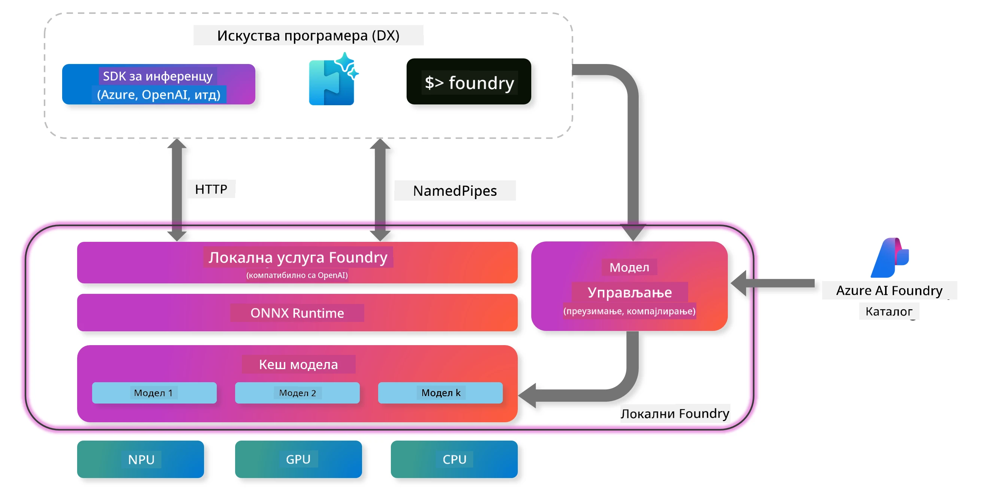
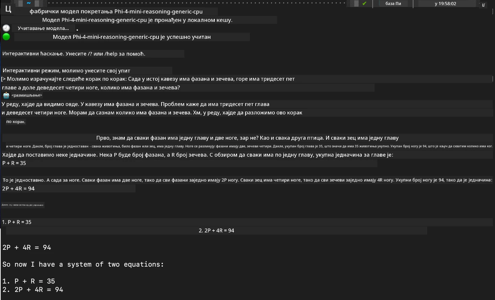

## Почетак рада са Phi-Family моделима у Foundry Local

### Увод у Foundry Local

Foundry Local је моћно решење за извршавање AI модела директно на уређају, које доноси корпоративни ниво AI могућности на вашу локалну опрему. Овај туторијал ће вас провести кроз подешавање и коришћење Phi-Family модела са Foundry Local, пружајући вам потпуну контролу над вашим AI задацима уз очување приватности и смањење трошкова.

Foundry Local нуди предности у перформансама, приватности, прилагођавању и трошковној ефикасности тако што покреће AI моделе локално на вашем уређају. Интегрише се беспрекорно у ваше постојеће радне токове и апликације преко интуитивног CLI, SDK и REST API-ја.




### Зашто одабрати Foundry Local?

Разумевање предности Foundry Local помоћи ће вам да донесете информисане одлуке о стратегији имплементације AI:

- **Извршавање на уређају:** Покрећите моделе локално на својој опреми, смањујући трошкове и задржавајући све податке на свом уређају.

- **Прилагођавање модела:** Изаберите између унапред дефинисаних модела или користите своје, у складу са специфичним захтевима и случајевима употребе.

- **Трошковна ефикасност:** Уклоните поновљене трошкове облачних сервиса коришћењем постојеће опреме, чинећи AI приступачнијим.

- **Беспрекорна интеграција:** Повежите се са својим апликацијама преко SDK-а, API крајњих тачака или CLI-ја, уз лако скалирање ка Azure AI Foundry како ваши захтеви расту.

> **Напомена за почетак:** Овај туторијал се фокусира на коришћење Foundry Local преко CLI и SDK интерфејса. Учићете оба приступа како бисте одабрали најбољи метод за свој случај употребе.

## Део 1: Подешавање Foundry Local CLI

### Корак 1: Инсталација

Foundry Local CLI је ваш улаз у управљање и покретање AI модела локално. Почнимо са инсталацијом на вашем систему.

**Подржане платформе:** Windows и macOS

За детаљна упутства о инсталацији, молимо погледајте [званичну Foundry Local документацију](https://github.com/microsoft/Foundry-Local/blob/main/README.md).

### Корак 2: Истраживање доступних модела

Када инсталирате Foundry Local CLI, можете открити који модели су доступни за ваш случај употребе. Ова команда ће вам показати све подржане моделе:


```bash
foundry model list
```

### Корак 3: Разумевање Phi Family модела

Phi Family нуди низ модела оптимизованих за различите случајеве употребе и хардверске конфигурације. Ево Phi модела доступних у Foundry Local:

**Доступни Phi модели:** 

- **phi-3.5-mini** - Компактан модел за основне задатке
- **phi-3-mini-128k** - Верзија са проширеним контекстом за дужи разговор
- **phi-3-mini-4k** - Стандардни контекст модел за општу употребу
- **phi-4** - Напредни модел са побољшаним могућностима
- **phi-4-mini** - Лагана верзија Phi-4
- **phi-4-mini-reasoning** - Специјализован за сложене задатке резоновања

> **Компатибилност са хардвером:** Сваки модел може бити конфигурисан за различите хардверске акцелерације (CPU, GPU) у зависности од могућности вашег система.

### Корак 4: Покретање првог Phi модела

Почнимо са практичним примером. Покренућемо модел `phi-4-mini-reasoning`, који одлично решава сложене проблеме корак по корак.


**Команда за покретање модела:**

```bash
foundry model run Phi-4-mini-reasoning-generic-cpu
```

> **Прво покретање:** Када покрећете модел први пут, Foundry Local ће га аутоматски преузети на ваш локални уређај. Време преузимања зависи од брзине ваше мреже, па вас молимо за стрпљење током почетног подешавања.

### Корак 5: Тестирање модела са стварним проблемом

Сада хајде да тестирамо наш модел са класичним логичким проблемом да видимо како изводи резоновање корак по корак:

**Пример проблема:**

```txt
Please calculate the following step by step: Now there are pheasants and rabbits in the same cage, there are thirty-five heads on top and ninety-four legs on the bottom, how many pheasants and rabbits are there?
```

**Очекивано понашање:** Модел би требало да разложи овај проблем на логичке кораке, користећи чињеницу да фазани имају 2 ноге, а зечеви 4 ноге, како би решио систем једначина.

**Резултати:**



## Део 2: Прављење апликација са Foundry Local SDK

### Зашто користити SDK?

Док је CLI идеалан за тестирање и брзе интеракције, SDK вам омогућава да програмски интегришете Foundry Local у своје апликације. Ово отвара могућности за:

- Прављење прилагођених AI апликација
- Креирање аутоматизованих радних токова
- Интеграцију AI могућности у постојеће системе
- Развој чатботова и интерактивних алата

### Подржани програмски језици

Foundry Local пружа подршку за SDK у више програмских језика како би одговарао вашим развојним преференцама:

**📦 Доступни SDK-ови:**

- **C# (.NET):** [SDK документација и примери](https://github.com/microsoft/Foundry-Local/tree/main/sdk/cs)
- **Python:** [SDK документација и примери](https://github.com/microsoft/Foundry-Local/tree/main/sdk/python)
- **JavaScript:** [SDK документација и примери](https://github.com/microsoft/Foundry-Local/tree/main/sdk/js)
- **Rust:** [SDK документација и примери](https://github.com/microsoft/Foundry-Local/tree/main/sdk/rust)

### Следећи кораци

1. **Изаберите свој омиљени SDK** у складу са развојним окружењем
2. **Пратите документацију специфичну за SDK** за детаљне водиче за имплементацију
3. **Почните са једноставним примерима** пре него што кренете у развој сложених апликација
4. **Истражите пример кода** који је доступан у сваком SDK репозиторијуму

## Закључак

Сада сте научили како да:
- ✅ Инсталирате и подесите Foundry Local CLI
- ✅ Откријете и покренете Phi Family моделе
- ✅ Тестирате моделе са стварним проблемима
- ✅ Разумете опције SDK-а за развој апликација

Foundry Local пружа снажну основу за довођење AI могућности директно у ваше локално окружење, дајући вам контролу над перформансама, приватношћу и трошковима, уз одржавање флексибилности за скалирање ка облачним решењима када је то потребно.

**Одрицање од одговорности**:  
Овај документ је преведен коришћењем AI услуге за превођење [Co-op Translator](https://github.com/Azure/co-op-translator). Иако се трудимо да превод буде тачан, молимо вас да имате у виду да аутоматски преводи могу садржати грешке или нетачности. Оригинални документ на његовом изворном језику треба сматрати ауторитетним извором. За критичне информације препоручује се професионални људски превод. Нисмо одговорни за било каква неспоразума или погрешна тумачења која произилазе из коришћења овог превода.