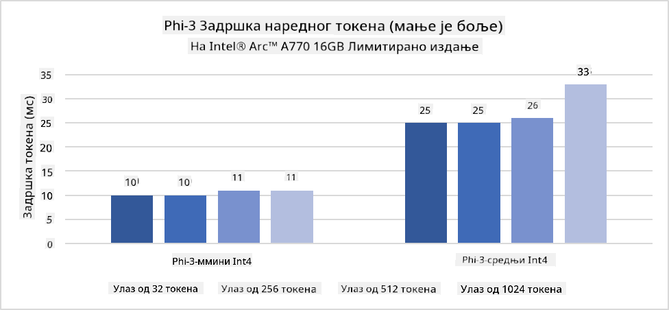
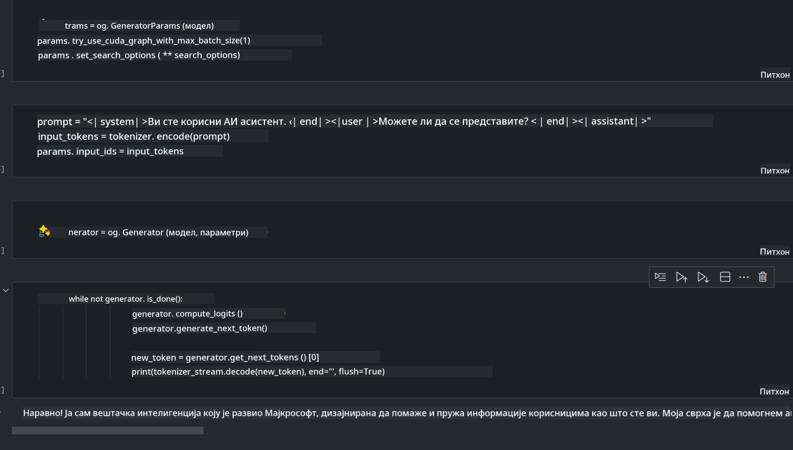
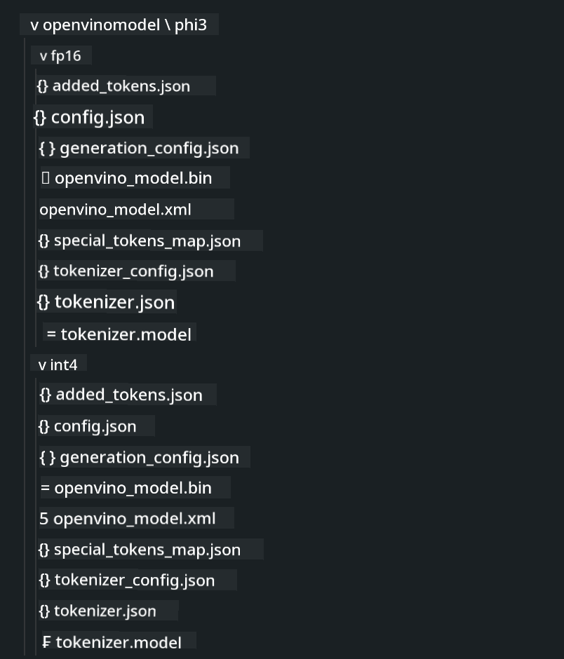

<!--
CO_OP_TRANSLATOR_METADATA:
{
  "original_hash": "e08ce816e23ad813244a09ca34ebb8ac",
  "translation_date": "2025-05-09T10:38:45+00:00",
  "source_file": "md/01.Introduction/03/AIPC_Inference.md",
  "language_code": "sr"
}
-->
# **Inferencija Phi-3 na AI PC-u**

Sa napretkom generativne AI i poboljšanjem hardverskih mogućnosti edge uređaja, sve veći broj generativnih AI modela može se integrisati u korisničke uređaje u konceptu Bring Your Own Device (BYOD). AI PC računari su među tim modelima. Počevši od 2024. godine, Intel, AMD i Qualcomm su u saradnji sa proizvođačima PC-a predstavili AI PC računare koji omogućavaju lokalnu primenu generativnih AI modela putem hardverskih modifikacija. U ovoj diskusiji fokusiraćemo se na Intel AI PC i istražiti kako se Phi-3 može pokrenuti na Intel AI PC-u.

### Šta je NPU

NPU (Neural Processing Unit) je namenski procesor ili procesorska jedinica unutar većeg SoC dizajnirana posebno za ubrzanje operacija neuronskih mreža i AI zadataka. Za razliku od opšte namene CPU i GPU, NPU su optimizovani za paralelno računanje zasnovano na podacima, što ih čini veoma efikasnim u obradi velikih količina multimedijalnih podataka poput videa i slika, kao i u obradi podataka za neuronske mreže. Posebno su dobri u obavljanju AI zadataka kao što su prepoznavanje govora, zamućivanje pozadine u video pozivima i procesi uređivanja fotografija ili video zapisa poput detekcije objekata.

## NPU vs GPU

Iako mnogi AI i mašinsko učenje zadaci rade na GPU-ima, postoji važna razlika između GPU i NPU.
GPU su poznati po svojim paralelnim računarskim sposobnostima, ali nisu svi GPU-ovi podjednako efikasni izvan grafičke obrade. NPU, s druge strane, su specijalno dizajnirani za složene proračune potrebne za neuronske mreže, što ih čini izuzetno efikasnim za AI zadatke.

Ukratko, NPU su matematički eksperti koji ubrzavaju AI proračune i igraju ključnu ulogu u novoj eri AI PC računara!

***Ovaj primer je baziran na najnovijem Intel Core Ultra procesoru***

## **1. Korišćenje NPU za pokretanje Phi-3 modela**

Intel® NPU uređaj je AI inferencijski akcelerator integrisan sa Intel klijentskim CPU-ima, počevši od Intel® Core™ Ultra generacije procesora (ranije poznat kao Meteor Lake). Omogućava energetsku efikasnost u izvršavanju zadataka veštačkih neuronskih mreža.




**Intel NPU Acceleration Library**

Intel NPU Acceleration Library [https://github.com/intel/intel-npu-acceleration-library](https://github.com/intel/intel-npu-acceleration-library) je Python biblioteka dizajnirana da poveća efikasnost vaših aplikacija koristeći snagu Intel Neural Processing Unit (NPU) za brze proračune na kompatibilnom hardveru.

Primer Phi-3-mini na AI PC-u sa Intel® Core™ Ultra procesorima.


Instalirajte Python biblioteku pomoću pip

```bash

   pip install intel-npu-acceleration-library

```

***Napomena*** Projekat je još uvek u razvoju, ali referentni model je već vrlo kompletan.

### **Pokretanje Phi-3 sa Intel NPU Acceleration Library**

Korišćenjem Intel NPU ubrzanja, ova biblioteka ne utiče na tradicionalni proces kodiranja. Potrebno je samo koristiti ovu biblioteku za kvantizaciju originalnog Phi-3 modela, kao što su FP16, INT8, INT4, na primer

```python
from transformers import AutoTokenizer, pipeline,TextStreamer
from intel_npu_acceleration_library import NPUModelForCausalLM, int4
from intel_npu_acceleration_library.compiler import CompilerConfig
import warnings

model_id = "microsoft/Phi-3-mini-4k-instruct"

compiler_conf = CompilerConfig(dtype=int4)
model = NPUModelForCausalLM.from_pretrained(
    model_id, use_cache=True, config=compiler_conf, attn_implementation="sdpa"
).eval()

tokenizer = AutoTokenizer.from_pretrained(model_id)

text_streamer = TextStreamer(tokenizer, skip_prompt=True)
```

Nakon uspešne kvantizacije, nastavlja se izvršavanje pozivanjem NPU da pokrene Phi-3 model.

```python
generation_args = {
   "max_new_tokens": 1024,
   "return_full_text": False,
   "temperature": 0.3,
   "do_sample": False,
   "streamer": text_streamer,
}

pipe = pipeline(
   "text-generation",
   model=model,
   tokenizer=tokenizer,
)

query = "<|system|>You are a helpful AI assistant.<|end|><|user|>Can you introduce yourself?<|end|><|assistant|>"

with warnings.catch_warnings():
    warnings.simplefilter("ignore")
    pipe(query, **generation_args)
```

Tokom izvršavanja koda, status rada NPU-a možemo pratiti preko Task Manager-a


***Primeri*** : [AIPC_NPU_DEMO.ipynb](../../../../../code/03.Inference/AIPC/AIPC_NPU_DEMO.ipynb)

## **2. Korišćenje DirectML + ONNX Runtime za pokretanje Phi-3 modela**

### **Šta je DirectML**

[DirectML](https://github.com/microsoft/DirectML) je visokoperformansna, hardverski ubrzana DirectX 12 biblioteka za mašinsko učenje. DirectML pruža GPU ubrzanje za uobičajene zadatke mašinskog učenja na širokom spektru podržanog hardvera i drajvera, uključujući sve GPU-ove sa podrškom za DirectX 12 od proizvođača kao što su AMD, Intel, NVIDIA i Qualcomm.

Kada se koristi samostalno, DirectML API je niskonivojska DirectX 12 biblioteka pogodna za visokoperformansne, niskolatentne aplikacije poput frejmwork-a, igara i drugih real-time aplikacija. Besprekorno međudjelovanje DirectML sa Direct3D 12, kao i njegova mala potrošnja resursa i usklađenost na različitom hardveru, čine DirectML idealnim za ubrzanje mašinskog učenja kada su potrebni visoke performanse, pouzdanost i predvidljivost rezultata na različitim uređajima.

***Napomena*** : Najnoviji DirectML već podržava NPU (https://devblogs.microsoft.com/directx/introducing-neural-processor-unit-npu-support-in-directml-developer-preview/)

### DirectML i CUDA u pogledu mogućnosti i performansi:

**DirectML** je biblioteka za mašinsko učenje razvijena od strane Microsoft-a. Namenjena je ubrzanju mašinskog učenja na Windows uređajima, uključujući desktop računare, laptope i edge uređaje.
- Baziran na DX12: DirectML je izgrađen na DirectX 12 (DX12) što pruža široku podršku hardvera na GPU-ovima, uključujući NVIDIA i AMD.
- Šira podrška: Pošto koristi DX12, DirectML može raditi sa bilo kojim GPU-om koji podržava DX12, čak i integrisanim GPU-ovima.
- Obrada slika: DirectML obrađuje slike i druge podatke koristeći neuronske mreže, što ga čini pogodnim za zadatke poput prepoznavanja slika, detekcije objekata i slično.
- Jednostavna instalacija: Postavljanje DirectML-a je jednostavno i ne zahteva specifične SDK-ove ili biblioteke od proizvođača GPU-a.
- Performanse: U nekim slučajevima, DirectML postiže dobre performanse i može biti brži od CUDA, naročito za određene vrste poslova.
- Ograničenja: Međutim, postoje situacije kada je DirectML sporiji, naročito za velike batch-eve u float16 formatu.

**CUDA** je NVIDIA-ina platforma za paralelno računanje i programski model. Omogućava programerima da iskoriste snagu NVIDIA GPU-ova za opštu računarsku obradu, uključujući mašinsko učenje i naučne simulacije.
- Specifično za NVIDIA: CUDA je usko povezan sa NVIDIA GPU-ovima i posebno je dizajniran za njih.
- Visoko optimizovan: Pruža odlične performanse za GPU ubrzane zadatke, naročito na NVIDIA hardveru.
- Široka upotreba: Mnogi frejmwork-i i biblioteke za mašinsko učenje (kao što su TensorFlow i PyTorch) podržavaju CUDA.
- Prilagodljivost: Programeri mogu detaljno podešavati CUDA postavke za specifične zadatke, što može dovesti do optimalnih performansi.
- Ograničenja: Međutim, zavisnost od NVIDIA hardvera može biti ograničavajuća ako želite širu kompatibilnost sa različitim GPU-ovima.

### Izbor između DirectML i CUDA

Izbor između DirectML i CUDA zavisi od vašeg konkretnog slučaja upotrebe, dostupnosti hardvera i ličnih preferencija.
Ako tražite širu kompatibilnost i jednostavnu instalaciju, DirectML može biti dobar izbor. Sa druge strane, ako imate NVIDIA GPU i potrebne su vam visoko optimizovane performanse, CUDA je i dalje snažan kandidat. Ukratko, oba imaju svoje prednosti i mane, pa razmotrite svoje zahteve i dostupni hardver pri donošenju odluke.

### **Generativna AI sa ONNX Runtime**

U eri AI, prenosivost AI modela je veoma važna. ONNX Runtime omogućava lako raspoređivanje treniranih modela na različite uređaje. Programeri ne moraju da brinu o okviru za inferenciju i koriste jedinstveni API za izvršavanje modela. U eri generativne AI, ONNX Runtime takođe vrši optimizaciju koda (https://onnxruntime.ai/docs/genai/). Kroz optimizovani ONNX Runtime, kvantizovani generativni AI modeli mogu se inferencirati na različitim uređajima. U Generative AI sa ONNX Runtime, inferenciju AI modela možete obaviti preko Python, C#, C/C++ API-ja. Naravno, na iPhone-u se može iskoristiti C++ Generative AI sa ONNX Runtime API-jem.

[Sample Code](https://github.com/Azure-Samples/Phi-3MiniSamples/tree/main/onnx)

***Kompajliranje generativne AI sa ONNX Runtime bibliotekom***

```bash

winget install --id=Kitware.CMake  -e

git clone https://github.com/microsoft/onnxruntime.git

cd .\onnxruntime\

./build.bat --build_shared_lib --skip_tests --parallel --use_dml --config Release

cd ../

git clone https://github.com/microsoft/onnxruntime-genai.git

cd .\onnxruntime-genai\

mkdir ort

cd ort

mkdir include

mkdir lib

copy ..\onnxruntime\include\onnxruntime\core\providers\dml\dml_provider_factory.h ort\include

copy ..\onnxruntime\include\onnxruntime\core\session\onnxruntime_c_api.h ort\include

copy ..\onnxruntime\build\Windows\Release\Release\*.dll ort\lib

copy ..\onnxruntime\build\Windows\Release\Release\onnxruntime.lib ort\lib

python build.py --use_dml


```

**Instalacija biblioteke**

```bash

pip install .\onnxruntime_genai_directml-0.3.0.dev0-cp310-cp310-win_amd64.whl

```

Ovo je rezultat izvršavanja



***Primeri*** : [AIPC_DirectML_DEMO.ipynb](../../../../../code/03.Inference/AIPC/AIPC_DirectML_DEMO.ipynb)

## **3. Korišćenje Intel OpenVino za pokretanje Phi-3 modela**

### **Šta je OpenVINO**

[OpenVINO](https://github.com/openvinotoolkit/openvino) je open-source alatka za optimizaciju i raspoređivanje dubokih modela učenja. Pruža ubrzanje dubokog učenja za modele vida, zvuka i jezika iz popularnih frejmwork-a kao što su TensorFlow, PyTorch i drugi. Počnite sa OpenVINO-om. OpenVINO se takođe može koristiti u kombinaciji sa CPU i GPU za pokretanje Phi-3 modela.

***Napomena***: Trenutno, OpenVINO ne podržava NPU.

### **Instalacija OpenVINO biblioteke**

```bash

 pip install git+https://github.com/huggingface/optimum-intel.git

 pip install git+https://github.com/openvinotoolkit/nncf.git

 pip install openvino-nightly

```

### **Pokretanje Phi-3 sa OpenVINO**

Kao i kod NPU, OpenVINO izvršava pozive generativnih AI modela kroz kvantizovane modele. Prvo je potrebno kvantizovati Phi-3 model i završiti kvantizaciju modela preko komandne linije koristeći optimum-cli.

**INT4**

```bash

optimum-cli export openvino --model "microsoft/Phi-3-mini-4k-instruct" --task text-generation-with-past --weight-format int4 --group-size 128 --ratio 0.6  --sym  --trust-remote-code ./openvinomodel/phi3/int4

```

**FP16**

```bash

optimum-cli export openvino --model "microsoft/Phi-3-mini-4k-instruct" --task text-generation-with-past --weight-format fp16 --trust-remote-code ./openvinomodel/phi3/fp16

```

konvertovani format izgleda ovako



Učitajte putanje modela (model_dir), povezane konfiguracije (ov_config = {"PERFORMANCE_HINT": "LATENCY", "NUM_STREAMS": "1", "CACHE_DIR": ""}), i hardverski ubrzane uređaje (GPU.0) preko OVModelForCausalLM

```python

ov_model = OVModelForCausalLM.from_pretrained(
     model_dir,
     device='GPU.0',
     ov_config=ov_config,
     config=AutoConfig.from_pretrained(model_dir, trust_remote_code=True),
     trust_remote_code=True,
)

```

Tokom izvršavanja koda, status rada GPU-a možemo pratiti preko Task Manager-a


***Primeri*** : [AIPC_OpenVino_Demo.ipynb](../../../../../code/03.Inference/AIPC/AIPC_OpenVino_Demo.ipynb)

### ***Napomena*** : Sve tri pomenute metode imaju svoje prednosti, ali se preporučuje korišćenje NPU ubrzanja za inferenciju na AI PC-u.

**Ограничење одговорности**:  
Овај документ је преведен помоћу АИ сервиса за превођење [Co-op Translator](https://github.com/Azure/co-op-translator). Иако тежимо прецизности, молимо имајте у виду да аутоматски преводи могу садржати грешке или нетачности. Оригинални документ на његовом изворном језику треба сматрати ауторитетним извором. За критичне информације препоручује се професионални превод од стране људи. Не одговарамо за било каква неспоразума или погрешна тумачења настала употребом овог превода.