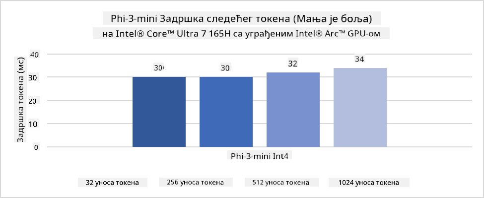
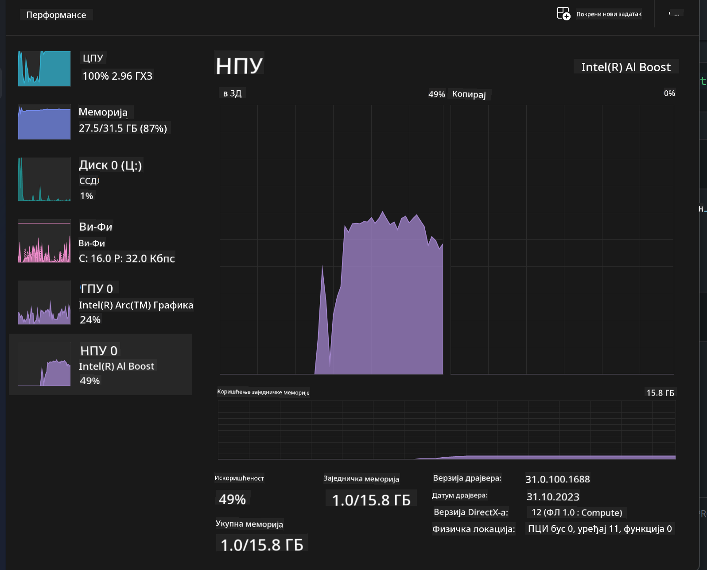
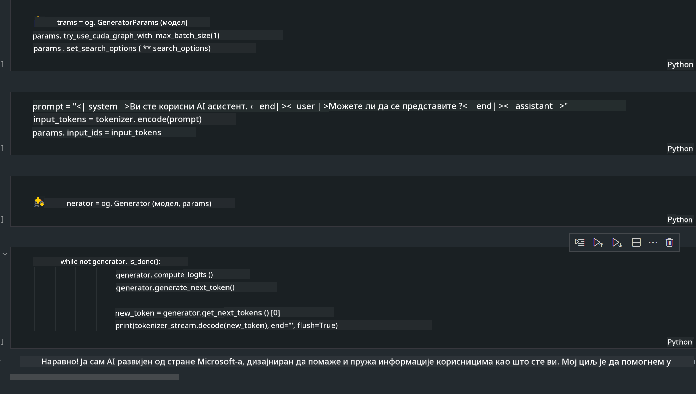
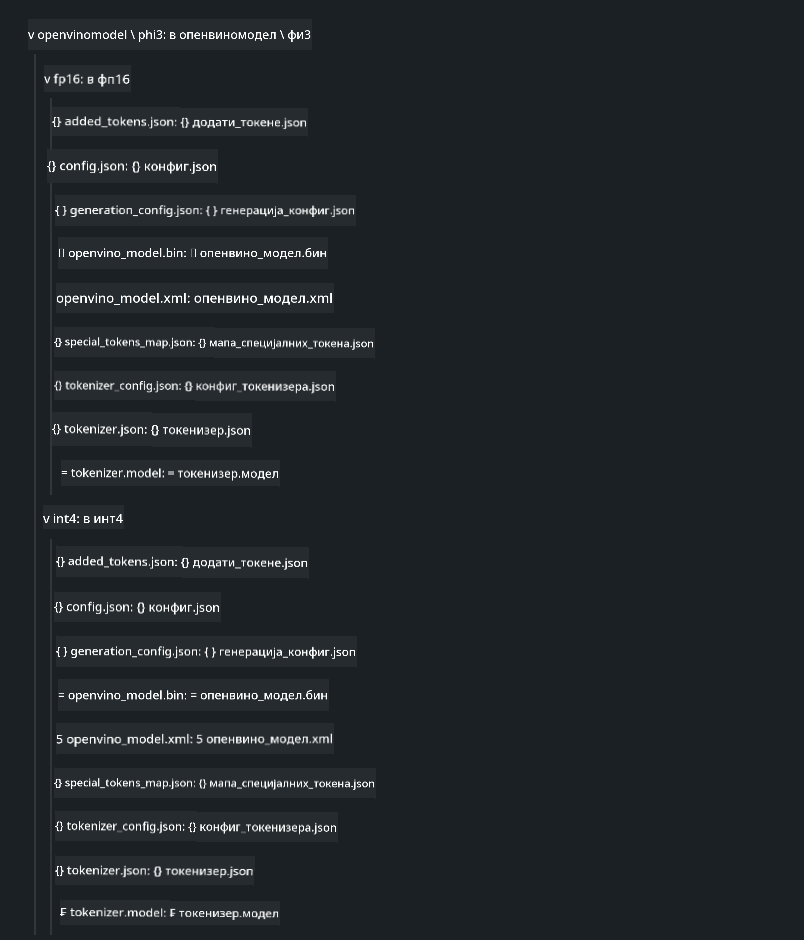
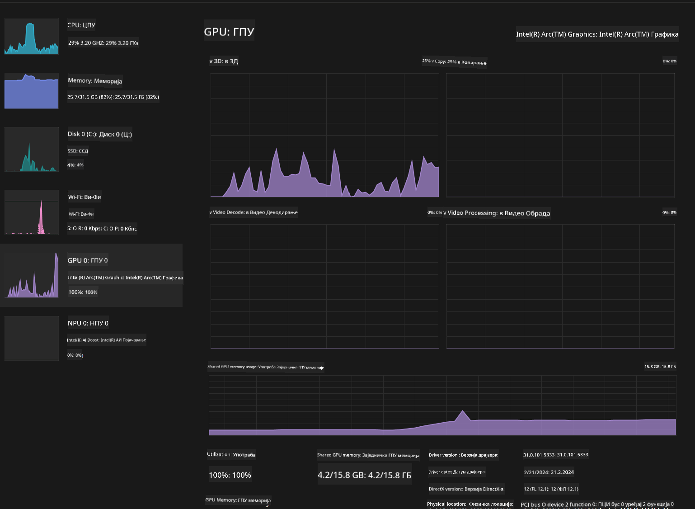

<!--
CO_OP_TRANSLATOR_METADATA:
{
  "original_hash": "e08ce816e23ad813244a09ca34ebb8ac",
  "translation_date": "2025-07-16T20:08:14+00:00",
  "source_file": "md/01.Introduction/03/AIPC_Inference.md",
  "language_code": "sr"
}
-->
# **Инференција Phi-3 на AI рачунару**

Са напретком генеративне вештачке интелигенције и побољшањем хардверских могућности уређаја на ивици мреже, све већи број генеративних AI модела може се интегрисати у корисничке уређаје по систему Bring Your Own Device (BYOD). AI рачунари су међу тим моделима. Почев од 2024. године, Intel, AMD и Qualcomm су сарађивали са произвођачима рачунара како би представили AI рачунаре који омогућавају покретање локализованих генеративних AI модела кроз хардверске измене. У овој дискусији фокусираћемо се на Intel AI рачунаре и истражити како покренути Phi-3 на Intel AI рачунару.

### Шта је NPU

NPU (Neural Processing Unit) је посебан процесор или процесорска јединица у оквиру већег SoC-а, дизајнирана посебно за убрзавање операција неуронских мрежа и AI задатака. За разлику од општих CPU и GPU, NPU су оптимизовани за паралелно рачунање засновано на подацима, што их чини изузетно ефикасним у обради великих мултимедијалних података као што су видео снимци и слике, као и у обради података за неуронске мреже. Посебно су добри у извршавању AI задатака као што су препознавање говора, замућење позадине у видео позивима и процеси уређивања фотографија или видео снимака као што је детекција објеката.

## NPU у односу на GPU

Иако многи AI и машинско учење задаци раде на GPU-има, постоји важна разлика између GPU и NPU.
GPU су познати по својим паралелним рачунарским способностима, али нису сви GPU једнако ефикасни изван обраде графике. NPU, с друге стране, су специјално направљени за сложене прорачуне који су укључени у операције неуронских мрежа, што их чини изузетно ефикасним за AI задатке.

Укратко, NPU су математички генији који убрзавају AI прорачуне и играју кључну улогу у новој ери AI рачунара!

***Овај пример је заснован на најновијем Intel Core Ultra процесору***

## **1. Коришћење NPU за покретање Phi-3 модела**

Intel® NPU уређај је AI инференцијски акцелератор интегрисан са Intel клијентским CPU-има, почев од Intel® Core™ Ultra генерације процесора (раније познат као Meteor Lake). Омогућава енергетски ефикасно извршавање задатака вештачких неуронских мрежа.




**Intel NPU Acceleration Library**

Intel NPU Acceleration Library [https://github.com/intel/intel-npu-acceleration-library](https://github.com/intel/intel-npu-acceleration-library) је Python библиотека дизајнирана да повећа ефикасност ваших апликација коришћењем снаге Intel Neural Processing Unit (NPU) за извођење брзих прорачуна на компатибилном хардверу.

Пример Phi-3-mini на AI рачунару са Intel® Core™ Ultra процесорима.


Инсталирајте Python библиотеку помоћу pip

```bash

   pip install intel-npu-acceleration-library

```

***Напомена*** Пројекат је још у развоју, али референтни модел је већ веома комплетан.

### **Покретање Phi-3 са Intel NPU Acceleration Library**

Коришћењем Intel NPU акцелерације, ова библиотека не утиче на традиционални процес кодирања. Потребно је само да користите ову библиотеку за квантизацију оригиналног Phi-3 модела, као што су FP16, INT8, INT4, на пример

```python
from transformers import AutoTokenizer, pipeline,TextStreamer
from intel_npu_acceleration_library import NPUModelForCausalLM, int4
from intel_npu_acceleration_library.compiler import CompilerConfig
import warnings

model_id = "microsoft/Phi-3-mini-4k-instruct"

compiler_conf = CompilerConfig(dtype=int4)
model = NPUModelForCausalLM.from_pretrained(
    model_id, use_cache=True, config=compiler_conf, attn_implementation="sdpa"
).eval()

tokenizer = AutoTokenizer.from_pretrained(model_id)

text_streamer = TextStreamer(tokenizer, skip_prompt=True)
```

Након успешне квантизације, наставите извршавање позивањем NPU за покретање Phi-3 модела.

```python
generation_args = {
   "max_new_tokens": 1024,
   "return_full_text": False,
   "temperature": 0.3,
   "do_sample": False,
   "streamer": text_streamer,
}

pipe = pipeline(
   "text-generation",
   model=model,
   tokenizer=tokenizer,
)

query = "<|system|>You are a helpful AI assistant.<|end|><|user|>Can you introduce yourself?<|end|><|assistant|>"

with warnings.catch_warnings():
    warnings.simplefilter("ignore")
    pipe(query, **generation_args)
```

При извршавању кода можемо пратити статус рада NPU преко Task Manager-а



***Примери*** : [AIPC_NPU_DEMO.ipynb](../../../../../code/03.Inference/AIPC/AIPC_NPU_DEMO.ipynb)

## **2. Коришћење DirectML + ONNX Runtime за покретање Phi-3 модела**

### **Шта је DirectML**

[DirectML](https://github.com/microsoft/DirectML) је високо перформантна, хардверски убрзана DirectX 12 библиотека за машинско учење. DirectML пружа GPU акцелерацију за уобичајене задатке машинског учења на широком спектру подржаног хардвера и драјвера, укључујући све DirectX 12 компатибилне GPU-ове од произвођача као што су AMD, Intel, NVIDIA и Qualcomm.

Када се користи самостално, DirectML API је ниско-ниво DirectX 12 библиотека и погодан је за апликације са високим перформансама и ниском латенцијом као што су фрејмворкови, игре и друге апликације у реалном времену. Беспрекорна интероперабилност DirectML са Direct3D 12, као и његов мали оверхед и конзистентност на различитом хардверу, чине DirectML идеалним за убрзавање машинског учења када су потребне и високе перформансе и поузданост и предвидљивост резултата на различитим уређајима.

***Напомена*** : Најновији DirectML већ подржава NPU (https://devblogs.microsoft.com/directx/introducing-neural-processor-unit-npu-support-in-directml-developer-preview/)

### DirectML и CUDA у погледу могућности и перформанси:

**DirectML** је библиотека за машинско учење коју је развио Microsoft. Дизајнирана је да убрза радне задатке машинског учења на Windows уређајима, укључујући десктопове, лаптопове и уређаје на ивици мреже.
- Заснован на DX12: DirectML је изграђен на врху DirectX 12 (DX12), који пружа широк спектар подршке за хардвер на GPU-овима, укључујући NVIDIA и AMD.
- Шира подршка: Пошто користи DX12, DirectML може радити са било којим GPU који подржава DX12, чак и интегрисаним GPU-овима.
- Обрада слика: DirectML обрађује слике и друге податке користећи неуронске мреже, што га чини погодним за задатке као што су препознавање слика, детекција објеката и слично.
- Лакоћа подешавања: Подешавање DirectML је једноставно и не захтева специфичне SDK или библиотеке од произвођача GPU-а.
- Перформансе: У неким случајевима, DirectML има добре перформансе и може бити бржи од CUDA, посебно за одређене радне задатке.
- Ограничења: Међутим, постоје случајеви када DirectML може бити спорији, нарочито за велике батчеве у float16 формату.

**CUDA** је NVIDIA платформа за паралелно рачунање и програмски модел. Омогућава програмерима да искористе снагу NVIDIA GPU-а за опште рачунарске задатке, укључујући машинско учење и научне симулације.
- Специфично за NVIDIA: CUDA је тесно интегрисана са NVIDIA GPU-овима и дизајнирана је посебно за њих.
- Високо оптимизована: Пружа одличне перформансе за задатке убрзане GPU-ом, посебно када се користе NVIDIA GPU-ови.
- Широко коришћена: Многи фрејмворкови и библиотеке за машинско учење (као што су TensorFlow и PyTorch) имају подршку за CUDA.
- Прилагођавање: Програмери могу детаљно подесити CUDA за специфичне задатке, што може довести до оптималних перформанси.
- Ограничења: Међутим, зависност CUDA од NVIDIA хардвера може бити ограничење ако желите ширу компатибилност са различитим GPU-овима.

### Избор између DirectML и CUDA

Избор између DirectML и CUDA зависи од вашег конкретног случаја употребе, доступности хардвера и личних преференција.
Ако тражите ширу компатибилност и лакоћу подешавања, DirectML може бити добар избор. Међутим, ако имате NVIDIA GPU и потребне су вам високо оптимизоване перформансе, CUDA остаје јак кандидат. Укратко, и DirectML и CUDA имају своје предности и мане, па узмите у обзир своје захтеве и расположиви хардвер при доношењу одлуке.

### **Генеративна AI са ONNX Runtime**

У ери AI, преносивост AI модела је веома важна. ONNX Runtime омогућава лако распоређивање обучених модела на различите уређаје. Програмери не морају да брину о инференцијском фрејмворку и користе унифицирани API за извршење инференције модела. У ери генеративне AI, ONNX Runtime је такође оптимизовао код (https://onnxruntime.ai/docs/genai/). Кроз оптимизовани ONNX Runtime, квантизовани генеративни AI модел може се изводити на различитим уређајима. У Generative AI са ONNX Runtime, можете извршавати AI модел преко API-ја у Python, C#, C / C++. Наравно, распоређивање на iPhone-у може искористити C++ Generative AI са ONNX Runtime API-јем.

[Пример кода](https://github.com/Azure-Samples/Phi-3MiniSamples/tree/main/onnx)

***компајлирање генеративне AI са ONNX Runtime библиотеком***

```bash

winget install --id=Kitware.CMake  -e

git clone https://github.com/microsoft/onnxruntime.git

cd .\onnxruntime\

./build.bat --build_shared_lib --skip_tests --parallel --use_dml --config Release

cd ../

git clone https://github.com/microsoft/onnxruntime-genai.git

cd .\onnxruntime-genai\

mkdir ort

cd ort

mkdir include

mkdir lib

copy ..\onnxruntime\include\onnxruntime\core\providers\dml\dml_provider_factory.h ort\include

copy ..\onnxruntime\include\onnxruntime\core\session\onnxruntime_c_api.h ort\include

copy ..\onnxruntime\build\Windows\Release\Release\*.dll ort\lib

copy ..\onnxruntime\build\Windows\Release\Release\onnxruntime.lib ort\lib

python build.py --use_dml


```

**Инсталирање библиотеке**

```bash

pip install .\onnxruntime_genai_directml-0.3.0.dev0-cp310-cp310-win_amd64.whl

```

Ово је резултат извршавања



***Примери*** : [AIPC_DirectML_DEMO.ipynb](../../../../../code/03.Inference/AIPC/AIPC_DirectML_DEMO.ipynb)

## **3. Коришћење Intel OpenVino за покретање Phi-3 модела**

### **Шта је OpenVINO**

[OpenVINO](https://github.com/openvinotoolkit/openvino) је open-source алат за оптимизацију и распоређивање дубоких модела учења. Пружа убрзање дубоког учења за моделе за вид, звук и језик из популарних фрејмворкова као што су TensorFlow, PyTorch и други. Започните са OpenVINO. OpenVINO се такође може користити у комбинацији са CPU и GPU за покретање Phi-3 модела.

***Напомена***: Тренутно OpenVINO не подржава NPU.

### **Инсталирање OpenVINO библиотеке**

```bash

 pip install git+https://github.com/huggingface/optimum-intel.git

 pip install git+https://github.com/openvinotoolkit/nncf.git

 pip install openvino-nightly

```

### **Покретање Phi-3 са OpenVINO**

Као и NPU, OpenVINO извршава позив генеративних AI модела покретањем квантизованих модела. Прво је потребно квантизовати Phi-3 модел и завршити квантизацију модела преко командне линије помоћу optimum-cli

**INT4**

```bash

optimum-cli export openvino --model "microsoft/Phi-3-mini-4k-instruct" --task text-generation-with-past --weight-format int4 --group-size 128 --ratio 0.6  --sym  --trust-remote-code ./openvinomodel/phi3/int4

```

**FP16**

```bash

optimum-cli export openvino --model "microsoft/Phi-3-mini-4k-instruct" --task text-generation-with-past --weight-format fp16 --trust-remote-code ./openvinomodel/phi3/fp16

```

конвертовани формат изгледа овако



Учитајте путање модела (model_dir), релевантне конфигурације (ov_config = {"PERFORMANCE_HINT": "LATENCY", "NUM_STREAMS": "1", "CACHE_DIR": ""}) и хардверски убрзане уређаје (GPU.0) преко OVModelForCausalLM

```python

ov_model = OVModelForCausalLM.from_pretrained(
     model_dir,
     device='GPU.0',
     ov_config=ov_config,
     config=AutoConfig.from_pretrained(model_dir, trust_remote_code=True),
     trust_remote_code=True,
)

```

При извршавању кода можемо пратити статус рада GPU преко Task Manager-а



***Примери*** : [AIPC_OpenVino_Demo.ipynb](../../../../../code/03.Inference/AIPC/AIPC_OpenVino_Demo.ipynb)

### ***Напомена*** : Горенаведене три методе имају своје предности, али се препоручује коришћење NPU акцелерације за инференцију на AI рачунарима.

**Одрицање од одговорности**:  
Овај документ је преведен коришћењем AI услуге за превођење [Co-op Translator](https://github.com/Azure/co-op-translator). Иако се трудимо да превод буде тачан, молимо вас да имате у виду да аутоматски преводи могу садржати грешке или нетачности. Оригинални документ на његовом изворном језику треба сматрати ауторитетним извором. За критичне информације препоручује се професионални људски превод. Нисмо одговорни за било каква неспоразума или погрешна тумачења која произилазе из коришћења овог превода.