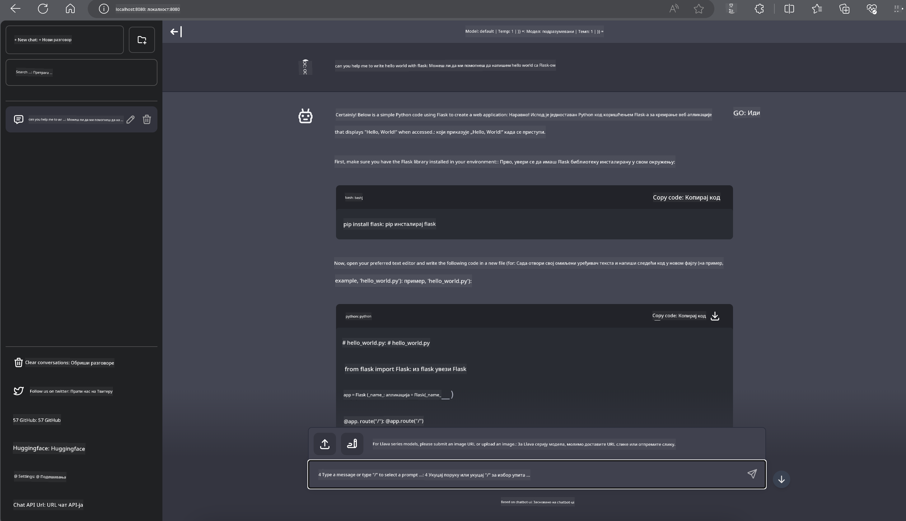

<!--
CO_OP_TRANSLATOR_METADATA:
{
  "original_hash": "be4101a30d98e95a71d42c276e8bcd37",
  "translation_date": "2025-05-09T11:46:31+00:00",
  "source_file": "md/01.Introduction/03/Jetson_Inference.md",
  "language_code": "sr"
}
-->
# **Inferencija Phi-3 na Nvidia Jetson-u**

Nvidia Jetson je serija ugrađenih računarskih ploča kompanije Nvidia. Modeli Jetson TK1, TX1 i TX2 svi koriste Tegra procesor (ili SoC) iz Nvidije koji integriše ARM arhitekturu centralne procesorske jedinice (CPU). Jetson je sistem niske potrošnje energije i dizajniran je za ubrzavanje aplikacija mašinskog učenja. Nvidia Jetson koriste profesionalni programeri za kreiranje revolucionarnih AI proizvoda u svim industrijama, kao i studenti i entuzijasti za praktično učenje AI i pravljenje impresivnih projekata. SLM je implementiran na edge uređajima poput Jetson-a, što omogućava bolje primene industrijskih generativnih AI scenarija.

## Implementacija na NVIDIA Jetson:
Programeri koji rade na autonomnoj robotici i ugrađenim uređajima mogu koristiti Phi-3 Mini. Relativno mala veličina Phi-3 čini ga idealnim za edge implementacije. Parametri su pažljivo podešeni tokom treniranja, što garantuje visoku tačnost odgovora.

### TensorRT-LLM Optimizacija:
NVIDIA-ina [TensorRT-LLM biblioteka](https://github.com/NVIDIA/TensorRT-LLM?WT.mc_id=aiml-138114-kinfeylo) optimizuje inferencu velikih jezičkih modela. Podržava dugi kontekst prozor Phi-3 Mini modela, poboljšavajući kako protok tako i latenciju. Optimizacije uključuju tehnike kao što su LongRoPE, FP8 i inflight batching.

### Dostupnost i implementacija:
Programeri mogu istražiti Phi-3 Mini sa 128K kontekst prozorom na [NVIDIA AI](https://www.nvidia.com/en-us/ai-data-science/generative-ai/). Model je pakovan kao NVIDIA NIM, mikroservis sa standardnim API-jem koji može biti implementiran bilo gde. Takođe, dostupne su [TensorRT-LLM implementacije na GitHub-u](https://github.com/NVIDIA/TensorRT-LLM).

## **1. Priprema**

a. Jetson Orin NX / Jetson NX

b. JetPack 5.1.2+

c. Cuda 11.8

d. Python 3.8+

## **2. Pokretanje Phi-3 na Jetson-u**

Možemo izabrati [Ollama](https://ollama.com) ili [LlamaEdge](https://llamaedge.com)

Ako želite da koristite gguf istovremeno u oblaku i na edge uređajima, LlamaEdge se može posmatrati kao WasmEdge (WasmEdge je lagan, visokoperformansni, skalabilni WebAssembly runtime pogodan za cloud native, edge i decentralizovane aplikacije. Podržava serverless aplikacije, ugrađene funkcije, mikroservise, pametne ugovore i IoT uređaje. Možete implementirati kvantitativni model gguf-a na edge uređaje i u oblak preko LlamaEdge).


Evo koraka za korišćenje

1. Instalirajte i preuzmite potrebne biblioteke i fajlove

```bash

curl -sSf https://raw.githubusercontent.com/WasmEdge/WasmEdge/master/utils/install.sh | bash -s -- --plugin wasi_nn-ggml

curl -LO https://github.com/LlamaEdge/LlamaEdge/releases/latest/download/llama-api-server.wasm

curl -LO https://github.com/LlamaEdge/chatbot-ui/releases/latest/download/chatbot-ui.tar.gz

tar xzf chatbot-ui.tar.gz

```

**Napomena**: llama-api-server.wasm i chatbot-ui moraju biti u istom direktorijumu

2. Pokrenite skripte u terminalu

```bash

wasmedge --dir .:. --nn-preload default:GGML:AUTO:{Your gguf path} llama-api-server.wasm -p phi-3-chat

```

Evo rezultata pokretanja



***Primer koda*** [Phi-3 mini WASM Notebook Sample](https://github.com/Azure-Samples/Phi-3MiniSamples/tree/main/wasm)

Ukratko, Phi-3 Mini predstavlja veliki iskorak u modeliranju jezika, kombinujući efikasnost, svest o kontekstu i NVIDIA-ine optimizacione sposobnosti. Bilo da pravite robote ili edge aplikacije, Phi-3 Mini je moćan alat koji treba imati na umu.

**Одрицање од одговорности**:  
Овај документ је преведен помоћу AI услуге за превођење [Co-op Translator](https://github.com/Azure/co-op-translator). Иако настојимо да превод буде тачан, имајте у виду да аутоматски преводи могу садржати грешке или нетачности. Оригинални документ на његовом изворном језику треба сматрати ауторитетним извором. За критичне информације препоручује се професионални људски превод. Нисмо одговорни за било каква неспоразума или погрешне интерпретације које произилазе из употребе овог превода.