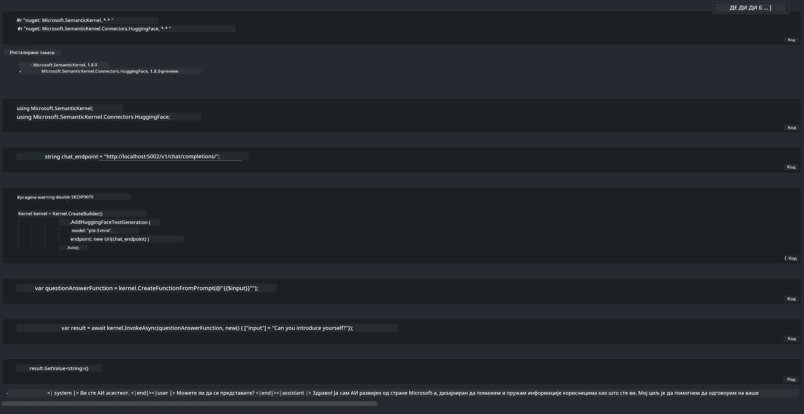

# **Инференција Phi-3 на локалном серверу**

Можемо да покренемо Phi-3 на локалном серверу. Корисници могу да изаберу решења као што су [Ollama](https://ollama.com) или [LM Studio](https://llamaedge.com), или могу написати свој код. Можете повезати локалне сервисе Phi-3 преко [Semantic Kernel](https://github.com/microsoft/semantic-kernel?WT.mc_id=aiml-138114-kinfeylo) или [Langchain](https://www.langchain.com/) како бисте направили Copilot апликације.

## **Коришћење Semantic Kernel за приступ Phi-3-mini**

У Copilot апликацији креирамо апликације преко Semantic Kernel / LangChain. Овај тип апликационог оквира је генерално компатибилан са Azure OpenAI Service / OpenAI моделима, а може подржати и open source моделе са Hugging Face и локалне моделе. Шта треба да урадимо ако желимо да користимо Semantic Kernel за приступ Phi-3-mini? Уз пример .NET-а, можемо га комбиновати са Hugging Face Connector-ом у Semantic Kernel-у. По дифолту, он одговара моделу на Hugging Face (при првом коришћењу модел ће бити преузет са Hugging Face-а, што може потрајати). Такође можете да се повежете на изграђени локални сервис. У поређењу са ова два, препоручујемо коришћење другог јер пружа већу аутономију, посебно у пословним апликацијама.

Са слике се види да приступ локалним сервисима преко Semantic Kernel-а лако повезује са самостално изграђеним Phi-3-mini сервером модела. Ево резултата извршавања:

***Пример кода*** https://github.com/kinfey/Phi3MiniSamples/tree/main/semantickernel

**Одрицање од одговорности**:  
Овај документ је преведен коришћењем AI услуге за превођење [Co-op Translator](https://github.com/Azure/co-op-translator). Иако се трудимо да превод буде тачан, молимо вас да имате у виду да аутоматски преводи могу садржати грешке или нетачности. Оригинални документ на његовом изворном језику треба сматрати ауторитетним извором. За критичне информације препоручује се професионални људски превод. Нисмо одговорни за било каква неспоразума или погрешна тумачења која произилазе из коришћења овог превода.