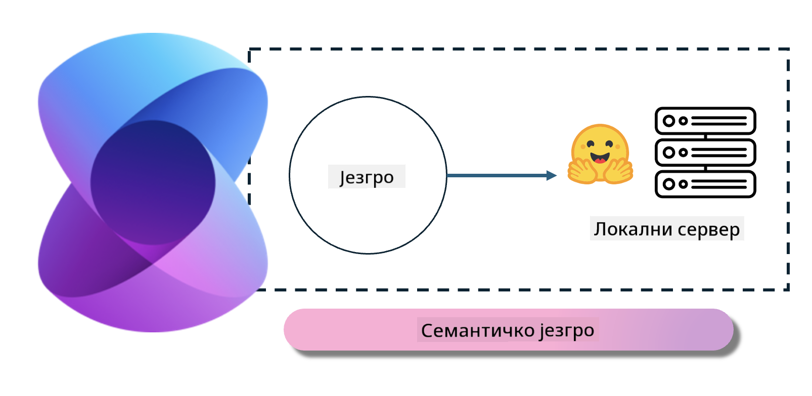
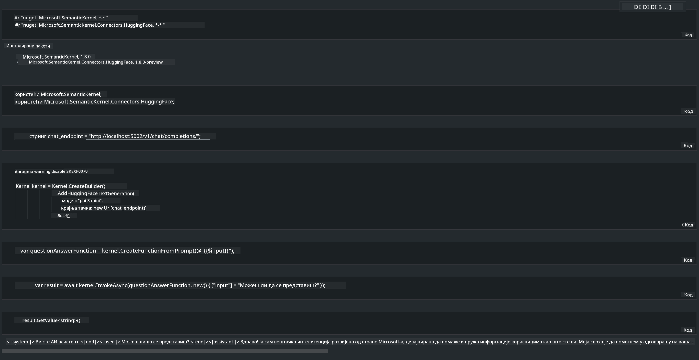

<!--
CO_OP_TRANSLATOR_METADATA:
{
  "original_hash": "bcf5dd7031db0031abdb9dd0c05ba118",
  "translation_date": "2025-05-09T12:09:28+00:00",
  "source_file": "md/01.Introduction/03/Local_Server_Inference.md",
  "language_code": "sr"
}
-->
# **Inferencija Phi-3 na lokalnom serveru**

Možemo da pokrenemo Phi-3 na lokalnom serveru. Korisnici mogu da izaberu rešenja kao što su [Ollama](https://ollama.com) ili [LM Studio](https://llamaedge.com), ili mogu da napišu sopstveni kod. Phi-3 lokalne servise možete povezati preko [Semantic Kernel](https://github.com/microsoft/semantic-kernel?WT.mc_id=aiml-138114-kinfeylo) ili [Langchain](https://www.langchain.com/) kako biste napravili Copilot aplikacije.

## **Korišćenje Semantic Kernel za pristup Phi-3-mini**

U Copilot aplikaciji pravimo aplikacije preko Semantic Kernel / LangChain. Ovaj tip okvira za aplikacije je uglavnom kompatibilan sa Azure OpenAI servisom / OpenAI modelima, a može podržavati i open source modele sa Hugging Face i lokalne modele. Šta treba da uradimo ako želimo da koristimo Semantic Kernel za pristup Phi-3-mini? Koristeći .NET kao primer, možemo ga kombinovati sa Hugging Face Connector u Semantic Kernel-u. Po default-u, to može da odgovara model id-u na Hugging Face-u (pri prvom korišćenju, model će biti preuzet sa Hugging Face-a, što može potrajati). Takođe, možete se povezati i na lokalno izgrađeni servis. Preporučujemo korišćenje ovog drugog jer pruža veći stepen autonomije, posebno u poslovnim aplikacijama.

Sa slike se vidi da pristup lokalnim servisima preko Semantic Kernel-a lako povezuje sa samostalno izgrađenim Phi-3-mini serverskim modelom. Ovo je rezultat pokretanja:

***Sample Code*** https://github.com/kinfey/Phi3MiniSamples/tree/main/semantickernel

**Одрицање од одговорности**:  
Овај документ је преведен помоћу AI услуге за превођење [Co-op Translator](https://github.com/Azure/co-op-translator). Иако се трудимо да превод буде тачан, имајте у виду да аутоматизовани преводи могу садржати грешке или нетачности. Изворни документ на његовом оригиналном језику треба сматрати ауторитетом. За критичне информације препоручује се професионални људски превод. Нисмо одговорни за било каква неспоразума или погрешне интерпретације настале употребом овог превода.