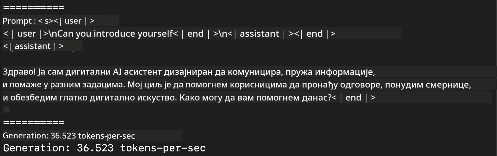
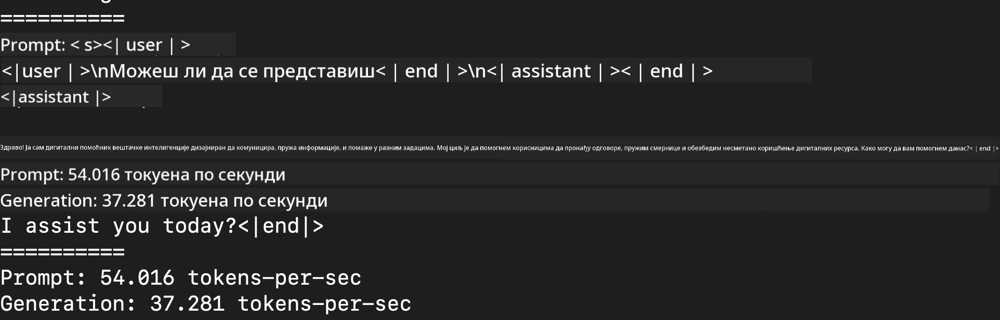
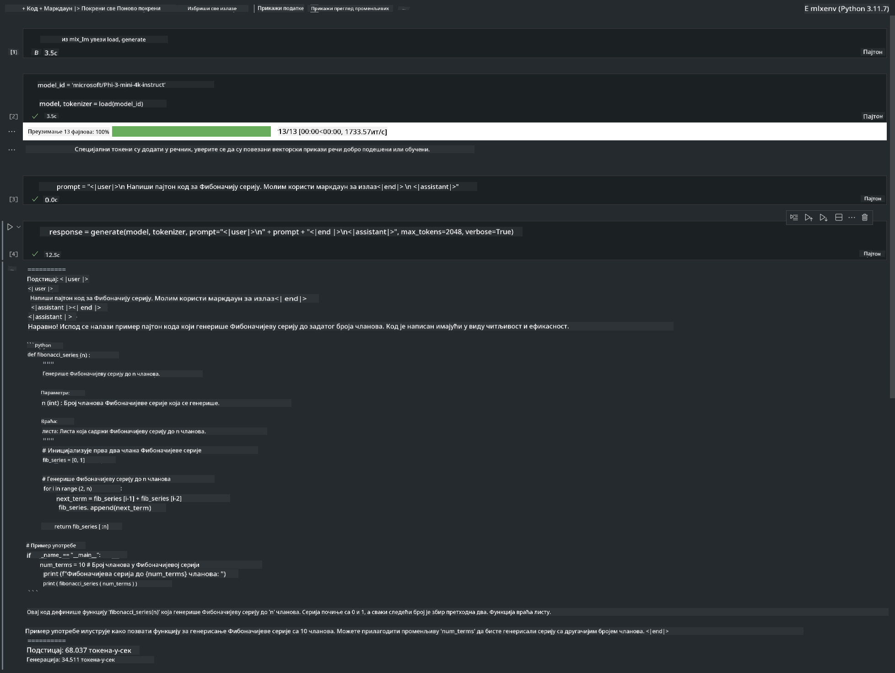

<!--
CO_OP_TRANSLATOR_METADATA:
{
  "original_hash": "dcb656f3d206fc4968e236deec5d4384",
  "translation_date": "2025-05-09T12:20:13+00:00",
  "source_file": "md/01.Introduction/03/MLX_Inference.md",
  "language_code": "sr"
}
-->
# **Inferencija Phi-3 sa Apple MLX Framework-om**

## **Šta je MLX Framework**

MLX je framework za nizove namenjen istraživanju mašinskog učenja na Apple silicijumu, razvijen od strane Apple istraživača u oblasti mašinskog učenja.

MLX je dizajniran od strane istraživača mašinskog učenja za istraživače mašinskog učenja. Framework je zamišljen da bude jednostavan za korišćenje, a istovremeno efikasan za treniranje i implementaciju modela. Sam dizajn framework-a je konceptualno jednostavan. Cilj nam je da omogućimo istraživačima lako proširenje i unapređenje MLX-a kako bi brzo mogli da istražuju nove ideje.

Veliki jezički modeli (LLMs) mogu se ubrzati na Apple Silicon uređajima pomoću MLX-a, a modeli se mogu vrlo jednostavno pokretati lokalno.

## **Korišćenje MLX za inferenciju Phi-3-mini**

### **1. Podešavanje MLX okruženja**

1. Python 3.11.x  
2. Instalirajte MLX biblioteku

```bash

pip install mlx-lm

```

### **2. Pokretanje Phi-3-mini u Terminalu sa MLX**

```bash

python -m mlx_lm.generate --model microsoft/Phi-3-mini-4k-instruct --max-token 2048 --prompt  "<|user|>\nCan you introduce yourself<|end|>\n<|assistant|>"

```

Rezultat (moje okruženje je Apple M1 Max, 64GB) je



### **3. Kvantizacija Phi-3-mini pomoću MLX u Terminalu**

```bash

python -m mlx_lm.convert --hf-path microsoft/Phi-3-mini-4k-instruct

```

***Note：*** Model se može kvantizovati putem mlx_lm.convert, a podrazumevana kvantizacija je INT4. Ovaj primer kvantizuje Phi-3-mini u INT4.

Model se može kvantizovati preko mlx_lm.convert, a podrazumevana kvantizacija je INT4. U ovom primeru kvantizujemo Phi-3-mini u INT4. Nakon kvantizacije, model će biti sačuvan u podrazumevani direktorijum ./mlx_model

Možemo testirati kvantizovani model sa MLX iz terminala

```bash

python -m mlx_lm.generate --model ./mlx_model/ --max-token 2048 --prompt  "<|user|>\nCan you introduce yourself<|end|>\n<|assistant|>"

```

Rezultat je



### **4. Pokretanje Phi-3-mini sa MLX u Jupyter Notebook-u**



***Note:*** Molimo pročitajte ovaj primer [klikom na ovaj link](../../../../../code/03.Inference/MLX/MLX_DEMO.ipynb)

## **Resursi**

1. Saznajte više o Apple MLX Framework-u [https://ml-explore.github.io](https://ml-explore.github.io/mlx/build/html/index.html)

2. Apple MLX GitHub Repo [https://github.com/ml-explore](https://github.com/ml-explore)

**Ограничење одговорности**:  
Овај документ је преведен коришћењем AI преводилачке услуге [Co-op Translator](https://github.com/Azure/co-op-translator). Иако се трудимо да превод буде тачан, молимо вас да имате у виду да аутоматски преводи могу садржати грешке или нетачности. Изворни документ на његовом оригиналном језику треба сматрати ауторитетним извором. За критичне информације препоручује се професионални људски превод. Нисмо одговорни за било какве неспоразуме или погрешне тумачења настала коришћењем овог превода.