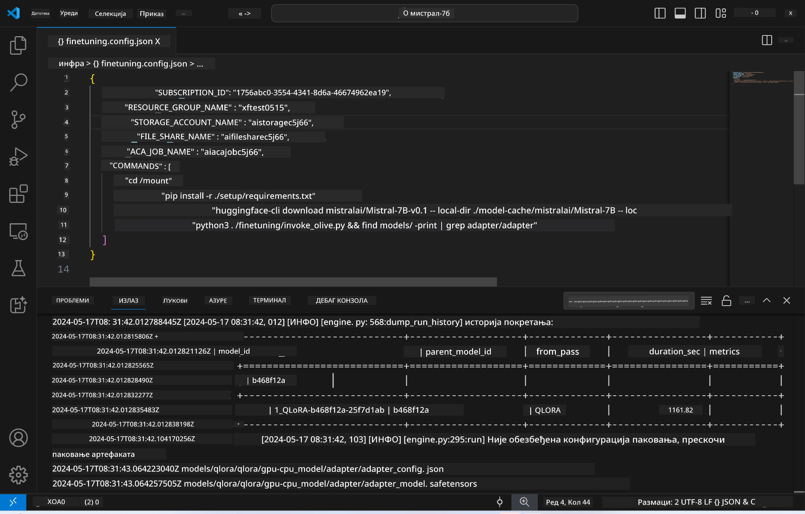
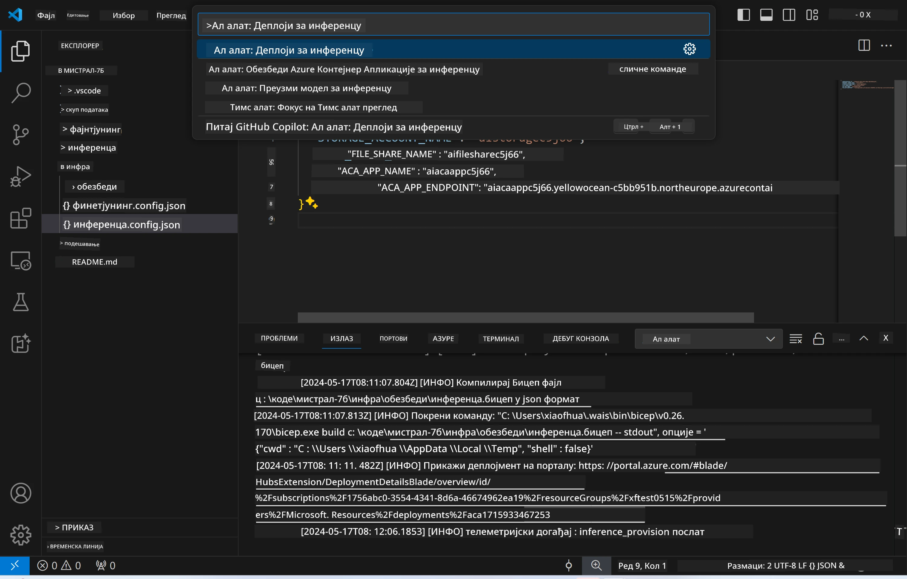

# Даљинско извођење са фино подешеним моделом

Након што су адаптери обучени у даљинском окружењу, користите једноставну Gradio апликацију за интеракцију са моделом.



### Постављање Azure ресурса  
Потребно је да подесите Azure ресурсе за даљинско извођење тако што ћете извршити команду `AI Toolkit: Provision Azure Container Apps for inference` из командне палете. Током овог подешавања бићете упитани да изаберете вашу Azure претплату и групу ресурса.  

   
Подразумевано, претплата и група ресурса за извођење треба да буду исте као оне које сте користили за фино подешавање. Извођење ће користити исто Azure Container App окружење и приступити моделу и адаптеру модела који су сачувани у Azure Files, а који су генерисани током корака фино подешавања.

## Коришћење AI Toolkit-а

### Деплојмент за извођење  
Ако желите да измените код за извођење или поново учитате модел за извођење, извршите команду `AI Toolkit: Deploy for inference`. Ово ће синхронизовати ваш најновији код са ACA и поново покренути реплику.



Након успешног завршетка деплојмента, модел је спреман за процену преко овог ендпоинта.

### Приступ API-ју за извођење

Приступ API-ју за извођење можете добити кликом на дугме "*Go to Inference Endpoint*" које се појављује у обавештењу у VSCode-у. Алтернативно, веб API ендпоинт се налази у `ACA_APP_ENDPOINT` у фајлу `./infra/inference.config.json` и у излазном панелу.


> **Напомена:** Ендпоинт за извођење може захтевати неколико минута да постане потпуно оперативан.

## Компоненте за извођење укључене у шаблон

| Фолдер | Садржај |
| ------ |--------- |
| `infra` | Садржи све неопходне конфигурације за даљински рад. |
| `infra/provision/inference.parameters.json` | Садржи параметре за bicep шаблоне, који се користе за постављање Azure ресурса за извођење. |
| `infra/provision/inference.bicep` | Садржи шаблоне за постављање Azure ресурса за извођење. |
| `infra/inference.config.json` | Конфигурациони фајл, генерисан командом `AI Toolkit: Provision Azure Container Apps for inference`. Користи се као улаз за друге даљинске команде из командне палете. |

### Коришћење AI Toolkit-а за конфигурисање Azure ресурса  
Конфигуришите [AI Toolkit](https://marketplace.visualstudio.com/items?itemName=ms-windows-ai-studio.windows-ai-studio)

Команда `Provision Azure Container Apps for inference`.

Параметре конфигурације можете пронаћи у фајлу `./infra/provision/inference.parameters.json`. Ево детаља:  
| Параметар | Опис |
| --------- |------ |
| `defaultCommands` | Команде за покретање веб API-ја. |
| `maximumInstanceCount` | Овај параметар поставља максималан број GPU инстанци. |
| `location` | Локација на којој се постављају Azure ресурси. Подразумевана вредност је иста као локација изабране групе ресурса. |
| `storageAccountName`, `fileShareName`, `acaEnvironmentName`, `acaEnvironmentStorageName`, `acaAppName`, `acaLogAnalyticsName` | Ови параметри се користе за именовање Azure ресурса приликом постављања. По подразумеваној вредности, исти су као и имена ресурса коришћених за фино подешавање. Можете унети ново, неупотребљено име ресурса да бисте креирали ресурсе по свом избору, или унети име већ постојећег Azure ресурса ако желите да га користите. За детаље, погледајте одељак [Коришћење постојећих Azure ресурса](../../../../../md/01.Introduction/03). |

### Коришћење постојећих Azure ресурса

Подразумевано, постављање за извођење користи исто Azure Container App окружење, Storage Account, Azure File Share и Azure Log Analytics који су коришћени за фино подешавање. Посебан Azure Container App се креира искључиво за API извођења.

Ако сте прилагодили Azure ресурсе током корака фино подешавања или желите да користите своје постојеће Azure ресурсе за извођење, наведите њихова имена у фајлу `./infra/inference.parameters.json`. Затим покрените команду `AI Toolkit: Provision Azure Container Apps for inference` из командне палете. Ово ће ажурирати наведене ресурсе и креирати оне који недостају.

На пример, ако већ имате постојеће Azure container окружење, ваш фајл `./infra/finetuning.parameters.json` треба да изгледа овако:

```json
{
    "$schema": "https://schema.management.azure.com/schemas/2019-04-01/deploymentParameters.json#",
    "contentVersion": "1.0.0.0",
    "parameters": {
      ...
      "acaEnvironmentName": {
        "value": "<your-aca-env-name>"
      },
      "acaEnvironmentStorageName": {
        "value": null
      },
      ...
    }
  }
```

### Ручно постављање  
Ако више волите да ручно конфигуришете Azure ресурсе, можете користити приложене bicep фајлове у фолдеру `./infra/provision`. Ако сте већ подесили и конфигурисали све Azure ресурсе без коришћења AI Toolkit командне палете, једноставно унесите имена ресурса у фајл `inference.config.json`.

На пример:

```json
{
  "SUBSCRIPTION_ID": "<your-subscription-id>",
  "RESOURCE_GROUP_NAME": "<your-resource-group-name>",
  "STORAGE_ACCOUNT_NAME": "<your-storage-account-name>",
  "FILE_SHARE_NAME": "<your-file-share-name>",
  "ACA_APP_NAME": "<your-aca-name>",
  "ACA_APP_ENDPOINT": "<your-aca-endpoint>"
}
```

**Одрицање од одговорности**:  
Овај документ је преведен коришћењем AI сервиса за превођење [Co-op Translator](https://github.com/Azure/co-op-translator). Иако се трудимо да превод буде тачан, молимо вас да имате у виду да аутоматски преводи могу садржати грешке или нетачности. Оригинални документ на његовом изворном језику треба сматрати ауторитетним извором. За критичне информације препоручује се професионални људски превод. Нисмо одговорни за било каква неспоразума или погрешна тумачења настала коришћењем овог превода.