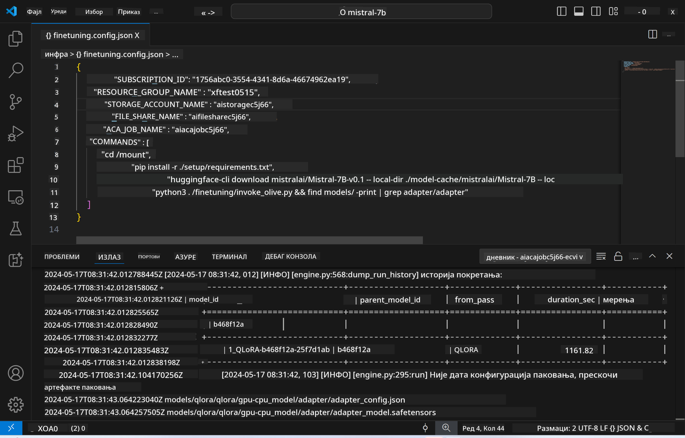
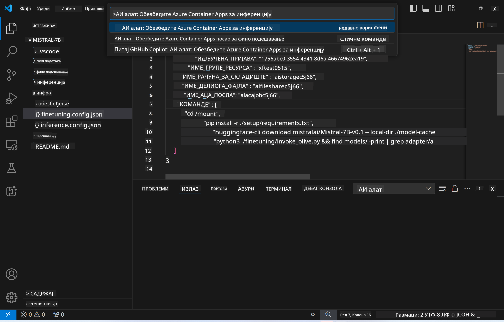
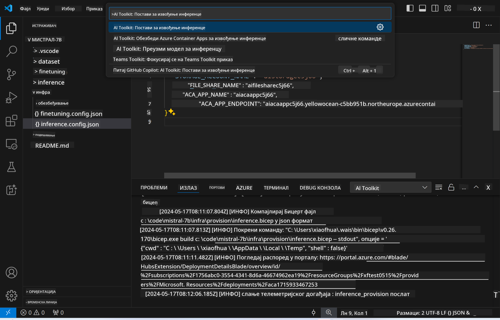

<!--
CO_OP_TRANSLATOR_METADATA:
{
  "original_hash": "a54cd3d65b6963e4e8ce21e143c3ab04",
  "translation_date": "2025-05-09T12:47:27+00:00",
  "source_file": "md/01.Introduction/03/Remote_Interence.md",
  "language_code": "sr"
}
-->
# Daljinsko izvođenje sa fino podešenim modelom

Nakon što su adapteri obučeni u daljinskom okruženju, koristite jednostavnu Gradio aplikaciju za interakciju sa modelom.



### Postavljanje Azure resursa  
Potrebno je da postavite Azure resurse za daljinsko izvođenje tako što ćete pokrenuti `AI Toolkit: Provision Azure Container Apps for inference` iz komandne palete. Tokom ovog podešavanja bićete upitani da izaberete svoju Azure pretplatu i grupu resursa.  


Podrazumevano, pretplata i grupa resursa za izvođenje treba da budu iste kao one koje ste koristili za fino podešavanje. Izvođenje će koristiti isto Azure Container App okruženje i pristup modelu i adapteru modela smeštenim u Azure Files, koji su generisani tokom koraka fino podešavanja.

## Korišćenje AI Toolkit-a

### Deploy za izvođenje  
Ako želite da izmenite kod za izvođenje ili ponovo učitate model za izvođenje, pokrenite `AI Toolkit: Deploy for inference` komandu. Ovo će sinhronizovati vaš najnoviji kod sa ACA i restartovati repliku.



Nakon uspešnog deploy-a, model je spreman za evaluaciju putem ovog endpointa.

### Pristup API-ju za izvođenje

API za izvođenje možete pristupiti klikom na dugme "*Go to Inference Endpoint*" koje se pojavljuje u VSCode notifikaciji. Alternativno, web API endpoint se može pronaći pod `ACA_APP_ENDPOINT` u `./infra/inference.config.json` i u izlaznom panelu.


> **Note:** Endpoint za izvođenje može zahtevati nekoliko minuta da postane potpuno operativan.

## Komponente za izvođenje uključene u šablon

| Folder | Sadržaj |
| ------ |--------- |
| `infra` | Sadrži sve neophodne konfiguracije za daljinske operacije. |
| `infra/provision/inference.parameters.json` | Sadrži parametre za bicep šablone, koji se koriste za postavljanje Azure resursa za izvođenje. |
| `infra/provision/inference.bicep` | Sadrži šablone za postavljanje Azure resursa za izvođenje. |
| `infra/inference.config.json` | Konfiguracioni fajl, generisan komandom `AI Toolkit: Provision Azure Container Apps for inference`. Koristi se kao ulaz za druge daljinske komandne palete. |

### Korišćenje AI Toolkit-a za konfiguraciju Azure resursa  
Konfigurišite [AI Toolkit](https://marketplace.visualstudio.com/items?itemName=ms-windows-ai-studio.windows-ai-studio)

Postavite Azure Container Apps za izvođenje` command.

You can find configuration parameters in `./infra/provision/inference.parameters.json` file. Here are the details:
| Parameter | Description |
| --------- |------------ |
| `defaultCommands` | This is the commands to initiate a web API. |
| `maximumInstanceCount` | This parameter sets the maximum capacity of GPU instances. |
| `location` | This is the location where Azure resources are provisioned. The default value is the same as the chosen resource group's location. |
| `storageAccountName`, `fileShareName` `acaEnvironmentName`, `acaEnvironmentStorageName`, `acaAppName`,  `acaLogAnalyticsName` | These parameters are used to name the Azure resources for provision. By default, they will be same to the fine-tuning resource name. You can input a new, unused resource name to create your own custom-named resources, or you can input the name of an already existing Azure resource if you'd prefer to use that. For details, refer to the section [Using existing Azure Resources](../../../../../md/01.Introduction/03). |

### Using Existing Azure Resources

By default, the inference provision use the same Azure Container App Environment, Storage Account, Azure File Share, and Azure Log Analytics that were used for fine-tuning. A separate Azure Container App is created solely for the inference API. 

If you have customized the Azure resources during the fine-tuning step or want to use your own existing Azure resources for inference, specify their names in the `./infra/inference.parameters.json` fajl. Zatim pokrenite `AI Toolkit: Provision Azure Container Apps for inference` komandu iz komandne palete. Ovo ažurira sve navedene resurse i kreira one koji nedostaju.

Na primer, ako već imate postojeće Azure container okruženje, vaš `./infra/finetuning.parameters.json` treba da izgleda ovako:

```json
{
    "$schema": "https://schema.management.azure.com/schemas/2019-04-01/deploymentParameters.json#",
    "contentVersion": "1.0.0.0",
    "parameters": {
      ...
      "acaEnvironmentName": {
        "value": "<your-aca-env-name>"
      },
      "acaEnvironmentStorageName": {
        "value": null
      },
      ...
    }
  }
```

### Ručno postavljanje  
Ako više volite da ručno konfigurišete Azure resurse, možete koristiti priložene bicep fajlove u `./infra/provision` folders. If you have already set up and configured all the Azure resources without using the AI Toolkit command palette, you can simply enter the resource names in the `inference.config.json` fajlu.

Na primer:

```json
{
  "SUBSCRIPTION_ID": "<your-subscription-id>",
  "RESOURCE_GROUP_NAME": "<your-resource-group-name>",
  "STORAGE_ACCOUNT_NAME": "<your-storage-account-name>",
  "FILE_SHARE_NAME": "<your-file-share-name>",
  "ACA_APP_NAME": "<your-aca-name>",
  "ACA_APP_ENDPOINT": "<your-aca-endpoint>"
}
```

**Ограничење одговорности**:  
Овај документ је преведен помоћу AI сервиса за превођење [Co-op Translator](https://github.com/Azure/co-op-translator). Иако се трудимо да превод буде прецизан, молимо имајте у виду да аутоматски преводи могу садржати грешке или нетачности. Изворни документ на његовом оригиналном језику треба сматрати ауторитетним извором. За критичне информације препоручује се професионални превод од стране људског преводиоца. Нисмо одговорни за било каква неспоразума или погрешна тумачења настала коришћењем овог превода.