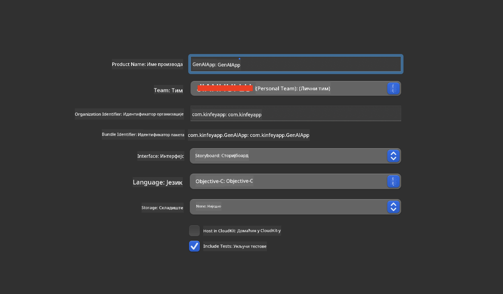
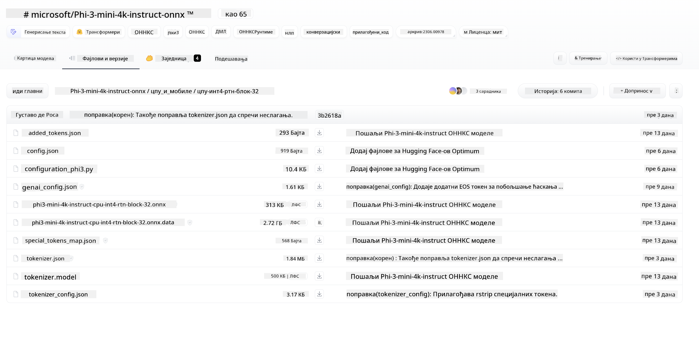
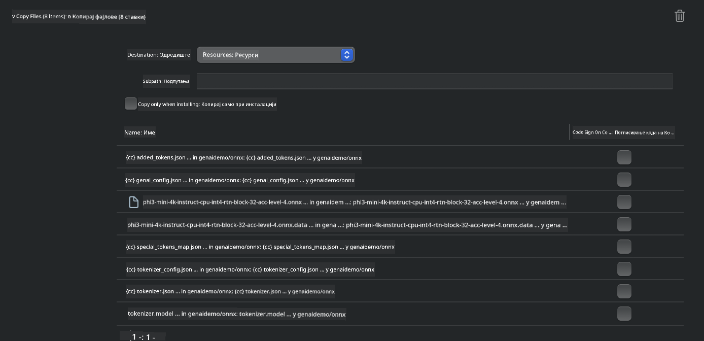
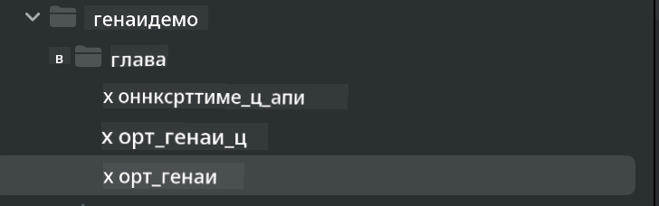
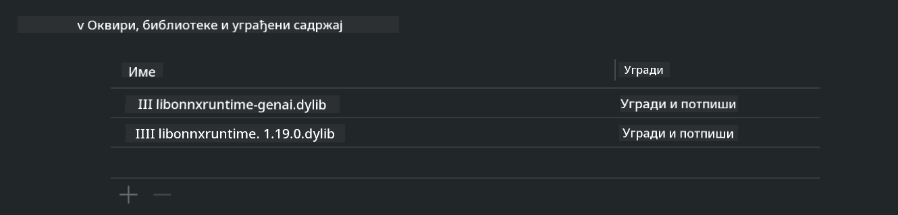
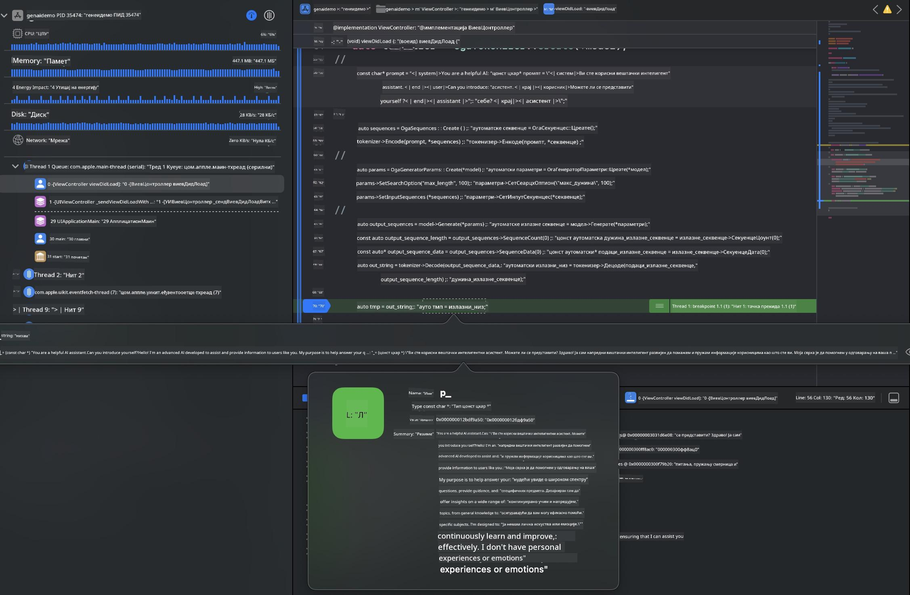

<!--
CO_OP_TRANSLATOR_METADATA:
{
  "original_hash": "82af197df38d25346a98f1f0e84d1698",
  "translation_date": "2025-05-09T11:06:56+00:00",
  "source_file": "md/01.Introduction/03/iOS_Inference.md",
  "language_code": "sr"
}
-->
# **Inferencija Phi-3 na iOS-u**

Phi-3-mini je nova serija modela iz Microsofta koja omogućava implementaciju velikih jezičkih modela (LLM) na edge uređajima i IoT uređajima. Phi-3-mini je dostupan za iOS, Android i Edge Device implementacije, što omogućava generativnoj veštačkoj inteligenciji da se koristi u BYOD okruženjima. Sledeći primer pokazuje kako implementirati Phi-3-mini na iOS-u.

## **1. Priprema**

- **a.** macOS 14+
- **b.** Xcode 15+
- **c.** iOS SDK 17.x (iPhone 14 A16 ili noviji)
- **d.** Instalirajte Python 3.10+ (preporučuje se Conda)
- **e.** Instalirajte Python biblioteku: `python-flatbuffers`
- **f.** Instalirajte CMake

### Semantic Kernel i inferencija

Semantic Kernel je aplikacioni okvir koji vam omogućava da kreirate aplikacije kompatibilne sa Azure OpenAI servisom, OpenAI modelima, pa čak i lokalnim modelima. Pristup lokalnim servisima preko Semantic Kernel-a olakšava integraciju sa vašim samostalno hostovanim Phi-3-mini serverskim modelom.

### Pozivanje kvantizovanih modela preko Ollama ili LlamaEdge

Mnogi korisnici preferiraju korišćenje kvantizovanih modela za lokalno pokretanje modela. [Ollama](https://ollama.com) i [LlamaEdge](https://llamaedge.com) omogućavaju korisnicima da pozivaju različite kvantizovane modele:

#### **Ollama**

Možete direktno pokrenuti `ollama run phi3` ili ga podesiti offline. Napravite Modelfile sa putanjom do vašeg `gguf` fajla. Primer koda za pokretanje Phi-3-mini kvantizovanog modela:

```gguf
FROM {Add your gguf file path}
TEMPLATE \"\"\"<|user|> .Prompt<|end|> <|assistant|>\"\"\"
PARAMETER stop <|end|>
PARAMETER num_ctx 4096
```

#### **LlamaEdge**

Ako želite da koristite `gguf` istovremeno na cloud i edge uređajima, LlamaEdge je odlična opcija.

## **2. Kompajliranje ONNX Runtime za iOS**

```bash

git clone https://github.com/microsoft/onnxruntime.git

cd onnxruntime

./build.sh --build_shared_lib --ios --skip_tests --parallel --build_dir ./build_ios --ios --apple_sysroot iphoneos --osx_arch arm64 --apple_deploy_target 17.5 --cmake_generator Xcode --config Release

cd ../

```

### **Napomena**

- **a.** Pre kompajliranja, proverite da je Xcode pravilno podešen i postavite ga kao aktivni developerski direktorijum u terminalu:

    ```bash
    sudo xcode-select -switch /Applications/Xcode.app/Contents/Developer
    ```

- **b.** ONNX Runtime treba kompajlirati za različite platforme. Za iOS možete kompajlirati za `arm64` or `x86_64`.

- **c.** Preporučuje se korišćenje najnovijeg iOS SDK-a za kompajliranje. Ipak, možete koristiti i stariju verziju ako vam je potrebna kompatibilnost sa prethodnim SDK-ovima.

## **3. Kompajliranje Generative AI sa ONNX Runtime za iOS**

> **Note:** Pošto je Generative AI sa ONNX Runtime u preview fazi, imajte na umu moguće promene.

```bash

git clone https://github.com/microsoft/onnxruntime-genai
 
cd onnxruntime-genai
 
mkdir ort
 
cd ort
 
mkdir include
 
mkdir lib
 
cd ../
 
cp ../onnxruntime/include/onnxruntime/core/session/onnxruntime_c_api.h ort/include
 
cp ../onnxruntime/build_ios/Release/Release-iphoneos/libonnxruntime*.dylib* ort/lib
 
export OPENCV_SKIP_XCODEBUILD_FORCE_TRYCOMPILE_DEBUG=1
 
python3 build.py --parallel --build_dir ./build_ios --ios --ios_sysroot iphoneos --ios_arch arm64 --ios_deployment_target 17.5 --cmake_generator Xcode --cmake_extra_defines CMAKE_XCODE_ATTRIBUTE_CODE_SIGNING_ALLOWED=NO

```

## **4. Kreiranje App aplikacije u Xcode-u**

Izabrao sam Objective-C kao metodu razvoja aplikacije, jer je korišćenje Generative AI sa ONNX Runtime C++ API-jem bolje kompatibilno sa Objective-C. Naravno, povezivanje sa Swift-om je takođe moguće.



## **5. Kopiranje ONNX kvantizovanog INT4 modela u App projekat**

Potrebno je da uvezemo INT4 kvantizovani model u ONNX formatu, koji prvo treba da preuzmete.



Nakon preuzimanja, dodajte model u Resources direktorijum projekta u Xcode-u.



## **6. Dodavanje C++ API-ja u ViewControllers**

> **Napomena:**

- **a.** Dodajte odgovarajuće C++ zaglavlje fajlove u projekat.

  

- **b.** Uključite `onnxruntime-genai` dynamic library in Xcode.

  

- **c.** Use the C Samples code for testing. You can also add additional features like ChatUI for more functionality.

- **d.** Since you need to use C++ in your project, rename `ViewController.m` to `ViewController.mm` da omogućite Objective-C++ podršku.

```objc

    NSString *llmPath = [[NSBundle mainBundle] resourcePath];
    char const *modelPath = llmPath.cString;

    auto model =  OgaModel::Create(modelPath);

    auto tokenizer = OgaTokenizer::Create(*model);

    const char* prompt = "<|system|>You are a helpful AI assistant.<|end|><|user|>Can you introduce yourself?<|end|><|assistant|>";

    auto sequences = OgaSequences::Create();
    tokenizer->Encode(prompt, *sequences);

    auto params = OgaGeneratorParams::Create(*model);
    params->SetSearchOption("max_length", 100);
    params->SetInputSequences(*sequences);

    auto output_sequences = model->Generate(*params);
    const auto output_sequence_length = output_sequences->SequenceCount(0);
    const auto* output_sequence_data = output_sequences->SequenceData(0);
    auto out_string = tokenizer->Decode(output_sequence_data, output_sequence_length);
    
    auto tmp = out_string;

```

## **7. Pokretanje aplikacije**

Kada završite sa podešavanjem, možete pokrenuti aplikaciju i videti rezultate inferencije Phi-3-mini modela.



Za više primera koda i detaljna uputstva, posetite [Phi-3 Mini Samples repository](https://github.com/Azure-Samples/Phi-3MiniSamples/tree/main/ios).

**Ограничење одговорности**:  
Овај документ је преведен коришћењем AI услуге за превођење [Co-op Translator](https://github.com/Azure/co-op-translator). Иако се трудимо да превод буде тачан, имајте у виду да аутоматски преводи могу садржати грешке или нетачности. Оригинални документ на његовом изворном језику треба сматрати ауторитетним извором. За критичне информације препоручује се професионални превод од стране људског преводиоца. Нисмо одговорни за било какве неспоразуме или погрешна тумачења која могу настати коришћењем овог превода.