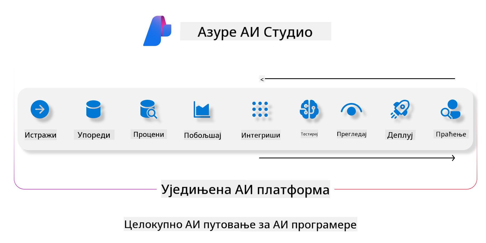
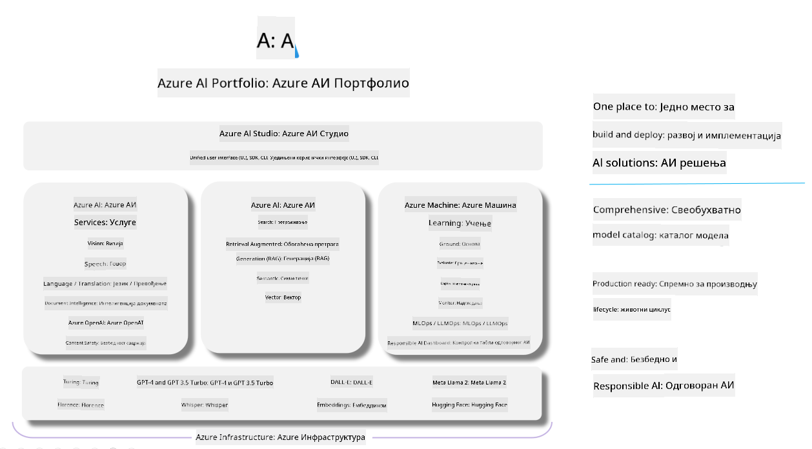

<!--
CO_OP_TRANSLATOR_METADATA:
{
  "original_hash": "7b4235159486df4000e16b7b46ddfec3",
  "translation_date": "2025-05-09T15:04:35+00:00",
  "source_file": "md/01.Introduction/05/AIFoundry.md",
  "language_code": "sr"
}
-->
# **Korišćenje Azure AI Foundry za evaluaciju**

Kako oceniti vašu generativnu AI aplikaciju koristeći [Azure AI Foundry](https://ai.azure.com?WT.mc_id=aiml-138114-kinfeylo). Bilo da procenjujete jednosmerne ili višesmerne razgovore, Azure AI Foundry pruža alate za procenu performansi modela i bezbednosti.

## Kako oceniti generativne AI aplikacije uz Azure AI Foundry
Za detaljnija uputstva pogledajte [Azure AI Foundry dokumentaciju](https://learn.microsoft.com/azure/ai-studio/how-to/evaluate-generative-ai-app?WT.mc_id=aiml-138114-kinfeylo)

Evo koraka za početak:

## Evaluacija generativnih AI modela u Azure AI Foundry

**Preduslovi**

- Test skup podataka u CSV ili JSON formatu.
- Postavljen generativni AI model (kao što su Phi-3, GPT 3.5, GPT 4 ili Davinci modeli).
- Runtime okruženje sa računarskim instancom za izvođenje evaluacije.

## Ugrađene metrike evaluacije

Azure AI Foundry omogućava evaluaciju kako jednosmernih, tako i složenih višesmernih razgovora.
Za Retrieval Augmented Generation (RAG) scenarije, gde je model zasnovan na specifičnim podacima, možete oceniti performanse koristeći ugrađene metrike evaluacije.
Takođe, moguće je evaluirati opšte scenarije odgovaranja na pitanja u jednosmernim interakcijama (ne-RAG).

## Kreiranje evaluacijske sesije

U Azure AI Foundry interfejsu, idite na stranicu Evaluate ili Prompt Flow.
Pratite vodič za kreiranje evaluacije da podesite evaluacionu sesiju. Možete uneti i opcioni naziv za vašu evaluaciju.
Izaberite scenario koji odgovara ciljevima vaše aplikacije.
Odaberite jednu ili više metrika za procenu izlaza modela.

## Prilagođeni evaluacioni tok (opciono)

Za veću fleksibilnost, možete kreirati prilagođeni evaluacioni tok. Prilagodite proces evaluacije prema vašim specifičnim potrebama.

## Pregled rezultata

Nakon izvršene evaluacije, evidentirajte, pregledajte i analizirajte detaljne metrike u Azure AI Foundry. Steknite uvid u mogućnosti i ograničenja vaše aplikacije.

**Note** Azure AI Foundry je trenutno u javnoj preview fazi, pa ga koristite za eksperimente i razvoj. Za produkcione zadatke, razmotrite druge opcije. Za više detalja i korak-po-korak uputstva, posetite zvaničnu [AI Foundry dokumentaciju](https://learn.microsoft.com/azure/ai-studio/?WT.mc_id=aiml-138114-kinfeylo).

**Одрицање од одговорности**:  
Овај документ је преведен коришћењем AI преводилачке услуге [Co-op Translator](https://github.com/Azure/co-op-translator). Иако се трудимо да превод буде тачан, молимо вас да имате у виду да аутоматски преводи могу садржати грешке или нетачности. Оригинални документ на његовом изворном језику треба сматрати ауторитетним извором. За критичне информације препоручује се професионални људски превод. Нисмо одговорни за било каква неспоразума или погрешне тумачења која произилазе из коришћења овог превода.