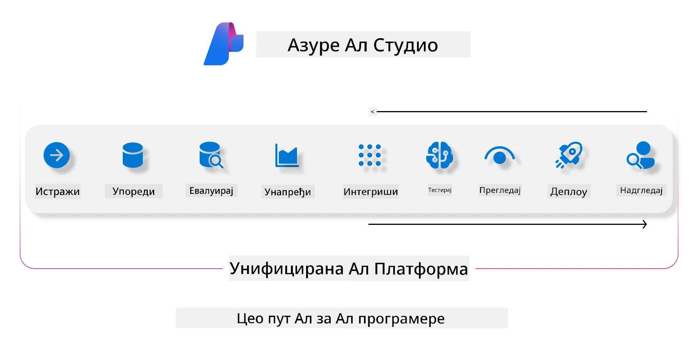
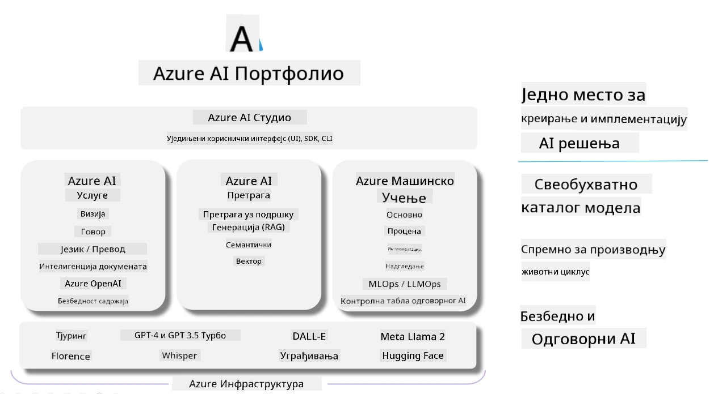

# **Коришћење Microsoft Foundry за евалуацију**

Како да процените своју генеративну AI апликацију користећи [Microsoft Foundry](https://ai.azure.com?WT.mc_id=aiml-138114-kinfeylo). Без обзира да ли процењујете једнократне или вишекратне разговоре, Microsoft Foundry пружа алате за евалуацију перформанси и безбедности модела.

## Како проценити генеративне AI апликације уз Microsoft Foundry
За детаљнија упутства погледајте [Microsoft Foundry документацију](https://learn.microsoft.com/azure/ai-studio/how-to/evaluate-generative-ai-app?WT.mc_id=aiml-138114-kinfeylo)

Ево корака за почетак:

## Процена генеративних AI модела у Microsoft Foundry

**Претпоставке**

- Тест скуп података у CSV или JSON формату.
- Распоређен генеративни AI модел (као што су Phi-3, GPT 3.5, GPT 4 или Davinci модели).
- Рантиме са рачунарским инстанцом за извођење евалуације.

## Уграђене метрике евалуације

Microsoft Foundry вам омогућава да процењујете како једнократне, тако и сложене вишекратне разговоре.  
За сценарије Retrieval Augmented Generation (RAG), где је модел заснован на специфичним подацима, можете проценити перформансе користећи уграђене метрике евалуације.  
Поред тога, можете проценити и опште сценарије једнократног одговарања на питања (не-RAG).

## Креирање евалуационог покретања

У Microsoft Foundry корисничком интерфејсу идите на страницу Evaluate или Prompt Flow.  
Пратите чаробњака за креирање евалуације да бисте подесили евалуационо покретање. Можете дати и опционални назив вашој евалуацији.  
Изаберите сценарио који одговара циљевима ваше апликације.  
Одаберите једну или више метрика евалуације за процену излаза модела.

## Прилагођени ток евалуације (опционо)

За већу флексибилност, можете поставити прилагођени ток евалуације. Прилагодите процес евалуације према својим специфичним потребама.

## Преглед резултата

Након извођења евалуације, пријавите се, прегледајте и анализирајте детаљне метрике евалуације у Microsoft Foundry. Стекните увид у могућности и ограничења ваше апликације.

**Note** Microsoft Foundry је тренутно у јавном прегледу, па га користите за експерименте и развој. За продукционе задатке размислите о другим опцијама. Погледајте званичну [AI Foundry документацију](https://learn.microsoft.com/azure/ai-studio/?WT.mc_id=aiml-138114-kinfeylo) за више детаља и корак-по-корак упутства.

**Одрицање од одговорности**:  
Овај документ је преведен коришћењем AI сервиса за превођење [Co-op Translator](https://github.com/Azure/co-op-translator). Иако се трудимо да превод буде тачан, молимо вас да имате у виду да аутоматски преводи могу садржати грешке или нетачности. Оригинални документ на његовом изворном језику треба сматрати ауторитетним извором. За критичне информације препоручује се професионални људски превод. Нисмо одговорни за било каква неспоразума или погрешна тумачења настала коришћењем овог превода.