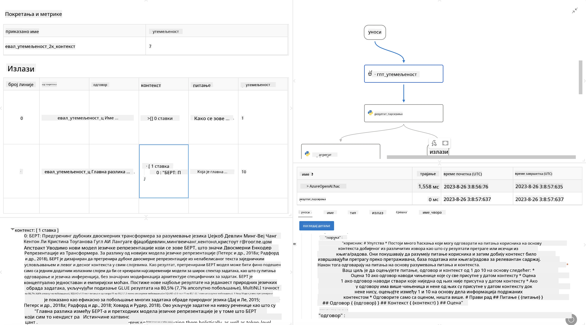

<!--
CO_OP_TRANSLATOR_METADATA:
{
  "original_hash": "3cbe7629d254f1043193b7fe22524d55",
  "translation_date": "2025-07-16T22:45:04+00:00",
  "source_file": "md/01.Introduction/05/Promptflow.md",
  "language_code": "sr"
}
-->
# **Упознавање са Promptflow-ом**

[Microsoft Prompt Flow](https://microsoft.github.io/promptflow/index.html?WT.mc_id=aiml-138114-kinfeylo) је визуелни алат за аутоматизацију радних токова који омогућава корисницима да креирају аутоматизоване процесе користећи унапред направљене шаблоне и прилагођене конекторе. Дизајниран је да омогући програмерима и пословним аналитичарима брзо креирање аутоматизованих процеса за задатке као што су управљање подацима, сарадња и оптимизација процеса. Уз Prompt Flow, корисници могу лако повезивати различите сервисе, апликације и системе и аутоматизовати сложене пословне процесе.

Microsoft Prompt Flow је осмишљен да поједностави цео развојни циклус AI апликација које користе Large Language Models (LLMs). Без обзира да ли осмишљавате идеје, правите прототипове, тестирате, процењујете или имплементирате апликације засноване на LLM-овима, Prompt Flow поједностављује процес и омогућава вам да изградите LLM апликације производног квалитета.

## Кључне карактеристике и предности коришћења Microsoft Prompt Flow-а:

**Интерактивно искуство креирања**

Prompt Flow пружа визуелан приказ структуре вашег тока, што олакшава разумевање и навигацију кроз пројекте.  
Нуди искуство слично бележници за ефикасан развој и отклањање грешака у току.

**Варијанте и подешавање упита**

Креирајте и упоредите више варијанти упита како бисте олакшали итеративни процес усавршавања. Процените перформансе различитих упита и изаберите најефикасније.

**Уграђени токови за процену**

Процените квалитет и ефикасност ваших упита и токова користећи уграђене алате за процену.  
Разумите колико добро ваше апликације засноване на LLM-овима раде.

**Обимни ресурси**

Prompt Flow укључује библиотеку уграђених алата, примера и шаблона. Ови ресурси служе као полазна тачка за развој, подстичу креативност и убрзавају процес.

**Сарадња и спремност за предузећа**

Подржава тимски рад омогућавајући више корисника да заједно раде на пројектима инжењеринга упита.  
Одржава контролу верзија и ефикасно дели знање. Поједностављује цео процес инжењеринга упита, од развоја и процене до имплементације и праћења.

## Процена у Prompt Flow-у

У Microsoft Prompt Flow-у, процена игра кључну улогу у оцењивању перформанси ваших AI модела. Погледајмо како можете прилагодити токове процене и метрике у Prompt Flow-у:

**Разумевање процене у Prompt Flow-у**

У Prompt Flow-у, ток представља низ чворова који обрађују улаз и генеришу излаз. Токови процене су посебне врсте токова дизајниране да оцењују перформансе извршења на основу одређених критеријума и циљева.

**Кључне карактеристике токова процене**

Обично се извршавају након тока који се тестира, користећи његове излазе. Израчунавају резултате или метрике за мерење перформанси тока који се тестира. Метрике могу укључивати тачност, оцене релевантности или друге релевантне мере.

### Прилагођавање токова процене

**Дефинисање улаза**

Токови процене морају примати излазе тока који се тестира. Дефинишите улазе слично као код стандардних токова.  
На пример, ако процењујете QnA ток, улаз назовите "answer". Ако процењујете ток класификације, улаз назовите "category". Могу бити потребни и улази са стварним вредностима (нпр. стварне ознаке).

**Излази и метрике**

Токови процене производе резултате који мере перформансе тока који се тестира. Метрике се могу израчунати помоћу Python-а или LLM-а. Користите функцију log_metric() за евидентирање релевантних метрика.

**Коришћење прилагођених токова процене**

Развијте свој ток процене прилагођен вашим специфичним задацима и циљевима. Прилагодите метрике у складу са својим циљевима процене.  
Примените овај прилагођени ток процене на серијске извршења за тестирање у великом обиму.

## Уграђене методе процене

Prompt Flow такође пружа уграђене методе процене.  
Можете покренути серијска извршења и користити ове методе да процените колико добро ваш ток ради са великим скупом података.  
Погледајте резултате процене, упоредите метрике и по потреби поновите поступак.  
Имајте на уму да је процена неопходна за осигурање да ваши AI модели испуњавају жељене критеријуме и циљеве. Погледајте званичну документацију за детаљна упутства о развоју и коришћењу токова процене у Microsoft Prompt Flow-у.

Укратко, Microsoft Prompt Flow омогућава програмерима да креирају квалитетне LLM апликације поједностављујући инжењеринг упита и пружајући робусно развојно окружење. Ако радите са LLM-овима, Prompt Flow је вредан алат за истраживање. Погледајте [Prompt Flow Evaluation Documents](https://learn.microsoft.com/azure/machine-learning/prompt-flow/how-to-develop-an-evaluation-flow?view=azureml-api-2?WT.mc_id=aiml-138114-kinfeylo) за детаљна упутства о развоју и коришћењу токова процене у Microsoft Prompt Flow-у.

**Одрицање од одговорности**:  
Овај документ је преведен коришћењем AI услуге за превођење [Co-op Translator](https://github.com/Azure/co-op-translator). Иако тежимо прецизности, молимо вас да имате у виду да аутоматски преводи могу садржати грешке или нетачности. Оригинални документ на његовом изворном језику треба сматрати ауторитетним извором. За критичне информације препоручује се професионални људски превод. Нисмо одговорни за било каква неспоразума или погрешна тумачења која произилазе из коришћења овог превода.