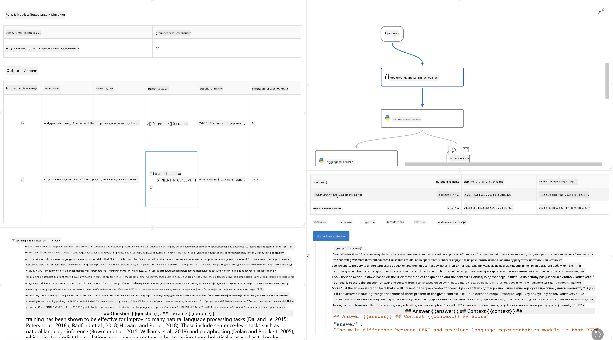

<!--
CO_OP_TRANSLATOR_METADATA:
{
  "original_hash": "3cbe7629d254f1043193b7fe22524d55",
  "translation_date": "2025-05-09T15:23:06+00:00",
  "source_file": "md/01.Introduction/05/Promptflow.md",
  "language_code": "sr"
}
-->
# **Uvod u Promptflow**

[Microsoft Prompt Flow](https://microsoft.github.io/promptflow/index.html?WT.mc_id=aiml-138114-kinfeylo) je vizuelni alat za automatizaciju tokova rada koji omogućava korisnicima da kreiraju automatizovane tokove koristeći unapred pripremljene šablone i prilagođene konektore. Dizajniran je da omogući programerima i poslovnim analitičarima brzo pravljenje automatizovanih procesa za zadatke kao što su upravljanje podacima, saradnja i optimizacija procesa. Sa Prompt Flow, korisnici lako povezuju različite servise, aplikacije i sisteme i automatizuju složene poslovne procese.

Microsoft Prompt Flow je napravljen da pojednostavi ceo razvojni ciklus AI aplikacija zasnovanih na velikim jezičkim modelima (LLMs). Bilo da smišljate ideje, pravite prototipe, testirate, ocenjujete ili implementirate aplikacije zasnovane na LLM-ovima, Prompt Flow olakšava ceo proces i omogućava vam da napravite LLM aplikacije profesionalnog kvaliteta.

## Ključne funkcije i prednosti korišćenja Microsoft Prompt Flow:

**Interaktivno kreiranje**

Prompt Flow pruža vizuelni prikaz strukture vašeg toka, što olakšava razumevanje i navigaciju kroz projekte.  
Nudi iskustvo kodiranja slično notebuku za efikasan razvoj i otklanjanje grešaka u toku.

**Varijante i podešavanje promptova**

Kreirajte i uporedite više varijanti promptova kako biste olakšali iterativni proces usavršavanja. Procijenite performanse različitih promptova i izaberite one najučinkovitije.

**Ugrađeni evaluacioni tokovi**  
Procijenite kvalitet i efikasnost vaših promptova i tokova koristeći ugrađene evaluacione alate.  
Razumite koliko dobro vaše LLM aplikacije funkcionišu.

**Sveobuhvatni resursi**

Prompt Flow uključuje biblioteku ugrađenih alata, primera i šablona. Ovi resursi služe kao polazna tačka za razvoj, podstiču kreativnost i ubrzavaju proces.

**Saradnja i spremnost za preduzeća**

Podržava timsku saradnju omogućavajući više korisnika da rade zajedno na projektima prompt inženjeringa.  
Održava kontrolu verzija i efikasno deli znanje. Pojednostavljuje ceo proces prompt inženjeringa, od razvoja i evaluacije do implementacije i nadzora.

## Evaluacija u Prompt Flow

U Microsoft Prompt Flow-u, evaluacija ima ključnu ulogu u proceni performansi vaših AI modela. Pogledajmo kako možete prilagoditi evaluacione tokove i metrike unutar Prompt Flow-a:

**Razumevanje evaluacije u Prompt Flow-u**

U Prompt Flow-u, tok predstavlja niz čvorova koji obrađuju ulaz i generišu izlaz. Evaluacioni tokovi su posebne vrste tokova dizajnirane da procene performanse izvršavanja na osnovu određenih kriterijuma i ciljeva.

**Ključne karakteristike evaluacionih tokova**

Obično se pokreću nakon toka koji se testira, koristeći njegove izlaze.  
Izračunavaju skorove ili metrike koje mere performanse testiranog toka. Metrike mogu uključivati tačnost, relevantnost ili druge odgovarajuće mere.

### Prilagođavanje evaluacionih tokova

**Definisanje ulaza**

Evaluacioni tokovi moraju da primaju izlaze toka koji se testira. Definišite ulaze slično kao kod standardnih tokova.  
Na primer, ako ocenjujete QnA tok, nazovite ulaz "answer". Ako ocenjujete tok klasifikacije, nazovite ulaz "category". Mogu biti potrebni i ulazi sa stvarnim vrednostima (npr. stvarne oznake).

**Izlazi i metrike**

Evaluacioni tokovi proizvode rezultate koji mere performanse testiranog toka. Metrike se mogu računati koristeći Python ili LLM. Koristite funkciju log_metric() za beleženje relevantnih metrika.

**Korišćenje prilagođenih evaluacionih tokova**

Razvijte sopstveni evaluacioni tok prilagođen vašim specifičnim zadacima i ciljevima. Prilagodite metrike na osnovu ciljeva evaluacije.  
Primijenite ovaj prilagođeni evaluacioni tok na serijske pokrete za testiranje u velikom obimu.

## Ugrađene metode evaluacije

Prompt Flow takođe nudi ugrađene metode evaluacije.  
Možete pokretati serijske testove i koristiti ove metode da procenite koliko dobro vaš tok funkcioniše sa velikim skupovima podataka.  
Pogledajte rezultate evaluacije, uporedite metrike i iterirajte po potrebi.  
Zapamtite, evaluacija je ključna za osiguravanje da vaši AI modeli ispunjavaju željene kriterijume i ciljeve. Pogledajte zvaničnu dokumentaciju za detaljna uputstva o razvoju i korišćenju evaluacionih tokova u Microsoft Prompt Flow-u.

Ukratko, Microsoft Prompt Flow omogućava programerima da kreiraju visokokvalitetne LLM aplikacije pojednostavljujući prompt inženjering i pružajući snažno razvojno okruženje. Ako radite sa LLM-ovima, Prompt Flow je vredan alat za istraživanje. Pogledajte [Prompt Flow Evaluation Documents](https://learn.microsoft.com/azure/machine-learning/prompt-flow/how-to-develop-an-evaluation-flow?view=azureml-api-2?WT.mc_id=aiml-138114-kinfeylo) za detaljna uputstva o razvoju i korišćenju evaluacionih tokova u Microsoft Prompt Flow-u.

**Одрицање од одговорности**:  
Овај документ је преведен коришћењем AI преводилачке услуге [Co-op Translator](https://github.com/Azure/co-op-translator). Иако настојимо да превод буде тачан, имајте у виду да аутоматизовани преводи могу садржати грешке или нетачности. Изворни документ на његовом изворном језику треба сматрати ауторитетним извором. За критичне информације препоручује се професионални превод од стране људског преводиоца. Нисмо одговорни за било каква неспоразума или погрешна тумачења која произилазе из коришћења овог превода.