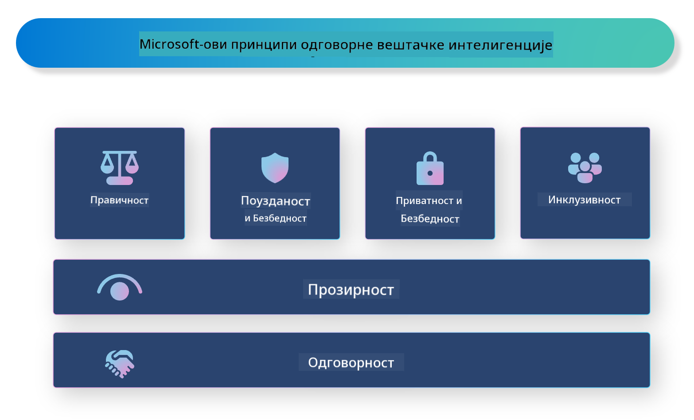

<!--
CO_OP_TRANSLATOR_METADATA:
{
  "original_hash": "805b96b20152936d8f4c587d90d6e06e",
  "translation_date": "2025-05-09T15:48:55+00:00",
  "source_file": "md/01.Introduction/05/ResponsibleAI.md",
  "language_code": "sr"
}
-->
# **Uvod u Odgovorni AI**

[Microsoft Responsible AI](https://www.microsoft.com/ai/responsible-ai?WT.mc_id=aiml-138114-kinfeylo) je inicijativa koja ima za cilj da pomogne programerima i organizacijama u izgradnji AI sistema koji su transparentni, pouzdani i odgovorni. Ova inicijativa pruža smernice i resurse za razvoj odgovornih AI rešenja koja su u skladu sa etičkim principima kao što su privatnost, pravičnost i transparentnost. Takođe ćemo istražiti neke od izazova i najboljih praksi vezanih za izgradnju odgovornih AI sistema.

## Pregled Microsoft Responsible AI

**Etički principi**

Microsoft Responsible AI se rukovodi skupom etičkih principa, kao što su privatnost, pravičnost, transparentnost, odgovornost i bezbednost. Ovi principi su osmišljeni da osiguraju da se AI sistemi razvijaju na etički i odgovoran način.

**Transparentni AI**

Microsoft Responsible AI naglašava važnost transparentnosti u AI sistemima. To uključuje pružanje jasnih objašnjenja kako AI modeli funkcionišu, kao i osiguravanje da izvori podataka i algoritmi budu javno dostupni.

**Odgovorni AI**

[Microsoft Responsible AI](https://www.microsoft.com/ai/responsible-ai?WT.mc_id=aiml-138114-kinfeylo) promoviše razvoj odgovornih AI sistema, koji mogu pružiti uvid u to kako AI modeli donose odluke. Ovo može pomoći korisnicima da razumeju i veruju rezultatima AI sistema.

**Uključivost**

AI sistemi treba da budu dizajnirani tako da koriste svima. Microsoft ima za cilj da stvori inkluzivan AI koji uzima u obzir različite perspektive i izbegava pristrasnost ili diskriminaciju.

**Pouzdanost i bezbednost**

Osiguranje da AI sistemi budu pouzdani i bezbedni je od ključnog značaja. Microsoft se fokusira na izgradnju robusnih modela koji dosledno rade i izbegavaju štetne ishode.

**Pravičnost u AI**

Microsoft Responsible AI prepoznaje da AI sistemi mogu da perpetuiraju pristrasnosti ako su trenirani na pristrasnim podacima ili algoritmima. Inicijativa pruža smernice za razvoj pravdičnih AI sistema koji ne diskriminišu na osnovu faktora kao što su rasa, pol ili godine.

**Privatnost i bezbednost**

Microsoft Responsible AI naglašava važnost zaštite privatnosti korisnika i bezbednosti podataka u AI sistemima. Ovo uključuje primenu snažne enkripcije podataka i kontrolu pristupa, kao i redovne revizije AI sistema radi otkrivanja ranjivosti.

**Odgovornost i odgovornost**

Microsoft Responsible AI promoviše odgovornost i odgovornost u razvoju i primeni AI. To podrazumeva da programeri i organizacije budu svesni potencijalnih rizika povezanih sa AI sistemima i preduzimaju korake za njihovo ublažavanje.

## Najbolje prakse za izgradnju odgovornih AI sistema

**Razvijajte AI modele koristeći raznovrsne skupove podataka**

Da biste izbegli pristrasnost u AI sistemima, važno je koristiti raznovrsne skupove podataka koji predstavljaju različite perspektive i iskustva.

**Koristite tehnike objašnjivog AI**

Tehnike objašnjivog AI mogu pomoći korisnicima da razumeju kako AI modeli donose odluke, što može povećati poverenje u sistem.

**Redovno proveravajte AI sisteme na ranjivosti**

Redovne revizije AI sistema mogu pomoći u identifikaciji potencijalnih rizika i ranjivosti koje je potrebno rešiti.

**Implementirajte snažnu enkripciju podataka i kontrole pristupa**

Enkripcija podataka i kontrole pristupa mogu pomoći u zaštiti privatnosti i bezbednosti korisnika u AI sistemima.

**Pridržavajte se etičkih principa u razvoju AI**

Pridržavanje etičkih principa, kao što su pravičnost, transparentnost i odgovornost, može pomoći u izgradnji poverenja u AI sisteme i osigurati da se razvijaju na odgovoran način.

## Korišćenje AI Foundry za Odgovorni AI

[Azure AI Foundry](https://ai.azure.com?WT.mc_id=aiml-138114-kinfeylo) je moćna platforma koja omogućava programerima i organizacijama da brzo kreiraju inteligentne, najsavremenije, tržišno spremne i odgovorne aplikacije. Evo nekoliko ključnih karakteristika i mogućnosti Azure AI Foundry:

**API-jevi i modeli spremni za upotrebu**

Azure AI Foundry pruža unapred izgrađene i prilagodljive API-jeve i modele. Oni pokrivaju širok spektar AI zadataka, uključujući generativni AI, obradu prirodnog jezika za razgovore, pretragu, nadzor, prevod, govor, viziju i donošenje odluka.

**Prompt Flow**

Prompt flow u Azure AI Foundry omogućava kreiranje konverzacionih AI iskustava. Omogućava dizajn i upravljanje konverzacionim tokovima, što olakšava izradu chatbotova, virtuelnih asistenata i drugih interaktivnih aplikacija.

**Retrieval Augmented Generation (RAG)**

RAG je tehnika koja kombinuje pristupe zasnovane na pretraživanju i generisanju. Poboljšava kvalitet generisanih odgovora korišćenjem i prethodno postojećeg znanja (pretraživanje) i kreativnog generisanja (generisanje).

**Metrike za evaluaciju i nadzor generativnog AI**

Azure AI Foundry pruža alate za evaluaciju i nadzor generativnih AI modela. Možete proceniti njihovu performansu, pravičnost i druge važne metrike kako biste osigurali odgovornu primenu. Takođe, ako ste kreirali kontrolnu tablu, možete koristiti no-code UI u Azure Machine Learning Studio za prilagođavanje i generisanje Responsible AI Dashboard-a i pripadajuće kartice ocena zasnovane na [Responsible AI Toolbox](https://responsibleaitoolbox.ai/?WT.mc_id=aiml-138114-kinfeylo) Python bibliotekama. Ova kartica ocena pomaže u deljenju ključnih uvida vezanih za pravičnost, važnost karakteristika i druge aspekte odgovorne primene sa tehničkim i netehničkim zainteresovanim stranama.

Da biste koristili AI Foundry sa odgovornim AI, možete slediti ove najbolje prakse:

**Definišite problem i ciljeve vašeg AI sistema**

Pre nego što započnete razvoj, važno je jasno definisati problem ili cilj koji vaš AI sistem treba da reši. Ovo će vam pomoći da identifikujete podatke, algoritme i resurse potrebne za izgradnju efikasnog modela.

**Prikupite i prethodno obradite relevantne podatke**

Kvalitet i količina podataka korišćenih za treniranje AI sistema može značajno uticati na njegovu performansu. Zato je važno prikupiti relevantne podatke, očistiti ih, prethodno obraditi i osigurati da predstavljaju populaciju ili problem koji pokušavate da rešite.

**Izaberite odgovarajuću evaluaciju**

Postoji više dostupnih evaluacionih algoritama. Važno je izabrati najprikladniji algoritam na osnovu vaših podataka i problema.

**Evaluirajte i interpretirajte model**

Kada izgradite AI model, važno je proceniti njegovu performansu koristeći odgovarajuće metrike i interpretirati rezultate na transparentan način. Ovo će vam pomoći da identifikujete eventualne pristrasnosti ili ograničenja modela i izvršite potrebna poboljšanja.

**Osigurajte transparentnost i objašnjivost**

AI sistemi treba da budu transparentni i objašnjivi kako bi korisnici mogli da razumeju kako funkcionišu i kako se donose odluke. Ovo je posebno važno za aplikacije koje imaju značajan uticaj na ljudske živote, kao što su zdravstvo, finansije i pravni sistemi.

**Nadzirite i ažurirajte model**

AI sistemi treba da budu kontinuirano nadzirani i ažurirani kako bi ostali tačni i efikasni tokom vremena. Ovo zahteva stalno održavanje, testiranje i ponovno treniranje modela.

Zaključno, Microsoft Responsible AI je inicijativa koja ima za cilj da pomogne programerima i organizacijama u izgradnji AI sistema koji su transparentni, pouzdani i odgovorni. Imajte na umu da je odgovorna primena AI od ključnog značaja, a Azure AI Foundry nastoji da je učini praktičnom za organizacije. Prateći etičke principe i najbolje prakse, možemo osigurati da se AI sistemi razvijaju i primenjuju na odgovoran način koji koristi celom društvu.

**Ограничење одговорности**:  
Овај документ је преведен помоћу АИ сервиса за превођење [Co-op Translator](https://github.com/Azure/co-op-translator). Иако се трудимо да превод буде тачан, имајте у виду да аутоматски преводи могу садржати грешке или нетачности. Оригинални документ на његовом изворном језику треба сматрати ауторитетним извором. За критичне информације препоручује се професионални превод од стране људског преводиоца. Нисмо одговорни за било каква неспоразума или погрешна тумачења настала коришћењем овог превода.