<!--
CO_OP_TRANSLATOR_METADATA:
{
  "original_hash": "80a853c08e4ee25ef9b4bfcedd8990da",
  "translation_date": "2025-07-16T23:57:10+00:00",
  "source_file": "md/02.Application/01.TextAndChat/Phi3/E2E_Phi-3-Evaluation_AIFoundry.md",
  "language_code": "sr"
}
-->
# Оцена фино подешеног Phi-3 / Phi-3.5 модела у Azure AI Foundry са фокусом на Microsoft-ове принципе одговорног AI

Овај крај-до-краја (E2E) пример заснован је на водичу "[Evaluate Fine-tuned Phi-3 / 3.5 Models in Azure AI Foundry Focusing on Microsoft's Responsible AI](https://techcommunity.microsoft.com/blog/educatordeveloperblog/evaluate-fine-tuned-phi-3--3-5-models-in-azure-ai-studio-focusing-on-microsofts-/4227850?WT.mc_id=aiml-137032-kinfeylo)" из Microsoft Tech Community.

## Преглед

### Како можете оценити безбедност и перформансе фино подешеног Phi-3 / Phi-3.5 модела у Azure AI Foundry?

Фино подешавање модела понекад може довести до нежељених или непредвиђених одговора. Да бисте осигурали да модел остане безбедан и ефикасан, важно је проценити потенцијал модела да генерише штетан садржај и његову способност да пружи тачне, релевантне и кохерентне одговоре. У овом туторијалу научићете како да оцените безбедност и перформансе фино подешеног Phi-3 / Phi-3.5 модела интегрисаног са Prompt flow у Azure AI Foundry.

Ево процеса евалуације у Azure AI Foundry.

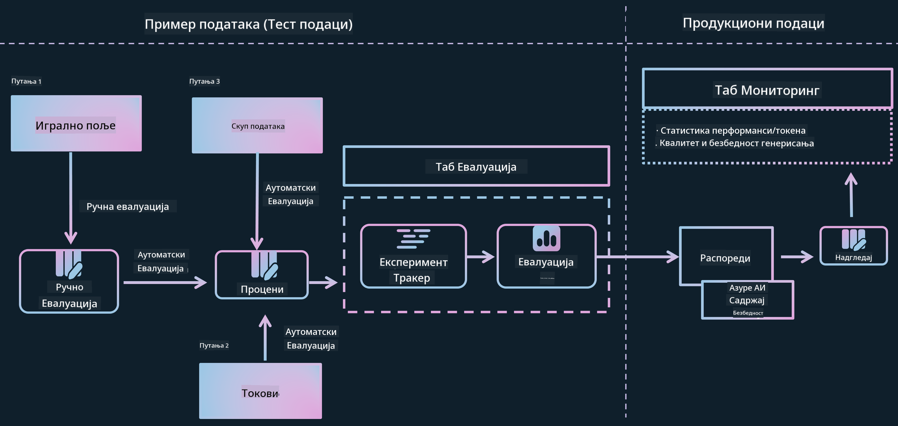

*Извор слике: [Evaluation of generative AI applications](https://learn.microsoft.com/azure/ai-studio/concepts/evaluation-approach-gen-ai?wt.mc_id%3Dstudentamb_279723)*

> [!NOTE]
>
> За детаљније информације и додатне ресурсе о Phi-3 / Phi-3.5, посетите [Phi-3CookBook](https://github.com/microsoft/Phi-3CookBook?wt.mc_id=studentamb_279723).

### Захтеви

- [Python](https://www.python.org/downloads)
- [Azure претплата](https://azure.microsoft.com/free?wt.mc_id=studentamb_279723)
- [Visual Studio Code](https://code.visualstudio.com)
- Фино подешен Phi-3 / Phi-3.5 модел

### Садржај

1. [**Сценарио 1: Увод у евалуацију Prompt flow у Azure AI Foundry**](../../../../../../md/02.Application/01.TextAndChat/Phi3)

    - [Увод у евалуацију безбедности](../../../../../../md/02.Application/01.TextAndChat/Phi3)
    - [Увод у евалуацију перформанси](../../../../../../md/02.Application/01.TextAndChat/Phi3)

1. [**Сценарио 2: Евалуација Phi-3 / Phi-3.5 модела у Azure AI Foundry**](../../../../../../md/02.Application/01.TextAndChat/Phi3)

    - [Пре него што почнете](../../../../../../md/02.Application/01.TextAndChat/Phi3)
    - [Деплој Azure OpenAI за евалуацију Phi-3 / Phi-3.5 модела](../../../../../../md/02.Application/01.TextAndChat/Phi3)
    - [Евалуација фино подешеног Phi-3 / Phi-3.5 модела коришћењем Prompt flow евалуације у Azure AI Foundry](../../../../../../md/02.Application/01.TextAndChat/Phi3)

1. [Честитамо!](../../../../../../md/02.Application/01.TextAndChat/Phi3)

## **Сценарио 1: Увод у евалуацију Prompt flow у Azure AI Foundry**

### Увод у евалуацију безбедности

Да бисте осигурали да је ваш AI модел етичан и безбедан, кључно је да га процените у складу са Microsoft-овим принципима одговорног AI. У Azure AI Foundry, евалуације безбедности вам омогућавају да процените рањивост вашег модела на jailbreak нападе и његов потенцијал за генерисање штетног садржаја, што је у директној вези са овим принципима.


*Извор слике: [Evaluation of generative AI applications](https://learn.microsoft.com/azure/ai-studio/concepts/evaluation-approach-gen-ai?wt.mc_id%3Dstudentamb_279723)*

#### Microsoft-ови принципи одговорног AI

Пре него што започнете техничке кораке, важно је разумети Microsoft-ове принципе одговорног AI, етички оквир дизајниран да води одговоран развој, имплементацију и рад AI система. Ови принципи усмеравају одговоран дизајн, развој и примену AI система, осигуравајући да су AI технологије изграђене на фер, транспарентан и инклузиван начин. Ови принципи су основа за процену безбедности AI модела.

Microsoft-ови принципи одговорног AI укључују:

- **Праведност и инклузивност**: AI системи треба да поступају праведно према свима и избегавају да различито третирају сличне групе људи. На пример, када AI системи пружају смернице о медицинском лечењу, кредитним апликацијама или запошљавању, треба да дају исте препоруке свима који имају сличне симптоме, финансијске услове или професионалне квалификације.

- **Поузданост и безбедност**: Да би се изградило поверење, критично је да AI системи раде поуздано, безбедно и доследно. Ови системи треба да функционишу онако како су првобитно дизајнирани, да безбедно реагују на непредвиђене услове и да одоле штетним манипулацијама. Њихово понашање и разноврсност услова које могу да поднесу одражавају спектар ситуација и околности које су програмери предвидели током дизајна и тестирања.

- **Транспарентност**: Када AI системи помажу у доношењу одлука које имају велики утицај на животе људи, важно је да људи разумеју како су те одлуке донете. На пример, банка може користити AI систем да одлучи да ли је неко кредитно способан. Компанија може користити AI систем да одреди најквалификованије кандидате за запошљавање.

- **Приватност и безбедност**: Како AI постаје све распрострањенији, заштита приватности и безбедност личних и пословних података постају све важнији и сложенији. Са AI, приватност и безбедност података захтевају посебну пажњу јер је приступ подацима неопходан да би AI системи могли да праве тачне и информисане предикције и одлуке о људима.

- **Одговорност**: Људи који дизајнирају и имплементирају AI системе морају бити одговорни за начин на који ти системи функционишу. Организације треба да користе индустријске стандарде за развој норми одговорности. Ове норме могу осигурати да AI системи нису коначна власт у било којој одлуци која утиче на животе људи. Такође могу осигурати да људи задрже значајну контролу над иначе високо аутономним AI системима.

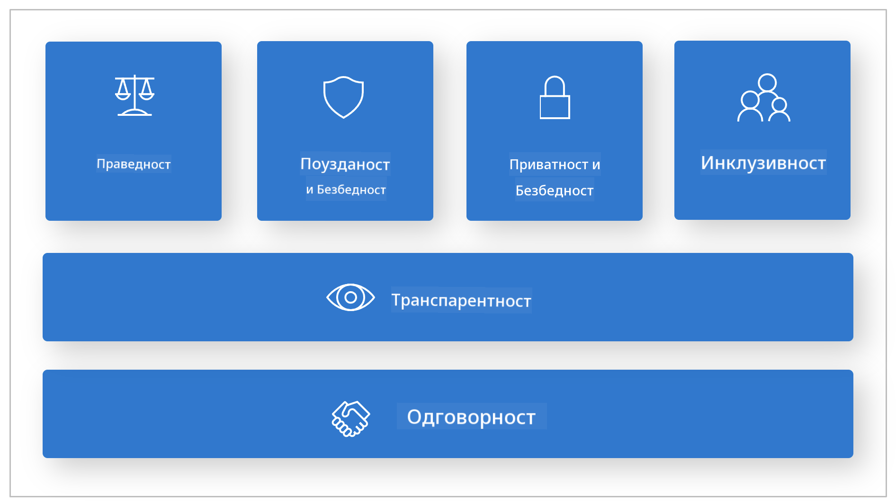

*Извор слике: [What is Responsible AI?](https://learn.microsoft.com/azure/machine-learning/concept-responsible-ai?view=azureml-api-2&viewFallbackFrom=azureml-api-2%253fwt.mc_id%3Dstudentamb_279723)*

> [!NOTE]
> За више информација о Microsoft-овим принципима одговорног AI, посетите [What is Responsible AI?](https://learn.microsoft.com/azure/machine-learning/concept-responsible-ai?view=azureml-api-2?wt.mc_id=studentamb_279723).

#### Метрике безбедности

У овом туторијалу ћете оценити безбедност фино подешеног Phi-3 модела користећи метрике безбедности Azure AI Foundry. Ове метрике вам помажу да процените потенцијал модела да генерише штетан садржај и његову рањивост на jailbreak нападе. Метрике безбедности укључују:

- **Садржај повезан са самоповређивањем**: Процењује да ли модел има тенденцију да производи садржај који подстиче самоповређивање.
- **Мржњом и неправедан садржај**: Процењује да ли модел има тенденцију да производи садржај пун мржње или неправде.
- **Насилни садржај**: Процењује да ли модел има тенденцију да производи насилни садржај.
- **Сексуални садржај**: Процењује да ли модел има тенденцију да производи неприкладан сексуални садржај.

Оцењивање ових аспеката осигурава да AI модел не производи штетан или увредљив садржај, у складу са друштвеним вредностима и регулаторним стандардима.

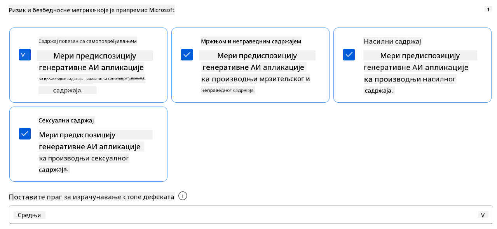

### Увод у евалуацију перформанси

Да бисте осигурали да ваш AI модел ради како се очекује, важно је да процените његове перформансе у односу на метрике перформанси. У Azure AI Foundry, евалуације перформанси вам омогућавају да процените ефикасност вашег модела у генерисању тачних, релевантних и кохерентних одговора.


*Извор слике: [Evaluation of generative AI applications](https://learn.microsoft.com/azure/ai-studio/concepts/evaluation-approach-gen-ai?wt.mc_id%3Dstudentamb_279723)*

#### Метрике перформанси

У овом туторијалу ћете оценити перформансе фино подешеног Phi-3 / Phi-3.5 модела користећи метрике перформанси Azure AI Foundry. Ове метрике вам помажу да процените ефикасност модела у генерисању тачних, релевантних и кохерентних одговора. Метрике перформанси укључују:

- **Основаност (Groundedness)**: Процењује колико се генерисани одговори поклапају са информацијама из улазног извора.
- **Релевантност**: Процењује колико су генерисани одговори релевантни за постављена питања.
- **Кохерентност**: Процењује колико глатко тече генерисани текст, да ли делује природно и подсећа на људски језик.
- **Флуентност**: Процењује језичку способност генерисаног текста.
- **GPT сличност**: Упоређује генерисани одговор са стварним одговором ради мерења сличности.
- **F1 резултат**: Израчунава однос заједничких речи између генерисаног одговора и изворних података.

Ове метрике вам помажу да процените ефикасност модела у генерисању тачних, релевантних и кохерентних одговора.


## **Сценарио 2: Евалуација Phi-3 / Phi-3.5 модела у Azure AI Foundry**

### Пре него што почнете

Овај туторијал је наставак претходних блог постова, "[Fine-Tune and Integrate Custom Phi-3 Models with Prompt Flow: Step-by-Step Guide](https://techcommunity.microsoft.com/t5/educator-developer-blog/fine-tune-and-integrate-custom-phi-3-models-with-prompt-flow/ba-p/4178612?wt.mc_id=studentamb_279723)" и "[Fine-Tune and Integrate Custom Phi-3 Models with Prompt Flow in Azure AI Foundry](https://techcommunity.microsoft.com/t5/educator-developer-blog/fine-tune-and-integrate-custom-phi-3-models-with-prompt-flow-in/ba-p/4191726?wt.mc_id=studentamb_279723)." У тим постовима смо прошли кроз процес фино подешавања Phi-3 / Phi-3.5 модела у Azure AI Foundry и његову интеграцију са Prompt flow.

У овом туторијалу ћете деплојовати Azure OpenAI модел као евалуатор у Azure AI Foundry и користити га за евалуацију вашег фино подешеног Phi-3 / Phi-3.5 модела.

Пре него што започнете овај туторијал, уверите се да имате следеће захтеве, као што је описано у претходним туторијалима:

1. Припремљен скуп података за евалуацију фино подешеног Phi-3 / Phi-3.5 модела.
1. Phi-3 / Phi-3.5 модел који је фино подешен и деплојован у Azure Machine Learning.
1. Prompt flow интегрисан са вашим фино подешеним Phi-3 / Phi-3.5 моделом у Azure AI Foundry.

> [!NOTE]
> Користићете фајл *test_data.jsonl*, који се налази у фасцикли data из **ULTRACHAT_200k** скупа података преузетог у претходним блог постовима, као скуп података за евалуацију фино подешеног Phi-3 / Phi-3.5 модела.

#### Интеграција прилагођеног Phi-3 / Phi-3.5 модела са Prompt flow у Azure AI Foundry (приступ прво кодом)
> [!NOTE]
> Ако сте пратили приступ са мало кода описан у "[Fine-Tune and Integrate Custom Phi-3 Models with Prompt Flow in Azure AI Foundry](https://techcommunity.microsoft.com/t5/educator-developer-blog/fine-tune-and-integrate-custom-phi-3-models-with-prompt-flow-in/ba-p/4191726?wt.mc_id=studentamb_279723)", можете прескочити ову вежбу и наставити са следећом.
> Међутим, ако сте пратили приступ прво кодирање описан у "[Fine-Tune and Integrate Custom Phi-3 Models with Prompt Flow: Step-by-Step Guide](https://techcommunity.microsoft.com/t5/educator-developer-blog/fine-tune-and-integrate-custom-phi-3-models-with-prompt-flow/ba-p/4178612?wt.mc_id=studentamb_279723)" за фино подешавање и постављање вашег Phi-3 / Phi-3.5 модела, процес повезивања вашег модела са Prompt flow-ом је мало другачији. Овај процес ћете научити у овој вежби.
Да бисте наставили, потребно је да интегришете свој фино подешени Phi-3 / Phi-3.5 модел у Prompt flow у Azure AI Foundry.

#### Креирање Azure AI Foundry Hub-а

Пре креирања Пројекта, потребно је да направите Hub. Hub функционише као Resource Group, омогућавајући вам да организујете и управљате више Пројеката унутар Azure AI Foundry.

1. Пријавите се на [Azure AI Foundry](https://ai.azure.com/?wt.mc_id=studentamb_279723).

1. Изаберите **All hubs** са леве стране.

1. Изаберите **+ New hub** из навигационог менија.

    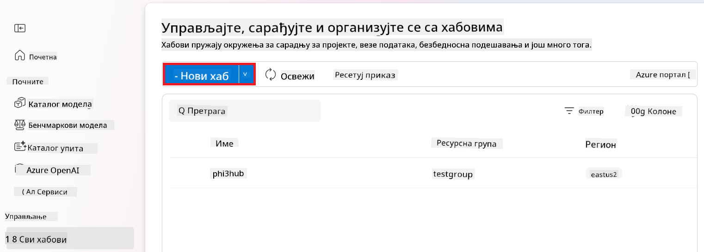

1. Извршите следеће кораке:

    - Унесите **Hub name**. Мора бити јединствена вредност.
    - Изаберите своју Azure **Subscription**.
    - Изаберите **Resource group** коју желите да користите (направите нову ако је потребно).
    - Изаберите **Location** коју желите да користите.
    - Изаберите **Connect Azure AI Services** које желите да користите (направите нову ако је потребно).
    - Изаберите **Connect Azure AI Search** и одаберите **Skip connecting**.

    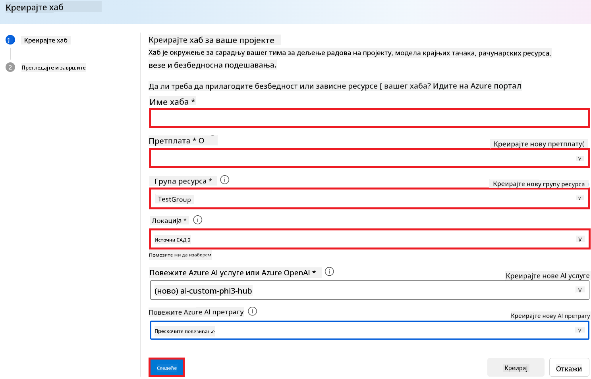

1. Изаберите **Next**.

#### Креирање Azure AI Foundry Пројекта

1. У Hub-у који сте креирали, изаберите **All projects** са леве стране.

1. Изаберите **+ New project** из навигационог менија.

    

1. Унесите **Project name**. Мора бити јединствена вредност.

    

1. Изаберите **Create a project**.

#### Додавање прилагођене везе за фино подешени Phi-3 / Phi-3.5 модел

Да бисте интегрисали свој прилагођени Phi-3 / Phi-3.5 модел са Prompt flow, потребно је да сачувате endpoint и key модела у прилагођеној вези. Овај подешавање омогућава приступ вашем прилагођеном Phi-3 / Phi-3.5 моделу у Prompt flow.

#### Подешавање api key и endpoint uri фино подешеног Phi-3 / Phi-3.5 модела

1. Посетите [Azure ML Studio](https://ml.azure.com/home?wt.mc_id=studentamb_279723).

1. Идите у Azure Machine learning workspace који сте креирали.

1. Изаберите **Endpoints** са леве стране.

    

1. Изаберите endpoint који сте креирали.

    

1. Изаберите **Consume** из навигационог менија.

1. Копирајте свој **REST endpoint** и **Primary key**.

    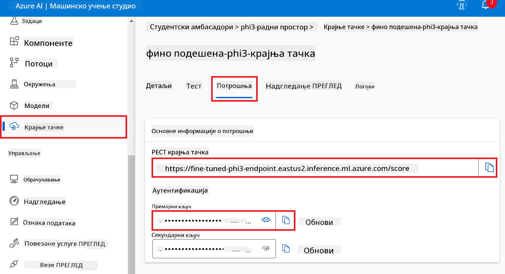

#### Додавање прилагођене везе

1. Посетите [Azure AI Foundry](https://ai.azure.com/?wt.mc_id=studentamb_279723).

1. Идите у Azure AI Foundry пројекат који сте креирали.

1. У пројекту који сте креирали, изаберите **Settings** са леве стране.

1. Изаберите **+ New connection**.

    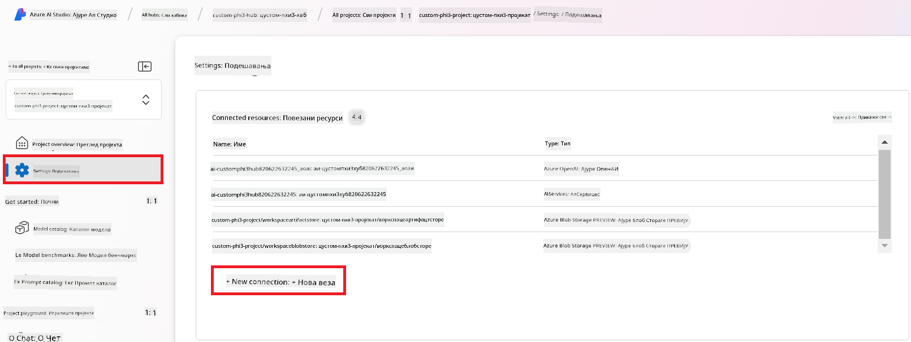

1. Изаберите **Custom keys** из навигационог менија.

    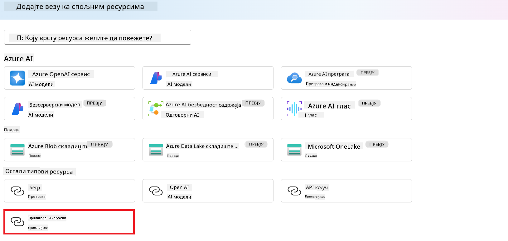

1. Извршите следеће кораке:

    - Изаберите **+ Add key value pairs**.
    - За име кључа унесите **endpoint** и налепите endpoint који сте копирали из Azure ML Studio у поље за вредност.
    - Поново изаберите **+ Add key value pairs**.
    - За име кључа унесите **key** и налепите key који сте копирали из Azure ML Studio у поље за вредност.
    - Након додавања кључева, означите **is secret** да бисте спречили да кључ буде изложен.

    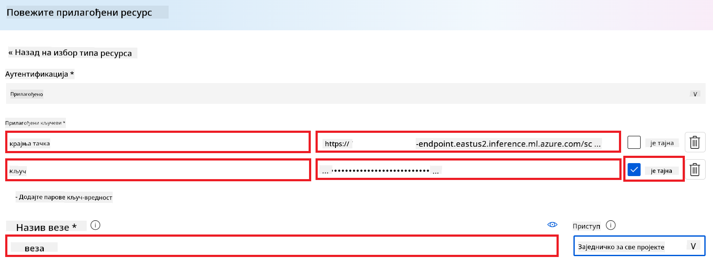

1. Изаберите **Add connection**.

#### Креирање Prompt flow

Додали сте прилагођену везу у Azure AI Foundry. Сада ћемо креирати Prompt flow пратећи следеће кораке. Након тога ћете повезати овај Prompt flow са прилагођеном везом како бисте користили фино подешени модел унутар Prompt flow-а.

1. Идите у Azure AI Foundry пројекат који сте креирали.

1. Изаберите **Prompt flow** са леве стране.

1. Изаберите **+ Create** из навигационог менија.

    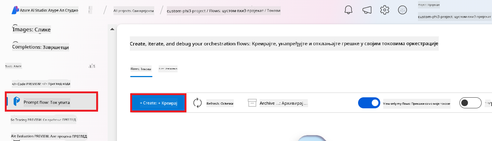

1. Изаберите **Chat flow** из навигационог менија.

    

1. Унесите **Folder name** који желите да користите.

    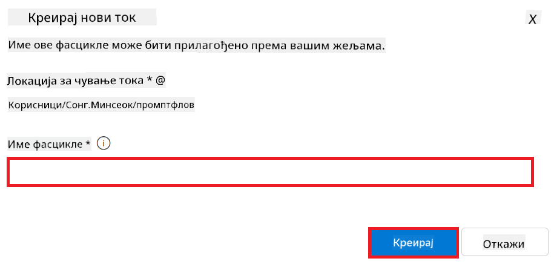

1. Изаберите **Create**.

#### Подешавање Prompt flow за разговор са вашим прилагођеним Phi-3 / Phi-3.5 моделом

Потребно је да интегришете фино подешени Phi-3 / Phi-3.5 модел у Prompt flow. Међутим, постојећи Prompt flow није дизајниран за ову сврху. Због тога морате редизајнирати Prompt flow како бисте омогућили интеграцију прилагођеног модела.

1. У Prompt flow-у извршите следеће кораке да бисте обновили постојећи flow:

    - Изаберите **Raw file mode**.
    - Обришите сав постојећи код у фајлу *flow.dag.yml*.
    - Додајте следећи код у *flow.dag.yml*.

        ```yml
        inputs:
          input_data:
            type: string
            default: "Who founded Microsoft?"

        outputs:
          answer:
            type: string
            reference: ${integrate_with_promptflow.output}

        nodes:
        - name: integrate_with_promptflow
          type: python
          source:
            type: code
            path: integrate_with_promptflow.py
          inputs:
            input_data: ${inputs.input_data}
        ```

    - Изаберите **Save**.

    

1. Додајте следећи код у *integrate_with_promptflow.py* да бисте користили прилагођени Phi-3 / Phi-3.5 модел у Prompt flow.

    ```python
    import logging
    import requests
    from promptflow import tool
    from promptflow.connections import CustomConnection

    # Logging setup
    logging.basicConfig(
        format="%(asctime)s - %(levelname)s - %(name)s - %(message)s",
        datefmt="%Y-%m-%d %H:%M:%S",
        level=logging.DEBUG
    )
    logger = logging.getLogger(__name__)

    def query_phi3_model(input_data: str, connection: CustomConnection) -> str:
        """
        Send a request to the Phi-3 / Phi-3.5 model endpoint with the given input data using Custom Connection.
        """

        # "connection" is the name of the Custom Connection, "endpoint", "key" are the keys in the Custom Connection
        endpoint_url = connection.endpoint
        api_key = connection.key

        headers = {
            "Content-Type": "application/json",
            "Authorization": f"Bearer {api_key}"
        }
    data = {
        "input_data": [input_data],
        "params": {
            "temperature": 0.7,
            "max_new_tokens": 128,
            "do_sample": True,
            "return_full_text": True
            }
        }
        try:
            response = requests.post(endpoint_url, json=data, headers=headers)
            response.raise_for_status()
            
            # Log the full JSON response
            logger.debug(f"Full JSON response: {response.json()}")

            result = response.json()["output"]
            logger.info("Successfully received response from Azure ML Endpoint.")
            return result
        except requests.exceptions.RequestException as e:
            logger.error(f"Error querying Azure ML Endpoint: {e}")
            raise

    @tool
    def my_python_tool(input_data: str, connection: CustomConnection) -> str:
        """
        Tool function to process input data and query the Phi-3 / Phi-3.5 model.
        """
        return query_phi3_model(input_data, connection)

    ```

    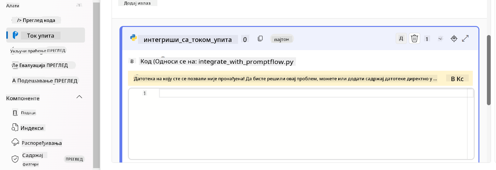

> [!NOTE]
> За детаљније информације о коришћењу Prompt flow у Azure AI Foundry, можете погледати [Prompt flow у Azure AI Foundry](https://learn.microsoft.com/azure/ai-studio/how-to/prompt-flow).

1. Изаберите **Chat input**, **Chat output** да бисте омогућили разговор са вашим моделом.

    

1. Сада сте спремни да разговарате са својим прилагођеним Phi-3 / Phi-3.5 моделом. У следећој вежби ћете научити како да покренете Prompt flow и користите га за разговор са фино подешеним Phi-3 / Phi-3.5 моделом.

> [!NOTE]
>
> Обновљени flow треба да изгледа као на слици испод:
>
> 
>

#### Покретање Prompt flow-а

1. Изаберите **Start compute sessions** да бисте покренули Prompt flow.

    

1. Изаберите **Validate and parse input** да бисте обновили параметре.

    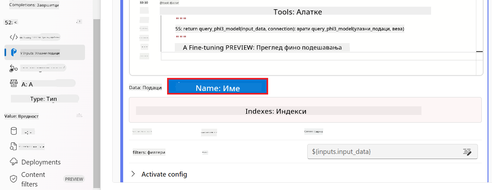

1. Изаберите **Value** за **connection** која води ка прилагођеној вези коју сте креирали. На пример, *connection*.

    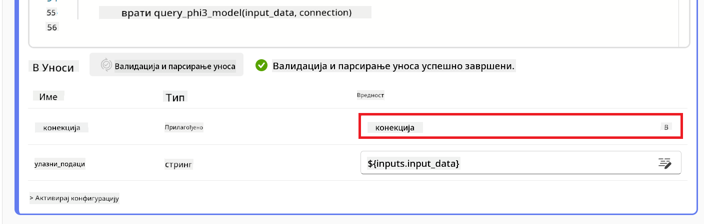

#### Разговор са вашим прилагођеним Phi-3 / Phi-3.5 моделом

1. Изаберите **Chat**.

    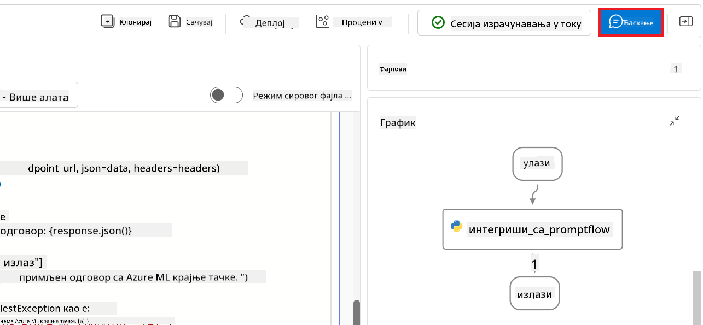

1. Ево примера резултата: Сада можете разговарати са својим прилагођеним Phi-3 / Phi-3.5 моделом. Препоручује се да постављате питања везана за податке који су коришћени за фино подешавање.

    

### Деплој Azure OpenAI за евалуацију Phi-3 / Phi-3.5 модела

Да бисте евалуирали Phi-3 / Phi-3.5 модел у Azure AI Foundry, потребно је да деплојујете Azure OpenAI модел. Овај модел ће се користити за процену перформанси Phi-3 / Phi-3.5 модела.

#### Деплој Azure OpenAI

1. Пријавите се на [Azure AI Foundry](https://ai.azure.com/?wt.mc_id=studentamb_279723).

1. Идите у Azure AI Foundry пројекат који сте креирали.

    

1. У пројекту који сте креирали, изаберите **Deployments** са леве стране.

1. Изаберите **+ Deploy model** из навигационог менија.

1. Изаберите **Deploy base model**.

    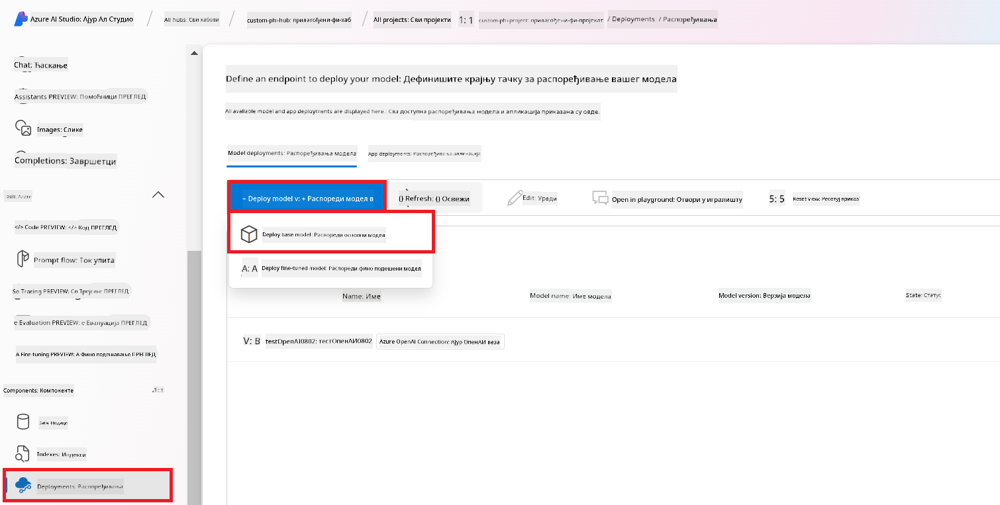

1. Изаберите Azure OpenAI модел који желите да користите. На пример, **gpt-4o**.

    

1. Изаберите **Confirm**.

### Евалуација фино подешеног Phi-3 / Phi-3.5 модела коришћењем Prompt flow евалуације у Azure AI Foundry

### Покретање нове евалуације

1. Посетите [Azure AI Foundry](https://ai.azure.com/?wt.mc_id=studentamb_279723).

1. Идите у Azure AI Foundry пројекат који сте креирали.

    

1. У пројекту који сте креирали, изаберите **Evaluation** са леве стране.

1. Изаберите **+ New evaluation** из навигационог менија.

    

1. Изаберите **Prompt flow** евалуацију.

    

1. Извршите следеће кораке:

    - Унесите име евалуације. Мора бити јединствено.
    - Изаберите **Question and answer without context** као тип задатка. Јер, **ULTRACHAT_200k** скуп података коришћен у овом туторијалу не садржи контекст.
    - Изаберите prompt flow који желите да евалуирате.

    

1. Изаберите **Next**.

1. Извршите следеће кораке:

    - Изаберите **Add your dataset** да отпремите скуп података. На пример, можете отпремити тест скуп података, као што је *test_data.json1*, који је укључен када преузмете **ULTRACHAT_200k** скуп података.
    - Изаберите одговарајућу **Dataset column** која одговара вашем скупу података. На пример, ако користите **ULTRACHAT_200k** скуп података, изаберите **${data.prompt}** као колону скупа података.

    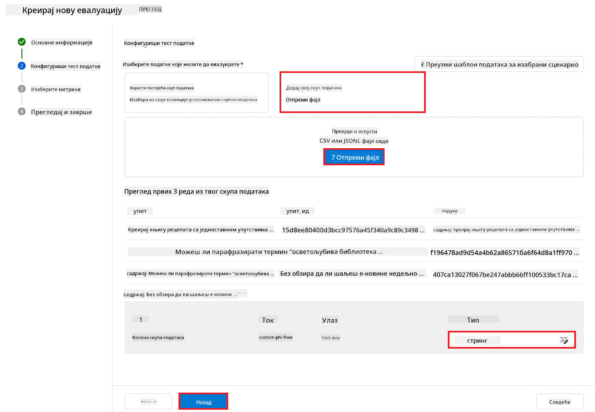

1. Изаберите **Next**.

1. Извршите следеће кораке за подешавање метрика перформанси и квалитета:

    - Изаберите метрике перформанси и квалитета које желите да користите.
    - Изаберите Azure OpenAI модел који сте креирали за евалуацију. На пример, изаберите **gpt-4o**.

    

1. Извршите следеће кораке за подешавање метрика ризика и безбедности:

    - Изаберите метрике ризика и безбедности које желите да користите.
    - Изаберите праг за израчунавање стопе дефеката који желите да користите. На пример, изаберите **Medium**.
    - За **question**, изаберите **Data source** као **{$data.prompt}**.
    - За **answer**, изаберите **Data source** као **{$run.outputs.answer}**.
    - За **ground_truth**, изаберите **Data source** као **{$data.message}**.

    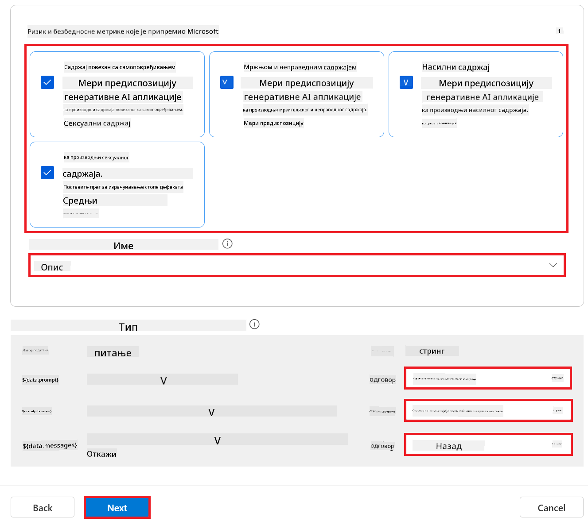

1. Изаберите **Next**.

1. Изаберите **Submit** да покренете евалуацију.

1. Евалуација ће потрајати неко време. Можете пратити напредак у табу **Evaluation**.

### Преглед резултата евалуације
> [!NOTE]
> Резултати приказани у наставку служе као илустрација процеса процене. У овом туторијалу користили смо модел који је фино подешен на релативно малом скупу података, што може довести до мање оптималних резултата. Стварни резултати могу значајно варирати у зависности од величине, квалитета и разноликости коришћеног скупа података, као и од специфичне конфигурације модела.
Када се процена заврши, можете прегледати резултате за метрике перформанси и безбедности.

1. Метрике перформанси и квалитета:

    - процените ефикасност модела у генерисању кохерентних, течно и релевантних одговора.

    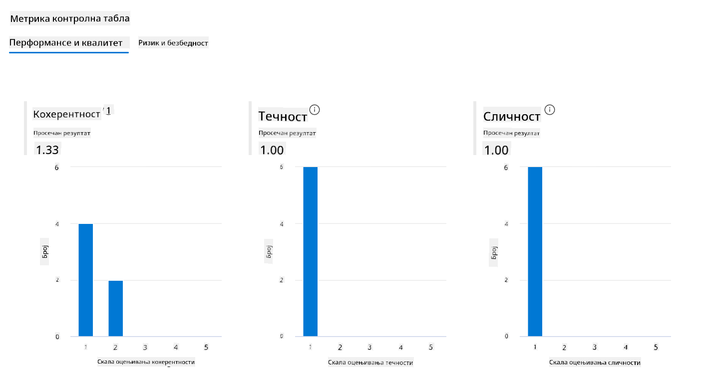

1. Метрике ризика и безбедности:

    - Осигурајте да излази модела буду безбедни и у складу са Responsible AI Principles, избегавајући било какав штетан или увредљив садржај.

    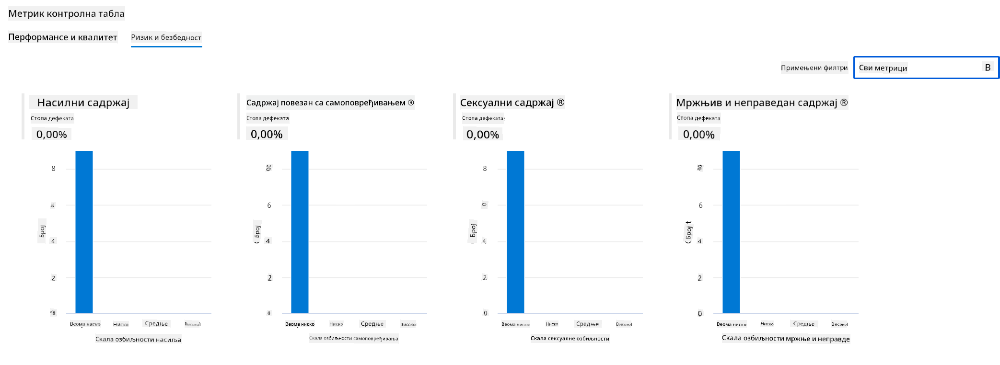

1. Можете скроловати надоле да бисте видели **Детаљне резултате метрика**.

    

1. Процењујући свој прилагођени Phi-3 / Phi-3.5 модел према метрикама перформанси и безбедности, можете потврдити да модел није само ефикасан, већ и да поштује одговорне праксе у вези са вештачком интелигенцијом, чинећи га спремним за примену у стварном свету.

## Честитамо!

### Завршили сте овај туторијал

Успешно сте проценили фино подешени Phi-3 модел интегрисан са Prompt flow у Azure AI Foundry. Ово је важан корак у осигуравању да ваши AI модели не само да добро раде, већ и да поштују Microsoft-ове принципе Responsible AI, помажући вам да изградите поуздане и сигурне AI апликације.


## Чишћење Azure ресурса

Очистите своје Azure ресурсе како бисте избегли додатне трошкове на свом налогу. Идите на Azure портал и избришите следеће ресурсе:

- Azure Machine learning ресурс.
- Azure Machine learning модел endpoint.
- Azure AI Foundry Project ресурс.
- Azure AI Foundry Prompt flow ресурс.

### Следећи кораци

#### Документација

- [Оцена AI система коришћењем Responsible AI dashboard](https://learn.microsoft.com/azure/machine-learning/concept-responsible-ai-dashboard?view=azureml-api-2&source=recommendations?wt.mc_id=studentamb_279723)
- [Метрике процене и праћења за генеративни AI](https://learn.microsoft.com/azure/ai-studio/concepts/evaluation-metrics-built-in?tabs=definition?wt.mc_id=studentamb_279723)
- [Azure AI Foundry документација](https://learn.microsoft.com/azure/ai-studio/?wt.mc_id=studentamb_279723)
- [Prompt flow документација](https://microsoft.github.io/promptflow/?wt.mc_id=studentamb_279723)

#### Обука

- [Увод у Microsoft-ов приступ Responsible AI](https://learn.microsoft.com/training/modules/introduction-to-microsofts-responsible-ai-approach/?source=recommendations?wt.mc_id=studentamb_279723)
- [Увод у Azure AI Foundry](https://learn.microsoft.com/training/modules/introduction-to-azure-ai-studio/?wt.mc_id=studentamb_279723)

### Референце

- [Шта је Responsible AI?](https://learn.microsoft.com/azure/machine-learning/concept-responsible-ai?view=azureml-api-2?wt.mc_id=studentamb_279723)
- [Објављени нови алати у Azure AI који вам помажу да изградите безбедније и поузданије генеративне AI апликације](https://azure.microsoft.com/blog/announcing-new-tools-in-azure-ai-to-help-you-build-more-secure-and-trustworthy-generative-ai-applications/?wt.mc_id=studentamb_279723)
- [Процена генеративних AI апликација](https://learn.microsoft.com/azure/ai-studio/concepts/evaluation-approach-gen-ai?wt.mc_id%3Dstudentamb_279723)

**Одрицање од одговорности**:  
Овај документ је преведен коришћењем AI услуге за превођење [Co-op Translator](https://github.com/Azure/co-op-translator). Иако се трудимо да превод буде тачан, молимо вас да имате у виду да аутоматски преводи могу садржати грешке или нетачности. Оригинални документ на његовом изворном језику треба сматрати ауторитетним извором. За критичне информације препоручује се професионални људски превод. Нисмо одговорни за било каква неспоразума или погрешна тумачења која произилазе из коришћења овог превода.