<!--
CO_OP_TRANSLATOR_METADATA:
{
  "original_hash": "455be2b7b9c3390d367d528f8fab2aa0",
  "translation_date": "2025-05-09T17:52:10+00:00",
  "source_file": "md/02.Application/01.TextAndChat/Phi3/E2E_Phi-3-FineTuning_PromptFlow_Integration.md",
  "language_code": "sr"
}
-->
# Fino podešavanje i integracija prilagođenih Phi-3 modela sa Prompt flow

Ovaj end-to-end (E2E) primer zasnovan je na vodiču "[Fine-Tune and Integrate Custom Phi-3 Models with Prompt Flow: Step-by-Step Guide](https://techcommunity.microsoft.com/t5/educator-developer-blog/fine-tune-and-integrate-custom-phi-3-models-with-prompt-flow/ba-p/4178612?WT.mc_id=aiml-137032-kinfeylo)" sa Microsoft Tech Community. Predstavlja procese fino podešavanja, implementacije i integracije prilagođenih Phi-3 modela sa Prompt flow.

## Pregled

U ovom E2E primeru naučićete kako da fino podesite Phi-3 model i integrišete ga sa Prompt flow. Korišćenjem Azure Machine Learning i Prompt flow, uspostavićete tok rada za implementaciju i korišćenje prilagođenih AI modela. Ovaj E2E primer je podeljen u tri scenarija:

**Scenario 1: Postavljanje Azure resursa i priprema za fino podešavanje**

**Scenario 2: Fino podešavanje Phi-3 modela i implementacija u Azure Machine Learning Studio**

**Scenario 3: Integracija sa Prompt flow i razgovor sa vašim prilagođenim modelom**

Evo pregleda ovog E2E primera.

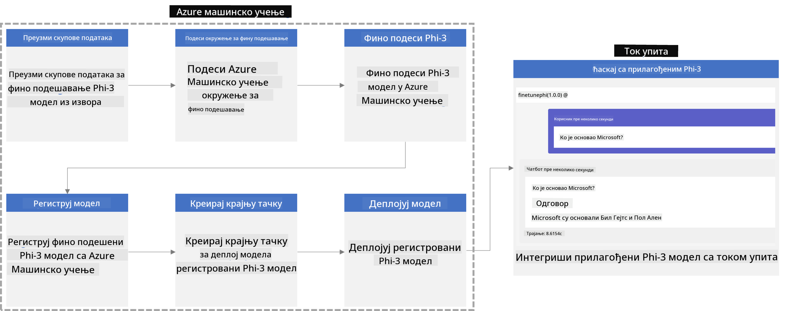

### Sadržaj

1. **[Scenario 1: Postavljanje Azure resursa i priprema za fino podešavanje](../../../../../../md/02.Application/01.TextAndChat/Phi3)**
    - [Kreiranje Azure Machine Learning Workspace](../../../../../../md/02.Application/01.TextAndChat/Phi3)
    - [Zahtev za GPU kvote u Azure pretplati](../../../../../../md/02.Application/01.TextAndChat/Phi3)
    - [Dodavanje dodeljivanja uloge](../../../../../../md/02.Application/01.TextAndChat/Phi3)
    - [Postavljanje projekta](../../../../../../md/02.Application/01.TextAndChat/Phi3)
    - [Priprema dataset-a za fino podešavanje](../../../../../../md/02.Application/01.TextAndChat/Phi3)

1. **[Scenario 2: Fino podešavanje Phi-3 modela i implementacija u Azure Machine Learning Studio](../../../../../../md/02.Application/01.TextAndChat/Phi3)**
    - [Postavljanje Azure CLI](../../../../../../md/02.Application/01.TextAndChat/Phi3)
    - [Fino podešavanje Phi-3 modela](../../../../../../md/02.Application/01.TextAndChat/Phi3)
    - [Implementacija fino podešenog modela](../../../../../../md/02.Application/01.TextAndChat/Phi3)

1. **[Scenario 3: Integracija sa Prompt flow i razgovor sa vašim prilagođenim modelom](../../../../../../md/02.Application/01.TextAndChat/Phi3)**
    - [Integracija prilagođenog Phi-3 modela sa Prompt flow](../../../../../../md/02.Application/01.TextAndChat/Phi3)
    - [Razgovor sa vašim prilagođenim modelom](../../../../../../md/02.Application/01.TextAndChat/Phi3)

## Scenario 1: Postavljanje Azure resursa i priprema za fino podešavanje

### Kreiranje Azure Machine Learning Workspace

1. Upišite *azure machine learning* u **traku za pretragu** na vrhu portala i izaberite **Azure Machine Learning** iz ponuđenih opcija.

    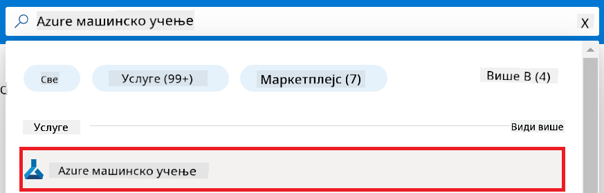

1. Izaberite **+ Create** u navigacionom meniju.

1. Izaberite **New workspace** u navigacionom meniju.

    

1. Obavite sledeće korake:

    - Izaberite vašu Azure **Subscription**.
    - Izaberite **Resource group** koju ćete koristiti (napravite novu ako je potrebno).
    - Unesite **Workspace Name**. Mora biti jedinstven.
    - Izaberite **Region** koji želite da koristite.
    - Izaberite **Storage account** koji ćete koristiti (napravite novi ako je potrebno).
    - Izaberite **Key vault** koji ćete koristiti (napravite novi ako je potrebno).
    - Izaberite **Application insights** koji ćete koristiti (napravite novi ako je potrebno).
    - Izaberite **Container registry** koji ćete koristiti (napravite novi ako je potrebno).

    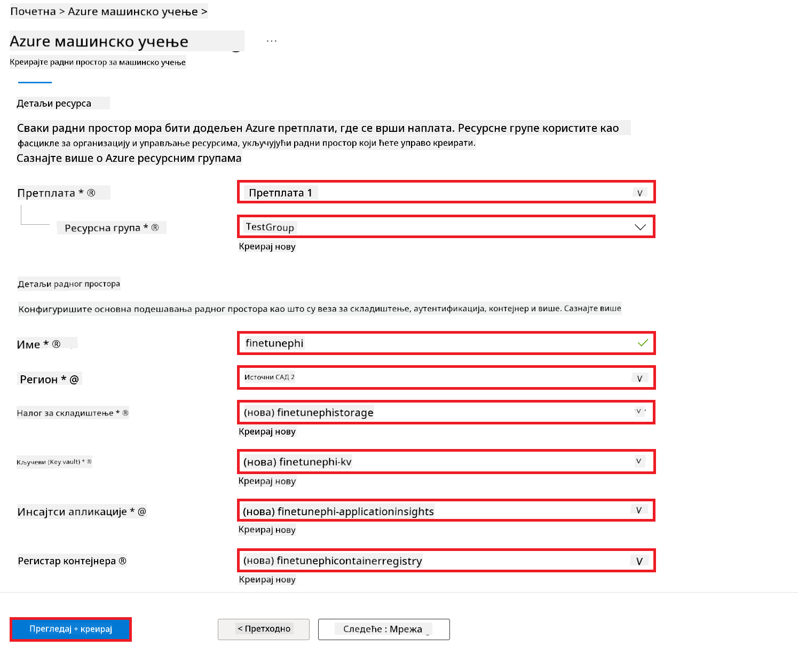

1. Izaberite **Review + Create**.

1. Izaberite **Create**.

### Zahtev za GPU kvote u Azure pretplati

U ovom E2E primeru koristićete *Standard_NC24ads_A100_v4 GPU* za fino podešavanje, što zahteva zahtev za kvotu, i *Standard_E4s_v3* CPU za implementaciju, za koji nije potreban zahtev za kvotu.

> [!NOTE]
>
> Samo Pay-As-You-Go pretplate (standardni tip pretplate) su podobne za dodelu GPU resursa; benefit pretplate trenutno nisu podržane.
>
> Za one koji koriste benefit pretplate (kao što je Visual Studio Enterprise Subscription) ili žele brzo da testiraju proces fino podešavanja i implementacije, ovaj vodič takođe pruža uputstva za fino podešavanje sa minimalnim dataset-om koristeći CPU. Ipak, važno je napomenuti da su rezultati fino podešavanja znatno bolji kada se koristi GPU sa većim dataset-ima.

1. Posetite [Azure ML Studio](https://ml.azure.com/home?wt.mc_id=studentamb_279723).

1. Obavite sledeće korake da biste zatražili *Standard NCADSA100v4 Family* kvotu:

    - Izaberite **Quota** sa leve strane.
    - Izaberite **Virtual machine family** koju želite da koristite. Na primer, izaberite **Standard NCADSA100v4 Family Cluster Dedicated vCPUs**, koja uključuje *Standard_NC24ads_A100_v4* GPU.
    - Izaberite **Request quota** u navigacionom meniju.

        

    - Na stranici Request quota unesite **New cores limit** koji želite da koristite. Na primer, 24.
    - Na stranici Request quota izaberite **Submit** da pošaljete zahtev za GPU kvotu.

> [!NOTE]
> Možete izabrati odgovarajući GPU ili CPU za vaše potrebe konsultujući se sa dokumentom [Sizes for Virtual Machines in Azure](https://learn.microsoft.com/azure/virtual-machines/sizes/overview?tabs=breakdownseries%2Cgeneralsizelist%2Ccomputesizelist%2Cmemorysizelist%2Cstoragesizelist%2Cgpusizelist%2Cfpgasizelist%2Chpcsizelist).

### Dodavanje dodeljivanja uloge

Da biste fino podesili i implementirali vaše modele, prvo morate kreirati User Assigned Managed Identity (UAI) i dodeliti joj odgovarajuće dozvole. Ova UAI će se koristiti za autentifikaciju tokom implementacije.

#### Kreiranje User Assigned Managed Identity (UAI)

1. Upišite *managed identities* u **traku za pretragu** na vrhu portala i izaberite **Managed Identities** iz ponuđenih opcija.

    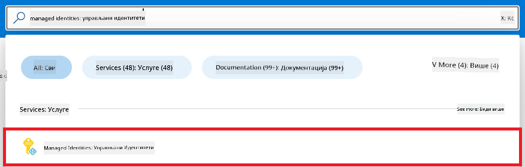

1. Izaberite **+ Create**.

    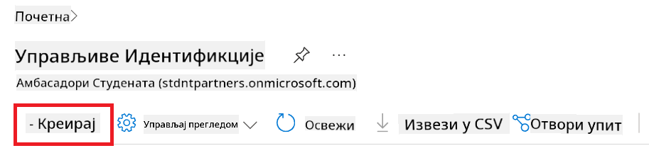

1. Obavite sledeće korake:

    - Izaberite vašu Azure **Subscription**.
    - Izaberite **Resource group** koju ćete koristiti (napravite novu ako je potrebno).
    - Izaberite **Region** koji želite da koristite.
    - Unesite **Name**. Mora biti jedinstven.

1. Izaberite **Review + create**.

1. Izaberite **+ Create**.

#### Dodavanje Contributor uloge Managed Identity

1. Idite na resurs Managed Identity koji ste kreirali.

1. Izaberite **Azure role assignments** sa leve strane.

1. Izaberite **+ Add role assignment** u navigacionom meniju.

1. Na stranici Add role assignment obavite sledeće:

    - Izaberite **Scope** na **Resource group**.
    - Izaberite vašu Azure **Subscription**.
    - Izaberite **Resource group** koju koristite.
    - Izaberite **Role** na **Contributor**.

    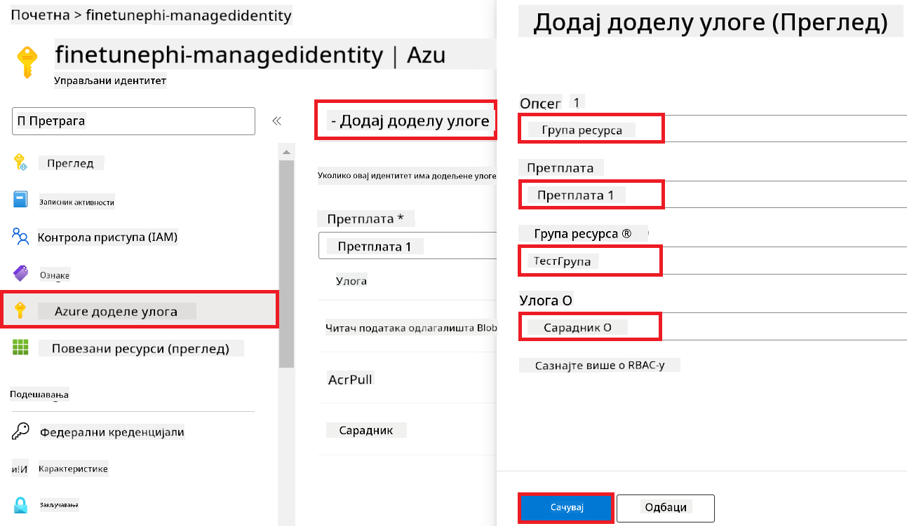

1. Izaberite **Save**.

#### Dodavanje Storage Blob Data Reader uloge Managed Identity

1. Upišite *storage accounts* u **traku za pretragu** na vrhu portala i izaberite **Storage accounts** iz ponuđenih opcija.

    

1. Izaberite storage account koji je povezan sa Azure Machine Learning workspace-om koji ste kreirali. Na primer, *finetunephistorage*.

1. Obavite sledeće da biste stigli do stranice Add role assignment:

    - Idite na Azure Storage account koji ste kreirali.
    - Izaberite **Access Control (IAM)** sa leve strane.
    - Izaberite **+ Add** u navigacionom meniju.
    - Izaberite **Add role assignment** u navigacionom meniju.

    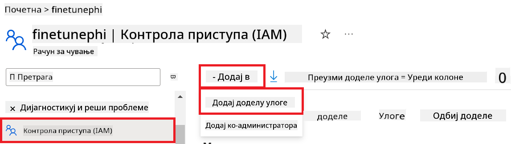

1. Na stranici Add role assignment obavite sledeće:

    - U polju Role upišite *Storage Blob Data Reader* u **traku za pretragu** i izaberite **Storage Blob Data Reader** iz ponuđenih opcija.
    - Izaberite **Next**.
    - Na stranici Members izaberite **Assign access to** na **Managed identity**.
    - Izaberite **+ Select members**.
    - Izaberite vašu Azure **Subscription**.
    - Izaberite **Managed identity** na **Manage Identity**.
    - Izaberite Managed Identity koju ste kreirali. Na primer, *finetunephi-managedidentity*.
    - Izaberite **Select**.

    

1. Izaberite **Review + assign**.

#### Dodavanje AcrPull uloge Managed Identity

1. Upišite *container registries* u **traku za pretragu** na vrhu portala i izaberite **Container registries** iz ponuđenih opcija.

    

1. Izaberite container registry koji je povezan sa Azure Machine Learning workspace-om. Na primer, *finetunephicontainerregistries*.

1. Obavite sledeće da biste stigli do stranice Add role assignment:

    - Izaberite **Access Control (IAM)** sa leve strane.
    - Izaberite **+ Add** u navigacionom meniju.
    - Izaberite **Add role assignment** u navigacionom meniju.

1. Na stranici Add role assignment obavite sledeće:

    - U polju Role upišite *AcrPull* u **traku za pretragu** i izaberite **AcrPull** iz ponuđenih opcija.
    - Izaberite **Next**.
    - Na stranici Members izaberite **Assign access to** na **Managed identity**.
    - Izaberite **+ Select members**.
    - Izaberite vašu Azure **Subscription**.
    - Izaberite **Managed identity** na **Manage Identity**.
    - Izaberite Managed Identity koju ste kreirali. Na primer, *finetunephi-managedidentity*.
    - Izaberite **Select**.
    - Izaberite **Review + assign**.

### Postavljanje projekta

Sada ćete kreirati folder za rad i podesiti virtuelno okruženje za razvoj programa koji komunicira sa korisnicima i koristi sačuvanu istoriju razgovora iz Azure Cosmos DB da bi informisao svoje odgovore.

#### Kreiranje foldera za rad

1. Otvorite terminal i otkucajte sledeću komandu da kreirate folder pod nazivom *finetune-phi* u podrazumevanoj putanji.

    ```console
    mkdir finetune-phi
    ```

1. U terminalu otkucajte sledeću komandu da uđete u folder *finetune-phi* koji ste kreirali.

    ```console
    cd finetune-phi
    ```

#### Kreiranje virtuelnog okruženja

1. U terminalu otkucajte sledeću komandu da kreirate virtuelno okruženje pod nazivom *.venv*.

    ```console
    python -m venv .venv
    ```

1. U terminalu otkucajte sledeću komandu da aktivirate virtuelno okruženje.

    ```console
    .venv\Scripts\activate.bat
    ```

> [!NOTE]
>
> Ako je uspešno, trebalo bi da vidite *(.venv)* ispred komandne linije.

#### Instalacija potrebnih paketa

1. U terminalu otkucajte sledeće komande da instalirate potrebne pakete.

    ```console
    pip install datasets==2.19.1
    pip install transformers==4.41.1
    pip install azure-ai-ml==1.16.0
    pip install torch==2.3.1
    pip install trl==0.9.4
    pip install promptflow==1.12.0
    ```

#### Kreiranje projektnih fajlova

U ovom zadatku kreiraćete osnovne fajlove za naš projekat. Ovi fajlovi uključuju skripte za preuzimanje dataset-a, postavljanje Azure Machine Learning okruženja, fino podešavanje Phi-3 modela i implementaciju fino podešenog modela. Takođe ćete kreirati *conda.yml* fajl za postavljanje okruženja za fino podešavanje.

U ovom zadatku ćete:

- Kreirati fajl *download_dataset.py* za preuzimanje dataset-a.
- Kreirati fajl *setup_ml.py* za postavljanje Azure Machine Learning okruženja.
- Kreirati fajl *fine_tune.py* u folderu *finetuning_dir* za fino podešavanje Phi-3 modela koristeći dataset.
- Kreirati *conda.yml* fajl za postavljanje okruženja za fino podešavanje.
- Kreirati fajl *deploy_model.py* za implementaciju fino podešenog modela.
- Kreirati fajl *integrate_with_promptflow.py* za integraciju fino podešenog modela i izvršavanje modela pomoću Prompt flow.
- Kreirati fajl *flow.dag.yml* za postavljanje strukture toka rada za Prompt flow.
- Kreirati fajl *config.py* za unošenje Azure informacija.

> [!NOTE]
>
> Kompletna struktura foldera:
>
> ```text
> └── YourUserName
> .    └── finetune-phi
> .        ├── finetuning_dir
> .        │      └── fine_tune.py
> .        ├── conda.yml
> .        ├── config.py
> .        ├── deploy_model.py
> .        ├── download_dataset.py
> .        ├── flow.dag.yml
> .        ├── integrate_with_promptflow.py
> .        └── setup_ml.py
> ```

1. Otvorite **Visual Studio Code**.

1. Izaberite **File** u meniju.

1. Izaberite **Open Folder**.

1. Izaberite folder *finetune-phi* koji ste kreirali, koji se nalazi na putanji *C:\Users\yourUserName\finetune-phi*.

    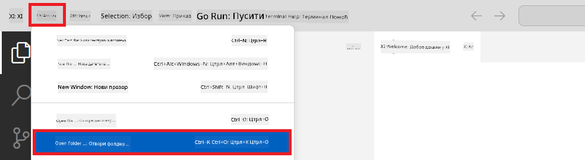

1. U levom delu Visual Studio Code-a kliknite desnim tasterom i izaberite **New File** da kreirate novi fajl pod nazivom *download_dataset.py*.

1. U levom delu Visual Studio Code-a kliknite desnim tasterom i izaberite **New File** da kreirate novi fajl pod nazivom *setup_ml.py*.

1. U levom delu Visual Studio Code-a kliknite desnim tasterom i izaberite **New File** da kreirate novi fajl pod nazivom *deploy_model.py*.

    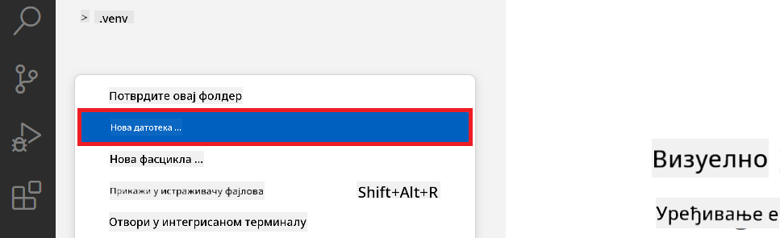

1. U levom delu Visual Studio Code-a kliknite desnim tasterom i izaberite **New Folder** da kreirate novi folder pod nazivom *finetuning_dir*.

1. U folderu *finetuning_dir* kreirajte novi fajl pod nazivom *fine_tune.py*.

#### Kreiranje i konfiguracija *conda.yml* fajla

1. U levom delu Visual Studio Code-a kliknite desnim tasterom i izaberite **New File** da kreirate novi fajl pod nazivom *conda.yml*.

1. Dodajte sledeći kod u *conda.yml* fajl za postavljanje okruženja za fino podešavanje Phi-3 modela.

    ```yml
    name: phi-3-training-env
    channels:
      - defaults
      - conda-forge
    dependencies:
      - python=3.10
      - pip
      - numpy<2.0
      - pip:
          - torch==2.4.0
          - torchvision==0.19.0
          - trl==0.8.6
          - transformers==4.41
          - datasets==2.21.0
          - azureml-core==1.57.0
          - azure-storage-blob==12.19.0
          - azure-ai-ml==1.16
          - azure-identity==1.17.1
          - accelerate==0.33.0
          - mlflow==2.15.1
          - azureml-mlflow==1.57.0
    ```

#### Kreiranje i konfiguracija *config.py* fajla

1. U levom delu Visual Studio Code-a kliknite desnim tasterom i izaberite **New File** da kreirate novi fajl pod nazivom *config.py*.

1. Dodajte sledeći kod u *config.py* fajl da uključite vaše Azure informacije.

    ```python
    # Azure settings
    AZURE_SUBSCRIPTION_ID = "your_subscription_id"
    AZURE_RESOURCE_GROUP_NAME = "your_resource_group_name" # "TestGroup"

    # Azure Machine Learning settings
    AZURE_ML_WORKSPACE_NAME = "your_workspace_name" # "finetunephi-workspace"

    # Azure Managed Identity settings
    AZURE_MANAGED_IDENTITY_CLIENT_ID = "your_azure_managed_identity_client_id"
    AZURE_MANAGED_IDENTITY_NAME = "your_azure_managed_identity_name" # "finetunephi-mangedidentity"
    AZURE_MANAGED_IDENTITY_RESOURCE_ID = f"/subscriptions/{AZURE_SUBSCRIPTION_ID}/resourceGroups/{AZURE_RESOURCE_GROUP_NAME}/providers/Microsoft.ManagedIdentity/userAssignedIdentities/{AZURE_MANAGED_IDENTITY_NAME}"

    # Dataset file paths
    TRAIN_DATA_PATH = "data/train_data.jsonl"
    TEST_DATA_PATH = "data/test_data.jsonl"

    # Fine-tuned model settings
    AZURE_MODEL_NAME = "your_fine_tuned_model_name" # "finetune-phi-model"
    AZURE_ENDPOINT_NAME = "your_fine_tuned_model_endpoint_name" # "finetune-phi-endpoint"
    AZURE_DEPLOYMENT_NAME = "your_fine_tuned_model_deployment_name" # "finetune-phi-deployment"

    AZURE_ML_API_KEY = "your_fine_tuned_model_api_key"
    AZURE_ML_ENDPOINT = "your_fine_tuned_model_endpoint_uri" # "https://{your-endpoint-name}.{your-region}.inference.ml.azure.com/score"
    ```

#### Dodavanje Azure promenljivih okruženja

1. Obavite sledeće da biste dodali Azure Subscription ID:

    - Upišite *subscriptions* u **traku za pretragu** na vrhu portala i izaberite **Subscriptions** iz ponuđenih opcija.
    - Izaberite Azure Subscription koju trenutno koristite.
    - Kopirajte i nalepite vaš Subscription ID u *config.py* fajl.
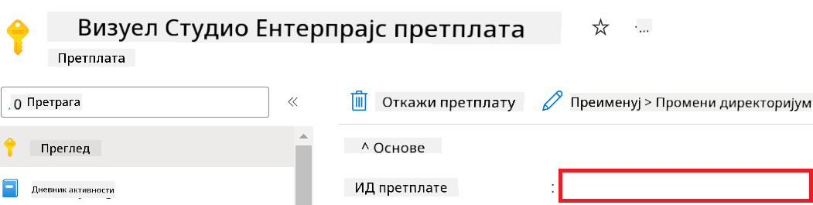

1. Obavite sledeće korake da dodate naziv Azure Workspace-a:

    - Idite do Azure Machine Learning resursa koji ste kreirali.
    - Kopirajte i nalepite naziv vašeg naloga u *config.py* fajl.

    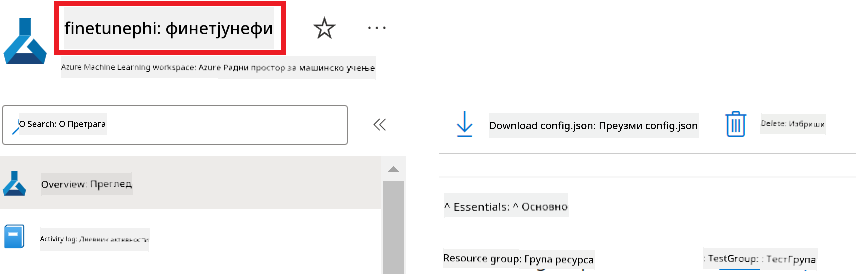

1. Obavite sledeće korake da dodate naziv Azure Resource Group-a:

    - Idite do Azure Machine Learning resursa koji ste kreirali.
    - Kopirajte i nalepite naziv vaše Azure Resource Group u *config.py* fajl.

    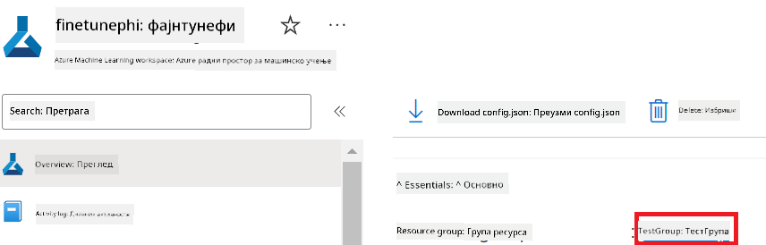

2. Obavite sledeće korake da dodate naziv Azure Managed Identity

    - Idite do Managed Identities resursa koji ste kreirali.
    - Kopirajte i nalepite naziv vaše Azure Managed Identity u *config.py* fajl.

    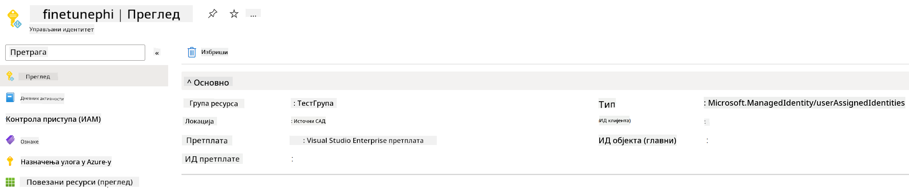

### Pripremite dataset za fino podešavanje

U ovom zadatku pokrenućete *download_dataset.py* fajl da preuzmete *ULTRACHAT_200k* dataset-e u vaše lokalno okruženje. Zatim ćete koristiti ove datasete za fino podešavanje Phi-3 modela u Azure Machine Learning-u.

#### Preuzmite vaš dataset koristeći *download_dataset.py*

1. Otvorite *download_dataset.py* fajl u Visual Studio Code-u.

1. Dodajte sledeći kod u *download_dataset.py*.

    ```python
    import json
    import os
    from datasets import load_dataset
    from config import (
        TRAIN_DATA_PATH,
        TEST_DATA_PATH)

    def load_and_split_dataset(dataset_name, config_name, split_ratio):
        """
        Load and split a dataset.
        """
        # Load the dataset with the specified name, configuration, and split ratio
        dataset = load_dataset(dataset_name, config_name, split=split_ratio)
        print(f"Original dataset size: {len(dataset)}")
        
        # Split the dataset into train and test sets (80% train, 20% test)
        split_dataset = dataset.train_test_split(test_size=0.2)
        print(f"Train dataset size: {len(split_dataset['train'])}")
        print(f"Test dataset size: {len(split_dataset['test'])}")
        
        return split_dataset

    def save_dataset_to_jsonl(dataset, filepath):
        """
        Save a dataset to a JSONL file.
        """
        # Create the directory if it does not exist
        os.makedirs(os.path.dirname(filepath), exist_ok=True)
        
        # Open the file in write mode
        with open(filepath, 'w', encoding='utf-8') as f:
            # Iterate over each record in the dataset
            for record in dataset:
                # Dump the record as a JSON object and write it to the file
                json.dump(record, f)
                # Write a newline character to separate records
                f.write('\n')
        
        print(f"Dataset saved to {filepath}")

    def main():
        """
        Main function to load, split, and save the dataset.
        """
        # Load and split the ULTRACHAT_200k dataset with a specific configuration and split ratio
        dataset = load_and_split_dataset("HuggingFaceH4/ultrachat_200k", 'default', 'train_sft[:1%]')
        
        # Extract the train and test datasets from the split
        train_dataset = dataset['train']
        test_dataset = dataset['test']

        # Save the train dataset to a JSONL file
        save_dataset_to_jsonl(train_dataset, TRAIN_DATA_PATH)
        
        # Save the test dataset to a separate JSONL file
        save_dataset_to_jsonl(test_dataset, TEST_DATA_PATH)

    if __name__ == "__main__":
        main()

    ```

> [!TIP]
>
> **Smernice za fino podešavanje sa minimalnim datasetom koristeći CPU**
>
> Ako želite da koristite CPU za fino podešavanje, ovaj pristup je idealan za one sa benefit pretplatama (kao što je Visual Studio Enterprise Subscription) ili za brzo testiranje procesa fino podešavanja i deploy-a.
>
> Zamenite `dataset = load_and_split_dataset("HuggingFaceH4/ultrachat_200k", 'default', 'train_sft[:1%]')` with `dataset = load_and_split_dataset("HuggingFaceH4/ultrachat_200k", 'default', 'train_sft[:10]')`
>

1. U terminalu otkucajte sledeću komandu da pokrenete skriptu i preuzmete dataset u vaše lokalno okruženje.

    ```console
    python download_data.py
    ```

1. Proverite da li su dataseti uspešno sačuvani u lokalnom *finetune-phi/data* direktorijumu.

> [!NOTE]
>
> **Veličina dataseta i vreme fino podešavanja**
>
> U ovom E2E primeru koristite samo 1% dataseta (`train_sft[:1%]`). Ovo značajno smanjuje količinu podataka, ubrzavajući i upload i proces fino podešavanja. Možete prilagoditi procenat da pronađete pravi balans između vremena treniranja i performansi modela. Korišćenje manjeg dela dataseta smanjuje vreme potrebno za fino podešavanje, čineći proces lakšim za E2E primer.

## Scenario 2: Fino podesite Phi-3 model i deploy-ujte u Azure Machine Learning Studio

### Postavite Azure CLI

Potrebno je da postavite Azure CLI da biste autentifikovali vaše okruženje. Azure CLI vam omogućava da upravljate Azure resursima direktno iz komandne linije i obezbeđuje kredencijale potrebne Azure Machine Learning-u za pristup tim resursima. Za početak instalirajte [Azure CLI](https://learn.microsoft.com/cli/azure/install-azure-cli)

1. Otvorite terminal i otkucajte sledeću komandu da se prijavite na vaš Azure nalog.

    ```console
    az login
    ```

1. Izaberite Azure nalog koji želite da koristite.

1. Izaberite Azure pretplatu koju želite da koristite.

    

> [!TIP]
>
> Ako imate problema sa prijavom na Azure, pokušajte da koristite device code. Otvorite terminal i otkucajte sledeću komandu da se prijavite na vaš Azure nalog:
>
> ```console
> az login --use-device-code
> ```
>

### Fino podesite Phi-3 model

U ovom zadatku ćete fino podesiti Phi-3 model koristeći dati dataset. Prvo ćete definisati proces fino podešavanja u *fine_tune.py* fajlu. Zatim ćete konfigurisati Azure Machine Learning okruženje i pokrenuti proces fino podešavanja pokretanjem *setup_ml.py* fajla. Ova skripta obezbeđuje da se fino podešavanje izvrši unutar Azure Machine Learning okruženja.

Pokretanjem *setup_ml.py* izvršićete proces fino podešavanja u Azure Machine Learning okruženju.

#### Dodajte kod u *fine_tune.py* fajl

1. Idite u folder *finetuning_dir* i otvorite *fine_tune.py* fajl u Visual Studio Code-u.

1. Dodajte sledeći kod u *fine_tune.py*.

    ```python
    import argparse
    import sys
    import logging
    import os
    from datasets import load_dataset
    import torch
    import mlflow
    from transformers import AutoModelForCausalLM, AutoTokenizer, TrainingArguments
    from trl import SFTTrainer

    # To avoid the INVALID_PARAMETER_VALUE error in MLflow, disable MLflow integration
    os.environ["DISABLE_MLFLOW_INTEGRATION"] = "True"

    # Logging setup
    logging.basicConfig(
        format="%(asctime)s - %(levelname)s - %(name)s - %(message)s",
        datefmt="%Y-%m-%d %H:%M:%S",
        handlers=[logging.StreamHandler(sys.stdout)],
        level=logging.WARNING
    )
    logger = logging.getLogger(__name__)

    def initialize_model_and_tokenizer(model_name, model_kwargs):
        """
        Initialize the model and tokenizer with the given pretrained model name and arguments.
        """
        model = AutoModelForCausalLM.from_pretrained(model_name, **model_kwargs)
        tokenizer = AutoTokenizer.from_pretrained(model_name)
        tokenizer.model_max_length = 2048
        tokenizer.pad_token = tokenizer.unk_token
        tokenizer.pad_token_id = tokenizer.convert_tokens_to_ids(tokenizer.pad_token)
        tokenizer.padding_side = 'right'
        return model, tokenizer

    def apply_chat_template(example, tokenizer):
        """
        Apply a chat template to tokenize messages in the example.
        """
        messages = example["messages"]
        if messages[0]["role"] != "system":
            messages.insert(0, {"role": "system", "content": ""})
        example["text"] = tokenizer.apply_chat_template(
            messages, tokenize=False, add_generation_prompt=False
        )
        return example

    def load_and_preprocess_data(train_filepath, test_filepath, tokenizer):
        """
        Load and preprocess the dataset.
        """
        train_dataset = load_dataset('json', data_files=train_filepath, split='train')
        test_dataset = load_dataset('json', data_files=test_filepath, split='train')
        column_names = list(train_dataset.features)

        train_dataset = train_dataset.map(
            apply_chat_template,
            fn_kwargs={"tokenizer": tokenizer},
            num_proc=10,
            remove_columns=column_names,
            desc="Applying chat template to train dataset",
        )

        test_dataset = test_dataset.map(
            apply_chat_template,
            fn_kwargs={"tokenizer": tokenizer},
            num_proc=10,
            remove_columns=column_names,
            desc="Applying chat template to test dataset",
        )

        return train_dataset, test_dataset

    def train_and_evaluate_model(train_dataset, test_dataset, model, tokenizer, output_dir):
        """
        Train and evaluate the model.
        """
        training_args = TrainingArguments(
            bf16=True,
            do_eval=True,
            output_dir=output_dir,
            eval_strategy="epoch",
            learning_rate=5.0e-06,
            logging_steps=20,
            lr_scheduler_type="cosine",
            num_train_epochs=3,
            overwrite_output_dir=True,
            per_device_eval_batch_size=4,
            per_device_train_batch_size=4,
            remove_unused_columns=True,
            save_steps=500,
            seed=0,
            gradient_checkpointing=True,
            gradient_accumulation_steps=1,
            warmup_ratio=0.2,
        )

        trainer = SFTTrainer(
            model=model,
            args=training_args,
            train_dataset=train_dataset,
            eval_dataset=test_dataset,
            max_seq_length=2048,
            dataset_text_field="text",
            tokenizer=tokenizer,
            packing=True
        )

        train_result = trainer.train()
        trainer.log_metrics("train", train_result.metrics)

        mlflow.transformers.log_model(
            transformers_model={"model": trainer.model, "tokenizer": tokenizer},
            artifact_path=output_dir,
        )

        tokenizer.padding_side = 'left'
        eval_metrics = trainer.evaluate()
        eval_metrics["eval_samples"] = len(test_dataset)
        trainer.log_metrics("eval", eval_metrics)

    def main(train_file, eval_file, model_output_dir):
        """
        Main function to fine-tune the model.
        """
        model_kwargs = {
            "use_cache": False,
            "trust_remote_code": True,
            "torch_dtype": torch.bfloat16,
            "device_map": None,
            "attn_implementation": "eager"
        }

        # pretrained_model_name = "microsoft/Phi-3-mini-4k-instruct"
        pretrained_model_name = "microsoft/Phi-3.5-mini-instruct"

        with mlflow.start_run():
            model, tokenizer = initialize_model_and_tokenizer(pretrained_model_name, model_kwargs)
            train_dataset, test_dataset = load_and_preprocess_data(train_file, eval_file, tokenizer)
            train_and_evaluate_model(train_dataset, test_dataset, model, tokenizer, model_output_dir)

    if __name__ == "__main__":
        parser = argparse.ArgumentParser()
        parser.add_argument("--train-file", type=str, required=True, help="Path to the training data")
        parser.add_argument("--eval-file", type=str, required=True, help="Path to the evaluation data")
        parser.add_argument("--model_output_dir", type=str, required=True, help="Directory to save the fine-tuned model")
        args = parser.parse_args()
        main(args.train_file, args.eval_file, args.model_output_dir)

    ```

1. Sačuvajte i zatvorite *fine_tune.py* fajl.

> [!TIP]
> **Možete fino podesiti Phi-3.5 model**
>
> U *fine_tune.py* fajlu možete promeniti `pretrained_model_name` from `"microsoft/Phi-3-mini-4k-instruct"` to any model you want to fine-tune. For example, if you change it to `"microsoft/Phi-3.5-mini-instruct"`, you'll be using the Phi-3.5-mini-instruct model for fine-tuning. To find and use the model name you prefer, visit [Hugging Face](https://huggingface.co/), search for the model you're interested in, and then copy and paste its name into the `pretrained_model_name` polje u vašem skriptu.
>
> :::image type="content" source="../../imgs/03/FineTuning-PromptFlow/finetunephi3.5.png" alt-text="Fino podešavanje Phi-3.5.":::
>

#### Dodajte kod u *setup_ml.py* fajl

1. Otvorite *setup_ml.py* fajl u Visual Studio Code-u.

1. Dodajte sledeći kod u *setup_ml.py*.

    ```python
    import logging
    from azure.ai.ml import MLClient, command, Input
    from azure.ai.ml.entities import Environment, AmlCompute
    from azure.identity import AzureCliCredential
    from config import (
        AZURE_SUBSCRIPTION_ID,
        AZURE_RESOURCE_GROUP_NAME,
        AZURE_ML_WORKSPACE_NAME,
        TRAIN_DATA_PATH,
        TEST_DATA_PATH
    )

    # Constants

    # Uncomment the following lines to use a CPU instance for training
    # COMPUTE_INSTANCE_TYPE = "Standard_E16s_v3" # cpu
    # COMPUTE_NAME = "cpu-e16s-v3"
    # DOCKER_IMAGE_NAME = "mcr.microsoft.com/azureml/openmpi4.1.0-ubuntu20.04:latest"

    # Uncomment the following lines to use a GPU instance for training
    COMPUTE_INSTANCE_TYPE = "Standard_NC24ads_A100_v4"
    COMPUTE_NAME = "gpu-nc24s-a100-v4"
    DOCKER_IMAGE_NAME = "mcr.microsoft.com/azureml/curated/acft-hf-nlp-gpu:59"

    CONDA_FILE = "conda.yml"
    LOCATION = "eastus2" # Replace with the location of your compute cluster
    FINETUNING_DIR = "./finetuning_dir" # Path to the fine-tuning script
    TRAINING_ENV_NAME = "phi-3-training-environment" # Name of the training environment
    MODEL_OUTPUT_DIR = "./model_output" # Path to the model output directory in azure ml

    # Logging setup to track the process
    logger = logging.getLogger(__name__)
    logging.basicConfig(
        format="%(asctime)s - %(levelname)s - %(name)s - %(message)s",
        datefmt="%Y-%m-%d %H:%M:%S",
        level=logging.WARNING
    )

    def get_ml_client():
        """
        Initialize the ML Client using Azure CLI credentials.
        """
        credential = AzureCliCredential()
        return MLClient(credential, AZURE_SUBSCRIPTION_ID, AZURE_RESOURCE_GROUP_NAME, AZURE_ML_WORKSPACE_NAME)

    def create_or_get_environment(ml_client):
        """
        Create or update the training environment in Azure ML.
        """
        env = Environment(
            image=DOCKER_IMAGE_NAME,  # Docker image for the environment
            conda_file=CONDA_FILE,  # Conda environment file
            name=TRAINING_ENV_NAME,  # Name of the environment
        )
        return ml_client.environments.create_or_update(env)

    def create_or_get_compute_cluster(ml_client, compute_name, COMPUTE_INSTANCE_TYPE, location):
        """
        Create or update the compute cluster in Azure ML.
        """
        try:
            compute_cluster = ml_client.compute.get(compute_name)
            logger.info(f"Compute cluster '{compute_name}' already exists. Reusing it for the current run.")
        except Exception:
            logger.info(f"Compute cluster '{compute_name}' does not exist. Creating a new one with size {COMPUTE_INSTANCE_TYPE}.")
            compute_cluster = AmlCompute(
                name=compute_name,
                size=COMPUTE_INSTANCE_TYPE,
                location=location,
                tier="Dedicated",  # Tier of the compute cluster
                min_instances=0,  # Minimum number of instances
                max_instances=1  # Maximum number of instances
            )
            ml_client.compute.begin_create_or_update(compute_cluster).wait()  # Wait for the cluster to be created
        return compute_cluster

    def create_fine_tuning_job(env, compute_name):
        """
        Set up the fine-tuning job in Azure ML.
        """
        return command(
            code=FINETUNING_DIR,  # Path to fine_tune.py
            command=(
                "python fine_tune.py "
                "--train-file ${{inputs.train_file}} "
                "--eval-file ${{inputs.eval_file}} "
                "--model_output_dir ${{inputs.model_output}}"
            ),
            environment=env,  # Training environment
            compute=compute_name,  # Compute cluster to use
            inputs={
                "train_file": Input(type="uri_file", path=TRAIN_DATA_PATH),  # Path to the training data file
                "eval_file": Input(type="uri_file", path=TEST_DATA_PATH),  # Path to the evaluation data file
                "model_output": MODEL_OUTPUT_DIR
            }
        )

    def main():
        """
        Main function to set up and run the fine-tuning job in Azure ML.
        """
        # Initialize ML Client
        ml_client = get_ml_client()

        # Create Environment
        env = create_or_get_environment(ml_client)
        
        # Create or get existing compute cluster
        create_or_get_compute_cluster(ml_client, COMPUTE_NAME, COMPUTE_INSTANCE_TYPE, LOCATION)

        # Create and Submit Fine-Tuning Job
        job = create_fine_tuning_job(env, COMPUTE_NAME)
        returned_job = ml_client.jobs.create_or_update(job)  # Submit the job
        ml_client.jobs.stream(returned_job.name)  # Stream the job logs
        
        # Capture the job name
        job_name = returned_job.name
        print(f"Job name: {job_name}")

    if __name__ == "__main__":
        main()

    ```

1. Zamenite `COMPUTE_INSTANCE_TYPE`, `COMPUTE_NAME`, and `LOCATION` sa vašim specifičnim podacima.

    ```python
   # Uncomment the following lines to use a GPU instance for training
    COMPUTE_INSTANCE_TYPE = "Standard_NC24ads_A100_v4"
    COMPUTE_NAME = "gpu-nc24s-a100-v4"
    ...
    LOCATION = "eastus2" # Replace with the location of your compute cluster
    ```

> [!TIP]
>
> **Smernice za fino podešavanje sa minimalnim datasetom koristeći CPU**
>
> Ako želite da koristite CPU za fino podešavanje, ovaj pristup je idealan za one sa benefit pretplatama (kao što je Visual Studio Enterprise Subscription) ili za brzo testiranje procesa fino podešavanja i deploy-a.
>
> 1. Otvorite *setup_ml* fajl.
> 1. Zamenite `COMPUTE_INSTANCE_TYPE`, `COMPUTE_NAME`, and `DOCKER_IMAGE_NAME` with the following. If you do not have access to *Standard_E16s_v3*, you can use an equivalent CPU instance or request a new quota.
> 1. Replace `LOCATION` sa vašim specifičnim podacima.
>
>    ```python
>    # Uncomment the following lines to use a CPU instance for training
>    COMPUTE_INSTANCE_TYPE = "Standard_E16s_v3" # cpu
>    COMPUTE_NAME = "cpu-e16s-v3"
>    DOCKER_IMAGE_NAME = "mcr.microsoft.com/azureml/openmpi4.1.0-ubuntu20.04:latest"
>    LOCATION = "eastus2" # Replace with the location of your compute cluster
>    ```
>

1. Otkucajte sledeću komandu da pokrenete *setup_ml.py* skriptu i započnete proces fino podešavanja u Azure Machine Learning-u.

    ```python
    python setup_ml.py
    ```

1. U ovom zadatku ste uspešno fino podesili Phi-3 model koristeći Azure Machine Learning. Pokretanjem *setup_ml.py* skripte postavili ste Azure Machine Learning okruženje i pokrenuli proces fino podešavanja definisan u *fine_tune.py* fajlu. Imajte na umu da proces fino podešavanja može potrajati. Nakon pokretanja `python setup_ml.py` command, you need to wait for the process to complete. You can monitor the status of the fine-tuning job by following the link provided in the terminal to the Azure Machine Learning portal.

    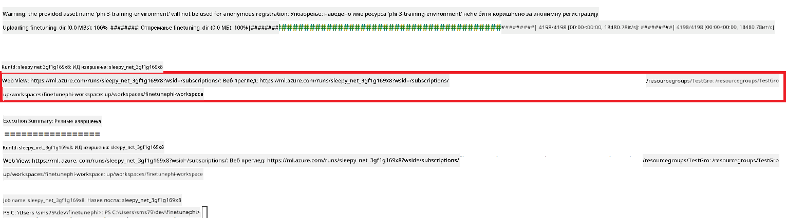

### Deploy the fine-tuned model

To integrate the fine-tuned Phi-3 model with Prompt Flow, you need to deploy the model to make it accessible for real-time inference. This process involves registering the model, creating an online endpoint, and deploying the model.

#### Set the model name, endpoint name, and deployment name for deployment

1. Open *config.py* file.

1. Replace `AZURE_MODEL_NAME = "your_fine_tuned_model_name"` with the desired name for your model.

1. Replace `AZURE_ENDPOINT_NAME = "your_fine_tuned_model_endpoint_name"` with the desired name for your endpoint.

1. Replace `AZURE_DEPLOYMENT_NAME = "your_fine_tuned_model_deployment_name"` sa željenim imenom za vašu deployment.

#### Dodajte kod u *deploy_model.py* fajl

Pokretanje *deploy_model.py* fajla automatizuje ceo proces deploy-a. Registruje model, kreira endpoint i izvršava deploy na osnovu podešavanja iz config.py fajla, koji uključuje ime modela, ime endpointa i ime deploy-a.

1. Otvorite *deploy_model.py* fajl u Visual Studio Code-u.

1. Dodajte sledeći kod u *deploy_model.py*.

    ```python
    import logging
    from azure.identity import AzureCliCredential
    from azure.ai.ml import MLClient
    from azure.ai.ml.entities import Model, ProbeSettings, ManagedOnlineEndpoint, ManagedOnlineDeployment, IdentityConfiguration, ManagedIdentityConfiguration, OnlineRequestSettings
    from azure.ai.ml.constants import AssetTypes

    # Configuration imports
    from config import (
        AZURE_SUBSCRIPTION_ID,
        AZURE_RESOURCE_GROUP_NAME,
        AZURE_ML_WORKSPACE_NAME,
        AZURE_MANAGED_IDENTITY_RESOURCE_ID,
        AZURE_MANAGED_IDENTITY_CLIENT_ID,
        AZURE_MODEL_NAME,
        AZURE_ENDPOINT_NAME,
        AZURE_DEPLOYMENT_NAME
    )

    # Constants
    JOB_NAME = "your-job-name"
    COMPUTE_INSTANCE_TYPE = "Standard_E4s_v3"

    deployment_env_vars = {
        "SUBSCRIPTION_ID": AZURE_SUBSCRIPTION_ID,
        "RESOURCE_GROUP_NAME": AZURE_RESOURCE_GROUP_NAME,
        "UAI_CLIENT_ID": AZURE_MANAGED_IDENTITY_CLIENT_ID,
    }

    # Logging setup
    logging.basicConfig(
        format="%(asctime)s - %(levelname)s - %(name)s - %(message)s",
        datefmt="%Y-%m-%d %H:%M:%S",
        level=logging.DEBUG
    )
    logger = logging.getLogger(__name__)

    def get_ml_client():
        """Initialize and return the ML Client."""
        credential = AzureCliCredential()
        return MLClient(credential, AZURE_SUBSCRIPTION_ID, AZURE_RESOURCE_GROUP_NAME, AZURE_ML_WORKSPACE_NAME)

    def register_model(ml_client, model_name, job_name):
        """Register a new model."""
        model_path = f"azureml://jobs/{job_name}/outputs/artifacts/paths/model_output"
        logger.info(f"Registering model {model_name} from job {job_name} at path {model_path}.")
        run_model = Model(
            path=model_path,
            name=model_name,
            description="Model created from run.",
            type=AssetTypes.MLFLOW_MODEL,
        )
        model = ml_client.models.create_or_update(run_model)
        logger.info(f"Registered model ID: {model.id}")
        return model

    def delete_existing_endpoint(ml_client, endpoint_name):
        """Delete existing endpoint if it exists."""
        try:
            endpoint_result = ml_client.online_endpoints.get(name=endpoint_name)
            logger.info(f"Deleting existing endpoint {endpoint_name}.")
            ml_client.online_endpoints.begin_delete(name=endpoint_name).result()
            logger.info(f"Deleted existing endpoint {endpoint_name}.")
        except Exception as e:
            logger.info(f"No existing endpoint {endpoint_name} found to delete: {e}")

    def create_or_update_endpoint(ml_client, endpoint_name, description=""):
        """Create or update an endpoint."""
        delete_existing_endpoint(ml_client, endpoint_name)
        logger.info(f"Creating new endpoint {endpoint_name}.")
        endpoint = ManagedOnlineEndpoint(
            name=endpoint_name,
            description=description,
            identity=IdentityConfiguration(
                type="user_assigned",
                user_assigned_identities=[ManagedIdentityConfiguration(resource_id=AZURE_MANAGED_IDENTITY_RESOURCE_ID)]
            )
        )
        endpoint_result = ml_client.online_endpoints.begin_create_or_update(endpoint).result()
        logger.info(f"Created new endpoint {endpoint_name}.")
        return endpoint_result

    def create_or_update_deployment(ml_client, endpoint_name, deployment_name, model):
        """Create or update a deployment."""

        logger.info(f"Creating deployment {deployment_name} for endpoint {endpoint_name}.")
        deployment = ManagedOnlineDeployment(
            name=deployment_name,
            endpoint_name=endpoint_name,
            model=model.id,
            instance_type=COMPUTE_INSTANCE_TYPE,
            instance_count=1,
            environment_variables=deployment_env_vars,
            request_settings=OnlineRequestSettings(
                max_concurrent_requests_per_instance=3,
                request_timeout_ms=180000,
                max_queue_wait_ms=120000
            ),
            liveness_probe=ProbeSettings(
                failure_threshold=30,
                success_threshold=1,
                period=100,
                initial_delay=500,
            ),
            readiness_probe=ProbeSettings(
                failure_threshold=30,
                success_threshold=1,
                period=100,
                initial_delay=500,
            ),
        )
        deployment_result = ml_client.online_deployments.begin_create_or_update(deployment).result()
        logger.info(f"Created deployment {deployment.name} for endpoint {endpoint_name}.")
        return deployment_result

    def set_traffic_to_deployment(ml_client, endpoint_name, deployment_name):
        """Set traffic to the specified deployment."""
        try:
            # Fetch the current endpoint details
            endpoint = ml_client.online_endpoints.get(name=endpoint_name)
            
            # Log the current traffic allocation for debugging
            logger.info(f"Current traffic allocation: {endpoint.traffic}")
            
            # Set the traffic allocation for the deployment
            endpoint.traffic = {deployment_name: 100}
            
            # Update the endpoint with the new traffic allocation
            endpoint_poller = ml_client.online_endpoints.begin_create_or_update(endpoint)
            updated_endpoint = endpoint_poller.result()
            
            # Log the updated traffic allocation for debugging
            logger.info(f"Updated traffic allocation: {updated_endpoint.traffic}")
            logger.info(f"Set traffic to deployment {deployment_name} at endpoint {endpoint_name}.")
            return updated_endpoint
        except Exception as e:
            # Log any errors that occur during the process
            logger.error(f"Failed to set traffic to deployment: {e}")
            raise


    def main():
        ml_client = get_ml_client()

        registered_model = register_model(ml_client, AZURE_MODEL_NAME, JOB_NAME)
        logger.info(f"Registered model ID: {registered_model.id}")

        endpoint = create_or_update_endpoint(ml_client, AZURE_ENDPOINT_NAME, "Endpoint for finetuned Phi-3 model")
        logger.info(f"Endpoint {AZURE_ENDPOINT_NAME} is ready.")

        try:
            deployment = create_or_update_deployment(ml_client, AZURE_ENDPOINT_NAME, AZURE_DEPLOYMENT_NAME, registered_model)
            logger.info(f"Deployment {AZURE_DEPLOYMENT_NAME} is created for endpoint {AZURE_ENDPOINT_NAME}.")

            set_traffic_to_deployment(ml_client, AZURE_ENDPOINT_NAME, AZURE_DEPLOYMENT_NAME)
            logger.info(f"Traffic is set to deployment {AZURE_DEPLOYMENT_NAME} at endpoint {AZURE_ENDPOINT_NAME}.")
        except Exception as e:
            logger.error(f"Failed to create or update deployment: {e}")

    if __name__ == "__main__":
        main()

    ```

1. Obavite sledeće korake da dobijete `JOB_NAME`:

    - Navigate to Azure Machine Learning resource that you created.
    - Select **Studio web URL** to open the Azure Machine Learning workspace.
    - Select **Jobs** from the left side tab.
    - Select the experiment for fine-tuning. For example, *finetunephi*.
    - Select the job that you created.
    - Copy and paste your job Name into the `JOB_NAME = "your-job-name"` in *deploy_model.py* file.

1. Replace `COMPUTE_INSTANCE_TYPE` sa vašim specifičnim podacima.

1. Otkucajte sledeću komandu da pokrenete *deploy_model.py* skriptu i započnete proces deploy-a u Azure Machine Learning-u.

    ```python
    python deploy_model.py
    ```

> [!WARNING]
> Da biste izbegli dodatne troškove na vašem nalogu, obavezno obrišite kreirani endpoint u Azure Machine Learning workspace-u.
>

#### Proverite status deploy-a u Azure Machine Learning Workspace-u

1. Posetite [Azure ML Studio](https://ml.azure.com/home?wt.mc_id=studentamb_279723).

1. Idite do Azure Machine Learning workspace-a koji ste kreirali.

1. Izaberite **Studio web URL** da otvorite Azure Machine Learning workspace.

1. Izaberite **Endpoints** sa leve strane.

    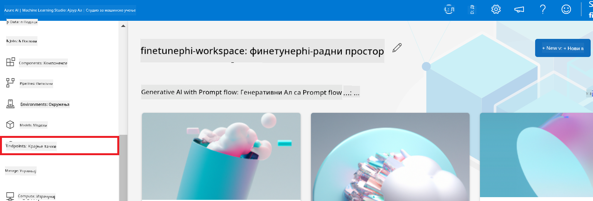

2. Izaberite endpoint koji ste kreirali.

    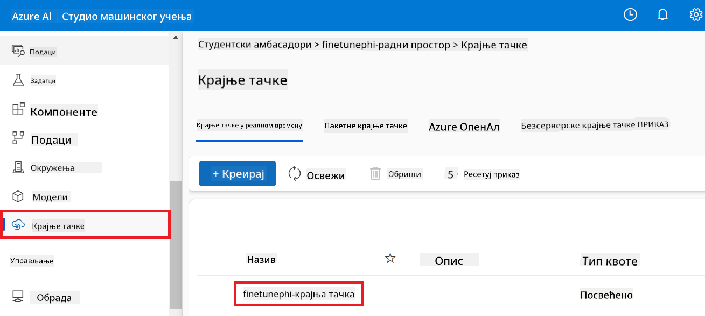

3. Na ovoj stranici možete upravljati endpoint-ima kreiranim tokom procesa deploy-a.

## Scenario 3: Integracija sa Prompt flow i razgovor sa vašim prilagođenim modelom

### Integracija prilagođenog Phi-3 modela sa Prompt flow

Nakon uspešnog deploy-a vašeg fino podešenog modela, sada ga možete integrisati sa Prompt flow da biste koristili model u realnom vremenu, omogućavajući razne interaktivne zadatke sa vašim prilagođenim Phi-3 modelom.

#### Postavite api key i endpoint uri fino podešenog Phi-3 modela

1. Idite do Azure Machine Learning workspace-a koji ste kreirali.
1. Izaberite **Endpoints** sa leve strane.
1. Izaberite endpoint koji ste kreirali.
1. Izaberite **Consume** iz navigacionog menija.
1. Kopirajte i nalepite vaš **REST endpoint** u *config.py* fajl, zamenjujući `AZURE_ML_ENDPOINT = "your_fine_tuned_model_endpoint_uri"` with your **REST endpoint**.
1. Copy and paste your **Primary key** into the *config.py* file, replacing `AZURE_ML_API_KEY = "your_fine_tuned_model_api_key"` sa vašim **Primary key**.

    

#### Dodajte kod u *flow.dag.yml* fajl

1. Otvorite *flow.dag.yml* fajl u Visual Studio Code-u.

1. Dodajte sledeći kod u *flow.dag.yml*.

    ```yml
    inputs:
      input_data:
        type: string
        default: "Who founded Microsoft?"

    outputs:
      answer:
        type: string
        reference: ${integrate_with_promptflow.output}

    nodes:
    - name: integrate_with_promptflow
      type: python
      source:
        type: code
        path: integrate_with_promptflow.py
      inputs:
        input_data: ${inputs.input_data}
    ```

#### Dodajte kod u *integrate_with_promptflow.py* fajl

1. Otvorite *integrate_with_promptflow.py* fajl u Visual Studio Code-u.

1. Dodajte sledeći kod u *integrate_with_promptflow.py*.

    ```python
    import logging
    import requests
    from promptflow.core import tool
    import asyncio
    import platform
    from config import (
        AZURE_ML_ENDPOINT,
        AZURE_ML_API_KEY
    )

    # Logging setup
    logging.basicConfig(
        format="%(asctime)s - %(levelname)s - %(name)s - %(message)s",
        datefmt="%Y-%m-%d %H:%M:%S",
        level=logging.DEBUG
    )
    logger = logging.getLogger(__name__)

    def query_azml_endpoint(input_data: list, endpoint_url: str, api_key: str) -> str:
        """
        Send a request to the Azure ML endpoint with the given input data.
        """
        headers = {
            "Content-Type": "application/json",
            "Authorization": f"Bearer {api_key}"
        }
        data = {
            "input_data": [input_data],
            "params": {
                "temperature": 0.7,
                "max_new_tokens": 128,
                "do_sample": True,
                "return_full_text": True
            }
        }
        try:
            response = requests.post(endpoint_url, json=data, headers=headers)
            response.raise_for_status()
            result = response.json()[0]
            logger.info("Successfully received response from Azure ML Endpoint.")
            return result
        except requests.exceptions.RequestException as e:
            logger.error(f"Error querying Azure ML Endpoint: {e}")
            raise

    def setup_asyncio_policy():
        """
        Setup asyncio event loop policy for Windows.
        """
        if platform.system() == 'Windows':
            asyncio.set_event_loop_policy(asyncio.WindowsSelectorEventLoopPolicy())
            logger.info("Set Windows asyncio event loop policy.")

    @tool
    def my_python_tool(input_data: str) -> str:
        """
        Tool function to process input data and query the Azure ML endpoint.
        """
        setup_asyncio_policy()
        return query_azml_endpoint(input_data, AZURE_ML_ENDPOINT, AZURE_ML_API_KEY)

    ```

### Razgovarajte sa vašim prilagođenim modelom

1. Otkucajte sledeću komandu da pokrenete *deploy_model.py* skriptu i započnete proces deploy-a u Azure Machine Learning-u.

    ```python
    pf flow serve --source ./ --port 8080 --host localhost
    ```

1. Evo primera rezultata: Sada možete razgovarati sa vašim prilagođenim Phi-3 modelom. Preporučuje se da postavljate pitanja bazirana na podacima korišćenim za fino podešavanje.

    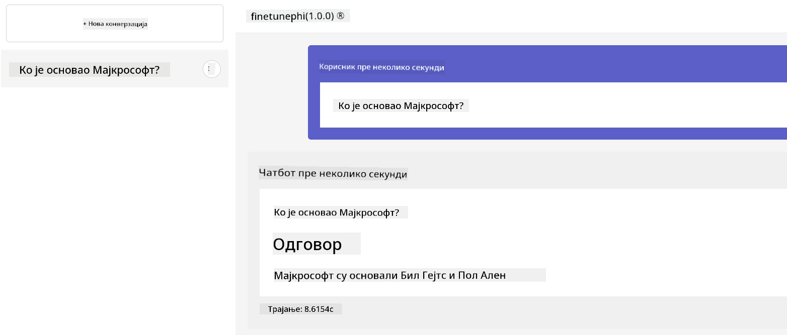

**Ограничење одговорности**:  
Овај документ је преведен коришћењем AI сервиса за превођење [Co-op Translator](https://github.com/Azure/co-op-translator). Иако тежимо тачности, молимо имајте у виду да аутоматски преводи могу садржати грешке или нетачности. Оригинални документ на његовом изворном језику треба сматрати ауторитетним извором. За критичне информације препоручује се професионални људски превод. Нисмо одговорни за било каква неспоразума или погрешна тумачења која произлазе из коришћења овог превода.