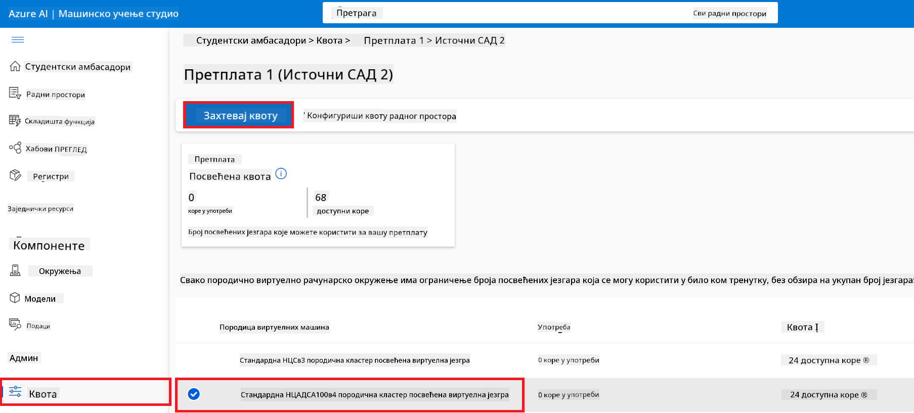
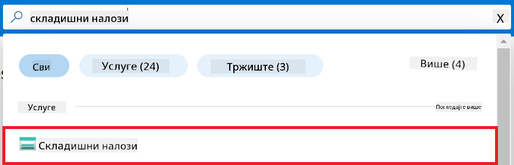
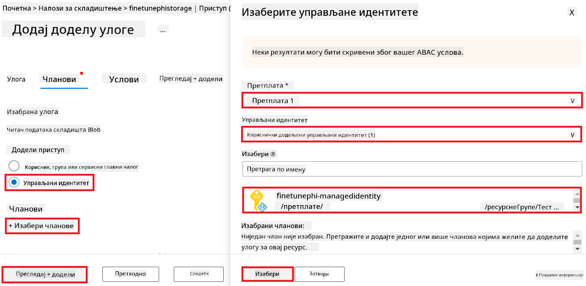
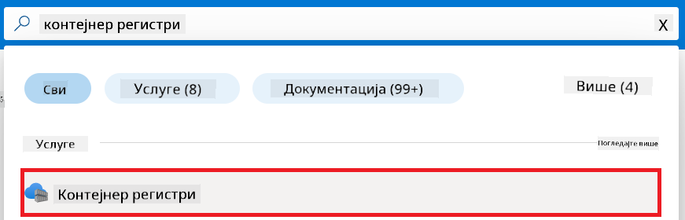
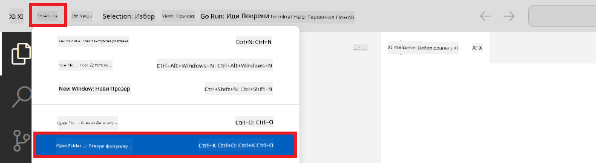
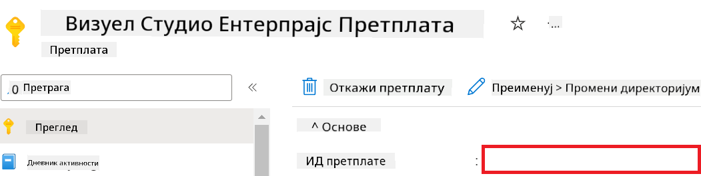
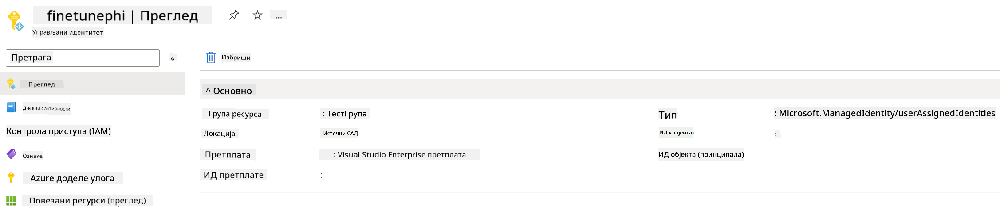
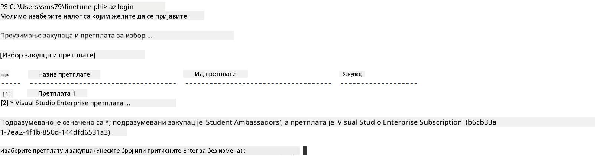
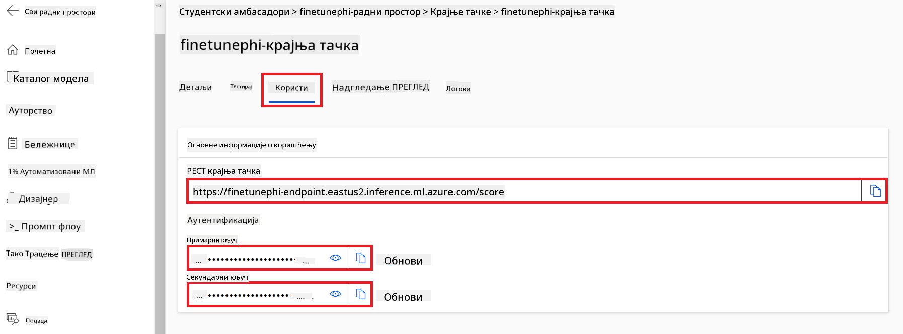
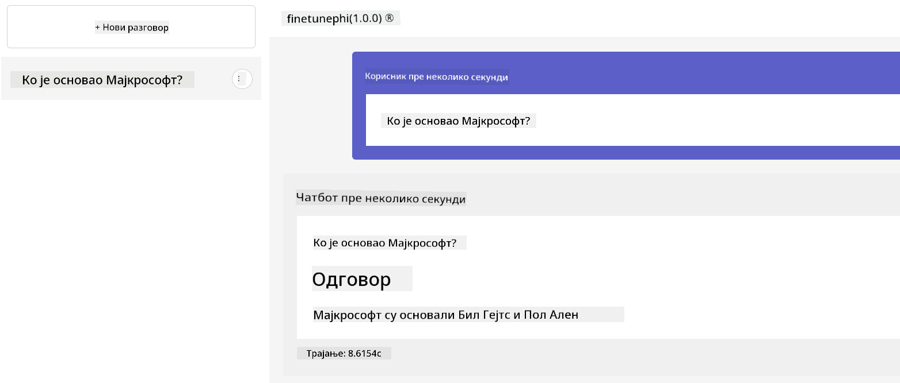

<!--
CO_OP_TRANSLATOR_METADATA:
{
  "original_hash": "455be2b7b9c3390d367d528f8fab2aa0",
  "translation_date": "2025-07-17T00:47:06+00:00",
  "source_file": "md/02.Application/01.TextAndChat/Phi3/E2E_Phi-3-FineTuning_PromptFlow_Integration.md",
  "language_code": "sr"
}
-->
# Фино подешавање и интеграција прилагођених Phi-3 модела са Prompt flow

Овај пример од почетка до краја (E2E) заснован је на водичу "[Fine-Tune and Integrate Custom Phi-3 Models with Prompt Flow: Step-by-Step Guide](https://techcommunity.microsoft.com/t5/educator-developer-blog/fine-tune-and-integrate-custom-phi-3-models-with-prompt-flow/ba-p/4178612?WT.mc_id=aiml-137032-kinfeylo)" из Microsoft Tech Community. Уводи процесе фино подешавања, распоређивања и интеграције прилагођених Phi-3 модела са Prompt flow.

## Преглед

У овом E2E примеру научићете како да фино подесите Phi-3 модел и интегришете га са Prompt flow. Користећи Azure Machine Learning и Prompt flow, успоставићете радни ток за распоређивање и коришћење прилагођених AI модела. Овај E2E пример подељен је у три сценарија:

**Сценарио 1: Подешавање Azure ресурса и припрема за фино подешавање**

**Сценарио 2: Фино подешавање Phi-3 модела и распоређивање у Azure Machine Learning Studio**

**Сценарио 3: Интеграција са Prompt flow и разговор са вашим прилагођеним моделом**

Ево прегледа овог E2E примера.


### Садржај

1. **[Сценарио 1: Подешавање Azure ресурса и припрема за фино подешавање](../../../../../../md/02.Application/01.TextAndChat/Phi3)**
    - [Креирање Azure Machine Learning радног простора](../../../../../../md/02.Application/01.TextAndChat/Phi3)
    - [Захтев за GPU квоте у Azure претплати](../../../../../../md/02.Application/01.TextAndChat/Phi3)
    - [Додавање улоге](../../../../../../md/02.Application/01.TextAndChat/Phi3)
    - [Подешавање пројекта](../../../../../../md/02.Application/01.TextAndChat/Phi3)
    - [Припрема скупa података за фино подешавање](../../../../../../md/02.Application/01.TextAndChat/Phi3)

1. **[Сценарио 2: Фино подешавање Phi-3 модела и распоређивање у Azure Machine Learning Studio](../../../../../../md/02.Application/01.TextAndChat/Phi3)**
    - [Подешавање Azure CLI](../../../../../../md/02.Application/01.TextAndChat/Phi3)
    - [Фино подешавање Phi-3 модела](../../../../../../md/02.Application/01.TextAndChat/Phi3)
    - [Распоређивање фино подешеног модела](../../../../../../md/02.Application/01.TextAndChat/Phi3)

1. **[Сценарио 3: Интеграција са Prompt flow и разговор са вашим прилагођеним моделом](../../../../../../md/02.Application/01.TextAndChat/Phi3)**
    - [Интеграција прилагођеног Phi-3 модела са Prompt flow](../../../../../../md/02.Application/01.TextAndChat/Phi3)
    - [Разговор са вашим прилагођеним моделом](../../../../../../md/02.Application/01.TextAndChat/Phi3)

## Сценарио 1: Подешавање Azure ресурса и припрема за фино подешавање

### Креирање Azure Machine Learning радног простора

1. Упишите *azure machine learning* у **претраживач** на врху портала и изаберите **Azure Machine Learning** из понуђених опција.

    

1. Изаберите **+ Create** из навигационог менија.

1. Изаберите **New workspace** из навигационог менија.

    

1. Извршите следеће кораке:

    - Изаберите вашу Azure **Subscription**.
    - Изаберите **Resource group** коју ћете користити (направите нову ако је потребно).
    - Унесите **Workspace Name**. Мора бити јединствена вредност.
    - Изаберите **Region** коју желите да користите.
    - Изаберите **Storage account** који ћете користити (направите нови ако је потребно).
    - Изаберите **Key vault** који ћете користити (направите нови ако је потребно).
    - Изаберите **Application insights** који ћете користити (направите нови ако је потребно).
    - Изаберите **Container registry** који ћете користити (направите нови ако је потребно).

    

1. Изаберите **Review + Create**.

1. Изаберите **Create**.

### Захтев за GPU квоте у Azure претплати

У овом E2E примеру користићете *Standard_NC24ads_A100_v4 GPU* за фино подешавање, што захтева захтев за квоту, и *Standard_E4s_v3* CPU за распоређивање, што не захтева захтев за квоту.

> [!NOTE]
>
> Само Pay-As-You-Go претплате (стандардни тип претплате) имају право на доделу GPU ресурса; претплате са погодностима тренутно нису подржане.
>
> За оне који користе претплате са погодностима (као што је Visual Studio Enterprise Subscription) или желе брзо да тестирају процес фино подешавања и распоређивања, овај туторијал пружа и смернице за фино подешавање са минималним скупом података користећи CPU. Међутим, важно је напоменути да су резултати фино подешавања знатно бољи када се користи GPU са већим скупом података.

1. Посетите [Azure ML Studio](https://ml.azure.com/home?wt.mc_id=studentamb_279723).

1. Извршите следеће кораке да бисте затражили квоту за *Standard NCADSA100v4 Family*:

    - Изаберите **Quota** са леве стране.
    - Изаберите **Virtual machine family** коју желите да користите. На пример, изаберите **Standard NCADSA100v4 Family Cluster Dedicated vCPUs**, који укључује *Standard_NC24ads_A100_v4* GPU.
    - Изаберите **Request quota** из навигационог менија.

        

    - Унутар странице Request quota унесите **New cores limit** коју желите да користите. На пример, 24.
    - Унутар странице Request quota изаберите **Submit** да бисте затражили GPU квоту.

> [!NOTE]
> Можете изабрати одговарајући GPU или CPU за ваше потребе према документу [Sizes for Virtual Machines in Azure](https://learn.microsoft.com/azure/virtual-machines/sizes/overview?tabs=breakdownseries%2Cgeneralsizelist%2Ccomputesizelist%2Cmemorysizelist%2Cstoragesizelist%2Cgpusizelist%2Cfpgasizelist%2Chpcsizelist).

### Додавање улоге

Да бисте фино подесили и распоредили ваше моделе, прво морате да креирате User Assigned Managed Identity (UAI) и доделите јој одговарајуће дозволе. Ова UAI ће се користити за аутентификацију током распоређивања.

#### Креирање User Assigned Managed Identity (UAI)

1. Упишите *managed identities* у **претраживач** на врху портала и изаберите **Managed Identities** из понуђених опција.

    

1. Изаберите **+ Create**.

    

1. Извршите следеће кораке:

    - Изаберите вашу Azure **Subscription**.
    - Изаберите **Resource group** коју ћете користити (направите нову ако је потребно).
    - Изаберите **Region** коју желите да користите.
    - Унесите **Name**. Мора бити јединствена вредност.

1. Изаберите **Review + create**.

1. Изаберите **+ Create**.

#### Додавање улоге Contributor Managed Identity-ју

1. Идите на ресурс Managed Identity који сте креирали.

1. Изаберите **Azure role assignments** са леве стране.

1. Изаберите **+Add role assignment** из навигационог менија.

1. Унутар странице Add role assignment, извршите следеће кораке:
    - Изаберите **Scope** као **Resource group**.
    - Изаберите вашу Azure **Subscription**.
    - Изаберите **Resource group** коју користите.
    - Изаберите улогу **Contributor**.

    

1. Изаберите **Save**.

#### Додавање улоге Storage Blob Data Reader Managed Identity-ју

1. Упишите *storage accounts* у **претраживач** на врху портала и изаберите **Storage accounts** из понуђених опција.

    

1. Изаберите налог за складиштење који је повезан са Azure Machine Learning радним простором који сте креирали. На пример, *finetunephistorage*.

1. Извршите следеће кораке да бисте отишли на страницу Add role assignment:

    - Идите на Azure Storage налог који сте креирали.
    - Изаберите **Access Control (IAM)** са леве стране.
    - Изаберите **+ Add** из навигационог менија.
    - Изаберите **Add role assignment** из навигационог менија.

    

1. Унутар странице Add role assignment, извршите следеће кораке:

    - У пољу за претрагу улога укуцајте *Storage Blob Data Reader* и изаберите **Storage Blob Data Reader** из понуђених опција.
    - Изаберите **Next**.
    - На страници Members изаберите **Assign access to** као **Managed identity**.
    - Изаберите **+ Select members**.
    - На страници Select managed identities изаберите вашу Azure **Subscription**.
    - Изаберите **Managed identity** као **Manage Identity**.
    - Изаберите Manage Identity коју сте креирали. На пример, *finetunephi-managedidentity*.
    - Изаберите **Select**.

    

1. Изаберите **Review + assign**.

#### Додавање улоге AcrPull Managed Identity-ју

1. Упишите *container registries* у **претраживач** на врху портала и изаберите **Container registries** из понуђених опција.

    

1. Изаберите регистар контејнера који је повезан са Azure Machine Learning радним простором. На пример, *finetunephicontainerregistries*

1. Извршите следеће кораке да бисте отишли на страницу Add role assignment:

    - Изаберите **Access Control (IAM)** са леве стране.
    - Изаберите **+ Add** из навигационог менија.
    - Изаберите **Add role assignment** из навигационог менија.

1. Унутар странице Add role assignment, извршите следеће кораке:

    - У пољу за претрагу улога укуцајте *AcrPull* и изаберите **AcrPull** из понуђених опција.
    - Изаберите **Next**.
    - На страници Members изаберите **Assign access to** као **Managed identity**.
    - Изаберите **+ Select members**.
    - На страници Select managed identities изаберите вашу Azure **Subscription**.
    - Изаберите **Managed identity** као **Manage Identity**.
    - Изаберите Manage Identity коју сте креирали. На пример, *finetunephi-managedidentity*.
    - Изаберите **Select**.
    - Изаберите **Review + assign**.

### Подешавање пројекта

Сада ћете креирати фасциклу у којој ћете радити и подесити виртуелно окружење за развој програма који комуницира са корисницима и користи сачувану историју разговора из Azure Cosmos DB да би обогаћивао своје одговоре.

#### Креирање фасцикле за рад

1. Отворите терминал и укуцајте следећу команду да бисте креирали фасциклу под називом *finetune-phi* у подразумеваној путањи.

    ```console
    mkdir finetune-phi
    ```

1. Укуцајте следећу команду у терминалу да бисте ушли у фасциклу *finetune-phi* коју сте креирали.

    ```console
    cd finetune-phi
    ```

#### Креирање виртуелног окружења

1. Укуцајте следећу команду у терминалу да бисте креирали виртуелно окружење под називом *.venv*.

    ```console
    python -m venv .venv
    ```

1. Укуцајте следећу команду у терминалу да бисте активирали виртуелно окружење.

    ```console
    .venv\Scripts\activate.bat
    ```
> [!NOTE]
>
> Ако је успело, требало би да видите *(.venv)* пре командне линије.
#### Инсталирајте потребне пакете

1. Укуцајте следеће команде у терминалу да бисте инсталирали потребне пакете.

    ```console
    pip install datasets==2.19.1
    pip install transformers==4.41.1
    pip install azure-ai-ml==1.16.0
    pip install torch==2.3.1
    pip install trl==0.9.4
    pip install promptflow==1.12.0
    ```

#### Креирање фајлова пројекта

У овом задатку ћете креирати основне фајлове за наш пројекат. Ови фајлови укључују скрипте за преузимање скупa података, подешавање Azure Machine Learning окружења, фино подешавање Phi-3 модела и деплој фино подешеног модела. Такође ћете креирати *conda.yml* фајл за подешавање окружења за фино подешавање.

У овом задатку ћете:

- Креирати *download_dataset.py* фајл за преузимање скупa података.
- Креирати *setup_ml.py* фајл за подешавање Azure Machine Learning окружења.
- Креирати *fine_tune.py* фајл у фасцикли *finetuning_dir* за фино подешавање Phi-3 модела користећи скуп података.
- Креирати *conda.yml* фајл за подешавање окружења за фино подешавање.
- Креирати *deploy_model.py* фајл за деплој фино подешеног модела.
- Креирати *integrate_with_promptflow.py* фајл за интеграцију фино подешеног модела и извршавање модела користећи Prompt flow.
- Креирати *flow.dag.yml* фајл за подешавање структуре радног тока за Prompt flow.
- Креирати *config.py* фајл за унос Azure информација.

> [!NOTE]
>
> Комплетна структура фасцикли:
>
> ```text
> └── YourUserName
> .    └── finetune-phi
> .        ├── finetuning_dir
> .        │      └── fine_tune.py
> .        ├── conda.yml
> .        ├── config.py
> .        ├── deploy_model.py
> .        ├── download_dataset.py
> .        ├── flow.dag.yml
> .        ├── integrate_with_promptflow.py
> .        └── setup_ml.py
> ```

1. Отворите **Visual Studio Code**.

1. Изаберите **File** из менија.

1. Изаберите **Open Folder**.

1. Изаберите фасциклу *finetune-phi* коју сте креирали, која се налази на *C:\Users\yourUserName\finetune-phi*.

    

1. У левом панелу Visual Studio Code-а, кликните десним тастером миша и изаберите **New File** да бисте креирали нови фајл под именом *download_dataset.py*.

1. У левом панелу Visual Studio Code-а, кликните десним тастером миша и изаберите **New File** да бисте креирали нови фајл под именом *setup_ml.py*.

1. У левом панелу Visual Studio Code-а, кликните десним тастером миша и изаберите **New File** да бисте креирали нови фајл под именом *deploy_model.py*.

    

1. У левом панелу Visual Studio Code-а, кликните десним тастером миша и изаберите **New Folder** да бисте креирали нову фасциклу под именом *finetuning_dir*.

1. У фасцикли *finetuning_dir*, креирајте нови фајл под именом *fine_tune.py*.

#### Креирање и конфигурисање *conda.yml* фајла

1. У левом панелу Visual Studio Code-а, кликните десним тастером миша и изаберите **New File** да бисте креирали нови фајл под именом *conda.yml*.

1. Додајте следећи код у *conda.yml* фајл за подешавање окружења за фино подешавање Phi-3 модела.

    ```yml
    name: phi-3-training-env
    channels:
      - defaults
      - conda-forge
    dependencies:
      - python=3.10
      - pip
      - numpy<2.0
      - pip:
          - torch==2.4.0
          - torchvision==0.19.0
          - trl==0.8.6
          - transformers==4.41
          - datasets==2.21.0
          - azureml-core==1.57.0
          - azure-storage-blob==12.19.0
          - azure-ai-ml==1.16
          - azure-identity==1.17.1
          - accelerate==0.33.0
          - mlflow==2.15.1
          - azureml-mlflow==1.57.0
    ```

#### Креирање и конфигурисање *config.py* фајла

1. У левом панелу Visual Studio Code-а, кликните десним тастером миша и изаберите **New File** да бисте креирали нови фајл под именом *config.py*.

1. Додајте следећи код у *config.py* фајл да бисте унели ваше Azure информације.

    ```python
    # Azure settings
    AZURE_SUBSCRIPTION_ID = "your_subscription_id"
    AZURE_RESOURCE_GROUP_NAME = "your_resource_group_name" # "TestGroup"

    # Azure Machine Learning settings
    AZURE_ML_WORKSPACE_NAME = "your_workspace_name" # "finetunephi-workspace"

    # Azure Managed Identity settings
    AZURE_MANAGED_IDENTITY_CLIENT_ID = "your_azure_managed_identity_client_id"
    AZURE_MANAGED_IDENTITY_NAME = "your_azure_managed_identity_name" # "finetunephi-mangedidentity"
    AZURE_MANAGED_IDENTITY_RESOURCE_ID = f"/subscriptions/{AZURE_SUBSCRIPTION_ID}/resourceGroups/{AZURE_RESOURCE_GROUP_NAME}/providers/Microsoft.ManagedIdentity/userAssignedIdentities/{AZURE_MANAGED_IDENTITY_NAME}"

    # Dataset file paths
    TRAIN_DATA_PATH = "data/train_data.jsonl"
    TEST_DATA_PATH = "data/test_data.jsonl"

    # Fine-tuned model settings
    AZURE_MODEL_NAME = "your_fine_tuned_model_name" # "finetune-phi-model"
    AZURE_ENDPOINT_NAME = "your_fine_tuned_model_endpoint_name" # "finetune-phi-endpoint"
    AZURE_DEPLOYMENT_NAME = "your_fine_tuned_model_deployment_name" # "finetune-phi-deployment"

    AZURE_ML_API_KEY = "your_fine_tuned_model_api_key"
    AZURE_ML_ENDPOINT = "your_fine_tuned_model_endpoint_uri" # "https://{your-endpoint-name}.{your-region}.inference.ml.azure.com/score"
    ```

#### Додавање Azure променљивих окружења

1. Извршите следеће кораке да бисте додали Azure Subscription ID:

    - Укуцајте *subscriptions* у **претраживач** на врху портала и изаберите **Subscriptions** из понуђених опција.
    - Изаберите Azure Subscription који тренутно користите.
    - Копирајте и налепите ваш Subscription ID у *config.py* фајл.

    

1. Извршите следеће кораке да бисте додали Azure Workspace Name:

    - Идите на Azure Machine Learning ресурс који сте креирали.
    - Копирајте и налепите име вашег радног простора у *config.py* фајл.

    

1. Извршите следеће кораке да бисте додали Azure Resource Group Name:

    - Идите на Azure Machine Learning ресурс који сте креирали.
    - Копирајте и налепите име ваше Azure Resource Group у *config.py* фајл.

    

2. Извршите следеће кораке да бисте додали Azure Managed Identity име:

    - Идите на Managed Identities ресурс који сте креирали.
    - Копирајте и налепите име ваше Azure Managed Identity у *config.py* фајл.

    

### Припрема скупa података за фино подешавање

У овом задатку ћете покренути *download_dataset.py* фајл да бисте преузели *ULTRACHAT_200k* скуп података у ваше локално окружење. Затим ћете користити овај скуп података за фино подешавање Phi-3 модела у Azure Machine Learning.

#### Преузмите скуп података користећи *download_dataset.py*

1. Отворите *download_dataset.py* фајл у Visual Studio Code-у.

1. Додајте следећи код у *download_dataset.py*.

    ```python
    import json
    import os
    from datasets import load_dataset
    from config import (
        TRAIN_DATA_PATH,
        TEST_DATA_PATH)

    def load_and_split_dataset(dataset_name, config_name, split_ratio):
        """
        Load and split a dataset.
        """
        # Load the dataset with the specified name, configuration, and split ratio
        dataset = load_dataset(dataset_name, config_name, split=split_ratio)
        print(f"Original dataset size: {len(dataset)}")
        
        # Split the dataset into train and test sets (80% train, 20% test)
        split_dataset = dataset.train_test_split(test_size=0.2)
        print(f"Train dataset size: {len(split_dataset['train'])}")
        print(f"Test dataset size: {len(split_dataset['test'])}")
        
        return split_dataset

    def save_dataset_to_jsonl(dataset, filepath):
        """
        Save a dataset to a JSONL file.
        """
        # Create the directory if it does not exist
        os.makedirs(os.path.dirname(filepath), exist_ok=True)
        
        # Open the file in write mode
        with open(filepath, 'w', encoding='utf-8') as f:
            # Iterate over each record in the dataset
            for record in dataset:
                # Dump the record as a JSON object and write it to the file
                json.dump(record, f)
                # Write a newline character to separate records
                f.write('\n')
        
        print(f"Dataset saved to {filepath}")

    def main():
        """
        Main function to load, split, and save the dataset.
        """
        # Load and split the ULTRACHAT_200k dataset with a specific configuration and split ratio
        dataset = load_and_split_dataset("HuggingFaceH4/ultrachat_200k", 'default', 'train_sft[:1%]')
        
        # Extract the train and test datasets from the split
        train_dataset = dataset['train']
        test_dataset = dataset['test']

        # Save the train dataset to a JSONL file
        save_dataset_to_jsonl(train_dataset, TRAIN_DATA_PATH)
        
        # Save the test dataset to a separate JSONL file
        save_dataset_to_jsonl(test_dataset, TEST_DATA_PATH)

    if __name__ == "__main__":
        main()

    ```

> [!TIP]
>
> **Упутство за фино подешавање са минималним скупом података користећи CPU**
>
> Ако желите да користите CPU за фино подешавање, овај приступ је идеалан за оне са претплатама које имају погодности (као што је Visual Studio Enterprise Subscription) или за брзо тестирање процеса фино подешавања и деплоја.
>
> Замените `dataset = load_and_split_dataset("HuggingFaceH4/ultrachat_200k", 'default', 'train_sft[:1%]')` са `dataset = load_and_split_dataset("HuggingFaceH4/ultrachat_200k", 'default', 'train_sft[:10]')`
>

1. Укуцајте следећу команду у терминалу да бисте покренули скрипту и преузели скуп података у ваше локално окружење.

    ```console
    python download_data.py
    ```

1. Проверите да ли су скупови података успешно сачувани у вашој локалној фасцикли *finetune-phi/data*.

> [!NOTE]
>
> **Величина скупa података и време фино подешавања**
>
> У овом E2E примеру користите само 1% скупa података (`train_sft[:1%]`). Ово значајно смањује количину података, убрзавајући и процес отпремања и фино подешавања. Можете прилагодити проценат да бисте пронашли праву равнотежу између времена тренинга и перформанси модела. Коришћење мањег дела скупa података смањује време потребно за фино подешавање, чинећи процес управљивијим за E2E пример.

## Сценарио 2: Фино подешавање Phi-3 модела и деплој у Azure Machine Learning Studio

### Подешавање Azure CLI

Потребно је да подесите Azure CLI да аутентификујете ваше окружење. Azure CLI вам омогућава да управљате Azure ресурсима директно из командне линије и пружа креденцијале потребне Azure Machine Learning-у за приступ тим ресурсима. За почетак инсталирајте [Azure CLI](https://learn.microsoft.com/cli/azure/install-azure-cli)

1. Отворите терминал и укуцајте следећу команду да бисте се пријавили на ваш Azure налог.

    ```console
    az login
    ```

1. Изаберите ваш Azure налог који желите да користите.

1. Изаберите Azure претплату коју желите да користите.

    

> [!TIP]
>
> Ако имате проблема са пријавом у Azure, покушајте да користите уређајни код. Отворите терминал и укуцајте следећу команду да бисте се пријавили на ваш Azure налог:
>
> ```console
> az login --use-device-code
> ```
>

### Фино подешавање Phi-3 модела

У овом задатку ћете фино подесити Phi-3 модел користећи обезбеђени скуп података. Прво ћете дефинисати процес фино подешавања у *fine_tune.py* фајлу. Затим ћете конфигурисати Azure Machine Learning окружење и покренути процес фино подешавања покретањем *setup_ml.py* фајла. Ова скрипта осигурава да се фино подешавање извршава у Azure Machine Learning окружењу.

Покретањем *setup_ml.py* покрећете процес фино подешавања у Azure Machine Learning окружењу.

#### Додавање кода у *fine_tune.py* фајл

1. Идите у фасциклу *finetuning_dir* и отворите *fine_tune.py* фајл у Visual Studio Code-у.

1. Додајте следећи код у *fine_tune.py*.

    ```python
    import argparse
    import sys
    import logging
    import os
    from datasets import load_dataset
    import torch
    import mlflow
    from transformers import AutoModelForCausalLM, AutoTokenizer, TrainingArguments
    from trl import SFTTrainer

    # To avoid the INVALID_PARAMETER_VALUE error in MLflow, disable MLflow integration
    os.environ["DISABLE_MLFLOW_INTEGRATION"] = "True"

    # Logging setup
    logging.basicConfig(
        format="%(asctime)s - %(levelname)s - %(name)s - %(message)s",
        datefmt="%Y-%m-%d %H:%M:%S",
        handlers=[logging.StreamHandler(sys.stdout)],
        level=logging.WARNING
    )
    logger = logging.getLogger(__name__)

    def initialize_model_and_tokenizer(model_name, model_kwargs):
        """
        Initialize the model and tokenizer with the given pretrained model name and arguments.
        """
        model = AutoModelForCausalLM.from_pretrained(model_name, **model_kwargs)
        tokenizer = AutoTokenizer.from_pretrained(model_name)
        tokenizer.model_max_length = 2048
        tokenizer.pad_token = tokenizer.unk_token
        tokenizer.pad_token_id = tokenizer.convert_tokens_to_ids(tokenizer.pad_token)
        tokenizer.padding_side = 'right'
        return model, tokenizer

    def apply_chat_template(example, tokenizer):
        """
        Apply a chat template to tokenize messages in the example.
        """
        messages = example["messages"]
        if messages[0]["role"] != "system":
            messages.insert(0, {"role": "system", "content": ""})
        example["text"] = tokenizer.apply_chat_template(
            messages, tokenize=False, add_generation_prompt=False
        )
        return example

    def load_and_preprocess_data(train_filepath, test_filepath, tokenizer):
        """
        Load and preprocess the dataset.
        """
        train_dataset = load_dataset('json', data_files=train_filepath, split='train')
        test_dataset = load_dataset('json', data_files=test_filepath, split='train')
        column_names = list(train_dataset.features)

        train_dataset = train_dataset.map(
            apply_chat_template,
            fn_kwargs={"tokenizer": tokenizer},
            num_proc=10,
            remove_columns=column_names,
            desc="Applying chat template to train dataset",
        )

        test_dataset = test_dataset.map(
            apply_chat_template,
            fn_kwargs={"tokenizer": tokenizer},
            num_proc=10,
            remove_columns=column_names,
            desc="Applying chat template to test dataset",
        )

        return train_dataset, test_dataset

    def train_and_evaluate_model(train_dataset, test_dataset, model, tokenizer, output_dir):
        """
        Train and evaluate the model.
        """
        training_args = TrainingArguments(
            bf16=True,
            do_eval=True,
            output_dir=output_dir,
            eval_strategy="epoch",
            learning_rate=5.0e-06,
            logging_steps=20,
            lr_scheduler_type="cosine",
            num_train_epochs=3,
            overwrite_output_dir=True,
            per_device_eval_batch_size=4,
            per_device_train_batch_size=4,
            remove_unused_columns=True,
            save_steps=500,
            seed=0,
            gradient_checkpointing=True,
            gradient_accumulation_steps=1,
            warmup_ratio=0.2,
        )

        trainer = SFTTrainer(
            model=model,
            args=training_args,
            train_dataset=train_dataset,
            eval_dataset=test_dataset,
            max_seq_length=2048,
            dataset_text_field="text",
            tokenizer=tokenizer,
            packing=True
        )

        train_result = trainer.train()
        trainer.log_metrics("train", train_result.metrics)

        mlflow.transformers.log_model(
            transformers_model={"model": trainer.model, "tokenizer": tokenizer},
            artifact_path=output_dir,
        )

        tokenizer.padding_side = 'left'
        eval_metrics = trainer.evaluate()
        eval_metrics["eval_samples"] = len(test_dataset)
        trainer.log_metrics("eval", eval_metrics)

    def main(train_file, eval_file, model_output_dir):
        """
        Main function to fine-tune the model.
        """
        model_kwargs = {
            "use_cache": False,
            "trust_remote_code": True,
            "torch_dtype": torch.bfloat16,
            "device_map": None,
            "attn_implementation": "eager"
        }

        # pretrained_model_name = "microsoft/Phi-3-mini-4k-instruct"
        pretrained_model_name = "microsoft/Phi-3.5-mini-instruct"

        with mlflow.start_run():
            model, tokenizer = initialize_model_and_tokenizer(pretrained_model_name, model_kwargs)
            train_dataset, test_dataset = load_and_preprocess_data(train_file, eval_file, tokenizer)
            train_and_evaluate_model(train_dataset, test_dataset, model, tokenizer, model_output_dir)

    if __name__ == "__main__":
        parser = argparse.ArgumentParser()
        parser.add_argument("--train-file", type=str, required=True, help="Path to the training data")
        parser.add_argument("--eval-file", type=str, required=True, help="Path to the evaluation data")
        parser.add_argument("--model_output_dir", type=str, required=True, help="Directory to save the fine-tuned model")
        args = parser.parse_args()
        main(args.train_file, args.eval_file, args.model_output_dir)

    ```

1. Сачувајте и затворите *fine_tune.py* фајл.

> [!TIP]
> **Можете фино подесити Phi-3.5 модел**
>
> У *fine_tune.py* фајлу можете променити `pretrained_model_name` са `"microsoft/Phi-3-mini-4k-instruct"` у било који модел који желите да фино подесите. На пример, ако га промените у `"microsoft/Phi-3.5-mini-instruct"`, користићете Phi-3.5-mini-instruct модел за фино подешавање. Да бисте пронашли и користили име модела који вам одговара, посетите [Hugging Face](https://huggingface.co/), потражите модел који вас интересује и копирајте његово име у поље `pretrained_model_name` у вашем скрипту.
>
> :::image type="content" source="../../imgs/03/FineTuning-PromptFlow/finetunephi3.5.png" alt-text="Фино подешавање Phi-3.5.":::
>

#### Додавање кода у *setup_ml.py* фајл

1. Отворите *setup_ml.py* фајл у Visual Studio Code-у.

1. Додајте следећи код у *setup_ml.py*.

    ```python
    import logging
    from azure.ai.ml import MLClient, command, Input
    from azure.ai.ml.entities import Environment, AmlCompute
    from azure.identity import AzureCliCredential
    from config import (
        AZURE_SUBSCRIPTION_ID,
        AZURE_RESOURCE_GROUP_NAME,
        AZURE_ML_WORKSPACE_NAME,
        TRAIN_DATA_PATH,
        TEST_DATA_PATH
    )

    # Constants

    # Uncomment the following lines to use a CPU instance for training
    # COMPUTE_INSTANCE_TYPE = "Standard_E16s_v3" # cpu
    # COMPUTE_NAME = "cpu-e16s-v3"
    # DOCKER_IMAGE_NAME = "mcr.microsoft.com/azureml/openmpi4.1.0-ubuntu20.04:latest"

    # Uncomment the following lines to use a GPU instance for training
    COMPUTE_INSTANCE_TYPE = "Standard_NC24ads_A100_v4"
    COMPUTE_NAME = "gpu-nc24s-a100-v4"
    DOCKER_IMAGE_NAME = "mcr.microsoft.com/azureml/curated/acft-hf-nlp-gpu:59"

    CONDA_FILE = "conda.yml"
    LOCATION = "eastus2" # Replace with the location of your compute cluster
    FINETUNING_DIR = "./finetuning_dir" # Path to the fine-tuning script
    TRAINING_ENV_NAME = "phi-3-training-environment" # Name of the training environment
    MODEL_OUTPUT_DIR = "./model_output" # Path to the model output directory in azure ml

    # Logging setup to track the process
    logger = logging.getLogger(__name__)
    logging.basicConfig(
        format="%(asctime)s - %(levelname)s - %(name)s - %(message)s",
        datefmt="%Y-%m-%d %H:%M:%S",
        level=logging.WARNING
    )

    def get_ml_client():
        """
        Initialize the ML Client using Azure CLI credentials.
        """
        credential = AzureCliCredential()
        return MLClient(credential, AZURE_SUBSCRIPTION_ID, AZURE_RESOURCE_GROUP_NAME, AZURE_ML_WORKSPACE_NAME)

    def create_or_get_environment(ml_client):
        """
        Create or update the training environment in Azure ML.
        """
        env = Environment(
            image=DOCKER_IMAGE_NAME,  # Docker image for the environment
            conda_file=CONDA_FILE,  # Conda environment file
            name=TRAINING_ENV_NAME,  # Name of the environment
        )
        return ml_client.environments.create_or_update(env)

    def create_or_get_compute_cluster(ml_client, compute_name, COMPUTE_INSTANCE_TYPE, location):
        """
        Create or update the compute cluster in Azure ML.
        """
        try:
            compute_cluster = ml_client.compute.get(compute_name)
            logger.info(f"Compute cluster '{compute_name}' already exists. Reusing it for the current run.")
        except Exception:
            logger.info(f"Compute cluster '{compute_name}' does not exist. Creating a new one with size {COMPUTE_INSTANCE_TYPE}.")
            compute_cluster = AmlCompute(
                name=compute_name,
                size=COMPUTE_INSTANCE_TYPE,
                location=location,
                tier="Dedicated",  # Tier of the compute cluster
                min_instances=0,  # Minimum number of instances
                max_instances=1  # Maximum number of instances
            )
            ml_client.compute.begin_create_or_update(compute_cluster).wait()  # Wait for the cluster to be created
        return compute_cluster

    def create_fine_tuning_job(env, compute_name):
        """
        Set up the fine-tuning job in Azure ML.
        """
        return command(
            code=FINETUNING_DIR,  # Path to fine_tune.py
            command=(
                "python fine_tune.py "
                "--train-file ${{inputs.train_file}} "
                "--eval-file ${{inputs.eval_file}} "
                "--model_output_dir ${{inputs.model_output}}"
            ),
            environment=env,  # Training environment
            compute=compute_name,  # Compute cluster to use
            inputs={
                "train_file": Input(type="uri_file", path=TRAIN_DATA_PATH),  # Path to the training data file
                "eval_file": Input(type="uri_file", path=TEST_DATA_PATH),  # Path to the evaluation data file
                "model_output": MODEL_OUTPUT_DIR
            }
        )

    def main():
        """
        Main function to set up and run the fine-tuning job in Azure ML.
        """
        # Initialize ML Client
        ml_client = get_ml_client()

        # Create Environment
        env = create_or_get_environment(ml_client)
        
        # Create or get existing compute cluster
        create_or_get_compute_cluster(ml_client, COMPUTE_NAME, COMPUTE_INSTANCE_TYPE, LOCATION)

        # Create and Submit Fine-Tuning Job
        job = create_fine_tuning_job(env, COMPUTE_NAME)
        returned_job = ml_client.jobs.create_or_update(job)  # Submit the job
        ml_client.jobs.stream(returned_job.name)  # Stream the job logs
        
        # Capture the job name
        job_name = returned_job.name
        print(f"Job name: {job_name}")

    if __name__ == "__main__":
        main()

    ```

1. Замените `COMPUTE_INSTANCE_TYPE`, `COMPUTE_NAME` и `LOCATION` вашим конкретним подацима.

    ```python
   # Uncomment the following lines to use a GPU instance for training
    COMPUTE_INSTANCE_TYPE = "Standard_NC24ads_A100_v4"
    COMPUTE_NAME = "gpu-nc24s-a100-v4"
    ...
    LOCATION = "eastus2" # Replace with the location of your compute cluster
    ```

> [!TIP]
>
> **Упутство за фино подешавање са минималним скупом података користећи CPU**
>
> Ако желите да користите CPU за фино подешавање, овај приступ је идеалан за оне са претплатама које имају погодности (као што је Visual Studio Enterprise Subscription) или за брзо тестирање процеса фино подешавања и деплоја.
>
> 1. Отворите *setup_ml* фајл.
> 1. Замените `COMPUTE_INSTANCE_TYPE`, `COMPUTE_NAME` и `DOCKER_IMAGE_NAME` следећим. Ако немате приступ *Standard_E16s_v3*, можете користити еквивалентну CPU инстанцу или затражити нову квоту.
> 1. Замените `LOCATION` вашим конкретним подацима.
>
>    ```python
>    # Uncomment the following lines to use a CPU instance for training
>    COMPUTE_INSTANCE_TYPE = "Standard_E16s_v3" # cpu
>    COMPUTE_NAME = "cpu-e16s-v3"
>    DOCKER_IMAGE_NAME = "mcr.microsoft.com/azureml/openmpi4.1.0-ubuntu20.04:latest"
>    LOCATION = "eastus2" # Replace with the location of your compute cluster
>    ```
>

1. Укуцајте следећу команду да бисте покренули *setup_ml.py* скрипту и започели процес фино подешавања у Azure Machine Learning.

    ```python
    python setup_ml.py
    ```

1. У овом задатку сте успешно фино подесили Phi-3 модел користећи Azure Machine Learning. Покретањем *setup_ml.py* скрипте подесили сте Azure Machine Learning окружење и покренули процес фино подешавања дефинисан у *fine_tune.py* фајлу. Имајте на уму да процес фино подешавања може трајати одређено време. Након покретања команде `python setup_ml.py`, потребно је да сачекате да се процес заврши. Статус посла фино подешавања можете пратити пратећи линк који се појављује у терминалу ка Azure Machine Learning порталу.

    

### Деплој фино подешеног модела

Да бисте интегрисали фино подешени Phi-3 модел са Prompt Flow, потребно је да деплојујете модел како би био доступан за реално време предвиђања. Овај процес укључује регистрацију модела, креирање онлајн ендпоинта и деплој модела.

#### Подешавање имена модела, имена ендпоинта и имена деплоја

1. Отворите *config.py* фајл.

1. Замените `AZURE_MODEL_NAME = "your_fine_tuned_model_name"` жељеним именом вашег модела.

1. Замените `AZURE_ENDPOINT_NAME = "your_fine_tuned_model_endpoint_name"` жељеним именом вашег ендпоинта.

1. Замените `AZURE_DEPLOYMENT_NAME = "your_fine_tuned_model_deployment_name"` жељеним именом вашег деплоја.

#### Додавање кода у *deploy_model.py* фајл

Покретањем *deploy_model.py* фајла аутоматизује се цео процес деплоја. Скрипта региструје модел, креира ендпоинт и извршава деплој на основу подешавања из *config.py* фајла, који укључује име модела, име ендпоинта и име деплоја.

1. Отворите *deploy_model.py* фајл у Visual Studio Code-у.

1. Додајте следећи код у *deploy_model.py*.

    ```python
    import logging
    from azure.identity import AzureCliCredential
    from azure.ai.ml import MLClient
    from azure.ai.ml.entities import Model, ProbeSettings, ManagedOnlineEndpoint, ManagedOnlineDeployment, IdentityConfiguration, ManagedIdentityConfiguration, OnlineRequestSettings
    from azure.ai.ml.constants import AssetTypes

    # Configuration imports
    from config import (
        AZURE_SUBSCRIPTION_ID,
        AZURE_RESOURCE_GROUP_NAME,
        AZURE_ML_WORKSPACE_NAME,
        AZURE_MANAGED_IDENTITY_RESOURCE_ID,
        AZURE_MANAGED_IDENTITY_CLIENT_ID,
        AZURE_MODEL_NAME,
        AZURE_ENDPOINT_NAME,
        AZURE_DEPLOYMENT_NAME
    )

    # Constants
    JOB_NAME = "your-job-name"
    COMPUTE_INSTANCE_TYPE = "Standard_E4s_v3"

    deployment_env_vars = {
        "SUBSCRIPTION_ID": AZURE_SUBSCRIPTION_ID,
        "RESOURCE_GROUP_NAME": AZURE_RESOURCE_GROUP_NAME,
        "UAI_CLIENT_ID": AZURE_MANAGED_IDENTITY_CLIENT_ID,
    }

    # Logging setup
    logging.basicConfig(
        format="%(asctime)s - %(levelname)s - %(name)s - %(message)s",
        datefmt="%Y-%m-%d %H:%M:%S",
        level=logging.DEBUG
    )
    logger = logging.getLogger(__name__)

    def get_ml_client():
        """Initialize and return the ML Client."""
        credential = AzureCliCredential()
        return MLClient(credential, AZURE_SUBSCRIPTION_ID, AZURE_RESOURCE_GROUP_NAME, AZURE_ML_WORKSPACE_NAME)

    def register_model(ml_client, model_name, job_name):
        """Register a new model."""
        model_path = f"azureml://jobs/{job_name}/outputs/artifacts/paths/model_output"
        logger.info(f"Registering model {model_name} from job {job_name} at path {model_path}.")
        run_model = Model(
            path=model_path,
            name=model_name,
            description="Model created from run.",
            type=AssetTypes.MLFLOW_MODEL,
        )
        model = ml_client.models.create_or_update(run_model)
        logger.info(f"Registered model ID: {model.id}")
        return model

    def delete_existing_endpoint(ml_client, endpoint_name):
        """Delete existing endpoint if it exists."""
        try:
            endpoint_result = ml_client.online_endpoints.get(name=endpoint_name)
            logger.info(f"Deleting existing endpoint {endpoint_name}.")
            ml_client.online_endpoints.begin_delete(name=endpoint_name).result()
            logger.info(f"Deleted existing endpoint {endpoint_name}.")
        except Exception as e:
            logger.info(f"No existing endpoint {endpoint_name} found to delete: {e}")

    def create_or_update_endpoint(ml_client, endpoint_name, description=""):
        """Create or update an endpoint."""
        delete_existing_endpoint(ml_client, endpoint_name)
        logger.info(f"Creating new endpoint {endpoint_name}.")
        endpoint = ManagedOnlineEndpoint(
            name=endpoint_name,
            description=description,
            identity=IdentityConfiguration(
                type="user_assigned",
                user_assigned_identities=[ManagedIdentityConfiguration(resource_id=AZURE_MANAGED_IDENTITY_RESOURCE_ID)]
            )
        )
        endpoint_result = ml_client.online_endpoints.begin_create_or_update(endpoint).result()
        logger.info(f"Created new endpoint {endpoint_name}.")
        return endpoint_result

    def create_or_update_deployment(ml_client, endpoint_name, deployment_name, model):
        """Create or update a deployment."""

        logger.info(f"Creating deployment {deployment_name} for endpoint {endpoint_name}.")
        deployment = ManagedOnlineDeployment(
            name=deployment_name,
            endpoint_name=endpoint_name,
            model=model.id,
            instance_type=COMPUTE_INSTANCE_TYPE,
            instance_count=1,
            environment_variables=deployment_env_vars,
            request_settings=OnlineRequestSettings(
                max_concurrent_requests_per_instance=3,
                request_timeout_ms=180000,
                max_queue_wait_ms=120000
            ),
            liveness_probe=ProbeSettings(
                failure_threshold=30,
                success_threshold=1,
                period=100,
                initial_delay=500,
            ),
            readiness_probe=ProbeSettings(
                failure_threshold=30,
                success_threshold=1,
                period=100,
                initial_delay=500,
            ),
        )
        deployment_result = ml_client.online_deployments.begin_create_or_update(deployment).result()
        logger.info(f"Created deployment {deployment.name} for endpoint {endpoint_name}.")
        return deployment_result

    def set_traffic_to_deployment(ml_client, endpoint_name, deployment_name):
        """Set traffic to the specified deployment."""
        try:
            # Fetch the current endpoint details
            endpoint = ml_client.online_endpoints.get(name=endpoint_name)
            
            # Log the current traffic allocation for debugging
            logger.info(f"Current traffic allocation: {endpoint.traffic}")
            
            # Set the traffic allocation for the deployment
            endpoint.traffic = {deployment_name: 100}
            
            # Update the endpoint with the new traffic allocation
            endpoint_poller = ml_client.online_endpoints.begin_create_or_update(endpoint)
            updated_endpoint = endpoint_poller.result()
            
            # Log the updated traffic allocation for debugging
            logger.info(f"Updated traffic allocation: {updated_endpoint.traffic}")
            logger.info(f"Set traffic to deployment {deployment_name} at endpoint {endpoint_name}.")
            return updated_endpoint
        except Exception as e:
            # Log any errors that occur during the process
            logger.error(f"Failed to set traffic to deployment: {e}")
            raise


    def main():
        ml_client = get_ml_client()

        registered_model = register_model(ml_client, AZURE_MODEL_NAME, JOB_NAME)
        logger.info(f"Registered model ID: {registered_model.id}")

        endpoint = create_or_update_endpoint(ml_client, AZURE_ENDPOINT_NAME, "Endpoint for finetuned Phi-3 model")
        logger.info(f"Endpoint {AZURE_ENDPOINT_NAME} is ready.")

        try:
            deployment = create_or_update_deployment(ml_client, AZURE_ENDPOINT_NAME, AZURE_DEPLOYMENT_NAME, registered_model)
            logger.info(f"Deployment {AZURE_DEPLOYMENT_NAME} is created for endpoint {AZURE_ENDPOINT_NAME}.")

            set_traffic_to_deployment(ml_client, AZURE_ENDPOINT_NAME, AZURE_DEPLOYMENT_NAME)
            logger.info(f"Traffic is set to deployment {AZURE_DEPLOYMENT_NAME} at endpoint {AZURE_ENDPOINT_NAME}.")
        except Exception as e:
            logger.error(f"Failed to create or update deployment: {e}")

    if __name__ == "__main__":
        main()

    ```

1. Извршите следеће кораке да бисте добили `JOB_NAME`:

    - Идите на Azure Machine Learning ресурс који сте креирали.
    - Изаберите **Studio web URL** да бисте отворили Azure Machine Learning радни простор.
    - Изаберите **Jobs** из левог менија.
    - Изаберите експеримент за фино подешавање. На пример, *finetunephi*.
    - Изаберите посао који сте креирали.
- Копирајте и налепите име вашег посла у `JOB_NAME = "your-job-name"` у фајлу *deploy_model.py*.

1. Замените `COMPUTE_INSTANCE_TYPE` вашим конкретним подацима.

1. Откуцајте следећу команду да покренете скрипту *deploy_model.py* и започнете процес деплоја у Azure Machine Learning.

    ```python
    python deploy_model.py
    ```


> [!WARNING]
> Да бисте избегли додатне трошкове на вашем налогу, обавезно избришите креирани endpoint у Azure Machine Learning радном простору.
>

#### Проверите статус деплоја у Azure Machine Learning радном простору

1. Посетите [Azure ML Studio](https://ml.azure.com/home?wt.mc_id=studentamb_279723).

1. Идите у Azure Machine Learning радни простор који сте креирали.

1. Изаберите **Studio web URL** да бисте отворили Azure Machine Learning радни простор.

1. Изаберите **Endpoints** са леве стране таба.

    

2. Изаберите endpoint који сте креирали.

    

3. На овој страници можете управљати endpoint-има креираним током процеса деплоја.

## Сценарио 3: Интеграција са Prompt flow и ћаскање са вашим прилагођеним моделом

### Интегрисање прилагођеног Phi-3 модела са Prompt flow

Након успешног деплоја вашег фино подешеног модела, сада га можете интегрисати са Prompt flow да бисте користили модел у реалним апликацијама, омогућавајући разне интерактивне задатке са вашим прилагођеним Phi-3 моделом.

#### Подешавање api кључа и endpoint URI фино подешеног Phi-3 модела

1. Идите у Azure Machine Learning радни простор који сте креирали.
1. Изаберите **Endpoints** са леве стране таба.
1. Изаберите endpoint који сте креирали.
1. Изаберите **Consume** из навигационог менија.
1. Копирајте и налепите ваш **REST endpoint** у фајл *config.py*, заменивши `AZURE_ML_ENDPOINT = "your_fine_tuned_model_endpoint_uri"` вашим **REST endpoint**.
1. Копирајте и налепите ваш **Primary key** у фајл *config.py*, заменивши `AZURE_ML_API_KEY = "your_fine_tuned_model_api_key"` вашим **Primary key**.

    

#### Додавање кода у фајл *flow.dag.yml*

1. Отворите фајл *flow.dag.yml* у Visual Studio Code.

1. Додајте следећи код у *flow.dag.yml*.

    ```yml
    inputs:
      input_data:
        type: string
        default: "Who founded Microsoft?"

    outputs:
      answer:
        type: string
        reference: ${integrate_with_promptflow.output}

    nodes:
    - name: integrate_with_promptflow
      type: python
      source:
        type: code
        path: integrate_with_promptflow.py
      inputs:
        input_data: ${inputs.input_data}
    ```

#### Додавање кода у фајл *integrate_with_promptflow.py*

1. Отворите фајл *integrate_with_promptflow.py* у Visual Studio Code.

1. Додајте следећи код у *integrate_with_promptflow.py*.

    ```python
    import logging
    import requests
    from promptflow.core import tool
    import asyncio
    import platform
    from config import (
        AZURE_ML_ENDPOINT,
        AZURE_ML_API_KEY
    )

    # Logging setup
    logging.basicConfig(
        format="%(asctime)s - %(levelname)s - %(name)s - %(message)s",
        datefmt="%Y-%m-%d %H:%M:%S",
        level=logging.DEBUG
    )
    logger = logging.getLogger(__name__)

    def query_azml_endpoint(input_data: list, endpoint_url: str, api_key: str) -> str:
        """
        Send a request to the Azure ML endpoint with the given input data.
        """
        headers = {
            "Content-Type": "application/json",
            "Authorization": f"Bearer {api_key}"
        }
        data = {
            "input_data": [input_data],
            "params": {
                "temperature": 0.7,
                "max_new_tokens": 128,
                "do_sample": True,
                "return_full_text": True
            }
        }
        try:
            response = requests.post(endpoint_url, json=data, headers=headers)
            response.raise_for_status()
            result = response.json()[0]
            logger.info("Successfully received response from Azure ML Endpoint.")
            return result
        except requests.exceptions.RequestException as e:
            logger.error(f"Error querying Azure ML Endpoint: {e}")
            raise

    def setup_asyncio_policy():
        """
        Setup asyncio event loop policy for Windows.
        """
        if platform.system() == 'Windows':
            asyncio.set_event_loop_policy(asyncio.WindowsSelectorEventLoopPolicy())
            logger.info("Set Windows asyncio event loop policy.")

    @tool
    def my_python_tool(input_data: str) -> str:
        """
        Tool function to process input data and query the Azure ML endpoint.
        """
        setup_asyncio_policy()
        return query_azml_endpoint(input_data, AZURE_ML_ENDPOINT, AZURE_ML_API_KEY)

    ```

### Ћаскање са вашим прилагођеним моделом

1. Откуцајте следећу команду да покренете скрипту *deploy_model.py* и започнете процес деплоја у Azure Machine Learning.

    ```python
    pf flow serve --source ./ --port 8080 --host localhost
    ```

1. Ево примера резултата: Сада можете ћаскати са вашим прилагођеним Phi-3 моделом. Препоручује се да постављате питања везана за податке који су коришћени за фино подешавање.

    

**Одрицање од одговорности**:  
Овај документ је преведен коришћењем AI преводилачке услуге [Co-op Translator](https://github.com/Azure/co-op-translator). Иако се трудимо да превод буде тачан, молимо вас да имате у виду да аутоматски преводи могу садржати грешке или нетачности. Оригинални документ на његовом изворном језику треба сматрати ауторитетним извором. За критичне информације препоручује се професионални људски превод. Нисмо одговорни за било каква неспоразума или погрешна тумачења која произилазе из коришћења овог превода.