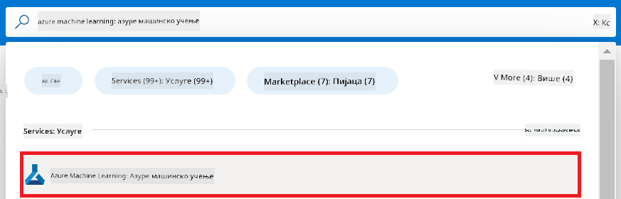
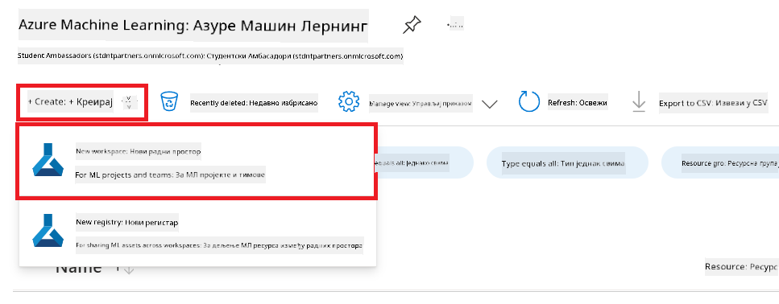

<!--
CO_OP_TRANSLATOR_METADATA:
{
  "original_hash": "7ca2c30fdb802664070e9cfbf92e24fe",
  "translation_date": "2026-01-05T15:22:05+00:00",
  "source_file": "md/02.Application/01.TextAndChat/Phi3/E2E_Phi-3-FineTuning_PromptFlow_Integration.md",
  "language_code": "sr"
}
-->
# Подешавање и интеграција прилагођених Phi-3 модела са Prompt flow

Овај од почетка до краја (E2E) пример заснован је на водичу "[Подешавање и интеграција прилагођених Phi-3 модела са Prompt flow: корак по корак водич](https://techcommunity.microsoft.com/t5/educator-developer-blog/fine-tune-and-integrate-custom-phi-3-models-with-prompt-flow/ba-p/4178612?WT.mc_id=aiml-137032-kinfeylo)" из Microsoft Tech Community. Уводи процесе подешавања, распоређивања и интеграције прилагођених Phi-3 модела са Prompt flow.

## Преглед

У овом E2E примеру научићете како да подесите Phi-3 модел и интегришете га са Prompt flow. Користећи Azure Machine Learning и Prompt flow, успоставићете радни ток за распоређивање и коришћење прилагођених AI модела. Овај E2E пример је подељен у три сценарија:

**Сценарио 1: Подешавање Azure ресурса и припрема за фино подешавање**

**Сценарио 2: Фино подешавање Phi-3 модела и распоређивање у Azure Machine Learning Studio**

**Сценарио 3: Интеграција са Prompt flow и разговор са вашим прилагођеним моделом**

Ево прегледа овог E2E примера.


### Садржај

1. **[Сценарио 1: Подешавање Azure ресурса и припрема за фино подешавање](../../../../../../md/02.Application/01.TextAndChat/Phi3)**
    - [Креирање Azure Machine Learning Workspace-а](../../../../../../md/02.Application/01.TextAndChat/Phi3)
    - [Захтев за GPU квоте у Azure Subscription-у](../../../../../../md/02.Application/01.TextAndChat/Phi3)
    - [Додавање доделе улоге](../../../../../../md/02.Application/01.TextAndChat/Phi3)
    - [Подешавање пројекта](../../../../../../md/02.Application/01.TextAndChat/Phi3)
    - [Припрема сета података за фино подешавање](../../../../../../md/02.Application/01.TextAndChat/Phi3)

1. **[Сценарио 2: Фино подешавање Phi-3 модела и распоређивање у Azure Machine Learning Studio](../../../../../../md/02.Application/01.TextAndChat/Phi3)**
    - [Подешавање Azure CLI](../../../../../../md/02.Application/01.TextAndChat/Phi3)
    - [Фино подешавање Phi-3 модела](../../../../../../md/02.Application/01.TextAndChat/Phi3)
    - [Распоређивање фино подешеног модела](../../../../../../md/02.Application/01.TextAndChat/Phi3)

1. **[Сценарио 3: Интеграција са Prompt flow и разговор са вашим прилагођеним моделом](../../../../../../md/02.Application/01.TextAndChat/Phi3)**
    - [Интеграција прилагођеног Phi-3 модела са Prompt flow](../../../../../../md/02.Application/01.TextAndChat/Phi3)
    - [Разговор са вашим прилагођеним моделом](../../../../../../md/02.Application/01.TextAndChat/Phi3)

## Сценарио 1: Подешавање Azure ресурса и припрема за фино подешавање

### Креирање Azure Machine Learning Workspace-а

1. Укуцајте *azure machine learning* у **претраживачу** на врху странице портала и изаберите **Azure Machine Learning** из понуђених опција.

    

1. Изаберите **+ Create** из навигационог менија.

1. Изаберите **New workspace** из навигационог менија.

    

1. Извршите следеће радње:

    - Изаберите ваш Azure **Subscription**.
    - Изаберите **Resource group** који ћете користити (креирајте нови ако је потребно).
    - Унесите **Workspace Name**. Мора бити јединствена вредност.
    - Изаберите **Region** коју желите да користите.
    - Изаберите **Storage account** који ћете користити (креирајте нови ако је потребно).
    - Изаберите **Key vault** који ћете користити (креирајте нови ако је потребно).
    - Изаберите **Application insights** који ћете користити (креирајте нови ако је потребно).
    - Изаберите **Container registry** који ћете користити (креирајте нови ако је потребно).

    

1. Изаберите **Review + Create**.

1. Изаберите **Create**.

### Захтев за GPU квоте у Azure Subscription-у

У овом E2E примеру, користићете *Standard_NC24ads_A100_v4 GPU* за фино подешавање, што захтева захтев за квоту, и *Standard_E4s_v3* CPU за распоређивање, што не захтева захтев за квоту.

> [!NOTE]
>
> Само Pay-As-You-Go претплате (стандардни тип претплате) имају право на доделу GPU ресурса; бенефит претплате тренутно нису подржане.
>
> За оне који користе бенефит претплате (као што је Visual Studio Enterprise Subscription) или желе брзо да тестирају процес подешавања и распоређивања, овај туториал пружа и смернице за фино подешавање са минималним скупом података користећи CPU. Међутим, важно је напоменути да су резултати фино подешавања значајно бољи када се користи GPU са већим скупом података.

1. Посетите [Azure ML Studio](https://ml.azure.com/home?wt.mc_id=studentamb_279723).

1. Извршите следеће радње да бисте захтевали *Standard NCADSA100v4 Family* квоту:

    - Изаберите **Quota** из левог таба.
    - Изаберите **Virtual machine family** коју желите да користите. На пример, изаберите **Standard NCADSA100v4 Family Cluster Dedicated vCPUs**, која укључује *Standard_NC24ads_A100_v4* GPU.
    - Изаберите **Request quota** из навигационог менија.

        

    - На страници Request quota унесите **New cores limit** коју желите да користите. На пример, 24.
    - На страници Request quota изаберите **Submit** да бисте захтевали GPU квоту.

> [!NOTE]
> Можете изабрати одговарајући GPU или CPU за ваше потребе тако што ћете погледати документ [Sizes for Virtual Machines in Azure](https://learn.microsoft.com/azure/virtual-machines/sizes/overview?tabs=breakdownseries%2Cgeneralsizelist%2Ccomputesizelist%2Cmemorysizelist%2Cstoragesizelist%2Cgpusizelist%2Cfpgasizelist%2Chpcsizelist).

### Додавање доделе улоге

Да бисте подесили и распоредили ваше моделе, прво морате да креирате User Assigned Managed Identity (UAI) и доделите јој одговарајућа права. Ова UAI ће се користити за аутентификацију током распоређивања.

#### Креирање User Assigned Managed Identity (UAI)

1. Укуцајте *managed identities* у **претраживачу** на врху странице портала и изаберите **Managed Identities** из понуђених опција.

    

1. Изаберите **+ Create**.

    

1. Извршите следеће радње:

    - Изаберите ваш Azure **Subscription**.
    - Изаберите **Resource group** који ћете користити (креирајте нови ако је потребно).
    - Изаберите **Region** коју желите да користите.
    - Унесите **Name**. Мора бити јединствена вредност.

1. Изаберите **Review + create**.

1. Изаберите **+ Create**.

#### Додавање доделе улоге Contributor Managed Identity-ју

1. Идите на Managed Identity ресурс који сте креирали.

1. Изаберите **Azure role assignments** из левог таба.

1. Изаберите **+Add role assignment** из навигационог менија.

1. На страници Add role assignment, извршите следеће радње:
    - Изаберите **Scope** на **Resource group**.
    - Изаберите ваш Azure **Subscription**.
    - Изаберите **Resource group** за коришћење.
    - Изаберите **Role** на **Contributor**.

    

1. Изаберите **Save**.

#### Додавање доделе улоге Storage Blob Data Reader Managed Identity-ју

1. Укуцајте *storage accounts* у **претраживачу** на врху странице портала и изаберите **Storage accounts** из понуђених опција.

    

1. Изаберите storage account који је повезан са Azure Machine Learning workspace-ом који сте креирали. На пример, *finetunephistorage*.

1. Извршите следеће кораке за навигацију до странице Add role assignment:

    - Идите на ваш Azure Storage account који сте креирали.
    - Изаберите **Access Control (IAM)** из левог таба.
    - Изаберите **+ Add** из навигационог менија.
    - Изаберите **Add role assignment** из навигационог менија.

    

1. На страници Add role assignment извршите следеће радње:

    - На страници Role укуцајте *Storage Blob Data Reader* у **претраживачу** и изаберите **Storage Blob Data Reader** из понуђених опција.
    - На страници Role изаберите **Next**.
    - На страници Members изаберите **Assign access to** **Managed identity**.
    - На страници Members изаберите **+ Select members**.
    - На страници Select managed identities изаберите ваш Azure **Subscription**.
    - На страници Select managed identities изаберите **Managed identity** на **Manage Identity**.
    - На страници Select managed identities изаберите Manage Identity коју сте креирали. На пример, *finetunephi-managedidentity*.
    - На страници Select managed identities изаберите **Select**.

    

1. Изаберите **Review + assign**.

#### Додавање доделе улоге AcrPull Managed Identity-ју

1. Укуцајте *container registries* у **претраживачу** на врху странице портала и изаберите **Container registries** из понуђених опција.

    

1. Изаберите container registry који је повезан са Azure Machine Learning workspace-ом. На пример, *finetunephicontainerregistries*

1. Извршите следеће кораке за навигацију до странице Add role assignment:

    - Изаберите **Access Control (IAM)** из левог таба.
    - Изаберите **+ Add** из навигационог менија.
    - Изаберите **Add role assignment** из навигационог менија.

1. На страници Add role assignment извршите следеће радње:

    - На страници Role укуцајте *AcrPull* у **претраживачу** и изаберите **AcrPull** из понуђених опција.
    - На страници Role изаберите **Next**.
    - На страници Members изаберите **Assign access to** **Managed identity**.
    - На страници Members изаберите **+ Select members**.
    - На страници Select managed identities изаберите ваш Azure **Subscription**.
    - На страници Select managed identities изаберите **Managed identity** на **Manage Identity**.
    - На страници Select managed identities изаберите Manage Identity коју сте креирали. На пример, *finetunephi-managedidentity*.
    - На страници Select managed identities изаберите **Select**.
    - Изаберите **Review + assign**.

### Подешавање пројекта

Сада ћете креирати фолдер у којем ћете радити и поставити виртуелно окружење за развој програма који комуницира са корисницима и користи сачувану историју разговора из Azure Cosmos DB да би обавестио своје одговоре.

#### Креирање фолдера у којем ћете радити

1. Отворите терминал и укуцајте следећу команду да бисте креирали фолдер по имену *finetune-phi* на подразумеваној путањи.

    ```console
    mkdir finetune-phi
    ```

1. Укуцајте следећу команду у вашем терминалу да бисте прешли у *finetune-phi* фолдер који сте креирали.

    ```console
    cd finetune-phi
    ```

#### Креирање виртуелног окружења

1. Укуцајте следећу команду у вашем терминалу да бисте креирали виртуелно окружење по имену *.venv*.

    ```console
    python -m venv .venv
    ```

1. Укуцајте следећу команду у вашем терминалу да активирате виртуелно окружење.

    ```console
    .venv\Scripts\activate.bat
    ```

> [!NOTE]
>
> Ако је радило исправно, требало би да видите *(.venv)* пре командне линије.

#### Инсталирање потребних пакета

1. Укуцајте следеће команде у вашем терминалу да бисте инсталирали потребне пакете.

    ```console
    pip install datasets==2.19.1
    pip install transformers==4.41.1
    pip install azure-ai-ml==1.16.0
    pip install torch==2.3.1
    pip install trl==0.9.4
    pip install promptflow==1.12.0
    ```

#### Креирање фајлова пројекта
У овом задатку, креираћете основне датотеке за наш пројекат. Ове датотеке укључују скрипте за преузимање сета података, постављање Azure Machine Learning окружења, фино подешавање Phi-3 модела и деплојмент фино подешеног модела. Такође ћете креирати *conda.yml* датотеку за подешавање окружења за фино подешавање.

У овом задатку ћете:

- Креирати датотеку *download_dataset.py* за преузимање сета података.
- Креирати датотеку *setup_ml.py* за постављање Azure Machine Learning окружења.
- Креирати датотеку *fine_tune.py* у фасцикли *finetuning_dir* за фино подешавање Phi-3 модела користећи сет података.
- Креирати *conda.yml* датотеку за подешавање окружења за фино подешавање.
- Креирати датотеку *deploy_model.py* за деплојмент фино подешеног модела.
- Креирати датотеку *integrate_with_promptflow.py* за интеграцију фино подешеног модела и извршавање модела користећи Prompt flow.
- Креирати flow.dag.yml датотеку за постављање структуре радног тока за Prompt flow.
- Креирати датотеку *config.py* за унос Azure информација.

> [!NOTE]
>
> Цела структура фасцикли:
>
> ```text
> └── YourUserName
> .    └── finetune-phi
> .        ├── finetuning_dir
> .        │      └── fine_tune.py
> .        ├── conda.yml
> .        ├── config.py
> .        ├── deploy_model.py
> .        ├── download_dataset.py
> .        ├── flow.dag.yml
> .        ├── integrate_with_promptflow.py
> .        └── setup_ml.py
> ```

1. Отворите **Visual Studio Code**.

1. Изаберите **File** из мени бара.

1. Изаберите **Open Folder**.

1. Изаберите фасциклу *finetune-phi* коју сте креирали, која се налази на путу *C:\Users\yourUserName\finetune-phi*.

    

1. У левом панелу Visual Studio Code-а, кликните десним тастером и изаберите **New File** да бисте креирали нову датотеку под именом *download_dataset.py*.

1. У левом панелу Visual Studio Code-а, кликните десним тастером и изаберите **New File** да бисте креирали нову датотеку под именом *setup_ml.py*.

1. У левом панелу Visual Studio Code-а, кликните десним тастером и изаберите **New File** да бисте креирали нову датотеку под именом *deploy_model.py*.

    

1. У левом панелу Visual Studio Code-а, кликните десним тастером и изаберите **New Folder** да бисте креирали нову фасциклу под именом *finetuning_dir*.

1. У фасцикли *finetuning_dir*, креирајте нову датотеку под именом *fine_tune.py*.

#### Креирајте и конфигуришите датотеку *conda.yml*

1. У левом панелу Visual Studio Code-а, кликните десним тастером и изаберите **New File** да бисте креирали нову датотеку под именом *conda.yml*.

1. Додајте следећи код у датотеку *conda.yml* да бисте подесили окружење за фино подешавање Phi-3 модела.

    ```yml
    name: phi-3-training-env
    channels:
      - defaults
      - conda-forge
    dependencies:
      - python=3.10
      - pip
      - numpy<2.0
      - pip:
          - torch==2.4.0
          - torchvision==0.19.0
          - trl==0.8.6
          - transformers==4.41
          - datasets==2.21.0
          - azureml-core==1.57.0
          - azure-storage-blob==12.19.0
          - azure-ai-ml==1.16
          - azure-identity==1.17.1
          - accelerate==0.33.0
          - mlflow==2.15.1
          - azureml-mlflow==1.57.0
    ```

#### Креирајте и конфигуришите датотеку *config.py*

1. У левом панелу Visual Studio Code-а, кликните десним тастером и изаберите **New File** да бисте креирали нову датотеку под именом *config.py*.

1. Додајте следећи код у датотеку *config.py* да бисте унели своје Azure информације.

    ```python
    # Azure подешавања
    AZURE_SUBSCRIPTION_ID = "your_subscription_id"
    AZURE_RESOURCE_GROUP_NAME = "your_resource_group_name" # "TestGroup"

    # Подешавања Azure Машинског учења
    AZURE_ML_WORKSPACE_NAME = "your_workspace_name" # "finetunephi-workspace"

    # Подешавања Azure Управљаног идентитета
    AZURE_MANAGED_IDENTITY_CLIENT_ID = "your_azure_managed_identity_client_id"
    AZURE_MANAGED_IDENTITY_NAME = "your_azure_managed_identity_name" # "finetunephi-mangedidentity"
    AZURE_MANAGED_IDENTITY_RESOURCE_ID = f"/subscriptions/{AZURE_SUBSCRIPTION_ID}/resourceGroups/{AZURE_RESOURCE_GROUP_NAME}/providers/Microsoft.ManagedIdentity/userAssignedIdentities/{AZURE_MANAGED_IDENTITY_NAME}"

    # Путање до датотека скупова података
    TRAIN_DATA_PATH = "data/train_data.jsonl"
    TEST_DATA_PATH = "data/test_data.jsonl"

    # Подешавања фино подешеног модела
    AZURE_MODEL_NAME = "your_fine_tuned_model_name" # "finetune-phi-model"
    AZURE_ENDPOINT_NAME = "your_fine_tuned_model_endpoint_name" # "finetune-phi-endpoint"
    AZURE_DEPLOYMENT_NAME = "your_fine_tuned_model_deployment_name" # "finetune-phi-deployment"

    AZURE_ML_API_KEY = "your_fine_tuned_model_api_key"
    AZURE_ML_ENDPOINT = "your_fine_tuned_model_endpoint_uri" # "https://{your-endpoint-name}.{your-region}.inference.ml.azure.com/score"
    ```

#### Додавање Azure променљивих окружења

1. Извршите следеће кораке да бисте додали Azure Subscription ID:

    - Унесите *subscriptions* у **претраживач** на врху странице портала и изаберите **Subscriptions** из опција које се појаве.
    - Изаберите Azure претплату коју тренутно користите.
    - Копирајте и залепите ваш Subscription ID у датотеку *config.py*.

    

1. Извршите следеће кораке да бисте додали Azure Workspace име:

    - Идите на Azure Machine Learning ресурс који сте креирали.
    - Копирајте и залепите име вашег рачуна у датотеку *config.py*.

    

1. Извршите следеће кораке да бисте додали Azure Resource Group име:

    - Идите на Azure Machine Learning ресурс који сте креирали.
    - Копирајте и залепите име ваше Azure Resource Group у датотеку *config.py*.

    

2. Извршите следеће кораке да бисте додали Azure Managed Identity име:

    - Идите на ресурс Managed Identities који сте креирали.
    - Копирајте и залепите име ваше Azure Managed Identity у датотеку *config.py*.

    

### Припрема сета података за фино подешавање

У овом задатку ћете покренути датотеку *download_dataset.py* да бисте преузели *ULTRACHAT_200k* сетове података у ваше локално окружење. Затим ћете користити ове сете података за фино подешавање Phi-3 модела у Azure Machine Learning.

#### Преузимање вашег сета података користећи *download_dataset.py*

1. Отворите датотеку *download_dataset.py* у Visual Studio Code.

1. Додајте следећи код у *download_dataset.py*.

    ```python
    import json
    import os
    from datasets import load_dataset
    from config import (
        TRAIN_DATA_PATH,
        TEST_DATA_PATH)

    def load_and_split_dataset(dataset_name, config_name, split_ratio):
        """
        Load and split a dataset.
        """
        # Учитај скуп података са задатим именом, конфигурацијом и односом поделе
        dataset = load_dataset(dataset_name, config_name, split=split_ratio)
        print(f"Original dataset size: {len(dataset)}")
        
        # Подели скуп података на тренинг и тест скупове (80% тренинг, 20% тест)
        split_dataset = dataset.train_test_split(test_size=0.2)
        print(f"Train dataset size: {len(split_dataset['train'])}")
        print(f"Test dataset size: {len(split_dataset['test'])}")
        
        return split_dataset

    def save_dataset_to_jsonl(dataset, filepath):
        """
        Save a dataset to a JSONL file.
        """
        # Креирај директоријум ако не постоји
        os.makedirs(os.path.dirname(filepath), exist_ok=True)
        
        # Отвори фајл у режиму писања
        with open(filepath, 'w', encoding='utf-8') as f:
            # Итерај кроз сваки запис у скупу података
            for record in dataset:
                # Сачувај запис као JSON објекат и упиши у фајл
                json.dump(record, f)
                # Упиши нови ред да раздвојиш записе
                f.write('\n')
        
        print(f"Dataset saved to {filepath}")

    def main():
        """
        Main function to load, split, and save the dataset.
        """
        # Учитај и подели ULTRACHAT_200k скуп података са специфичном конфигурацијом и односом поделе
        dataset = load_and_split_dataset("HuggingFaceH4/ultrachat_200k", 'default', 'train_sft[:1%]')
        
        # Извуци тренинг и тест скуп података из поделе
        train_dataset = dataset['train']
        test_dataset = dataset['test']

        # Сачувај тренинг скуп у JSONL фајл
        save_dataset_to_jsonl(train_dataset, TRAIN_DATA_PATH)
        
        # Сачувај тест скуп у посебан JSONL фајл
        save_dataset_to_jsonl(test_dataset, TEST_DATA_PATH)

    if __name__ == "__main__":
        main()

    ```

> [!TIP]
>
> **Упутство за фино подешавање са минималним сетом података користећи CPU**
>
> Ако желите да користите CPU за фино подешавање, овај приступ је идеалан за оне са претплатама са погодностима (као што је Visual Studio Enterprise Subscription) или за брзо тестирање процеса фино подешавања и деплојмента.
>
> Замените `dataset = load_and_split_dataset("HuggingFaceH4/ultrachat_200k", 'default', 'train_sft[:1%]')` са `dataset = load_and_split_dataset("HuggingFaceH4/ultrachat_200k", 'default', 'train_sft[:10]')`
>

1. Упишите следећу команду у терминалу да покренете скрипту и преузмете сет података у ваше локално окружење.

    ```console
    python download_data.py
    ```

1. Проверите да ли су скупови података успешно сачувани у вашој локалној фасцикли *finetune-phi/data*.

> [!NOTE]
>
> **Величина сета података и време фино подешавања**
>
> У овом E2E примеру користите само 1% сета података (`train_sft[:1%]`). Ово значајно смањује количину података, убрзавајући и процес отпремања и фино подешавања. Можете подесити проценат како бисте пронашли праву равнотежу између времена тренинга и перформанси модела. Коришћењем мањег дела сета података скраћује се време потребно за фино подешавање, чинећи процес приступачнијим за E2E пример.

## Сценарио 2: Фино подешавање Phi-3 модела и деплојмент у Azure Machine Learning Studio

### Постављање Azure CLI

Потребно је да подесите Azure CLI како бисте аутентификовали своје окружење. Azure CLI вам омогућава управљање Azure ресурсима директно из командне линије и пружа креденцијале потребне за приступ Azure Machine Learning ресурсима. Да бисте започели, инсталирајте [Azure CLI](https://learn.microsoft.com/cli/azure/install-azure-cli).

1. Отворите терминал и укуцајте следећу команду да бисте се пријавили на свој Azure налог.

    ```console
    az login
    ```

1. Изаберите свој Azure налог за коришћење.

1. Изаберите своју Azure претплату за коришћење.

    

> [!TIP]
>
> Ако имате проблема приликом пријављивања у Azure, покушајте да користите код уређаја. Отворите терминал и укуцајте следећу команду за пријављивање у свој Azure налог:
>
> ```console
> az login --use-device-code
> ```
>

### Фино подешавање Phi-3 модела

У овом задатку ћете фино подесити Phi-3 модел користећи обезбеђени сет података. Прво ћете дефинисати процес фино подешавања у датотеци *fine_tune.py*. Затим ћете конфиурисати Azure Machine Learning окружење и покренути процес фино подешавања покретањем датотеке *setup_ml.py*. Ова скрипта обезбеђује да фино подешавање буде извршено у Azure Machine Learning окружењу.

Покретањем *setup_ml.py* покренућете процес фино подешавања у Azure Machine Learning окружењу.

#### Додајте код у датотеку *fine_tune.py*

1. Идите у фасциклу *finetuning_dir* и отворите датотеку *fine_tune.py* у Visual Studio Code.

1. Додајте следећи код у *fine_tune.py*.

    ```python
    import argparse
    import sys
    import logging
    import os
    from datasets import load_dataset
    import torch
    import mlflow
    from transformers import AutoModelForCausalLM, AutoTokenizer, TrainingArguments
    from trl import SFTTrainer

    # Да бисте избегли грешку INVALID_PARAMETER_VALUE у MLflow-у, онемогућите MLflow интеграцију
    os.environ["DISABLE_MLFLOW_INTEGRATION"] = "True"

    # Подешавање логовања
    logging.basicConfig(
        format="%(asctime)s - %(levelname)s - %(name)s - %(message)s",
        datefmt="%Y-%m-%d %H:%M:%S",
        handlers=[logging.StreamHandler(sys.stdout)],
        level=logging.WARNING
    )
    logger = logging.getLogger(__name__)

    def initialize_model_and_tokenizer(model_name, model_kwargs):
        """
        Initialize the model and tokenizer with the given pretrained model name and arguments.
        """
        model = AutoModelForCausalLM.from_pretrained(model_name, **model_kwargs)
        tokenizer = AutoTokenizer.from_pretrained(model_name)
        tokenizer.model_max_length = 2048
        tokenizer.pad_token = tokenizer.unk_token
        tokenizer.pad_token_id = tokenizer.convert_tokens_to_ids(tokenizer.pad_token)
        tokenizer.padding_side = 'right'
        return model, tokenizer

    def apply_chat_template(example, tokenizer):
        """
        Apply a chat template to tokenize messages in the example.
        """
        messages = example["messages"]
        if messages[0]["role"] != "system":
            messages.insert(0, {"role": "system", "content": ""})
        example["text"] = tokenizer.apply_chat_template(
            messages, tokenize=False, add_generation_prompt=False
        )
        return example

    def load_and_preprocess_data(train_filepath, test_filepath, tokenizer):
        """
        Load and preprocess the dataset.
        """
        train_dataset = load_dataset('json', data_files=train_filepath, split='train')
        test_dataset = load_dataset('json', data_files=test_filepath, split='train')
        column_names = list(train_dataset.features)

        train_dataset = train_dataset.map(
            apply_chat_template,
            fn_kwargs={"tokenizer": tokenizer},
            num_proc=10,
            remove_columns=column_names,
            desc="Applying chat template to train dataset",
        )

        test_dataset = test_dataset.map(
            apply_chat_template,
            fn_kwargs={"tokenizer": tokenizer},
            num_proc=10,
            remove_columns=column_names,
            desc="Applying chat template to test dataset",
        )

        return train_dataset, test_dataset

    def train_and_evaluate_model(train_dataset, test_dataset, model, tokenizer, output_dir):
        """
        Train and evaluate the model.
        """
        training_args = TrainingArguments(
            bf16=True,
            do_eval=True,
            output_dir=output_dir,
            eval_strategy="epoch",
            learning_rate=5.0e-06,
            logging_steps=20,
            lr_scheduler_type="cosine",
            num_train_epochs=3,
            overwrite_output_dir=True,
            per_device_eval_batch_size=4,
            per_device_train_batch_size=4,
            remove_unused_columns=True,
            save_steps=500,
            seed=0,
            gradient_checkpointing=True,
            gradient_accumulation_steps=1,
            warmup_ratio=0.2,
        )

        trainer = SFTTrainer(
            model=model,
            args=training_args,
            train_dataset=train_dataset,
            eval_dataset=test_dataset,
            max_seq_length=2048,
            dataset_text_field="text",
            tokenizer=tokenizer,
            packing=True
        )

        train_result = trainer.train()
        trainer.log_metrics("train", train_result.metrics)

        mlflow.transformers.log_model(
            transformers_model={"model": trainer.model, "tokenizer": tokenizer},
            artifact_path=output_dir,
        )

        tokenizer.padding_side = 'left'
        eval_metrics = trainer.evaluate()
        eval_metrics["eval_samples"] = len(test_dataset)
        trainer.log_metrics("eval", eval_metrics)

    def main(train_file, eval_file, model_output_dir):
        """
        Main function to fine-tune the model.
        """
        model_kwargs = {
            "use_cache": False,
            "trust_remote_code": True,
            "torch_dtype": torch.bfloat16,
            "device_map": None,
            "attn_implementation": "eager"
        }

        # pretrained_model_name = "microsoft/Phi-3-mini-4k-instruct"
        pretrained_model_name = "microsoft/Phi-3.5-mini-instruct"

        with mlflow.start_run():
            model, tokenizer = initialize_model_and_tokenizer(pretrained_model_name, model_kwargs)
            train_dataset, test_dataset = load_and_preprocess_data(train_file, eval_file, tokenizer)
            train_and_evaluate_model(train_dataset, test_dataset, model, tokenizer, model_output_dir)

    if __name__ == "__main__":
        parser = argparse.ArgumentParser()
        parser.add_argument("--train-file", type=str, required=True, help="Path to the training data")
        parser.add_argument("--eval-file", type=str, required=True, help="Path to the evaluation data")
        parser.add_argument("--model_output_dir", type=str, required=True, help="Directory to save the fine-tuned model")
        args = parser.parse_args()
        main(args.train_file, args.eval_file, args.model_output_dir)

    ```

1. Сачувајте и затворите датотеку *fine_tune.py*.

> [!TIP]
> **Можете фино подесити Phi-3.5 модел**
>
> У датотеци *fine_tune.py* можете променити `pretrained_model_name` са `"microsoft/Phi-3-mini-4k-instruct"` на било који модел који желите да фино подесите. На пример, ако га промените у `"microsoft/Phi-3.5-mini-instruct"`, користићете Phi-3.5-mini-instruct модел за фино подешавање. Да бисте пронашли и користили име модела по свом избору, посетите [Hugging Face](https://huggingface.co/), потражите модел који вас интересује и затим његово име копирајте и залепите у поље `pretrained_model_name` у вашем скрипту.
>
> <image type="content" src="../../../../imgs/02/FineTuning-PromptFlow/finetunephi3.5.png" alt-text="Фино подешавање Phi-3.5.">
>

#### Додајте код у датотеку *setup_ml.py*

1. Отворите датотеку *setup_ml.py* у Visual Studio Code.

1. Додајте следећи код у *setup_ml.py*.

    ```python
    import logging
    from azure.ai.ml import MLClient, command, Input
    from azure.ai.ml.entities import Environment, AmlCompute
    from azure.identity import AzureCliCredential
    from config import (
        AZURE_SUBSCRIPTION_ID,
        AZURE_RESOURCE_GROUP_NAME,
        AZURE_ML_WORKSPACE_NAME,
        TRAIN_DATA_PATH,
        TEST_DATA_PATH
    )

    # Константе

    # Откоментаришите следеће линије да бисте користили CPU инстанцу за тренирање
    # COMPUTE_INSTANCE_TYPE = "Standard_E16s_v3" # cpu
    # COMPUTE_NAME = "cpu-e16s-v3"
    # DOCKER_IMAGE_NAME = "mcr.microsoft.com/azureml/openmpi4.1.0-ubuntu20.04:latest"

    # Откоментаришите следеће линије да бисте користили GPU инстанцу за тренирање
    COMPUTE_INSTANCE_TYPE = "Standard_NC24ads_A100_v4"
    COMPUTE_NAME = "gpu-nc24s-a100-v4"
    DOCKER_IMAGE_NAME = "mcr.microsoft.com/azureml/curated/acft-hf-nlp-gpu:59"

    CONDA_FILE = "conda.yml"
    LOCATION = "eastus2" # Замените локацијом вашег compute кластера
    FINETUNING_DIR = "./finetuning_dir" # Путања ка скрипти за фино подешавање
    TRAINING_ENV_NAME = "phi-3-training-environment" # Назив окружења за тренирање
    MODEL_OUTPUT_DIR = "./model_output" # Путања до директоријума за излазни модел у Azure ML

    # Подешавање логовања за праћење процеса
    logger = logging.getLogger(__name__)
    logging.basicConfig(
        format="%(asctime)s - %(levelname)s - %(name)s - %(message)s",
        datefmt="%Y-%m-%d %H:%M:%S",
        level=logging.WARNING
    )

    def get_ml_client():
        """
        Initialize the ML Client using Azure CLI credentials.
        """
        credential = AzureCliCredential()
        return MLClient(credential, AZURE_SUBSCRIPTION_ID, AZURE_RESOURCE_GROUP_NAME, AZURE_ML_WORKSPACE_NAME)

    def create_or_get_environment(ml_client):
        """
        Create or update the training environment in Azure ML.
        """
        env = Environment(
            image=DOCKER_IMAGE_NAME,  # Docker слика за окружење
            conda_file=CONDA_FILE,  # Conda датотека окружења
            name=TRAINING_ENV_NAME,  # Назив окружења
        )
        return ml_client.environments.create_or_update(env)

    def create_or_get_compute_cluster(ml_client, compute_name, COMPUTE_INSTANCE_TYPE, location):
        """
        Create or update the compute cluster in Azure ML.
        """
        try:
            compute_cluster = ml_client.compute.get(compute_name)
            logger.info(f"Compute cluster '{compute_name}' already exists. Reusing it for the current run.")
        except Exception:
            logger.info(f"Compute cluster '{compute_name}' does not exist. Creating a new one with size {COMPUTE_INSTANCE_TYPE}.")
            compute_cluster = AmlCompute(
                name=compute_name,
                size=COMPUTE_INSTANCE_TYPE,
                location=location,
                tier="Dedicated",  # Ниво compute кластера
                min_instances=0,  # Минималан број инстанци
                max_instances=1  # Максималан број инстанци
            )
            ml_client.compute.begin_create_or_update(compute_cluster).wait()  # Чекај да се кластер креира
        return compute_cluster

    def create_fine_tuning_job(env, compute_name):
        """
        Set up the fine-tuning job in Azure ML.
        """
        return command(
            code=FINETUNING_DIR,  # Путања до fine_tune.py
            command=(
                "python fine_tune.py "
                "--train-file ${{inputs.train_file}} "
                "--eval-file ${{inputs.eval_file}} "
                "--model_output_dir ${{inputs.model_output}}"
            ),
            environment=env,  # Окружење за тренирање
            compute=compute_name,  # Компјутерски кластер за употребу
            inputs={
                "train_file": Input(type="uri_file", path=TRAIN_DATA_PATH),  # Путања до датотеке са подацима за тренирање
                "eval_file": Input(type="uri_file", path=TEST_DATA_PATH),  # Путања до датотеке са подацима за евалуацију
                "model_output": MODEL_OUTPUT_DIR
            }
        )

    def main():
        """
        Main function to set up and run the fine-tuning job in Azure ML.
        """
        # Иницијализација ML клијента
        ml_client = get_ml_client()

        # Креирање окружења
        env = create_or_get_environment(ml_client)
        
        # Креирање или добијање постојећег компјутерског кластера
        create_or_get_compute_cluster(ml_client, COMPUTE_NAME, COMPUTE_INSTANCE_TYPE, LOCATION)

        # Креирање и слање посла за фино подешавање
        job = create_fine_tuning_job(env, COMPUTE_NAME)
        returned_job = ml_client.jobs.create_or_update(job)  # Слање посла
        ml_client.jobs.stream(returned_job.name)  # Транслирање логова посла
        
        # Бележење имена посла
        job_name = returned_job.name
        print(f"Job name: {job_name}")

    if __name__ == "__main__":
        main()

    ```

1. Замените `COMPUTE_INSTANCE_TYPE`, `COMPUTE_NAME` и `LOCATION` вашим конкретним подацима.

    ```python
   # Одвршите коментар са следећих линија да бисте користили GPU инстанцу за тренирање
    COMPUTE_INSTANCE_TYPE = "Standard_NC24ads_A100_v4"
    COMPUTE_NAME = "gpu-nc24s-a100-v4"
    ...
    LOCATION = "eastus2" # Замените локацију вашег кластерa рачунара
    ```

> [!TIP]
>
> **Упутство за фино подешавање са минималним сетом података користећи CPU**
>
> Ако желите да користите CPU за фино подешавање, овај приступ је идеалан за оне са претплатама са погодностима (као што је Visual Studio Enterprise Subscription) или за брзо тестирање процеса фино подешавања и деплојмента.
>
> 1. Отворите датотеку *setup_ml*.
> 1. Замените `COMPUTE_INSTANCE_TYPE`, `COMPUTE_NAME` и `DOCKER_IMAGE_NAME` са следећим. Ако немате приступ *Standard_E16s_v3*, можете користити еквивалентну CPU инстанцу или затражити нови квота.
> 1. Замените `LOCATION` вашим конкретним подацима.
>
>    ```python
>    # Uncomment the following lines to use a CPU instance for training
>    COMPUTE_INSTANCE_TYPE = "Standard_E16s_v3" # cpu
>    COMPUTE_NAME = "cpu-e16s-v3"
>    DOCKER_IMAGE_NAME = "mcr.microsoft.com/azureml/openmpi4.1.0-ubuntu20.04:latest"
>    LOCATION = "eastus2" # Replace with the location of your compute cluster
>    ```
>

1. Укуцајте следећу команду да покренете скрипту *setup_ml.py* и стартујете процес фино подешавања у Azure Machine Learning.

    ```python
    python setup_ml.py
    ```

1. У овом задатку успешно сте фино подесили Phi-3 модел користећи Azure Machine Learning. Покретањем скрипте *setup_ml.py*, подесили сте Azure Machine Learning окружење и иницирали процес фино подешавања дефинисан у датотеци *fine_tune.py*. Имајте на уму да процес фино подешавања може трајати одређено време. Након покретања команде `python setup_ml.py`, морате сачекати да се процес заврши. Статус посла фино подешавања можете пратити путем линка који ће бити приказан у терминалу ка Azure Machine Learning порталу.

    

### Деплојмент фино подешеног модела

Да бисте интегрисали фино подешени Phi-3 модел са Prompt Flow, потребно је да деплојујете модел како би био доступан за реално време интерпретације. Овај процес укључује регистрацију модела, креирање онлајн endpoint-а и деплојмент модела.

#### Подесите име модела, име endpoint-а и име деплојмента за деплојмент

1. Отворите датотеку *config.py*.

1. Замените `AZURE_MODEL_NAME = "your_fine_tuned_model_name"` жељеним именом вашег модела.

1. Замените `AZURE_ENDPOINT_NAME = "your_fine_tuned_model_endpoint_name"` жељеним именом вашег endpoint-а.

1. Замените `AZURE_DEPLOYMENT_NAME = "your_fine_tuned_model_deployment_name"` жељеним именом вашег деплојмента.

#### Додајте код у датотеку *deploy_model.py*

Покретањем датотеке *deploy_model.py* аутоматизује се цео процес деплојмента. Датотека региструје модел, креира endpoint и извршава деплојмент на основу подешавања у датотеци *config.py*, која укључује име модела, име endpoint-а и име деплојмента.

1. Отворите датотеку *deploy_model.py* у Visual Studio Code.

1. Додајте следећи код у *deploy_model.py*.

    ```python
    import logging
    from azure.identity import AzureCliCredential
    from azure.ai.ml import MLClient
    from azure.ai.ml.entities import Model, ProbeSettings, ManagedOnlineEndpoint, ManagedOnlineDeployment, IdentityConfiguration, ManagedIdentityConfiguration, OnlineRequestSettings
    from azure.ai.ml.constants import AssetTypes

    # Увоз конфигурације
    from config import (
        AZURE_SUBSCRIPTION_ID,
        AZURE_RESOURCE_GROUP_NAME,
        AZURE_ML_WORKSPACE_NAME,
        AZURE_MANAGED_IDENTITY_RESOURCE_ID,
        AZURE_MANAGED_IDENTITY_CLIENT_ID,
        AZURE_MODEL_NAME,
        AZURE_ENDPOINT_NAME,
        AZURE_DEPLOYMENT_NAME
    )

    # Константе
    JOB_NAME = "your-job-name"
    COMPUTE_INSTANCE_TYPE = "Standard_E4s_v3"

    deployment_env_vars = {
        "SUBSCRIPTION_ID": AZURE_SUBSCRIPTION_ID,
        "RESOURCE_GROUP_NAME": AZURE_RESOURCE_GROUP_NAME,
        "UAI_CLIENT_ID": AZURE_MANAGED_IDENTITY_CLIENT_ID,
    }

    # Подешавање евидентирања
    logging.basicConfig(
        format="%(asctime)s - %(levelname)s - %(name)s - %(message)s",
        datefmt="%Y-%m-%d %H:%M:%S",
        level=logging.DEBUG
    )
    logger = logging.getLogger(__name__)

    def get_ml_client():
        """Initialize and return the ML Client."""
        credential = AzureCliCredential()
        return MLClient(credential, AZURE_SUBSCRIPTION_ID, AZURE_RESOURCE_GROUP_NAME, AZURE_ML_WORKSPACE_NAME)

    def register_model(ml_client, model_name, job_name):
        """Register a new model."""
        model_path = f"azureml://jobs/{job_name}/outputs/artifacts/paths/model_output"
        logger.info(f"Registering model {model_name} from job {job_name} at path {model_path}.")
        run_model = Model(
            path=model_path,
            name=model_name,
            description="Model created from run.",
            type=AssetTypes.MLFLOW_MODEL,
        )
        model = ml_client.models.create_or_update(run_model)
        logger.info(f"Registered model ID: {model.id}")
        return model

    def delete_existing_endpoint(ml_client, endpoint_name):
        """Delete existing endpoint if it exists."""
        try:
            endpoint_result = ml_client.online_endpoints.get(name=endpoint_name)
            logger.info(f"Deleting existing endpoint {endpoint_name}.")
            ml_client.online_endpoints.begin_delete(name=endpoint_name).result()
            logger.info(f"Deleted existing endpoint {endpoint_name}.")
        except Exception as e:
            logger.info(f"No existing endpoint {endpoint_name} found to delete: {e}")

    def create_or_update_endpoint(ml_client, endpoint_name, description=""):
        """Create or update an endpoint."""
        delete_existing_endpoint(ml_client, endpoint_name)
        logger.info(f"Creating new endpoint {endpoint_name}.")
        endpoint = ManagedOnlineEndpoint(
            name=endpoint_name,
            description=description,
            identity=IdentityConfiguration(
                type="user_assigned",
                user_assigned_identities=[ManagedIdentityConfiguration(resource_id=AZURE_MANAGED_IDENTITY_RESOURCE_ID)]
            )
        )
        endpoint_result = ml_client.online_endpoints.begin_create_or_update(endpoint).result()
        logger.info(f"Created new endpoint {endpoint_name}.")
        return endpoint_result

    def create_or_update_deployment(ml_client, endpoint_name, deployment_name, model):
        """Create or update a deployment."""

        logger.info(f"Creating deployment {deployment_name} for endpoint {endpoint_name}.")
        deployment = ManagedOnlineDeployment(
            name=deployment_name,
            endpoint_name=endpoint_name,
            model=model.id,
            instance_type=COMPUTE_INSTANCE_TYPE,
            instance_count=1,
            environment_variables=deployment_env_vars,
            request_settings=OnlineRequestSettings(
                max_concurrent_requests_per_instance=3,
                request_timeout_ms=180000,
                max_queue_wait_ms=120000
            ),
            liveness_probe=ProbeSettings(
                failure_threshold=30,
                success_threshold=1,
                period=100,
                initial_delay=500,
            ),
            readiness_probe=ProbeSettings(
                failure_threshold=30,
                success_threshold=1,
                period=100,
                initial_delay=500,
            ),
        )
        deployment_result = ml_client.online_deployments.begin_create_or_update(deployment).result()
        logger.info(f"Created deployment {deployment.name} for endpoint {endpoint_name}.")
        return deployment_result

    def set_traffic_to_deployment(ml_client, endpoint_name, deployment_name):
        """Set traffic to the specified deployment."""
        try:
            # Преузмите тренутне детаље крајње точке
            endpoint = ml_client.online_endpoints.get(name=endpoint_name)
            
            # Евидентирајте тренутну расподелу саобраћаја за отклањање грешака
            logger.info(f"Current traffic allocation: {endpoint.traffic}")
            
            # Поставите расподелу саобраћаја за распоређивање
            endpoint.traffic = {deployment_name: 100}
            
            # Ажурирајте крајњу точку са новом расподелом саобраћаја
            endpoint_poller = ml_client.online_endpoints.begin_create_or_update(endpoint)
            updated_endpoint = endpoint_poller.result()
            
            # Евидентирајте ажурирану расподелу саобраћаја за отклањање грешака
            logger.info(f"Updated traffic allocation: {updated_endpoint.traffic}")
            logger.info(f"Set traffic to deployment {deployment_name} at endpoint {endpoint_name}.")
            return updated_endpoint
        except Exception as e:
            # Евидентирајте све грешке које се јаве током процеса
            logger.error(f"Failed to set traffic to deployment: {e}")
            raise


    def main():
        ml_client = get_ml_client()

        registered_model = register_model(ml_client, AZURE_MODEL_NAME, JOB_NAME)
        logger.info(f"Registered model ID: {registered_model.id}")

        endpoint = create_or_update_endpoint(ml_client, AZURE_ENDPOINT_NAME, "Endpoint for finetuned Phi-3 model")
        logger.info(f"Endpoint {AZURE_ENDPOINT_NAME} is ready.")

        try:
            deployment = create_or_update_deployment(ml_client, AZURE_ENDPOINT_NAME, AZURE_DEPLOYMENT_NAME, registered_model)
            logger.info(f"Deployment {AZURE_DEPLOYMENT_NAME} is created for endpoint {AZURE_ENDPOINT_NAME}.")

            set_traffic_to_deployment(ml_client, AZURE_ENDPOINT_NAME, AZURE_DEPLOYMENT_NAME)
            logger.info(f"Traffic is set to deployment {AZURE_DEPLOYMENT_NAME} at endpoint {AZURE_ENDPOINT_NAME}.")
        except Exception as e:
            logger.error(f"Failed to create or update deployment: {e}")

    if __name__ == "__main__":
        main()

    ```

1. Извршите следеће кораке да бисте добили `JOB_NAME`:

    - Идите на Azure Machine Learning ресурс који сте креирали.
    - Изаберите **Studio web URL** за отварање Azure Machine Learning радног простора.
    - Изаберите **Jobs** са левог бочног менија.
    - Изаберите експеримент за фино подешавање. На пример, *finetunephi*.
    - Изаберите посао који сте креирали.
- Копирајте и налепите име свог посла у `JOB_NAME = "your-job-name"` у фајлу *deploy_model.py*.

1. Замените `COMPUTE_INSTANCE_TYPE` вашим специфичним детаљима.

1. Унесите следећу команду да покренете скрипту *deploy_model.py* и започнете процес деплоја у Azure Machine Learning.

    ```python
    python deploy_model.py
    ```

> [!WARNING]
> Да бисте избегли додатне трошкове на вашем налогу, обавезно обришите креирану крајњу тачку у Azure Machine Learning радном простору.
>

#### Проверите статус деплоя у Azure Machine Learning Workspace

1. Посетите [Azure ML Studio](https://ml.azure.com/home?wt.mc_id=studentamb_279723).

1. Навигирајте до Azure Machine Learning радног простора који сте креирали.

1. Изаберите **Studio web URL** да отворите Azure Machine Learning радни простор.

1. Изаберите **Endpoints** са леве бочне траке.

    

2. Изаберите крајњу тачку коју сте креирали.

    

3. На овој страници можете управљати крајњим тачкама креираним током процеса деплоирања.

## Сценарио 3: Интеграција са Prompt flow и ћаскање са вашим прилагођеним моделом

### Интегришање прилагођеног Phi-3 модела са Prompt flow-ом

Након успешног деплоирања вашег финетјуњованог модела, сада можете да га интегришете са Prompt flow-ом како бисте користили свој модел у апликацијама у реалном времену, омогућавајући различите интерактивне задатке са вашим прилагођеним Phi-3 моделом.

#### Подесите api кључ и endpoint URI финетјуњованог Phi-3 модела

1. Навигирајте до Azure Machine learning радног простора који сте креирали.  
1. Изаберите **Endpoints** са леве бочне траке.  
1. Изаберите крајњу тачку коју сте креирали.  
1. Изаберите **Consume** из навигационог менија.  
1. Копирајте и налепите свој **REST endpoint** у фајл *config.py*, заменивши `AZURE_ML_ENDPOINT = "your_fine_tuned_model_endpoint_uri"` вашим **REST endpoint-ом**.  
1. Копирајте и налепите свој **Primary key** у фајл *config.py*, заменивши `AZURE_ML_API_KEY = "your_fine_tuned_model_api_key"` вашим **Primary key-јем**.

    

#### Додајте код у фајл *flow.dag.yml*

1. Отворите фајл *flow.dag.yml* у Visual Studio Code-у.

1. Додајте следећи код у *flow.dag.yml*.

    ```yml
    inputs:
      input_data:
        type: string
        default: "Who founded Microsoft?"

    outputs:
      answer:
        type: string
        reference: ${integrate_with_promptflow.output}

    nodes:
    - name: integrate_with_promptflow
      type: python
      source:
        type: code
        path: integrate_with_promptflow.py
      inputs:
        input_data: ${inputs.input_data}
    ```

#### Додајте код у фајл *integrate_with_promptflow.py*

1. Отворите фајл *integrate_with_promptflow.py* у Visual Studio Code-у.

1. Додајте следећи код у *integrate_with_promptflow.py*.

    ```python
    import logging
    import requests
    from promptflow.core import tool
    import asyncio
    import platform
    from config import (
        AZURE_ML_ENDPOINT,
        AZURE_ML_API_KEY
    )

    # Подешавање евидентирања
    logging.basicConfig(
        format="%(asctime)s - %(levelname)s - %(name)s - %(message)s",
        datefmt="%Y-%m-%d %H:%M:%S",
        level=logging.DEBUG
    )
    logger = logging.getLogger(__name__)

    def query_azml_endpoint(input_data: list, endpoint_url: str, api_key: str) -> str:
        """
        Send a request to the Azure ML endpoint with the given input data.
        """
        headers = {
            "Content-Type": "application/json",
            "Authorization": f"Bearer {api_key}"
        }
        data = {
            "input_data": [input_data],
            "params": {
                "temperature": 0.7,
                "max_new_tokens": 128,
                "do_sample": True,
                "return_full_text": True
            }
        }
        try:
            response = requests.post(endpoint_url, json=data, headers=headers)
            response.raise_for_status()
            result = response.json()[0]
            logger.info("Successfully received response from Azure ML Endpoint.")
            return result
        except requests.exceptions.RequestException as e:
            logger.error(f"Error querying Azure ML Endpoint: {e}")
            raise

    def setup_asyncio_policy():
        """
        Setup asyncio event loop policy for Windows.
        """
        if platform.system() == 'Windows':
            asyncio.set_event_loop_policy(asyncio.WindowsSelectorEventLoopPolicy())
            logger.info("Set Windows asyncio event loop policy.")

    @tool
    def my_python_tool(input_data: str) -> str:
        """
        Tool function to process input data and query the Azure ML endpoint.
        """
        setup_asyncio_policy()
        return query_azml_endpoint(input_data, AZURE_ML_ENDPOINT, AZURE_ML_API_KEY)

    ```

### Ћаскајте са вашим прилагођеним моделом

1. Унесите следећу команду да покренете скрипту *deploy_model.py* и започнете процес деплоја у Azure Machine Learning.

    ```python
    pf flow serve --source ./ --port 8080 --host localhost
    ```

1. Ево примера резултата: Сада можете ћаскати са вашим прилагођеним Phi-3 моделом. Препоручује се да постављате питања која се базирају на подацима коришћеним за финетјунирање.

    

---

<!-- CO-OP TRANSLATOR DISCLAIMER START -->
**Изјава о одрицању одговорности**:
Овај документ је преведен користећи AI сервиса за превођење [Co-op Translator](https://github.com/Azure/co-op-translator). Иако настојимо да превод буде тачан, имајте на уму да аутоматизовани преводи могу садржати грешке или нетачности. Оригинални документ на његовом изворном језику треба сматрати ауторитетним извором. За критичне информације препоручује се професионални људски превод. Нисмо одговорни за било каква неразумевања или погрешне тумачења настала употребом овог превода.
<!-- CO-OP TRANSLATOR DISCLAIMER END -->