<!--
CO_OP_TRANSLATOR_METADATA:
{
  "original_hash": "ecbd9179a21edbaafaf114d47f09f3e3",
  "translation_date": "2025-05-09T18:26:23+00:00",
  "source_file": "md/02.Application/01.TextAndChat/Phi3/E2E_Phi-3-FineTuning_PromptFlow_Integration_AIFoundry.md",
  "language_code": "sr"
}
-->
# Fino podešavanje i integracija prilagođenih Phi-3 modela sa Prompt flow u Azure AI Foundry

Ovaj end-to-end (E2E) primer zasnovan je na vodiču "[Fine-Tune and Integrate Custom Phi-3 Models with Prompt Flow in Azure AI Foundry](https://techcommunity.microsoft.com/t5/educator-developer-blog/fine-tune-and-integrate-custom-phi-3-models-with-prompt-flow-in/ba-p/4191726?WT.mc_id=aiml-137032-kinfeylo)" sa Microsoft Tech Community. Upoznaje vas sa procesima fino podešavanja, implementacije i integracije prilagođenih Phi-3 modela sa Prompt flow u Azure AI Foundry.
Za razliku od E2E primera "[Fine-Tune and Integrate Custom Phi-3 Models with Prompt Flow](./E2E_Phi-3-FineTuning_PromptFlow_Integration.md)", koji je uključivao lokalno pokretanje koda, ovaj tutorijal se u potpunosti fokusira na fino podešavanje i integraciju vašeg modela unutar Azure AI / ML Studija.

## Pregled

U ovom E2E primeru naučićete kako da fino podesite Phi-3 model i integrišete ga sa Prompt flow u Azure AI Foundry. Korišćenjem Azure AI / ML Studija, uspostavićete tok rada za implementaciju i korišćenje prilagođenih AI modela. Ovaj E2E primer je podeljen u tri scenarija:

**Scenario 1: Postavljanje Azure resursa i priprema za fino podešavanje**

**Scenario 2: Fino podešavanje Phi-3 modela i implementacija u Azure Machine Learning Studio**

**Scenario 3: Integracija sa Prompt flow i razgovor sa vašim prilagođenim modelom u Azure AI Foundry**

Evo pregleda ovog E2E primera.


### Sadržaj

1. **[Scenario 1: Postavljanje Azure resursa i priprema za fino podešavanje](../../../../../../md/02.Application/01.TextAndChat/Phi3)**
    - [Kreiranje Azure Machine Learning Workspace](../../../../../../md/02.Application/01.TextAndChat/Phi3)
    - [Zahtev za GPU kvote u Azure pretplati](../../../../../../md/02.Application/01.TextAndChat/Phi3)
    - [Dodavanje dodeljivanja uloge](../../../../../../md/02.Application/01.TextAndChat/Phi3)
    - [Postavljanje projekta](../../../../../../md/02.Application/01.TextAndChat/Phi3)
    - [Priprema skupa podataka za fino podešavanje](../../../../../../md/02.Application/01.TextAndChat/Phi3)

1. **[Scenario 2: Fino podešavanje Phi-3 modela i implementacija u Azure Machine Learning Studio](../../../../../../md/02.Application/01.TextAndChat/Phi3)**
    - [Fino podešavanje Phi-3 modela](../../../../../../md/02.Application/01.TextAndChat/Phi3)
    - [Implementacija fino podešenog Phi-3 modela](../../../../../../md/02.Application/01.TextAndChat/Phi3)

1. **[Scenario 3: Integracija sa Prompt flow i razgovor sa vašim prilagođenim modelom u Azure AI Foundry](../../../../../../md/02.Application/01.TextAndChat/Phi3)**
    - [Integracija prilagođenog Phi-3 modela sa Prompt flow](../../../../../../md/02.Application/01.TextAndChat/Phi3)
    - [Razgovor sa vašim prilagođenim Phi-3 modelom](../../../../../../md/02.Application/01.TextAndChat/Phi3)

## Scenario 1: Postavljanje Azure resursa i priprema za fino podešavanje

### Kreiranje Azure Machine Learning Workspace

1. Upišite *azure machine learning* u **traku za pretragu** na vrhu portala i izaberite **Azure Machine Learning** iz ponuđenih opcija.

    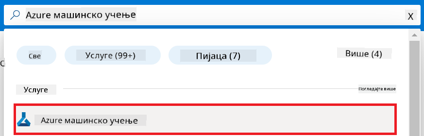

2. Izaberite **+ Create** iz navigacionog menija.

3. Izaberite **New workspace** iz navigacionog menija.

    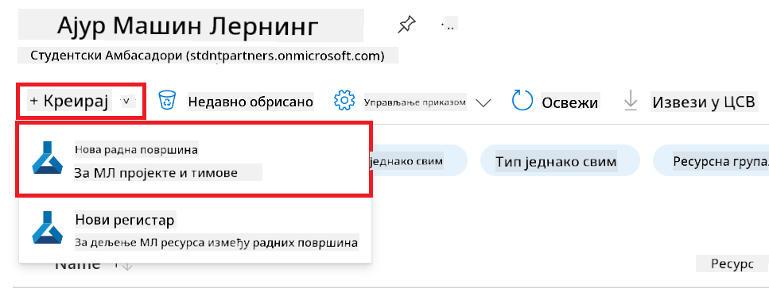

4. Izvršite sledeće zadatke:

    - Izaberite vašu Azure **Subscription**.
    - Izaberite **Resource group** koju ćete koristiti (napravite novu ako je potrebno).
    - Unesite **Workspace Name**. Mora biti jedinstvena vrednost.
    - Izaberite **Region** koju želite da koristite.
    - Izaberite **Storage account** koji ćete koristiti (napravite novi ako je potrebno).
    - Izaberite **Key vault** koji ćete koristiti (napravite novi ako je potrebno).
    - Izaberite **Application insights** koji ćete koristiti (napravite novi ako je potrebno).
    - Izaberite **Container registry** koji ćete koristiti (napravite novi ako je potrebno).

    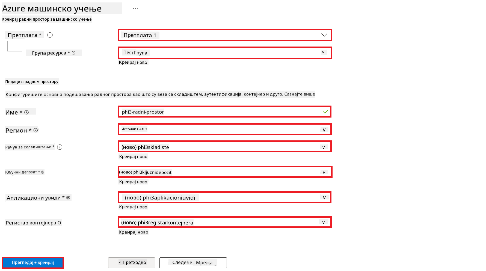

5. Izaberite **Review + Create**.

6. Izaberite **Create**.

### Zahtev za GPU kvote u Azure pretplati

U ovom tutorijalu naučićete kako da fino podesite i implementirate Phi-3 model koristeći GPU-ove. Za fino podešavanje koristićete *Standard_NC24ads_A100_v4* GPU, za koji je potrebno podneti zahtev za kvotu. Za implementaciju koristićete *Standard_NC6s_v3* GPU, za koji je takođe potreban zahtev za kvotu.

> [!NOTE]
>
> Samo Pay-As-You-Go pretplate (standardni tip pretplate) su podobne za dodelu GPU resursa; pretplate sa benefitima trenutno nisu podržane.
>

1. Posetite [Azure ML Studio](https://ml.azure.com/home?wt.mc_id=studentamb_279723).

1. Izvršite sledeće korake da zatražite *Standard NCADSA100v4 Family* kvotu:

    - Izaberite **Quota** sa leve strane.
    - Izaberite **Virtual machine family** koju želite da koristite. Na primer, izaberite **Standard NCADSA100v4 Family Cluster Dedicated vCPUs**, koji uključuje *Standard_NC24ads_A100_v4* GPU.
    - Izaberite **Request quota** iz navigacionog menija.

        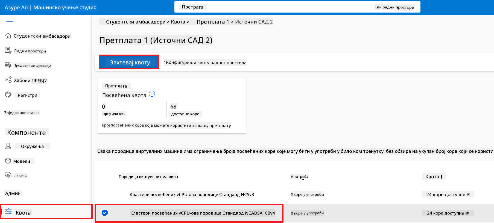

    - Na stranici za zahtev kvote unesite **New cores limit** koju želite da koristite. Na primer, 24.
    - Na stranici za zahtev kvote izaberite **Submit** da podnesete zahtev za GPU kvotu.

1. Izvršite sledeće korake da zatražite *Standard NCSv3 Family* kvotu:

    - Izaberite **Quota** sa leve strane.
    - Izaberite **Virtual machine family** koju želite da koristite. Na primer, izaberite **Standard NCSv3 Family Cluster Dedicated vCPUs**, koji uključuje *Standard_NC6s_v3* GPU.
    - Izaberite **Request quota** iz navigacionog menija.
    - Na stranici za zahtev kvote unesite **New cores limit** koju želite da koristite. Na primer, 24.
    - Na stranici za zahtev kvote izaberite **Submit** da podnesete zahtev za GPU kvotu.

### Dodavanje dodeljivanja uloge

Da biste fino podesili i implementirali vaše modele, prvo morate kreirati User Assigned Managed Identity (UAI) i dodeliti joj odgovarajuće dozvole. Ova UAI će se koristiti za autentifikaciju tokom implementacije.

#### Kreiranje User Assigned Managed Identity (UAI)

1. Upišite *managed identities* u **traku za pretragu** na vrhu portala i izaberite **Managed Identities** iz ponuđenih opcija.

    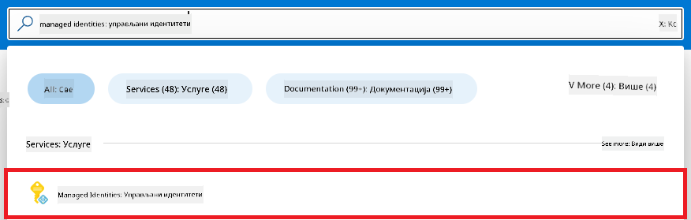

1. Izaberite **+ Create**.

    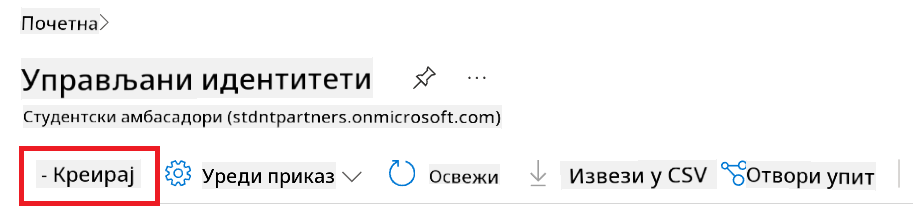

1. Izvršite sledeće zadatke:

    - Izaberite vašu Azure **Subscription**.
    - Izaberite **Resource group** koju ćete koristiti (napravite novu ako je potrebno).
    - Izaberite **Region** koju želite da koristite.
    - Unesite **Name**. Mora biti jedinstvena vrednost.

    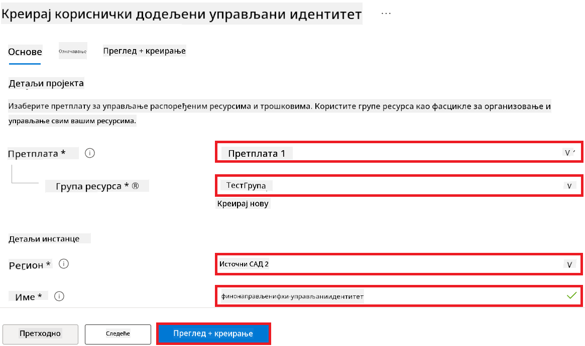

1. Izaberite **Review + create**.

1. Izaberite **+ Create**.

#### Dodavanje Contributor uloge Managed Identity

1. Idite na Managed Identity resurs koji ste kreirali.

1. Izaberite **Azure role assignments** sa leve strane.

1. Izaberite **+Add role assignment** iz navigacionog menija.

1. Na stranici za dodavanje uloge, izvršite sledeće:

    - Izaberite **Scope** na **Resource group**.
    - Izaberite vašu Azure **Subscription**.
    - Izaberite **Resource group** koju koristite.
    - Izaberite **Role** na **Contributor**.

    

2. Izaberite **Save**.

#### Dodavanje Storage Blob Data Reader uloge Managed Identity

1. Upišite *storage accounts* u **traku za pretragu** na vrhu portala i izaberite **Storage accounts** iz ponuđenih opcija.

    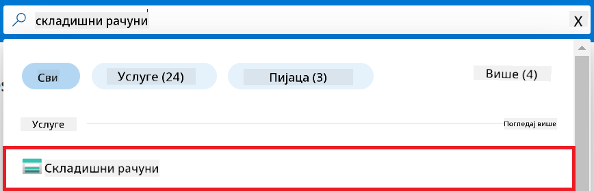

1. Izaberite storage account povezan sa Azure Machine Learning workspace koji ste kreirali. Na primer, *finetunephistorage*.

1. Izvršite sledeće da biste stigli do stranice za dodavanje uloge:

    - Idite na Azure Storage account koji ste kreirali.
    - Izaberite **Access Control (IAM)** sa leve strane.
    - Izaberite **+ Add** iz navigacionog menija.
    - Izaberite **Add role assignment** iz navigacionog menija.

    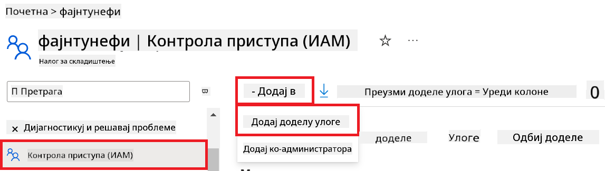

1. Na stranici za dodavanje uloge, izvršite sledeće:

    - U polje za pretragu ulogu upišite *Storage Blob Data Reader* i izaberite **Storage Blob Data Reader** iz ponuđenih opcija.
    - Izaberite **Next**.
    - Na stranici za članove izaberite **Assign access to** na **Managed identity**.
    - Izaberite **+ Select members**.
    - Izaberite vašu Azure **Subscription**.
    - Izaberite **Managed identity** na **Manage Identity**.
    - Izaberite Managed Identity koju ste kreirali. Na primer, *finetunephi-managedidentity*.
    - Izaberite **Select**.

    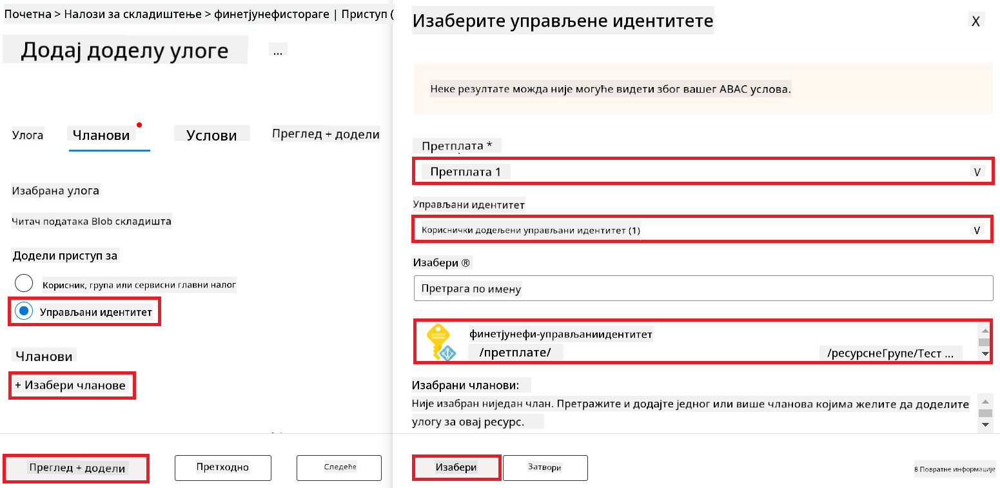

1. Izaberite **Review + assign**.

#### Dodavanje AcrPull uloge Managed Identity

1. Upišite *container registries* u **traku za pretragu** na vrhu portala i izaberite **Container registries** iz ponuđenih opcija.

    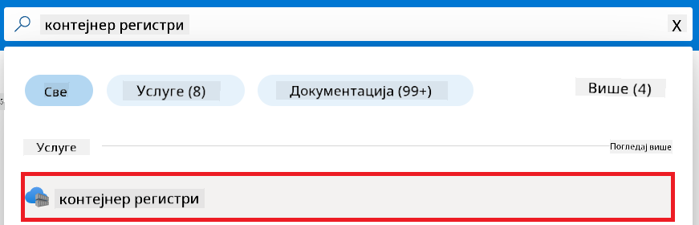

1. Izaberite container registry povezan sa Azure Machine Learning workspace. Na primer, *finetunephicontainerregistry*.

1. Izvršite sledeće da biste stigli do stranice za dodavanje uloge:

    - Izaberite **Access Control (IAM)** sa leve strane.
    - Izaberite **+ Add** iz navigacionog menija.
    - Izaberite **Add role assignment** iz navigacionog menija.

1. Na stranici za dodavanje uloge, izvršite sledeće:

    - U polje za pretragu upišite *AcrPull* i izaberite **AcrPull** iz ponuđenih opcija.
    - Izaberite **Next**.
    - Na stranici za članove izaberite **Assign access to** na **Managed identity**.
    - Izaberite **+ Select members**.
    - Izaberite vašu Azure **Subscription**.
    - Izaberite **Managed identity** na **Manage Identity**.
    - Izaberite Managed Identity koju ste kreirali. Na primer, *finetunephi-managedidentity*.
    - Izaberite **Select**.
    - Izaberite **Review + assign**.

### Postavljanje projekta

Da biste preuzeli skupove podataka potrebne za fino podešavanje, postavićete lokalno okruženje.

U ovom zadatku ćete:

- Kreirati folder u kojem ćete raditi.
- Kreirati virtuelno okruženje.
- Instalirati potrebne pakete.
- Kreirati fajl *download_dataset.py* za preuzimanje skupa podataka.

#### Kreiranje foldera za rad

1. Otvorite terminal i otkucajte sledeću komandu da kreirate folder pod nazivom *finetune-phi* u podrazumevanoj putanji.

    ```console
    mkdir finetune-phi
    ```

2. U terminalu otkucajte sledeću komandu da uđete u folder *finetune-phi* koji ste kreirali.

    ```console
    cd finetune-phi
    ```

#### Kreiranje virtuelnog okruženja

1. U terminalu otkucajte sledeću komandu da kreirate virtuelno okruženje pod nazivom *.venv*.

    ```console
    python -m venv .venv
    ```

2. U terminalu otkucajte sledeću komandu da aktivirate virtuelno okruženje.

    ```console
    .venv\Scripts\activate.bat
    ```

> [!NOTE]
> Ako je uspešno, trebalo bi da vidite *(.venv)* ispred komandne linije.

#### Instalacija potrebnih paketa

1. U terminalu otkucajte sledeće komande da instalirate potrebne pakete.

    ```console
    pip install datasets==2.19.1
    ```

#### Kreiranje `download_dataset.py`

> [!NOTE]
> Kompletna struktura foldera:
>
> ```text
> └── YourUserName
> .    └── finetune-phi
> .        └── download_dataset.py
> ```

1. Otvorite **Visual Studio Code**.

1. Izaberite **File** iz menija.

1. Izaberite **Open Folder**.

1. Izaberite folder *finetune-phi* koji ste kreirali, koji se nalazi na putanji *C:\Users\yourUserName\finetune-phi*.

    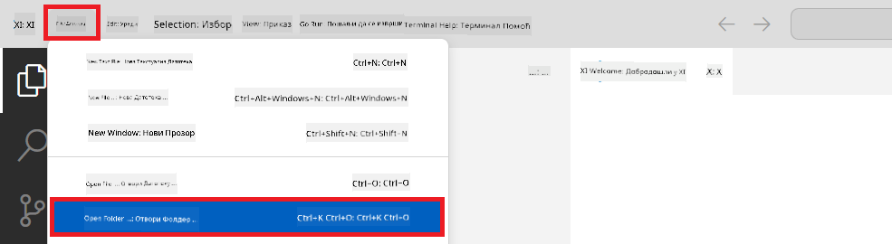

1. U levom delu Visual Studio Code, kliknite desnim tasterom i izaberite **New File** da kreirate novi fajl pod nazivom *download_dataset.py*.

    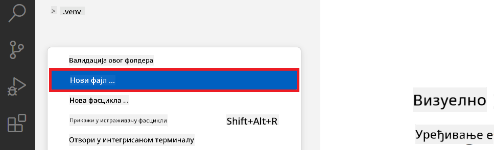

### Priprema skupa podataka za fino podešavanje

U ovom zadatku pokrenućete fajl *download_dataset.py* da preuzmete *ultrachat_200k* skupove podataka u vaše lokalno okruženje. Nakon toga ćete koristiti ove skupove podataka za fino podešavanje Phi-3 modela u Azure Machine Learning.

U ovom zadatku ćete:

- Dodati kod u fajl *download_dataset.py* za preuzimanje skupova podataka.
- Pokrenuti fajl *download_dataset.py* da preuzmete skupove podataka u lokalno okruženje.

#### Preuzimanje skupa podataka pomoću *download_dataset.py*

1. Otvorite fajl *download_dataset.py* u Visual Studio Code.

1. Dodajte sledeći kod u fajl *download_dataset.py*.

    ```python
    import json
    import os
    from datasets import load_dataset

    def load_and_split_dataset(dataset_name, config_name, split_ratio):
        """
        Load and split a dataset.
        """
        # Load the dataset with the specified name, configuration, and split ratio
        dataset = load_dataset(dataset_name, config_name, split=split_ratio)
        print(f"Original dataset size: {len(dataset)}")
        
        # Split the dataset into train and test sets (80% train, 20% test)
        split_dataset = dataset.train_test_split(test_size=0.2)
        print(f"Train dataset size: {len(split_dataset['train'])}")
        print(f"Test dataset size: {len(split_dataset['test'])}")
        
        return split_dataset

    def save_dataset_to_jsonl(dataset, filepath):
        """
        Save a dataset to a JSONL file.
        """
        # Create the directory if it does not exist
        os.makedirs(os.path.dirname(filepath), exist_ok=True)
        
        # Open the file in write mode
        with open(filepath, 'w', encoding='utf-8') as f:
            # Iterate over each record in the dataset
            for record in dataset:
                # Dump the record as a JSON object and write it to the file
                json.dump(record, f)
                # Write a newline character to separate records
                f.write('\n')
        
        print(f"Dataset saved to {filepath}")

    def main():
        """
        Main function to load, split, and save the dataset.
        """
        # Load and split the ULTRACHAT_200k dataset with a specific configuration and split ratio
        dataset = load_and_split_dataset("HuggingFaceH4/ultrachat_200k", 'default', 'train_sft[:1%]')
        
        # Extract the train and test datasets from the split
        train_dataset = dataset['train']
        test_dataset = dataset['test']

        # Save the train dataset to a JSONL file
        save_dataset_to_jsonl(train_dataset, "data/train_data.jsonl")
        
        # Save the test dataset to a separate JSONL file
        save_dataset_to_jsonl(test_dataset, "data/test_data.jsonl")

    if __name__ == "__main__":
        main()

    ```

1. U terminalu otkucajte sledeću komandu da pokrenete skriptu i preuzmete skup podataka u lokalno okruženje.

    ```console
    python download_dataset.py
    ```

1. Proverite da li su skupovi podataka uspešno sačuvani u lokalnom direktorijumu *finetune-phi/data*.

> [!NOTE]
>
> #### Napomena o veličini skupa podataka i vremenu fino podešavanja
>
> U ovom tutorijalu koristite samo 1% skupa podataka (`split='train[:1%]'`). Ovo značajno smanjuje količinu podataka, ubrzavajući i proces otpremanja i fino podešavanja. Možete prilagoditi procenat da pronađete pravi balans između vremena treniranja i performansi modela. Korišćenje manjeg dela skupa podataka smanjuje vreme potrebno za fino podešavanje, čineći proces lakšim za tutorijal.

## Scenario 2: Fino podešavanje Phi-3 modela i implementacija u Azure Machine Learning Studio

### Fino podešavanje Phi-3 modela

U ovom zadatku fino ćete podesiti Phi-3 model u Azure Machine Learning Studio.

U ovom zadatku ćete:

- Kreirati računski klaster za fino podešavanje.
- Fino podesiti Phi-3 model u Azure Machine Learning Studio.

#### Kreiranje računskog klastera za fino podešavanje
1. Posetite [Azure ML Studio](https://ml.azure.com/home?wt.mc_id=studentamb_279723).

1. Izaberite **Compute** sa leve strane taba.

1. Izaberite **Compute clusters** iz navigacionog menija.

1. Izaberite **+ New**.

    

1. Uradite sledeće:

    - Izaberite **Region** koji želite da koristite.
    - Izaberite **Virtual machine tier** na **Dedicated**.
    - Izaberite **Virtual machine type** na **GPU**.
    - Izaberite filter za **Virtual machine size** na **Select from all options**.
    - Izaberite **Virtual machine size** na **Standard_NC24ads_A100_v4**.

    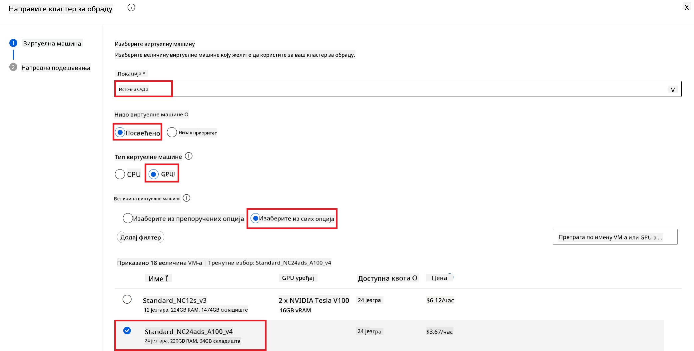

1. Izaberite **Next**.

1. Uradite sledeće:

    - Unesite **Compute name**. Mora biti jedinstvena vrednost.
    - Izaberite **Minimum number of nodes** na **0**.
    - Izaberite **Maximum number of nodes** na **1**.
    - Izaberite **Idle seconds before scale down** na **120**.

    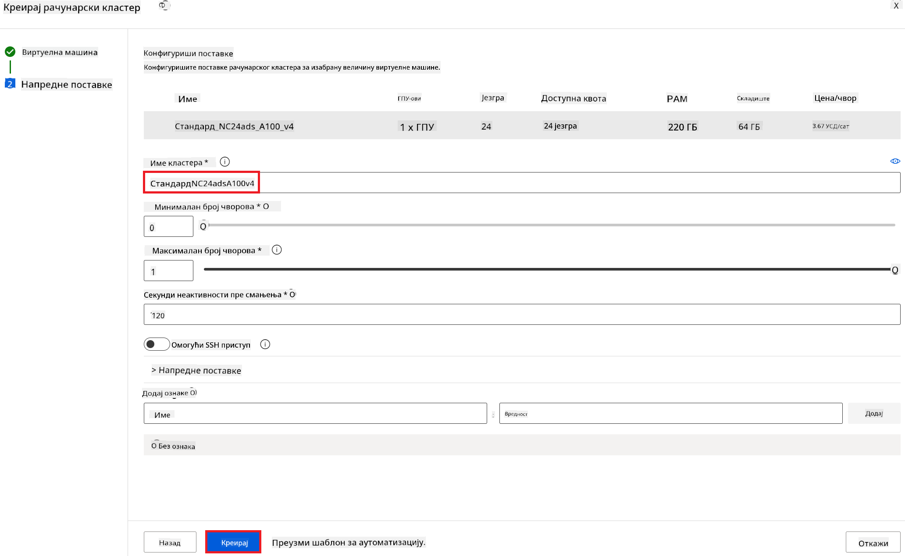

1. Izaberite **Create**.

#### Fino podešavanje Phi-3 modela

1. Posetite ponovo [Azure ML Studio](https://ml.azure.com/home?wt.mc_id=studentamb_279723).

1. Izaberite Azure Machine Learning workspace koji ste kreirali.

    

1. Uradite sledeće:

    - Izaberite **Model catalog** sa leve strane taba.
    - Ukucajte *phi-3-mini-4k* u **search bar** i izaberite **Phi-3-mini-4k-instruct** iz ponuđenih opcija.

    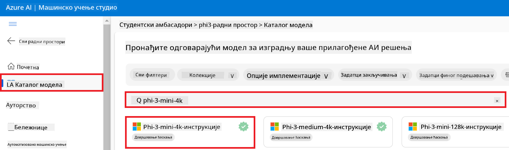

1. Izaberite **Fine-tune** iz navigacionog menija.

    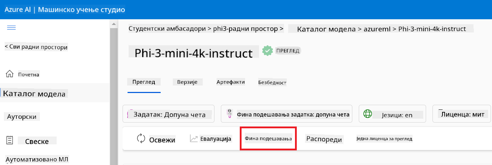

1. Uradite sledeće:

    - Izaberite **Select task type** na **Chat completion**.
    - Izaberite **+ Select data** da otpremite **Training data**.
    - Izaberite tip otpremanja Validation podataka na **Provide different validation data**.
    - Izaberite **+ Select data** da otpremite **Validation data**.

    

    > [!TIP]
    >
    > Možete izabrati **Advanced settings** da prilagodite podešavanja kao što su **learning_rate** i **lr_scheduler_type** kako biste optimizovali proces fino podešavanja prema vašim potrebama.

1. Izaberite **Finish**.

1. U ovoj vežbi ste uspešno fino podesili Phi-3 model koristeći Azure Machine Learning. Imajte na umu da proces fino podešavanja može potrajati. Nakon pokretanja posla za fino podešavanje, potrebno je sačekati da se završi. Status posla možete pratiti u tabu Jobs sa leve strane u vašem Azure Machine Learning Workspace-u. U narednom delu ćete postaviti fino podešeni model i integrisati ga sa Prompt flow.

    

### Postavljanje fino podešenog Phi-3 modela

Da biste integrisali fino podešeni Phi-3 model sa Prompt flow, potrebno je da postavite model kako bi bio dostupan za real-time inferencu. Ovaj proces uključuje registraciju modela, kreiranje online endpoint-a i postavljanje modela.

U ovoj vežbi ćete:

- Registrovati fino podešeni model u Azure Machine Learning workspace-u.
- Kreirati online endpoint.
- Postaviti registrovani fino podešeni Phi-3 model.

#### Registracija fino podešenog modela

1. Posetite [Azure ML Studio](https://ml.azure.com/home?wt.mc_id=studentamb_279723).

1. Izaberite Azure Machine Learning workspace koji ste kreirali.

    

1. Izaberite **Models** sa leve strane taba.
1. Izaberite **+ Register**.
1. Izaberite **From a job output**.

    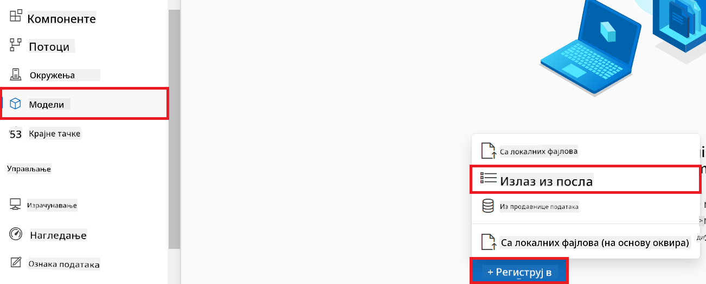

1. Izaberite posao koji ste kreirali.

    

1. Izaberite **Next**.

1. Izaberite **Model type** na **MLflow**.

1. Proverite da je **Job output** izabran; trebalo bi da bude automatski izabran.

    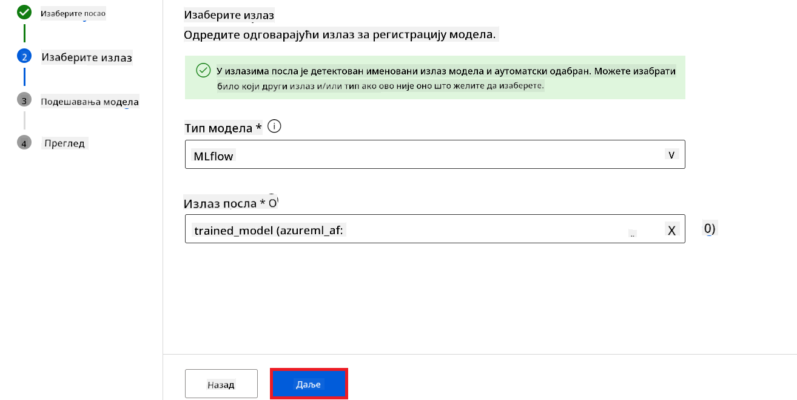

2. Izaberite **Next**.

3. Izaberite **Register**.

    

4. Registrovani model možete videti u meniju **Models** sa leve strane taba.

    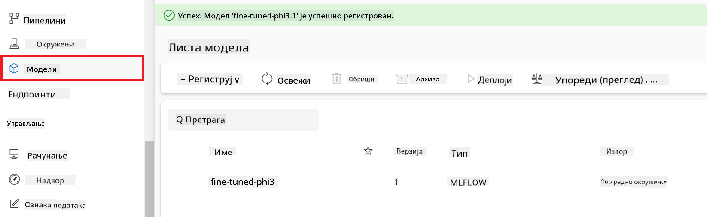

#### Postavljanje fino podešenog modela

1. Idite u Azure Machine Learning workspace koji ste kreirali.

1. Izaberite **Endpoints** sa leve strane taba.

1. Izaberite **Real-time endpoints** iz navigacionog menija.

    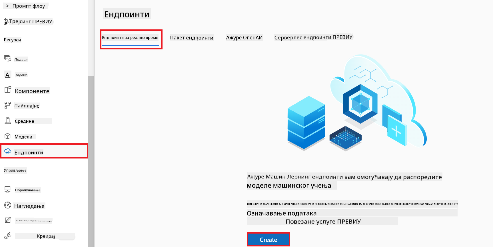

1. Izaberite **Create**.

1. Izaberite registrovani model koji ste kreirali.

    

1. Izaberite **Select**.

1. Uradite sledeće:

    - Izaberite **Virtual machine** na *Standard_NC6s_v3*.
    - Izaberite broj instanci koje želite da koristite. Na primer, *1*.
    - Izaberite **Endpoint** na **New** da kreirate novi endpoint.
    - Unesite **Endpoint name**. Mora biti jedinstvena vrednost.
    - Unesite **Deployment name**. Mora biti jedinstvena vrednost.

    

1. Izaberite **Deploy**.

> [!WARNING]
> Da biste izbegli dodatne troškove, obavezno obrišite kreirani endpoint u Azure Machine Learning workspace-u kada vam više nije potreban.
>

#### Provera statusa postavljanja u Azure Machine Learning Workspace-u

1. Idite u Azure Machine Learning workspace koji ste kreirali.

1. Izaberite **Endpoints** sa leve strane taba.

1. Izaberite endpoint koji ste kreirali.

    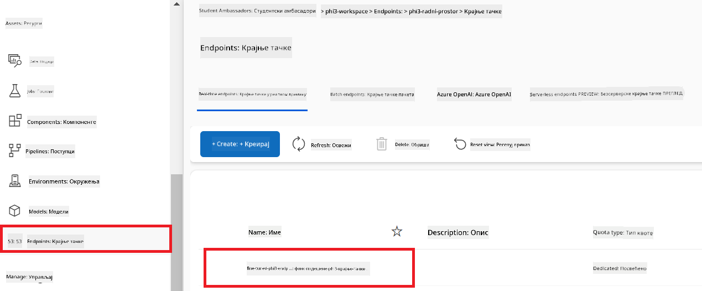

1. Na ovoj stranici možete upravljati endpoint-ima tokom procesa postavljanja.

> [!NOTE]
> Kada postavljanje bude završeno, proverite da je **Live traffic** podešen na **100%**. Ako nije, izaberite **Update traffic** da prilagodite saobraćaj. Ne možete testirati model ako je saobraćaj podešen na 0%.
>
> 
>

## Scenario 3: Integracija sa Prompt flow i razgovor sa vašim prilagođenim modelom u Azure AI Foundry

### Integracija prilagođenog Phi-3 modela sa Prompt flow

Nakon uspešnog postavljanja fino podešenog modela, sada ga možete integrisati sa Prompt Flow kako biste koristili model u real-time aplikacijama, omogućavajući različite interaktivne zadatke sa vašim prilagođenim Phi-3 modelom.

U ovoj vežbi ćete:

- Kreirati Azure AI Foundry Hub.
- Kreirati Azure AI Foundry Projekat.
- Kreirati Prompt flow.
- Dodati prilagođenu konekciju za fino podešeni Phi-3 model.
- Podesiti Prompt flow za razgovor sa vašim prilagođenim Phi-3 modelom.

> [!NOTE]
> Takođe možete integrisati sa Promptflow koristeći Azure ML Studio. Isti proces integracije važi i za Azure ML Studio.

#### Kreiranje Azure AI Foundry Hub-a

Pre nego što kreirate Projekat, potrebno je da kreirate Hub. Hub funkcioniše kao Resource Group, omogućavajući organizaciju i upravljanje više Projekata unutar Azure AI Foundry.

1. Posetite [Azure AI Foundry](https://ai.azure.com/?WT.mc_id=aiml-137032-kinfeylo).

1. Izaberite **All hubs** sa leve strane taba.

1. Izaberite **+ New hub** iz navigacionog menija.

    

1. Uradite sledeće:

    - Unesite **Hub name**. Mora biti jedinstvena vrednost.
    - Izaberite vašu Azure **Subscription**.
    - Izaberite **Resource group** koju želite da koristite (kreirajte novu ako je potrebno).
    - Izaberite **Location** koju želite da koristite.
    - Izaberite **Connect Azure AI Services** (kreirajte novu ako je potrebno).
    - Izaberite **Connect Azure AI Search** na **Skip connecting**.

    

1. Izaberite **Next**.

#### Kreiranje Azure AI Foundry Projekta

1. U Hub-u koji ste kreirali, izaberite **All projects** sa leve strane taba.

1. Izaberite **+ New project** iz navigacionog menija.

    

1. Unesite **Project name**. Mora biti jedinstvena vrednost.

    

1. Izaberite **Create a project**.

#### Dodavanje prilagođene konekcije za fino podešeni Phi-3 model

Da biste integrisali vaš prilagođeni Phi-3 model sa Prompt flow, potrebno je da sačuvate endpoint i ključ modela u prilagođenoj konekciji. Ovo omogućava pristup vašem prilagođenom Phi-3 modelu u Prompt flow-u.

#### Podesite api ključ i endpoint URI fino podešenog Phi-3 modela

1. Posetite [Azure ML Studio](https://ml.azure.com/home?WT.mc_id=aiml-137032-kinfeylo).

1. Idite u Azure Machine Learning workspace koji ste kreirali.

1. Izaberite **Endpoints** sa leve strane taba.

    

1. Izaberite endpoint koji ste kreirali.

    

1. Izaberite **Consume** iz navigacionog menija.

1. Kopirajte vaš **REST endpoint** i **Primary key**.


#### Dodajte prilagođenu konekciju

1. Posetite [Azure AI Foundry](https://ai.azure.com/?WT.mc_id=aiml-137032-kinfeylo).

1. Idite do Azure AI Foundry projekta koji ste kreirali.

1. U projektu koji ste napravili, izaberite **Settings** sa leve strane.

1. Izaberite **+ New connection**.

    

1. Izaberite **Custom keys** iz navigacionog menija.

    

1. Uradite sledeće:

    - Izaberite **+ Add key value pairs**.
    - Za ime ključa unesite **endpoint** i nalepite endpoint koji ste kopirali iz Azure ML Studija u polje za vrednost.
    - Ponovo izaberite **+ Add key value pairs**.
    - Za ime ključa unesite **key** i nalepite ključ koji ste kopirali iz Azure ML Studija u polje za vrednost.
    - Nakon dodavanja ključeva, označite **is secret** da biste sprečili da ključ bude vidljiv.

    

1. Izaberite **Add connection**.

#### Kreirajte Prompt flow

Dodali ste prilagođenu konekciju u Azure AI Foundry. Sada ćemo kreirati Prompt flow koristeći sledeće korake. Nakon toga povezaćete ovaj Prompt flow sa prilagođenom konekcijom kako biste mogli da koristite fino podešeni model unutar Prompt flow-a.

1. Idite do Azure AI Foundry projekta koji ste kreirali.

1. Izaberite **Prompt flow** sa leve strane.

1. Izaberite **+ Create** iz navigacionog menija.

    

1. Izaberite **Chat flow** iz navigacionog menija.

    

1. Unesite **Folder name** koji želite da koristite.

    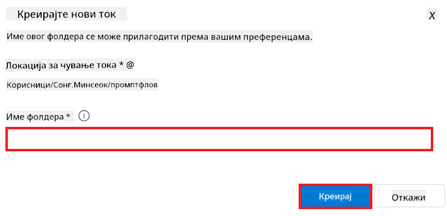

2. Izaberite **Create**.

#### Podesite Prompt flow za ćaskanje sa vašim prilagođenim Phi-3 modelom

Potrebno je da integrišete fino podešeni Phi-3 model u Prompt flow. Međutim, postojeći Prompt flow nije dizajniran za ovu svrhu. Zato je potrebno da redizajnirate Prompt flow kako biste omogućili integraciju prilagođenog modela.

1. U Prompt flow-u, uradite sledeće da biste prepravili postojeći tok:

    - Izaberite **Raw file mode**.
    - Obrišite sav postojeći kod u *flow.dag.yml* fajlu.
    - Dodajte sledeći kod u *flow.dag.yml* fajl.

        ```yml
        inputs:
          input_data:
            type: string
            default: "Who founded Microsoft?"

        outputs:
          answer:
            type: string
            reference: ${integrate_with_promptflow.output}

        nodes:
        - name: integrate_with_promptflow
          type: python
          source:
            type: code
            path: integrate_with_promptflow.py
          inputs:
            input_data: ${inputs.input_data}
        ```

    - Izaberite **Save**.

    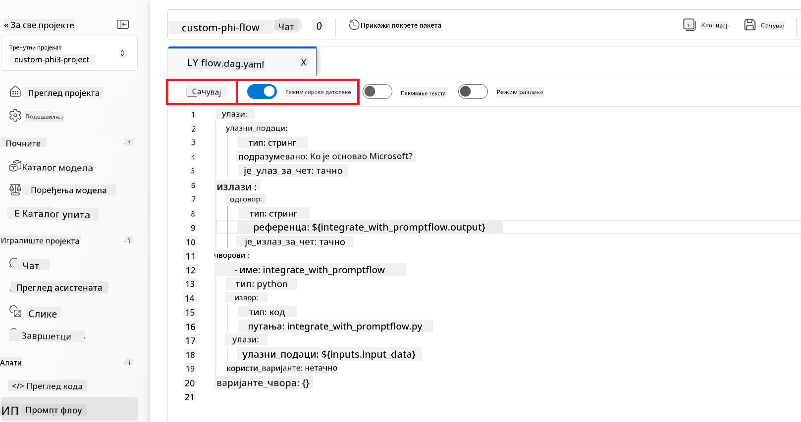

1. Dodajte sledeći kod u *integrate_with_promptflow.py* fajl da biste koristili prilagođeni Phi-3 model u Prompt flow-u.

    ```python
    import logging
    import requests
    from promptflow import tool
    from promptflow.connections import CustomConnection

    # Logging setup
    logging.basicConfig(
        format="%(asctime)s - %(levelname)s - %(name)s - %(message)s",
        datefmt="%Y-%m-%d %H:%M:%S",
        level=logging.DEBUG
    )
    logger = logging.getLogger(__name__)

    def query_phi3_model(input_data: str, connection: CustomConnection) -> str:
        """
        Send a request to the Phi-3 model endpoint with the given input data using Custom Connection.
        """

        # "connection" is the name of the Custom Connection, "endpoint", "key" are the keys in the Custom Connection
        endpoint_url = connection.endpoint
        api_key = connection.key

        headers = {
            "Content-Type": "application/json",
            "Authorization": f"Bearer {api_key}"
        }
        data = {
            "input_data": {
                "input_string": [
                    {"role": "user", "content": input_data}
                ],
                "parameters": {
                    "temperature": 0.7,
                    "max_new_tokens": 128
                }
            }
        }
        try:
            response = requests.post(endpoint_url, json=data, headers=headers)
            response.raise_for_status()
            
            # Log the full JSON response
            logger.debug(f"Full JSON response: {response.json()}")

            result = response.json()["output"]
            logger.info("Successfully received response from Azure ML Endpoint.")
            return result
        except requests.exceptions.RequestException as e:
            logger.error(f"Error querying Azure ML Endpoint: {e}")
            raise

    @tool
    def my_python_tool(input_data: str, connection: CustomConnection) -> str:
        """
        Tool function to process input data and query the Phi-3 model.
        """
        return query_phi3_model(input_data, connection)

    ```

    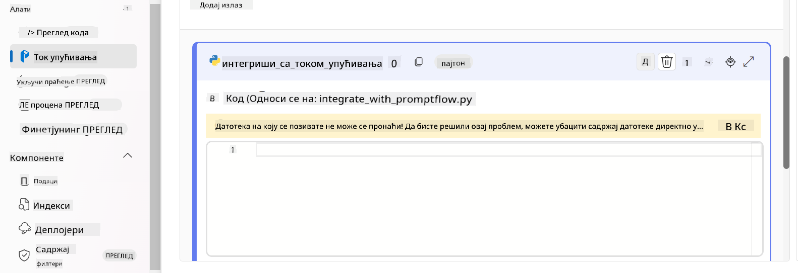

> [!NOTE]
> Za detaljnije informacije o korišćenju Prompt flow u Azure AI Foundry, možete pogledati [Prompt flow in Azure AI Foundry](https://learn.microsoft.com/azure/ai-studio/how-to/prompt-flow).

1. Izaberite **Chat input**, **Chat output** da omogućite ćaskanje sa vašim modelom.

    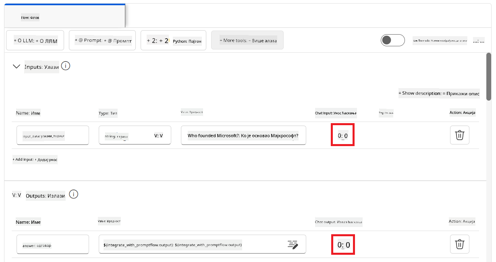

1. Sada ste spremni da ćaskate sa vašim prilagođenim Phi-3 modelom. U sledećem zadatku naučićete kako da pokrenete Prompt flow i koristite ga za razgovor sa fino podešenim Phi-3 modelom.

> [!NOTE]
>
> Prepravljeni tok treba da izgleda kao na slici ispod:
>
> 
>

### Ćaskajte sa vašim prilagođenim Phi-3 modelom

Sada kada ste fino podesili i integrisali vaš prilagođeni Phi-3 model sa Prompt flow-om, spremni ste da počnete interakciju sa njim. Ovaj zadatak će vas voditi kroz proces podešavanja i pokretanja ćaskanja sa vašim modelom koristeći Prompt flow. Prateći ove korake, moći ćete u potpunosti da iskoristite mogućnosti vašeg fino podešenog Phi-3 modela za različite zadatke i razgovore.

- Ćaskajte sa vašim prilagođenim Phi-3 modelom koristeći Prompt flow.

#### Pokrenite Prompt flow

1. Izaberite **Start compute sessions** da pokrenete Prompt flow.

    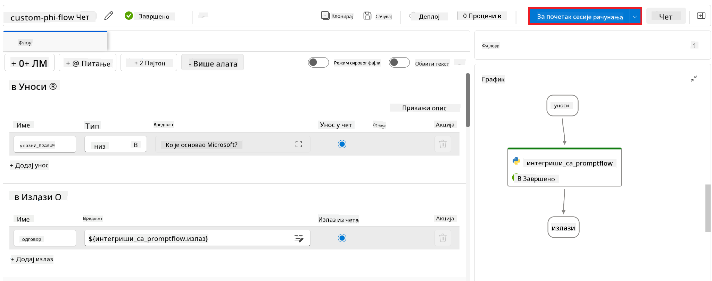

1. Izaberite **Validate and parse input** da osvežite parametre.

    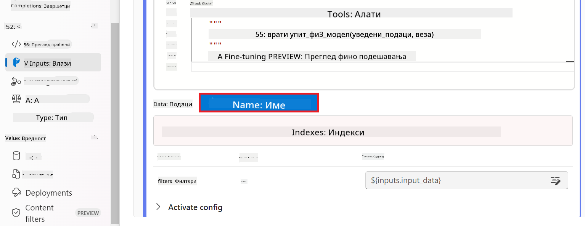

1. Izaberite **Value** za **connection** i povežite ga sa prilagođenom konekcijom koju ste napravili. Na primer, *connection*.

    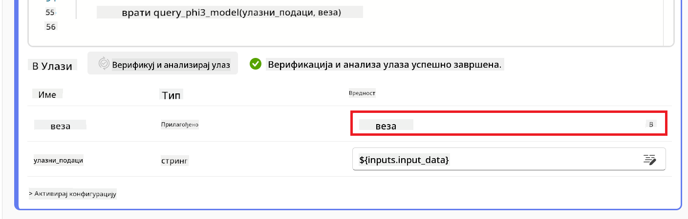

#### Ćaskajte sa vašim prilagođenim modelom

1. Izaberite **Chat**.

    

1. Evo primera rezultata: Sada možete da ćaskate sa vašim prilagođenim Phi-3 modelom. Preporučuje se da postavljate pitanja na osnovu podataka korišćenih za fino podešavanje.

    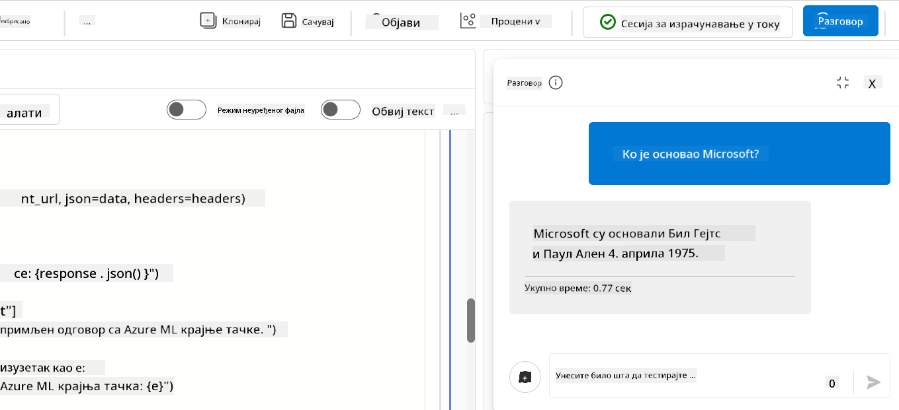

**Ограничење одговорности**:  
Овај документ је преведен коришћењем AI преводилачке услуге [Co-op Translator](https://github.com/Azure/co-op-translator). Иако настојимо да превод буде прецизан, молимо имајте у виду да аутоматски преводи могу садржати грешке или нетачности. Оригинални документ на његовом изворном језику треба сматрати ауторитетним извором. За критичне информације препоручује се професионални људски превод. Нисмо одговорни за било каква неспоразума или погрешна тумачења која произилазе из коришћења овог превода.