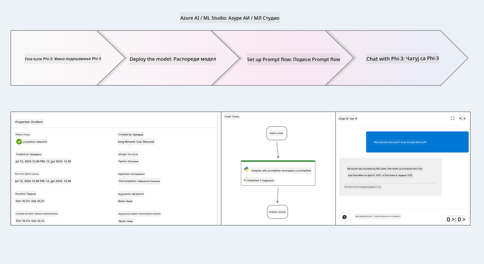
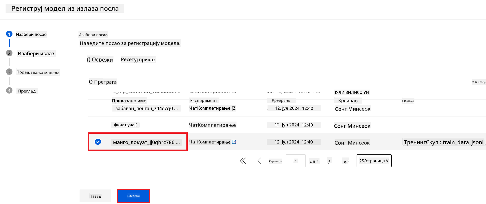
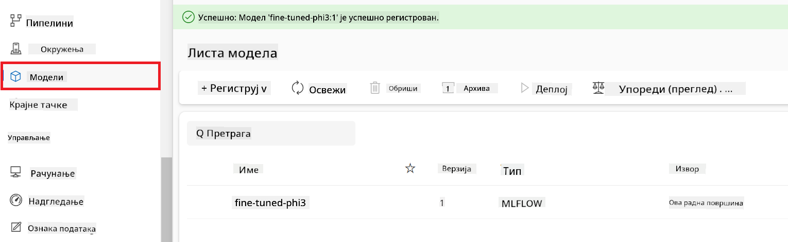
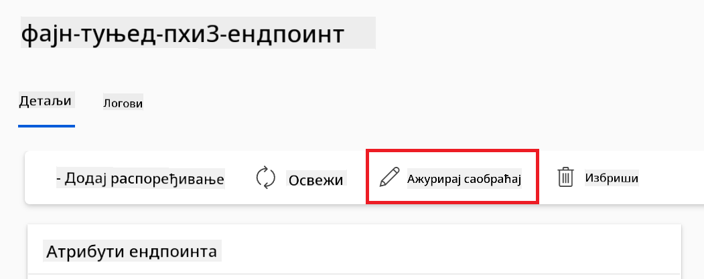
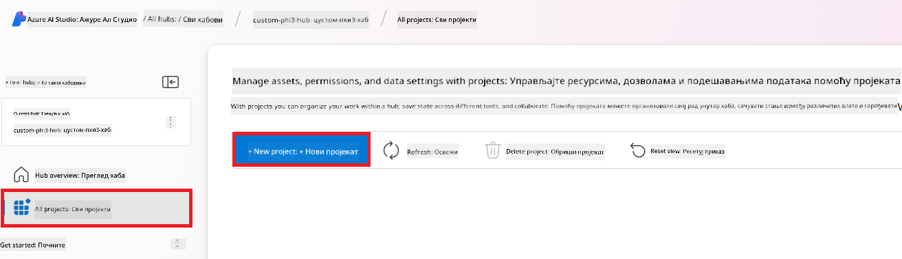
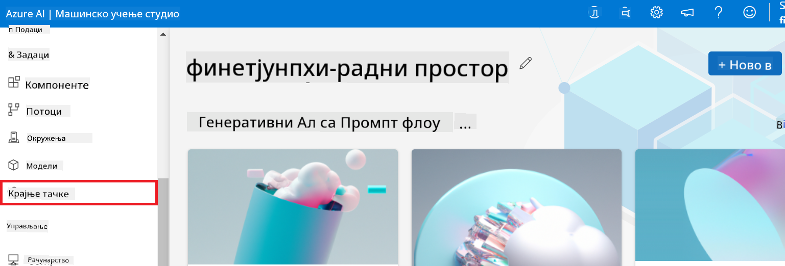
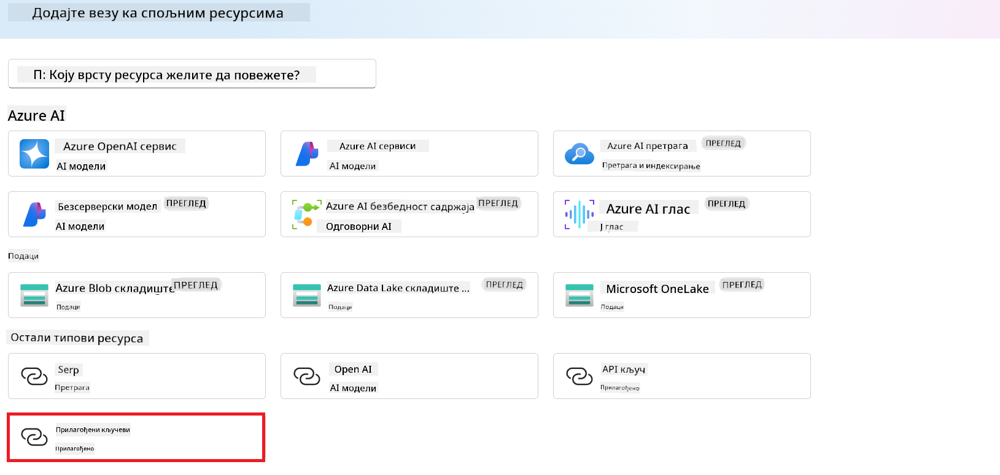
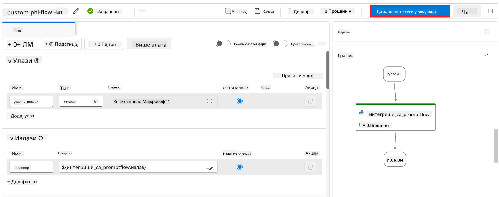

<!--
CO_OP_TRANSLATOR_METADATA:
{
  "original_hash": "0df910a227098303cc392b6ad204c271",
  "translation_date": "2026-01-06T05:14:47+00:00",
  "source_file": "md/02.Application/01.TextAndChat/Phi3/E2E_Phi-3-FineTuning_PromptFlow_Integration_AIFoundry.md",
  "language_code": "sr"
}
-->
# Фајн-тунинг и интеграција прилагођених Phi-3 модела са Prompt flow у Azure AI Foundry

Овај крај-до-краја (E2E) пример заснован је на водичу "[Fine-Tune and Integrate Custom Phi-3 Models with Prompt Flow in Azure AI Foundry](https://techcommunity.microsoft.com/t5/educator-developer-blog/fine-tune-and-integrate-custom-phi-3-models-with-prompt-flow-in/ba-p/4191726?WT.mc_id=aiml-137032-kinfeylo)" из Microsoft Tech Community. Уводи процесе фајн тунинга, распореда и интеграције прилагођених Phi-3 модела са Prompt flow у Azure AI Foundry.
За разлику од E2E примера, "[Fine-Tune and Integrate Custom Phi-3 Models with Prompt Flow](./E2E_Phi-3-FineTuning_PromptFlow_Integration.md)", који је укључивао покретање кода локално, овај туторијал се у потпуности фокусира на фајн-тунинг и интеграцију вашег модела у Azure AI / ML Studio.

## Преглед

У овом E2E примеру научићете како да фајн тунирате Phi-3 модел и интегришете га са Prompt flow у Azure AI Foundry. Коришћењем Azure AI / ML Studia, успоставићете радни ток за распоредање и коришћење прилагођених AI модела. Овај E2E пример је подељен у три сценарија:

**Сценарио 1: Подешавање Azure ресурса и припрема за фајн тунинг**

**Сценарио 2: Фајн тунинг Phi-3 модела и распоредање у Azure Machine Learning Studio**

**Сценарио 3: Интеграција са Prompt flow и ћаскање са вашим прилагођеним моделом у Azure AI Foundry**

Ево прегледа овог E2E примера.



### Садржај

1. **[Сценарио 1: Подешавање Azure ресурса и припрема за фајн тунинг](../../../../../../md/02.Application/01.TextAndChat/Phi3)**
    - [Креирање Azure Machine Learning Workspace-а](../../../../../../md/02.Application/01.TextAndChat/Phi3)
    - [Захтев за GPU квоте у Azure Subscription-у](../../../../../../md/02.Application/01.TextAndChat/Phi3)
    - [Додавање улоге](../../../../../../md/02.Application/01.TextAndChat/Phi3)
    - [Подешавање пројекта](../../../../../../md/02.Application/01.TextAndChat/Phi3)
    - [Припрема сета података за фајн тунинг](../../../../../../md/02.Application/01.TextAndChat/Phi3)

1. **[Сценарио 2: Фајн тунинг Phi-3 модела и распоредање у Azure Machine Learning Studio](../../../../../../md/02.Application/01.TextAndChat/Phi3)**
    - [Фајн тунинг Phi-3 модела](../../../../../../md/02.Application/01.TextAndChat/Phi3)
    - [Распоредање фајн-тунираног Phi-3 модела](../../../../../../md/02.Application/01.TextAndChat/Phi3)

1. **[Сценарио 3: Интеграција са Prompt flow и ћаскање са вашим прилагођеним моделом у Azure AI Foundry](../../../../../../md/02.Application/01.TextAndChat/Phi3)**
    - [Интеграција прилагођеног Phi-3 модела са Prompt flow](../../../../../../md/02.Application/01.TextAndChat/Phi3)
    - [Ћаскање са вашим прилагођеним Phi-3 моделом](../../../../../../md/02.Application/01.TextAndChat/Phi3)

## Сценарио 1: Подешавање Azure ресурса и припрема за фајн тунинг

### Креирање Azure Machine Learning Workspace-а

1. Укуцајте *azure machine learning* у **претраживач мени** на врху странице портала и изаберите **Azure Machine Learning** из појављених опција.

    

2. Изаберите **+ Create** из навигационог менија.

3. Изаберите **New workspace** из навигационог менија.

    

4. Извршите следеће задатке:

    - Изаберите вашу Azure **Subscription**.
    - Изаберите **Resource group** за коришћење (направите нову ако је потребно).
    - Унесите **Workspace Name**. Мора бити јединствена вредност.
    - Изаберите **Region** коју желите да користите.
    - Изаберите **Storage account** за коришћење (направите нову ако је потребно).
    - Изаберите **Key vault** за коришћење (направите нову ако је потребно).
    - Изаберите **Application insights** за коришћење (направите нову ако је потребно).
    - Изаберите **Container registry** за коришћење (направите нову ако је потребно).

    

5. Изаберите **Review + Create**.

6. Изаберите **Create**.

### Захтев за GPU квоте у Azure Subscription-у

У овом туторијалу ћете научити како да фајн тунирате и распоредите Phi-3 модел, користећи GPU. За фајн тунинг користићете *Standard_NC24ads_A100_v4* GPU, за који је потребан захтев за квоту. За распоредање користићете *Standard_NC6s_v3* GPU, који такође захтева квоту.

> [!NOTE]
>
> Само Pay-As-You-Go претплате (стандардни тип претплате) имају право на доделу GPU ресурса; претплате са попустом тренутно нису подржане.
>

1. Посетите [Azure ML Studio](https://ml.azure.com/home?wt.mc_id=studentamb_279723).

1. Извршите следеће задатке да бисте захтевали квоту за *Standard NCADSA100v4 Family*:

    - Изаберите **Quota** из леве траке.
    - Изаберите **Virtual machine family** коју желите да користите. На пример, изаберите **Standard NCADSA100v4 Family Cluster Dedicated vCPUs**, који укључује *Standard_NC24ads_A100_v4* GPU.
    - Изаберите **Request quota** из навигационог менија.

        

    - На страници Request quota унесите **New cores limit** коју желите да користите. На пример, 24.
    - На страници Request quota изаберите **Submit** да пошаљете захтев за GPU квоту.

1. Извршите следеће задатке да бисте захтевали квоту за *Standard NCSv3 Family*:

    - Изаберите **Quota** из леве траке.
    - Изаберите **Virtual machine family** коју желите да користите. На пример, изаберите **Standard NCSv3 Family Cluster Dedicated vCPUs**, који укључује *Standard_NC6s_v3* GPU.
    - Изаберите **Request quota** из навигационог менија.
    - На страници Request quota унесите **New cores limit** коју желите да користите. На пример, 24.
    - На страници Request quota изаберите **Submit** да пошаљете захтев за GPU квоту.

### Додавање улоге

Да бисте извршили фајн тунинг и распоредање модела, прво морате да креирате User Assigned Managed Identity (UAI) и доделите јој одговарајуће дозволе. Овај UAI ће се користити за аутификацију приликом распоредања.

#### Креирање User Assigned Managed Identity(UAI)

1. Укуцајте *managed identities* у **претраживач мени** на врху странице портала и изаберите **Managed Identities** из појављених опција.

    

1. Изаберите **+ Create**.

    

1. Извршите следеће задатке:

    - Изаберите вашу Azure **Subscription**.
    - Изаберите **Resource group** за коришћење (направите нову ако је потребно).
    - Изаберите **Region** коју желите да користите.
    - Унесите **Name**. Мора бити јединствено име.

    

1. Изаберите **Review + create**.

1. Изаберите **+ Create**.

#### Додавање улоге Contributor Managed Identity-ју

1. Идите на ресурс Managed Identity који сте креирали.

1. Изаберите **Azure role assignments** из леве траке.

1. Изаберите **+Add role assignment** из навигационог менија.

1. На страници Add role assignment, извршите следеће задатке:
    - Изаберите **Scope** као **Resource group**.
    - Изаберите вашу Azure **Subscription**.
    - Изаберите **Resource group** коју користите.
    - Изаберите улогу **Contributor**.

    

2. Изаберите **Save**.

#### Додавање улоге Storage Blob Data Reader Managed Identity-ју

1. Укуцајте *storage accounts* у **претраживач мени** на врху странице портала и изаберите **Storage accounts** из појављених опција.

    

1. Изаберите налог за складиштење који је повезан са Azure Machine Learning workspace-ом који сте креирали. На пример, *finetunephistorage*.

1. Извршите следеће задатке да бисте дошли на страницу Add role assignment:

    - Идите на Azure Storage налог који сте креирали.
    - Изаберите **Access Control (IAM)** из леве траке.
    - Изаберите **+ Add** из навигационог менија.
    - Изаберите **Add role assignment** из навигационог менија.

    

1. На страници Add role assignment, извршите следеће задатке:

    - У пољу улоге укуцајте *Storage Blob Data Reader* у **претраживач** и изаберите **Storage Blob Data Reader** из појављених опција.
    - Кликните **Next**.
    - На страници Members, изаберите **Assign access to** **Managed identity**.
    - Кликните **+ Select members**.
    - На страници Select managed identities изаберите вашу Azure **Subscription**.
    - Изаберите **Managed identity** као **Manage Identity**.
    - Изаберите Manage Identity коју сте креирали. На пример, *finetunephi-managedidentity*.
    - Кликните **Select**.

    

1. Изаберите **Review + assign**.

#### Додавање улоге AcrPull Managed Identity-ју

1. Укуцајте *container registries* у **претраживач мени** на врху странице и изаберите **Container registries** из појављених опција.

    

1. Изаберите регистратор контејнера који је повезан са Azure Machine Learning workspace-ом. На пример, *finetunephicontainerregistry*

1. Извршите следеће задатке да бисте дошли на страницу Add role assignment:

    - Изаберите **Access Control (IAM)** из леве траке.
    - Изаберите **+ Add** из навигационог менија.
    - Изаберите **Add role assignment** из навигационог менија.

1. На страници Add role assignment, извршите следеће задатке:

    - У пољу улоге укуцајте *AcrPull* у **претраживач** и изаберите **AcrPull** из појављених опција.
    - Кликните **Next**.
    - На страници Members, изаберите **Assign access to** **Managed identity**.
    - Кликните **+ Select members**.
    - На страници Select managed identities изаберите вашу Azure **Subscription**.
    - Изаберите **Managed identity** као **Manage Identity**.
    - Изаберите Manage Identity коју сте креирали. На пример, *finetunephi-managedidentity*.
    - Кликните **Select**.
    - Изаберите **Review + assign**.

### Подешавање пројекта

Да бисте преузели скупове података потребне за фајн тунинг, подешавате локално окружење.

У овом задатку ћете:

- Креирати фасциклу за рад.
- Креирати виртуелно окружење.
- Инсталирати потребне пакете.
- Креирати фајл *download_dataset.py* за преузимање скупa података.

#### Креирање фасцикле за рад

1. Отворите терминал и укуцајте следећу команду да бисте креирали фасциклу под називом *finetune-phi* у подразумеваној путањи.

    ```console
    mkdir finetune-phi
    ```

2. Унесите следећу команду у терминал да бисте прешли у фасциклу *finetune-phi* коју сте креирали.

    ```console
    cd finetune-phi
    ```

#### Креирање виртуелног окружења

1. Унесите следећу команду у терминал да бисте креирали виртуелно окружење са именом *.venv*.

    ```console
    python -m venv .venv
    ```

2. Унесите следећу команду у терминал да бисте активирали виртуелно окружење.

    ```console
    .venv\Scripts\activate.bat
    ```

> [!NOTE]
> Ако је све урађено правилно, требало би да видите *(.venv)* испред командне линије.

#### Инсталирање потребних пакета

1. Унесите следеће команде у терминал да бисте инсталирали потребне пакете.

    ```console
    pip install datasets==2.19.1
    ```

#### Креирање `donload_dataset.py`

> [!NOTE]
> Потпуна структура фасцикле:
>
> ```text
> └── YourUserName
> .    └── finetune-phi
> .        └── download_dataset.py
> ```

1. Отворите **Visual Studio Code**.

1. Изаберите **File** из менија.

1. Изаберите **Open Folder**.

1. Изаберите фасциклу *finetune-phi* коју сте креирали, која се налази на *C:\Users\yourUserName\finetune-phi*.

    

1. У левом панелу Visual Studio Code, кликните десним тастером мишa и изаберите **New File** да бисте креирали нову датотеку са именом *download_dataset.py*.

    

### Припрема скупа података за финетјунинг

У овом вежбању покренућете фајл *download_dataset.py* да бисте преузели скупове података *ultrachat_200k* у локално окружење. Потом ћете користити ове скупове података за финетјунинг Phi-3 модела у Azure Machine Learning.

У овом вежбању ћете:

- Додати код у фајл *download_dataset.py* за преузимање скупова података.
- Покренути фајл *download_dataset.py* да бисте преузели скупове података у локално окружење.

#### Преузмите свој скуп података користећи *download_dataset.py*

1. Отворите фајл *download_dataset.py* у Visual Studio Code.

1. Додајте следећи код у фајл *download_dataset.py*.

    ```python
    import json
    import os
    from datasets import load_dataset

    def load_and_split_dataset(dataset_name, config_name, split_ratio):
        """
        Load and split a dataset.
        """
        # Учитај скуп података са назначеним именом, конфигурацијом и односом поделе
        dataset = load_dataset(dataset_name, config_name, split=split_ratio)
        print(f"Original dataset size: {len(dataset)}")
        
        # Подели скуп података на тренинг и тест скупове (80% тренинг, 20% тест)
        split_dataset = dataset.train_test_split(test_size=0.2)
        print(f"Train dataset size: {len(split_dataset['train'])}")
        print(f"Test dataset size: {len(split_dataset['test'])}")
        
        return split_dataset

    def save_dataset_to_jsonl(dataset, filepath):
        """
        Save a dataset to a JSONL file.
        """
        # Направи директоријум ако не постоји
        os.makedirs(os.path.dirname(filepath), exist_ok=True)
        
        # Отвори фајл у режиму писања
        with open(filepath, 'w', encoding='utf-8') as f:
            # Прођи кроз сваки запис у скупу података
            for record in dataset:
                # Сними запис као JSON објекат и упиши у фајл
                json.dump(record, f)
                # Упиши нови ред за раздвајање записа
                f.write('\n')
        
        print(f"Dataset saved to {filepath}")

    def main():
        """
        Main function to load, split, and save the dataset.
        """
        # Учитај и подели ULTRACHAT_200k скуп података са специфичном конфигурацијом и односом поделе
        dataset = load_and_split_dataset("HuggingFaceH4/ultrachat_200k", 'default', 'train_sft[:1%]')
        
        # Извуци тренинг и тест скупове из поделе
        train_dataset = dataset['train']
        test_dataset = dataset['test']

        # Сними тренинг скуп у JSONL фајл
        save_dataset_to_jsonl(train_dataset, "data/train_data.jsonl")
        
        # Сними тест скуп у посебан JSONL фајл
        save_dataset_to_jsonl(test_dataset, "data/test_data.jsonl")

    if __name__ == "__main__":
        main()

    ```

1. Унесите следећу команду у терминал да бисте покренули скрипту и преузели скуп података у своје локално окружење.

    ```console
    python download_dataset.py
    ```

1. Потврдите да су скупови података успешно сачувани у ваш локални директоријум *finetune-phi/data*.

> [!NOTE]
>
> #### Напомена о величини скупа података и времену финетјунига
>
> У овом туторијалу користите само 1% скупа података (`split='train[:1%]'`). Ово значајно смањује количину података, убрзавајући и процес отпремања и финетјунинга. Проценат можете прилагодити да бисте нашли прави баланс између времена тренинга и перформанси модела. Користећи мањи подскуп скупа података смањује се време потребно за финетјунинг, чинећи процес управљивијим за туторијал.

## Сценарио 2: Финетјунинг Phi-3 модела и деплој у Azure Machine Learning Studio

### Финетјунинг Phi-3 модела

У овом вежбању ћете финетјунирати Phi-3 модел у Azure Machine Learning Studio.

У овом вежбању ћете:

- Креирати кластер рачунара за финетјунинг.
- Финетјунирати Phi-3 модел у Azure Machine Learning Studio.

#### Креирање кластера рачунара за финетјунинг

1. Посетите [Azure ML Studio](https://ml.azure.com/home?wt.mc_id=studentamb_279723).

1. Изаберите **Compute** са левог менија.

1. Изаберите **Compute clusters** из навигационог менија.

1. Изаберите **+ New**.

    

1. Урадите следеће:

    - Изаберите **Region** коју желите да користите.
    - Изаберите **Virtual machine tier** као **Dedicated**.
    - Изаберите **Virtual machine type** као **GPU**.
    - Филтрирајте **Virtual machine size** на **Select from all options**.
    - Изаберите величину виртуелне машине **Standard_NC24ads_A100_v4**.

    

1. Изаберите **Next**.

1. Урадите следеће:

    - Унесите **Compute name**. Мора бити јединствено име.
    - Изаберите **Minimum number of nodes** као **0**.
    - Изаберите **Maximum number of nodes** као **1**.
    - Поставите **Idle seconds before scale down** на **120**.

    

1. Изаберите **Create**.

#### Финетјунинг Phi-3 модела

1. Посетите [Azure ML Studio](https://ml.azure.com/home?wt.mc_id=studentamb_279723).

1. Изаберите Azure Machine Learning радно окружење које сте креирали.

    

1. Урадите следеће:

    - Изаберите **Model catalog** са левог менија.
    - У траку за претрагу укуцајте *phi-3-mini-4k* и изаберите **Phi-3-mini-4k-instruct** из понуђених опција.

    

1. Изаберите **Fine-tune** из навигационог менија.

    

1. Урадите следеће:

    - Изаберите **Select task type** као **Chat completion**.
    - Изаберите **+ Select data** да бисте отпремили **Training data**.
    - За тип отпремања Validation података изаберите **Provide different validation data**.
    - Изаберите **+ Select data** да бисте отпремили **Validation data**.

    

> [!TIP]
>
> Можете одабрати **Advanced settings** да бисте подесили конфигурације као што су **learning_rate** и **lr_scheduler_type** како бисте оптимизовали процес финетјунинга према вашим потребама.

1. Изаберите **Finish**.

1. У овом вежбању успешно сте финетјунирали Phi-3 модел користећи Azure Machine Learning. Имајте у виду да процес финетјунинга може потрајати значајно време. Након покретања финетјунинг задатка, сачекајте да се заврши. Статус можете пратити у опцији Jobs на левој страни Azure Machine Learning Workspace-а. У следећем делу ћете урадити деплој финетјунираног модела и интегрисати га са Prompt flow.

    

### Деплуј финетјунирани Phi-3 модел

Да бисте интегрисали финетјунирани Phi-3 модел са Prompt flow-ом, потребно је да деплојујете модел како бисте омогућили његово коришћење у реалном времену. Овај процес укључује регистрацију модела, креирање онлајн крајње тачке и деплој модела.

У овом вежбању ћете:

- Регистровати финетјунирани модел у Azure Machine Learning workspace-у.
- Креирати онлајн крајњу тачку.
- Деплојујете регистровани финетјунирани Phi-3 модел.

#### Регистрација финетјунираног модела

1. Посетите [Azure ML Studio](https://ml.azure.com/home?wt.mc_id=studentamb_279723).

1. Изаберите Azure Machine Learning workspace који сте креирали.

    

1. Изаберите **Models** са левог менија.
1. Изаберите **+ Register**.
1. Изаберите **From a job output**.

    

1. Изаберите задатак који сте креирали.

    

1. Изаберите **Next**.

1. Подесите **Model type** на **MLflow**.

1. Проверите да је изабран **Job output**; требало би да буде аутоматски одабран.

    

2. Изаберите **Next**.

3. Изаберите **Register**.

    

4. Можете видети регистрован модел тако што ћете отићи у мени **Models** са левог панела.

    

#### Деплој финетјунираног модела

1. Отворите Azure Machine Learning workspace који сте креирали.

1. Изаберите **Endpoints** са левог менија.

1. Изаберите **Real-time endpoints** из навигационог менија.

    

1. Изаберите **Create**.

1. Изаберите регистровани модел који сте креирали.

    

1. Изаберите **Select**.

1. Урадите следеће:

    - Изаберите **Virtual machine** на *Standard_NC6s_v3*.
    - Изаберите број инстанци које желите да користите, на пример *1*.
    - Изаберите **Endpoint** као **New** за креирање нове крајње тачке.
    - Унесите **Endpoint name**. Мора бити јединствен.
    - Унесите **Deployment name**. Мора бити јединствен.

    

1. Изаберите **Deploy**.

> [!WARNING]
> Да бисте избегли додатне трошкове на вашем налогу, обавезно обришите креирану крајњу тачку у Azure Machine Learning workspace-у.
>

#### Провера статуса деплоја у Azure Machine Learning Workspace

1. Отворите Azure Machine Learning workspace који сте креирали.

1. Изаберите **Endpoints** са левог менија.

1. Изаберите крајњу тачку коју сте креирали.

    

1. На овој страници можете управљати крајњим тачкама током процеса деплоја.

> [!NOTE]
> Након што је деплој завршен, уверите се да је **Live traffic** постављен на **100%**. Ако није, изаберите **Update traffic** да бисте подесили саобраћај. Имајте у виду да не можете тестирати модел ако је саобраћај постављен на 0%.
>
> 
>

## Сценарио 3: Интеграција са Prompt flow и ћаскање са вашим прилагођеним моделом у Azure AI Foundry

### Интеграција прилагођеног Phi-3 модела са Prompt flow

После успешног деплоја финетјунираног модела, сада можете интегрисати модел са Prompt Flow-ом да бисте га користили у апликацијама у реалном времену, омогућавајући различите интерактивне задатке са вашим прилагођеним Phi-3 моделом.

У овом вежбању ћете:

- Креирати Azure AI Foundry Hub.
- Креирати Azure AI Foundry Пројекат.
- Креирати Prompt flow.
- Додати прилагођену везу за финетјунирани Phi-3 модел.
- Подесити Prompt flow да ћаска са вашим прилагођеним Phi-3 моделом.

> [!NOTE]
> Такође можете интегрисати Promptflow користећи Azure ML Studio. Иста процедура интеграције може се применити на Azure ML Studio.

#### Креирање Azure AI Foundry Hub

Морате креирати Hub пре него што направите Пројекат. Hub делује као група ресурса, омогућавајући организацију и управљање више Пројеката у Azure AI Foundry.

1. Посетите [Azure AI Foundry](https://ai.azure.com/?WT.mc_id=aiml-137032-kinfeylo).

1. Изаберите **All hubs** са левог менија.

1. Изаберите **+ New hub** из навигационог менија.
    

1. Извршите следеће задатке:

    - Унесите **Име хаба**. Мора бити јединствена вредност.
    - Изаберите ваш Azure **Претплату**.
    - Изаберите **Ресурсну групу** коју желите да користите (направите нову ако је потребно).
    - Изаберите **Локацију** коју желите да користите.
    - Изаберите **Повежите Azure AI услуге** које желите да користите (направите нову ако је потребно).
    - Изаберите **Повежите Azure AI претрагу** да бисте **прескочили повезивање**.

    

1. Изаберите **Даље**.

#### Направите Azure AI Foundry пројекат

1. У хабу који сте креирали, изаберите **Сви пројекти** са леве стране картице.

1. Изаберите **+ Нови пројекат** из навигационог менија.

    

1. Унесите **Име пројекта**. Мора бити јединствена вредност.

    

1. Изаберите **Креирај пројекат**.

#### Додајте прилагођену конекцију за фино подешен Phi-3 модел

Да бисте интегрисали свој прилагођени Phi-3 модел са Prompt flow, потребно је да сачувате крајњу тачку и кључ модела у прилагођеној конекцији. Ово подешавање осигурава приступ вашем прилагођеном Phi-3 моделу у Prompt flow.

#### Подесите api кључ и endpoint URI фино подешеног Phi-3 модела

1. Посетите [Azure ML Studio](https://ml.azure.com/home?WT.mc_id=aiml-137032-kinfeylo).

1. Идите у радни простор Azure Machine learning који сте креирали.

1. Изаберите **Endpoints** са леве стране картице.

    

1. Изаберите endpoint који сте креирали.

    

1. Изаберите **Consume** из навигационог менија.

1. Копирајте ваш **REST endpoint** и **Примарни кључ**.

    

#### Додајте прилагођену конекцију

1. Посетите [Azure AI Foundry](https://ai.azure.com/?WT.mc_id=aiml-137032-kinfeylo).

1. Идите у Azure AI Foundry пројекат који сте креирали.

1. У пројекту који сте креирали, изаберите **Подешавања** са леве стране картице.

1. Изаберите **+ Нова конекција**.

    

1. Изаберите **Прилагођени кључеви** из навигационог менија.

    

1. Извршите следеће задатке:

    - Изаберите **+ Додај парове кључ-вредност**.
    - За име кључа унесите **endpoint** и залепите endpoint који сте копирали из Azure ML Studio у поље за вредност.
    - Опет изаберите **+ Додај парове кључ-вредност**.
    - За име кључа унесите **key** и залепите кључ који сте копирали из Azure ML Studio у поље за вредност.
    - Након додавања кључева, изаберите **је тајна вредност** да бисте спречили да кључ буде откривен.

    

1. Изаберите **Додај конекцију**.

#### Направите Prompt flow

Додали сте прилагођену конекцију у Azure AI Foundry. Сада направимо Prompt flow пратећи следеће кораке. Потом ћете повезати овај Prompt flow са прилагођеном конекцијом како бисте користили фино подешени модел у Prompt flow.

1. Идите на Azure AI Foundry пројекат који сте креирали.

1. Изаберите **Prompt flow** са леве стране картице.

1. Изаберите **+ Креирај** из навигационог менија.

    

1. Изаберите **Chat flow** из навигационог менија.

    

1. Унесите **Име фолдера** за коришћење.

    

2. Изаберите **Креирај**.

#### Подесите Prompt flow да ћате ћаскати са прилагођеним Phi-3 моделом

Потребно је да интегришете фино подешени Phi-3 модел у Prompt flow. Међутим, постојећи Prompt flow који је обезбеђен није дизајниран за ову сврху. Стога морате редизајнирати Prompt flow да омогућите интеграцију прилагођеног модела.

1. У Prompt flow, извршите следеће задатке да бисте поново изградили постојећи ток:

    - Изаберите **Режим сирове датотеке**.
    - Обришите сав постојећи код у датотеци *flow.dag.yml*.
    - Додајте следећи код у датотеку *flow.dag.yml*.

        ```yml
        inputs:
          input_data:
            type: string
            default: "Who founded Microsoft?"

        outputs:
          answer:
            type: string
            reference: ${integrate_with_promptflow.output}

        nodes:
        - name: integrate_with_promptflow
          type: python
          source:
            type: code
            path: integrate_with_promptflow.py
          inputs:
            input_data: ${inputs.input_data}
        ```

    - Изаберите **Сачувај**.

    

1. Додајте следећи код у датотеку *integrate_with_promptflow.py* да бисте користили прилагођени Phi-3 модел у Prompt flow.

    ```python
    import logging
    import requests
    from promptflow import tool
    from promptflow.connections import CustomConnection

    # Подешавање логовања
    logging.basicConfig(
        format="%(asctime)s - %(levelname)s - %(name)s - %(message)s",
        datefmt="%Y-%m-%d %H:%M:%S",
        level=logging.DEBUG
    )
    logger = logging.getLogger(__name__)

    def query_phi3_model(input_data: str, connection: CustomConnection) -> str:
        """
        Send a request to the Phi-3 model endpoint with the given input data using Custom Connection.
        """

        # "connection" је назив прилагођеног конекције, "endpoint", "key" су кључеви у прилагођеној конекцији
        endpoint_url = connection.endpoint
        api_key = connection.key

        headers = {
            "Content-Type": "application/json",
            "Authorization": f"Bearer {api_key}"
        }
        data = {
            "input_data": {
                "input_string": [
                    {"role": "user", "content": input_data}
                ],
                "parameters": {
                    "temperature": 0.7,
                    "max_new_tokens": 128
                }
            }
        }
        try:
            response = requests.post(endpoint_url, json=data, headers=headers)
            response.raise_for_status()
            
            # Логовање потпуног JSON одговора
            logger.debug(f"Full JSON response: {response.json()}")

            result = response.json()["output"]
            logger.info("Successfully received response from Azure ML Endpoint.")
            return result
        except requests.exceptions.RequestException as e:
            logger.error(f"Error querying Azure ML Endpoint: {e}")
            raise

    @tool
    def my_python_tool(input_data: str, connection: CustomConnection) -> str:
        """
        Tool function to process input data and query the Phi-3 model.
        """
        return query_phi3_model(input_data, connection)

    ```

    

> [!NOTE]
> За детаљније информације о коришћењу Prompt flow у Azure AI Foundry, можете погледати [Prompt flow у Azure AI Foundry](https://learn.microsoft.com/azure/ai-studio/how-to/prompt-flow).

1. Изаберите **Улаз у ћаскање**, **Излаз из ћаскања** да бисте омогућили ћаскање са вашим моделом.

    

1. Сада сте спремни за ћаскање са вашим прилагођеним Phi-3 моделом. У следећој вежби ћете научити како да покренете Prompt flow и користите га за ћаскање са вашим фино подешеним Phi-3 моделом.

> [!NOTE]
>
> Поново изграђени ток треба да изгледа као на слици испод:
>
> 
>

### Ћаскајте са вашим прилагођеним Phi-3 моделом

Сада када сте фино подесили и интегрисали свој прилагођени Phi-3 модел са Prompt flow, спремни сте за почетак интеракције са њим. Ова вежба ће вас провести кроз процес подешавања и иницијализације ћаскања са вашим моделом користећи Prompt flow. Пратећи ове кораке моћи ћете у потпуности да искористите могућности свог фино подешеног Phi-3 модела за разне задатке и разговоре.

- Ћаскајте са вашим прилагођеним Phi-3 моделом користећи Prompt flow.

#### Покрените Prompt flow

1. Изаберите **Покрени session за рачунарство** да бисте започели Prompt flow.

    

1. Изаберите **Валидирај и анализирај улаз** да обновите параметре.

    

1. Изаберите **Вредност** за **конекцију** до прилагођене конекције коју сте креирали. На пример, *connection*.

    

#### Ћаскајте са вашим прилагођеним моделом

1. Изаберите **Ћаскање**.

    

1. Ево примера резултата: сада можете ћаскати са вашим прилагођеним Phi-3 моделом. Препоручује се да постављате питања на основу података коришћених за финог подешавање.

    

---

<!-- CO-OP TRANSLATOR DISCLAIMER START -->
**Одрицање од одговорности**:  
Овај документ је преведен коришћењем AI услуге за превођење [Co-op Translator](https://github.com/Azure/co-op-translator). Иако тежимо тачности, имајте на уму да аутоматизовани преводи могу садржати грешке или нетачности. Оригинални документ на његовом матерњем језику треба сматрати ауторитетним извором. За критичне информације препоручује се професионалан превод од стране људског преводиоца. Нисмо одговорни за било каква неспоразума или погрешна тумачења која произилазе из коришћења овог превода.
<!-- CO-OP TRANSLATOR DISCLAIMER END -->