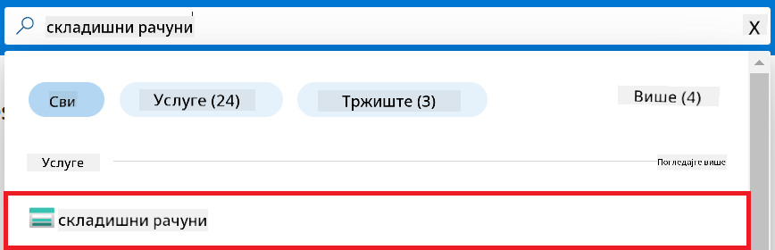

<!--
CO_OP_TRANSLATOR_METADATA:
{
  "original_hash": "ecbd9179a21edbaafaf114d47f09f3e3",
  "translation_date": "2025-07-17T01:59:14+00:00",
  "source_file": "md/02.Application/01.TextAndChat/Phi3/E2E_Phi-3-FineTuning_PromptFlow_Integration_AIFoundry.md",
  "language_code": "sr"
}
-->
# Фино подешавање и интеграција прилагођених Phi-3 модела са Prompt flow у Azure AI Foundry

Овај пример од почетка до краја (E2E) заснован је на водичу "[Fine-Tune and Integrate Custom Phi-3 Models with Prompt Flow in Azure AI Foundry](https://techcommunity.microsoft.com/t5/educator-developer-blog/fine-tune-and-integrate-custom-phi-3-models-with-prompt-flow-in/ba-p/4191726?WT.mc_id=aiml-137032-kinfeylo)" из Microsoft Tech Community. Уводи процесе фино подешавања, распоређивања и интеграције прилагођених Phi-3 модела са Prompt flow у Azure AI Foundry.
За разлику од E2E примера, "[Fine-Tune and Integrate Custom Phi-3 Models with Prompt Flow](./E2E_Phi-3-FineTuning_PromptFlow_Integration.md)", који је укључивао покретање кода локално, овај туторијал се у потпуности фокусира на фино подешавање и интеграцију вашег модела унутар Azure AI / ML Studio.

## Преглед

У овом E2E примеру научићете како да фино подесите Phi-3 модел и интегришете га са Prompt flow у Azure AI Foundry. Користећи Azure AI / ML Studio, успоставићете радни ток за распоређивање и коришћење прилагођених AI модела. Овај E2E пример је подељен у три сценарија:

**Сценарио 1: Подешавање Azure ресурса и припрема за фино подешавање**

**Сценарио 2: Фино подешавање Phi-3 модела и распоређивање у Azure Machine Learning Studio**

**Сценарио 3: Интеграција са Prompt flow и разговор са вашим прилагођеним моделом у Azure AI Foundry**

Ево прегледа овог E2E примера.


### Садржај

1. **[Сценарио 1: Подешавање Azure ресурса и припрема за фино подешавање](../../../../../../md/02.Application/01.TextAndChat/Phi3)**
    - [Креирање Azure Machine Learning Workspace](../../../../../../md/02.Application/01.TextAndChat/Phi3)
    - [Захтев за GPU квоте у Azure Subscription](../../../../../../md/02.Application/01.TextAndChat/Phi3)
    - [Додавање улоге](../../../../../../md/02.Application/01.TextAndChat/Phi3)
    - [Подешавање пројекта](../../../../../../md/02.Application/01.TextAndChat/Phi3)
    - [Припрема сета података за фино подешавање](../../../../../../md/02.Application/01.TextAndChat/Phi3)

1. **[Сценарио 2: Фино подешавање Phi-3 модела и распоређивање у Azure Machine Learning Studio](../../../../../../md/02.Application/01.TextAndChat/Phi3)**
    - [Фино подешавање Phi-3 модела](../../../../../../md/02.Application/01.TextAndChat/Phi3)
    - [Распоређивање фино подешеног Phi-3 модела](../../../../../../md/02.Application/01.TextAndChat/Phi3)

1. **[Сценарио 3: Интеграција са Prompt flow и разговор са вашим прилагођеним моделом у Azure AI Foundry](../../../../../../md/02.Application/01.TextAndChat/Phi3)**
    - [Интеграција прилагођеног Phi-3 модела са Prompt flow](../../../../../../md/02.Application/01.TextAndChat/Phi3)
    - [Разговор са вашим прилагођеним Phi-3 моделом](../../../../../../md/02.Application/01.TextAndChat/Phi3)

## Сценарио 1: Подешавање Azure ресурса и припрема за фино подешавање

### Креирање Azure Machine Learning Workspace

1. Упишите *azure machine learning* у **претраживач** на врху портала и изаберите **Azure Machine Learning** из понуђених опција.

    

2. Изаберите **+ Create** из навигационог менија.

3. Изаберите **New workspace** из навигационог менија.

    

4. Извршите следеће кораке:

    - Изаберите вашу Azure **Subscription**.
    - Изаберите **Resource group** коју желите да користите (направите нову ако је потребно).
    - Унесите **Workspace Name**. Мора бити јединствена вредност.
    - Изаберите **Region** коју желите да користите.
    - Изаберите **Storage account** који желите да користите (направите нови ако је потребно).
    - Изаберите **Key vault** који желите да користите (направите нови ако је потребно).
    - Изаберите **Application insights** који желите да користите (направите нови ако је потребно).
    - Изаберите **Container registry** који желите да користите (направите нови ако је потребно).

    

5. Изаберите **Review + Create**.

6. Изаберите **Create**.

### Захтев за GPU квоте у Azure Subscription

У овом туторијалу научићете како да фино подесите и распоредите Phi-3 модел користећи GPU-ове. За фино подешавање користићете *Standard_NC24ads_A100_v4* GPU, за који је потребан захтев за квоту. За распоређивање користићете *Standard_NC6s_v3* GPU, који такође захтева захтев за квоту.

> [!NOTE]
>
> Само Pay-As-You-Go претплате (стандардни тип претплате) имају право на доделу GPU ресурса; претплате са погодностима тренутно нису подржане.
>

1. Посетите [Azure ML Studio](https://ml.azure.com/home?wt.mc_id=studentamb_279723).

1. Извршите следеће кораке да бисте затражили квоту за *Standard NCADSA100v4 Family*:

    - Изаберите **Quota** са леве стране.
    - Изаберите **Virtual machine family** коју желите да користите. На пример, изаберите **Standard NCADSA100v4 Family Cluster Dedicated vCPUs**, која укључује *Standard_NC24ads_A100_v4* GPU.
    - Изаберите **Request quota** из навигационог менија.

        

    - Унутар странице Request quota унесите **New cores limit** који желите да користите. На пример, 24.
    - Унутар странице Request quota изаберите **Submit** да пошаљете захтев за GPU квоту.

1. Извршите следеће кораке да бисте затражили квоту за *Standard NCSv3 Family*:

    - Изаберите **Quota** са леве стране.
    - Изаберите **Virtual machine family** коју желите да користите. На пример, изаберите **Standard NCSv3 Family Cluster Dedicated vCPUs**, која укључује *Standard_NC6s_v3* GPU.
    - Изаберите **Request quota** из навигационог менија.
    - Унутар странице Request quota унесите **New cores limit** који желите да користите. На пример, 24.
    - Унутар странице Request quota изаберите **Submit** да пошаљете захтев за GPU квоту.

### Додавање улоге

Да бисте фино подесили и распоредили ваше моделе, прво морате да креирате User Assigned Managed Identity (UAI) и доделите јој одговарајуће дозволе. Ова UAI ће се користити за аутентификацију током распоређивања.

#### Креирање User Assigned Managed Identity (UAI)

1. Упишите *managed identities* у **претраживач** на врху портала и изаберите **Managed Identities** из понуђених опција.

    

1. Изаберите **+ Create**.

    

1. Извршите следеће кораке:

    - Изаберите вашу Azure **Subscription**.
    - Изаберите **Resource group** коју желите да користите (направите нову ако је потребно).
    - Изаберите **Region** коју желите да користите.
    - Унесите **Name**. Мора бити јединствена вредност.

    

1. Изаберите **Review + create**.

1. Изаберите **+ Create**.

#### Додавање улоге Contributor Managed Identity-ју

1. Идите на ресурс Managed Identity који сте креирали.

1. Изаберите **Azure role assignments** са леве стране.

1. Изаберите **+Add role assignment** из навигационог менија.

1. Унутар странице Add role assignment, извршите следеће кораке:
    - Изаберите **Scope** на **Resource group**.
    - Изаберите вашу Azure **Subscription**.
    - Изаберите **Resource group** коју желите да користите.
    - Изаберите **Role** на **Contributor**.

    

2. Изаберите **Save**.

#### Додавање улоге Storage Blob Data Reader Managed Identity-ју

1. Упишите *storage accounts* у **претраживач** на врху портала и изаберите **Storage accounts** из понуђених опција.

    

1. Изаберите storage account који је повезан са Azure Machine Learning workspace-ом који сте креирали. На пример, *finetunephistorage*.

1. Извршите следеће кораке да бисте отишли на страницу Add role assignment:

    - Идите на Azure Storage account који сте креирали.
    - Изаберите **Access Control (IAM)** са леве стране.
    - Изаберите **+ Add** из навигационог менија.
    - Изаберите **Add role assignment** из навигационог менија.

    

1. Унутар странице Add role assignment, извршите следеће кораке:

    - У пољу Role унесите *Storage Blob Data Reader* у **претраживач** и изаберите **Storage Blob Data Reader** из понуђених опција.
    - Изаберите **Next**.
    - На страници Members изаберите **Assign access to** **Managed identity**.
    - Изаберите **+ Select members**.
    - На страници Select managed identities изаберите вашу Azure **Subscription**.
    - Изаберите **Managed identity** на **Manage Identity**.
    - Изаберите Manage Identity коју сте креирали. На пример, *finetunephi-managedidentity*.
    - Изаберите **Select**.

    

1. Изаберите **Review + assign**.

#### Додавање улоге AcrPull Managed Identity-ју

1. Упишите *container registries* у **претраживач** на врху портала и изаберите **Container registries** из понуђених опција.

    

1. Изаберите container registry који је повезан са Azure Machine Learning workspace-ом. На пример, *finetunephicontainerregistry*

1. Извршите следеће кораке да бисте отишли на страницу Add role assignment:

    - Изаберите **Access Control (IAM)** са леве стране.
    - Изаберите **+ Add** из навигационог менија.
    - Изаберите **Add role assignment** из навигационог менија.

1. Унутар странице Add role assignment, извршите следеће кораке:

    - У пољу Role унесите *AcrPull* у **претраживач** и изаберите **AcrPull** из понуђених опција.
    - Изаберите **Next**.
    - На страници Members изаберите **Assign access to** **Managed identity**.
    - Изаберите **+ Select members**.
    - На страници Select managed identities изаберите вашу Azure **Subscription**.
    - Изаберите **Managed identity** на **Manage Identity**.
    - Изаберите Manage Identity коју сте креирали. На пример, *finetunephi-managedidentity*.
    - Изаберите **Select**.
    - Изаберите **Review + assign**.

### Подешавање пројекта

Да бисте преузели скуп података потребан за фино подешавање, подешићете локално окружење.

У овом задатку ћете:

- Креирати фасциклу у којој ћете радити.
- Креирати виртуелно окружење.
- Инсталирати потребне пакете.
- Креирати фајл *download_dataset.py* за преузимање скупа података.

#### Креирање фасцикле у којој ћете радити

1. Отворите терминал и укуцајте следећу команду да бисте креирали фасциклу под називом *finetune-phi* у подразумеваној путањи.

    ```console
    mkdir finetune-phi
    ```

2. Укуцајте следећу команду у терминалу да бисте ушли у фасциклу *finetune-phi* коју сте креирали.
#### Креирање виртуелног окружења

1. Укуцајте следећу команду у терминалу да бисте креирали виртуелно окружење под именом *.venv*.

    ```console
    python -m venv .venv
    ```

2. Укуцајте следећу команду у терминалу да бисте активирали виртуелно окружење.

    ```console
    .venv\Scripts\activate.bat
    ```


> [!NOTE]
> Ако је успешно, требало би да видите *(.venv)* испред командне линије.

#### Инсталирање потребних пакета

1. Укуцајте следеће команде у терминалу да бисте инсталирали потребне пакете.

    ```console
    pip install datasets==2.19.1
    ```

#### Креирање `download_dataset.py`

> [!NOTE]
> Комплетна структура фасцикли:
>
> ```text
> └── YourUserName
> .    └── finetune-phi
> .        └── download_dataset.py
> ```

1. Отворите **Visual Studio Code**.

1. Изаберите **File** у менију.

1. Изаберите **Open Folder**.

1. Изаберите фасциклу *finetune-phi* коју сте креирали, која се налази на путу *C:\Users\yourUserName\finetune-phi*.

    

1. У левом панелу Visual Studio Code-а, кликните десним тастером миша и изаберите **New File** да бисте креирали нови фајл под именом *download_dataset.py*.

    

### Припрема сета података за фино подешавање

У овом задатку покренућете фајл *download_dataset.py* да бисте преузели скуп података *ultrachat_200k* у ваше локално окружење. Након тога ћете користити овај скуп података за фино подешавање Phi-3 модела у Azure Machine Learning.

У овом задатку ћете:

- Додати код у фајл *download_dataset.py* за преузимање скупова података.
- Покренути фајл *download_dataset.py* да бисте преузели скупове података у локално окружење.

#### Преузимање сета података помоћу *download_dataset.py*

1. Отворите фајл *download_dataset.py* у Visual Studio Code-у.

1. Додајте следећи код у фајл *download_dataset.py*.

    ```python
    import json
    import os
    from datasets import load_dataset

    def load_and_split_dataset(dataset_name, config_name, split_ratio):
        """
        Load and split a dataset.
        """
        # Load the dataset with the specified name, configuration, and split ratio
        dataset = load_dataset(dataset_name, config_name, split=split_ratio)
        print(f"Original dataset size: {len(dataset)}")
        
        # Split the dataset into train and test sets (80% train, 20% test)
        split_dataset = dataset.train_test_split(test_size=0.2)
        print(f"Train dataset size: {len(split_dataset['train'])}")
        print(f"Test dataset size: {len(split_dataset['test'])}")
        
        return split_dataset

    def save_dataset_to_jsonl(dataset, filepath):
        """
        Save a dataset to a JSONL file.
        """
        # Create the directory if it does not exist
        os.makedirs(os.path.dirname(filepath), exist_ok=True)
        
        # Open the file in write mode
        with open(filepath, 'w', encoding='utf-8') as f:
            # Iterate over each record in the dataset
            for record in dataset:
                # Dump the record as a JSON object and write it to the file
                json.dump(record, f)
                # Write a newline character to separate records
                f.write('\n')
        
        print(f"Dataset saved to {filepath}")

    def main():
        """
        Main function to load, split, and save the dataset.
        """
        # Load and split the ULTRACHAT_200k dataset with a specific configuration and split ratio
        dataset = load_and_split_dataset("HuggingFaceH4/ultrachat_200k", 'default', 'train_sft[:1%]')
        
        # Extract the train and test datasets from the split
        train_dataset = dataset['train']
        test_dataset = dataset['test']

        # Save the train dataset to a JSONL file
        save_dataset_to_jsonl(train_dataset, "data/train_data.jsonl")
        
        # Save the test dataset to a separate JSONL file
        save_dataset_to_jsonl(test_dataset, "data/test_data.jsonl")

    if __name__ == "__main__":
        main()

    ```

1. Укуцајте следећу команду у терминалу да бисте покренули скрипту и преузели скуп података у локално окружење.

    ```console
    python download_dataset.py
    ```

1. Проверите да ли су скупови података успешно сачувани у локалном директоријуму *finetune-phi/data*.

> [!NOTE]
>
> #### Напомена о величини сета података и времену фино подешавања
>
> У овом туторијалу користите само 1% сета података (`split='train[:1%]'`). Ово значајно смањује количину података, убрзавајући и процес отпремања и фино подешавања. Проценат можете прилагодити да бисте пронашли праву равнотежу између времена тренинга и перформанси модела. Коришћење мањег дела сета података смањује време потребно за фино подешавање, чинећи процес приступачнијим за туторијал.

## Сценарио 2: Фино подешавање Phi-3 модела и деплој у Azure Machine Learning Studio

### Фино подешавање Phi-3 модела

У овом задатку ћете фино подесити Phi-3 модел у Azure Machine Learning Studio.

У овом задатку ћете:

- Креирати кластер рачунара за фино подешавање.
- Фино подесити Phi-3 модел у Azure Machine Learning Studio.

#### Креирање кластера рачунара за фино подешавање

1. Посетите [Azure ML Studio](https://ml.azure.com/home?wt.mc_id=studentamb_279723).

1. Изаберите **Compute** у левом менију.

1. Изаберите **Compute clusters** у навигационом менију.

1. Изаберите **+ New**.

    

1. Извршите следеће кораке:

    - Изаберите **Region** коју желите да користите.
    - Изаберите **Virtual machine tier** на **Dedicated**.
    - Изаберите **Virtual machine type** на **GPU**.
    - Филтрирајте **Virtual machine size** на **Select from all options**.
    - Изаберите **Virtual machine size** на **Standard_NC24ads_A100_v4**.

    

1. Изаберите **Next**.

1. Извршите следеће кораке:

    - Унесите **Compute name**. Мора бити јединствено име.
    - Изаберите **Minimum number of nodes** на **0**.
    - Изаберите **Maximum number of nodes** на **1**.
    - Изаберите **Idle seconds before scale down** на **120**.

    

1. Изаберите **Create**.

#### Фино подешавање Phi-3 модела

1. Посетите [Azure ML Studio](https://ml.azure.com/home?wt.mc_id=studentamb_279723).

1. Изаберите Azure Machine Learning workspace који сте креирали.

    

1. Извршите следеће кораке:

    - Изаберите **Model catalog** у левом менију.
    - У пољу за претрагу укуцајте *phi-3-mini-4k* и изаберите **Phi-3-mini-4k-instruct** из понуђених опција.

    

1. Изаберите **Fine-tune** у навигационом менију.

    

1. Извршите следеће кораке:

    - Изаберите **Select task type** на **Chat completion**.
    - Изаберите **+ Select data** да отпремите **Training data**.
    - Изаберите тип отпремања Validation података на **Provide different validation data**.
    - Изаберите **+ Select data** да отпремите **Validation data**.

    

    > [!TIP]
    >
    > Можете изабрати **Advanced settings** да прилагодите конфигурације као што су **learning_rate** и **lr_scheduler_type** како бисте оптимизовали процес фино подешавања према вашим потребама.

1. Изаберите **Finish**.

1. У овом задатку сте успешно фино подесили Phi-3 модел користећи Azure Machine Learning. Имајте на уму да процес фино подешавања може потрајати. Након покретања посла за фино подешавање, потребно је сачекати да се заврши. Статус посла можете пратити у табу Jobs у левом менију вашег Azure Machine Learning Workspace-а. У наредном делу ћете деплојовати фино подешени модел и интегрисати га са Prompt flow.

    

### Деплој фино подешеног Phi-3 модела

Да бисте интегрисали фино подешени Phi-3 модел са Prompt flow, потребно је да деплојујете модел како би био доступан за реално време предвиђања. Овај процес укључује регистрацију модела, креирање онлајн ендинта и деплој модела.

У овом задатку ћете:

- Регистровати фино подешени модел у Azure Machine Learning workspace-у.
- Креирати онлајн ендинг.
- Деплојовати регистровани фино подешени Phi-3 модел.

#### Регистрација фино подешеног модела

1. Посетите [Azure ML Studio](https://ml.azure.com/home?wt.mc_id=studentamb_279723).

1. Изаберите Azure Machine Learning workspace који сте креирали.

    

1. Изаберите **Models** у левом менију.

1. Изаберите **+ Register**.

1. Изаберите **From a job output**.

    

1. Изаберите посао који сте креирали.

    

1. Изаберите **Next**.

1. Изаберите **Model type** на **MLflow**.

1. Проверите да је **Job output** изабран; требало би да буде аутоматски изабран.

    

2. Изаберите **Next**.

3. Изаберите **Register**.

    

4. Можете видети регистровани модел тако што ћете отићи у мени **Models** у левом менију.

    

#### Деплој фино подешеног модела

1. Идите у Azure Machine Learning workspace који сте креирали.

1. Изаберите **Endpoints** у левом менију.

1. Изаберите **Real-time endpoints** у навигационом менију.

    

1. Изаберите **Create**.

1. Изаберите регистровани модел који сте креирали.

    

1. Изаберите **Select**.

1. Извршите следеће кораке:

    - Изаберите **Virtual machine** на *Standard_NC6s_v3*.
    - Изаберите број инстанци које желите да користите, на пример *1*.
    - Изаберите **Endpoint** на **New** да бисте креирали нови ендинг.
    - Унесите **Endpoint name**. Мора бити јединствено име.
    - Унесите **Deployment name**. Мора бити јединствено име.

    

1. Изаберите **Deploy**.

> [!WARNING]
> Да бисте избегли додатне трошкове, обавезно избришите креирани ендинг у Azure Machine Learning workspace-у.
>

#### Провера статуса деплоја у Azure Machine Learning Workspace-у

1. Идите у Azure Machine Learning workspace који сте креирали.

1. Изаберите **Endpoints** у левом менију.

1. Изаберите ендинг који сте креирали.

    

1. На овој страници можете управљати ендингима током процеса деплоја.

> [!NOTE]
> Када деплој буде завршен, уверите се да је **Live traffic** подешен на **100%**. Ако није, изаберите **Update traffic** да прилагодите подешавања саобраћаја. Имајте у виду да не можете тестирати модел ако је саобраћај подешен на 0%.
>
> 
>

## Сценарио 3: Интеграција са Prompt flow и ћаскање са вашим прилагођеним моделом у Azure AI Foundry

### Интеграција прилагођеног Phi-3 модела са Prompt flow

Након успешног деплоја вашег фино подешеног модела, сада га можете интегрисати са Prompt Flow да бисте користили модел у реалним апликацијама, омогућавајући разне интерактивне задатке са вашим прилагођеним Phi-3 моделом.

У овом задатку ћете:

- Креирати Azure AI Foundry Hub.
- Креирати Azure AI Foundry пројекат.
- Креирати Prompt flow.
- Додати прилагођену конекцију за фино подешени Phi-3 модел.
- Подесити Prompt flow за ћаскање са вашим прилагођеним Phi-3 моделом.
> [!NOTE]
> Такође можете интегрисати са Promptflow користећи Azure ML Studio. Исти процес интеграције може се применити и на Azure ML Studio.
#### Креирање Azure AI Foundry Hub-а

Пре него што креирате Пројекат, потребно је да направите Hub. Hub функционише као Resource Group, омогућавајући вам да организујете и управљате више Пројеката у оквиру Azure AI Foundry.

1. Посетите [Azure AI Foundry](https://ai.azure.com/?WT.mc_id=aiml-137032-kinfeylo).

1. Изаберите **All hubs** са леве стране.

1. Изаберите **+ New hub** из навигационог менија.

    

1. Обавите следеће кораке:

    - Унесите **Hub name**. Мора бити јединствена вредност.
    - Изаберите вашу Azure **Subscription**.
    - Изаберите **Resource group** коју желите да користите (направите нову ако је потребно).
    - Изаберите **Location** коју желите да користите.
    - Изаберите **Connect Azure AI Services** које желите да користите (направите нову ако је потребно).
    - За **Connect Azure AI Search** изаберите **Skip connecting**.

    

1. Изаберите **Next**.

#### Креирање Azure AI Foundry Пројекта

1. У Hub-у који сте креирали, изаберите **All projects** са леве стране.

1. Изаберите **+ New project** из навигационог менија.

    

1. Унесите **Project name**. Мора бити јединствена вредност.

    

1. Изаберите **Create a project**.

#### Додавање прилагођене везе за фино подешени Phi-3 модел

Да бисте интегрисали свој прилагођени Phi-3 модел са Prompt flow-ом, потребно је да сачувате endpoint и key модела у прилагођеној вези. Овај поступак омогућава приступ вашем прилагођеном Phi-3 моделу у Prompt flow-у.

#### Подешавање api key и endpoint uri фино подешеног Phi-3 модела

1. Посетите [Azure ML Studio](https://ml.azure.com/home?WT.mc_id=aiml-137032-kinfeylo).

1. Идите у Azure Machine learning workspace који сте креирали.

1. Изаберите **Endpoints** са леве стране.

    

1. Изаберите endpoint који сте креирали.

    

1. Изаберите **Consume** из навигационог менија.

1. Копирајте ваш **REST endpoint** и **Primary key**.

    

#### Додавање прилагођене везе

1. Посетите [Azure AI Foundry](https://ai.azure.com/?WT.mc_id=aiml-137032-kinfeylo).

1. Идите у Azure AI Foundry пројекат који сте креирали.

1. У пројекту који сте креирали, изаберите **Settings** са леве стране.

1. Изаберите **+ New connection**.

    

1. Изаберите **Custom keys** из навигационог менија.

    

1. Обавите следеће кораке:

    - Изаберите **+ Add key value pairs**.
    - За име кључа унесите **endpoint** и налепите endpoint који сте копирали из Azure ML Studio у поље за вредност.
    - Поново изаберите **+ Add key value pairs**.
    - За име кључа унесите **key** и налепите key који сте копирали из Azure ML Studio у поље за вредност.
    - Након додавања кључева, означите **is secret** да бисте спречили да кључ буде видљив.

    

1. Изаберите **Add connection**.

#### Креирање Prompt flow-а

Додали сте прилагођену везу у Azure AI Foundry. Сада ћемо креирати Prompt flow пратећи следеће кораке. Након тога ћете повезати овај Prompt flow са прилагођеном везом како бисте могли да користите фино подешени модел унутар Prompt flow-а.

1. Идите у Azure AI Foundry пројекат који сте креирали.

1. Изаберите **Prompt flow** са леве стране.

1. Изаберите **+ Create** из навигационог менија.

    

1. Изаберите **Chat flow** из навигационог менија.

    

1. Унесите **Folder name** који желите да користите.

    

2. Изаберите **Create**.

#### Подешавање Prompt flow-а за разговор са вашим прилагођеним Phi-3 моделом

Потребно је да интегришете фино подешени Phi-3 модел у Prompt flow. Међутим, постојећи Prompt flow није дизајниран за ову сврху. Због тога морате редизајнирати Prompt flow како бисте омогућили интеграцију прилагођеног модела.

1. У Prompt flow-у обавите следеће кораке да бисте реконструисали постојећи flow:

    - Изаберите **Raw file mode**.
    - Обришите сав постојећи код у фајлу *flow.dag.yml*.
    - Додајте следећи код у фајл *flow.dag.yml*.

        ```yml
        inputs:
          input_data:
            type: string
            default: "Who founded Microsoft?"

        outputs:
          answer:
            type: string
            reference: ${integrate_with_promptflow.output}

        nodes:
        - name: integrate_with_promptflow
          type: python
          source:
            type: code
            path: integrate_with_promptflow.py
          inputs:
            input_data: ${inputs.input_data}
        ```

    - Изаберите **Save**.

    

1. Додајте следећи код у фајл *integrate_with_promptflow.py* да бисте користили прилагођени Phi-3 модел у Prompt flow-у.

    ```python
    import logging
    import requests
    from promptflow import tool
    from promptflow.connections import CustomConnection

    # Logging setup
    logging.basicConfig(
        format="%(asctime)s - %(levelname)s - %(name)s - %(message)s",
        datefmt="%Y-%m-%d %H:%M:%S",
        level=logging.DEBUG
    )
    logger = logging.getLogger(__name__)

    def query_phi3_model(input_data: str, connection: CustomConnection) -> str:
        """
        Send a request to the Phi-3 model endpoint with the given input data using Custom Connection.
        """

        # "connection" is the name of the Custom Connection, "endpoint", "key" are the keys in the Custom Connection
        endpoint_url = connection.endpoint
        api_key = connection.key

        headers = {
            "Content-Type": "application/json",
            "Authorization": f"Bearer {api_key}"
        }
        data = {
            "input_data": {
                "input_string": [
                    {"role": "user", "content": input_data}
                ],
                "parameters": {
                    "temperature": 0.7,
                    "max_new_tokens": 128
                }
            }
        }
        try:
            response = requests.post(endpoint_url, json=data, headers=headers)
            response.raise_for_status()
            
            # Log the full JSON response
            logger.debug(f"Full JSON response: {response.json()}")

            result = response.json()["output"]
            logger.info("Successfully received response from Azure ML Endpoint.")
            return result
        except requests.exceptions.RequestException as e:
            logger.error(f"Error querying Azure ML Endpoint: {e}")
            raise

    @tool
    def my_python_tool(input_data: str, connection: CustomConnection) -> str:
        """
        Tool function to process input data and query the Phi-3 model.
        """
        return query_phi3_model(input_data, connection)

    ```

    

> [!NOTE]
> За детаљније информације о коришћењу Prompt flow-а у Azure AI Foundry, можете погледати [Prompt flow у Azure AI Foundry](https://learn.microsoft.com/azure/ai-studio/how-to/prompt-flow).

1. Изаберите **Chat input**, **Chat output** да бисте омогућили разговор са вашим моделом.

    

1. Сада сте спремни да разговарате са вашим прилагођеним Phi-3 моделом. У следећој вежби ћете научити како да покренете Prompt flow и користите га за разговор са вашим фино подешеним Phi-3 моделом.

> [!NOTE]
>
> Реконструисани flow треба да изгледа као на слици испод:
>
> 
>

### Разговор са вашим прилагођеним Phi-3 моделом

Сада када сте фино подесили и интегрисали свој прилагођени Phi-3 модел са Prompt flow-ом, спремни сте да почнете интеракцију са њим. Ова вежба ће вас провести кроз процес подешавања и покретања разговора са вашим моделом користећи Prompt flow. Пратећи ове кораке, моћи ћете да у потпуности искористите могућности вашег фино подешеног Phi-3 модела за разне задатке и разговоре.

- Разговарајте са својим прилагођеним Phi-3 моделом користећи Prompt flow.

#### Покретање Prompt flow-а

1. Изаберите **Start compute sessions** да покренете Prompt flow.

    

1. Изаберите **Validate and parse input** да обновите параметре.

    

1. Изаберите **Value** за **connection** која води ка прилагођеној вези коју сте креирали. На пример, *connection*.

    

#### Разговор са вашим прилагођеним моделом

1. Изаберите **Chat**.

    

1. Ево примера резултата: Сада можете да разговарате са својим прилагођеним Phi-3 моделом. Препоручује се да постављате питања везана за податке који су коришћени за фино подешавање.

    

**Одрицање од одговорности**:  
Овај документ је преведен коришћењем AI сервиса за превођење [Co-op Translator](https://github.com/Azure/co-op-translator). Иако се трудимо да превод буде тачан, молимо вас да имате у виду да аутоматски преводи могу садржати грешке или нетачности. Оригинални документ на његовом изворном језику треба сматрати ауторитетним извором. За критичне информације препоручује се професионални људски превод. Нисмо одговорни за било каква неспоразума или погрешна тумачења настала коришћењем овог превода.