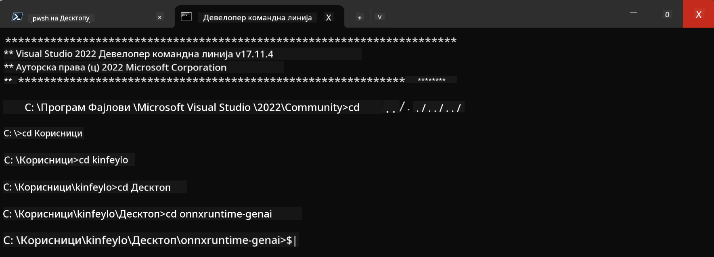

<!--
CO_OP_TRANSLATOR_METADATA:
{
  "original_hash": "b066fc29c1b2129df84e027cb75119ce",
  "translation_date": "2025-07-17T02:47:38+00:00",
  "source_file": "md/02.Application/01.TextAndChat/Phi3/ORTWindowGPUGuideline.md",
  "language_code": "sr"
}
-->
# **Упутство за OnnxRuntime GenAI Windows GPU**

Ово упутство пружа кораке за подешавање и коришћење ONNX Runtime (ORT) са GPU-овима на Windows-у. Намењено је да вам помогне да искористите GPU акцелерацију за ваше моделе, побољшавајући перформансе и ефикасност.

Документ даје смернице о:

- Подешавање окружења: Упутства за инсталацију неопходних зависности као што су CUDA, cuDNN и ONNX Runtime.
- Конфигурација: Како подесити окружење и ONNX Runtime да ефикасно користе GPU ресурсе.
- Савети за оптимизацију: Препоруке како да подесите GPU за најбоље перформансе.

### **1. Python 3.10.x /3.11.8**

   ***Note*** Препоручује се коришћење [miniforge](https://github.com/conda-forge/miniforge/releases/latest/download/Miniforge3-Windows-x86_64.exe) као вашег Python окружења

   ```bash

   conda create -n pydev python==3.11.8

   conda activate pydev

   ```

   ***Reminder*** Ако сте инсталирали било коју Python ONNX библиотеку, молимо деинсталирајте је

### **2. Инсталирајте CMake помоћу winget**

   ```bash

   winget install -e --id Kitware.CMake

   ```

### **3. Инсталирајте Visual Studio 2022 - Desktop Development with C++**

   ***Note*** Ако не желите да компајлирате, можете прескочити овај корак


### **4. Инсталирајте NVIDIA драјвер**

1. **NVIDIA GPU драјвер**  [https://www.nvidia.com/en-us/drivers/](https://www.nvidia.com/en-us/drivers/)

2. **NVIDIA CUDA 12.4** [https://developer.nvidia.com/cuda-12-4-0-download-archive](https://developer.nvidia.com/cuda-12-4-0-download-archive)

3. **NVIDIA CUDNN 9.4**  [https://developer.nvidia.com/cudnn-downloads](https://developer.nvidia.com/cudnn-downloads)

***Reminder*** Молимо користите подразумевана подешавања током инсталације

### **5. Подешавање NVIDIA окружења**

Копирајте NVIDIA CUDNN 9.4 lib, bin, include фолдере у NVIDIA CUDA 12.4 lib, bin, include

- копирајте фајлове из *'C:\Program Files\NVIDIA\CUDNN\v9.4\bin\12.6'* у  *'C:\Program Files\NVIDIA GPU Computing Toolkit\CUDA\v12.4\bin'*

- копирајте фајлове из *'C:\Program Files\NVIDIA\CUDNN\v9.4\include\12.6'* у  *'C:\Program Files\NVIDIA GPU Computing Toolkit\CUDA\v12.4\include'*

- копирајте фајлове из *'C:\Program Files\NVIDIA\CUDNN\v9.4\lib\12.6'* у  *'C:\Program Files\NVIDIA GPU Computing Toolkit\CUDA\v12.4\lib\x64'*

### **6. Преузмите Phi-3.5-mini-instruct-onnx**

   ```bash

   winget install -e --id Git.Git

   winget install -e --id GitHub.GitLFS

   git lfs install

   git clone https://huggingface.co/microsoft/Phi-3.5-mini-instruct-onnx

   ```

### **7. Покретање InferencePhi35Instruct.ipynb**

   Отворите [Notebook](../../../../../../code/09.UpdateSamples/Aug/ortgpu-phi35-instruct.ipynb) и извршите


### **8. Компилација ORT GenAI GPU**

   ***Note*** 
   
   1. Прво деинсталирајте све везано за onnx, onnxruntime и onnxruntime-genai

   ```bash

   pip list 
   
   ```

   Затим деинсталирајте све onnxruntime библиотеке, нпр.

   ```bash

   pip uninstall onnxruntime

   pip uninstall onnxruntime-genai

   pip uninstall onnxruntume-genai-cuda
   
   ```

   2. Проверите подршку Visual Studio екстензије

   Проверите да ли у C:\Program Files\NVIDIA GPU Computing Toolkit\CUDA\v12.4\extras постоји фолдер C:\Program Files\NVIDIA GPU Computing Toolkit\CUDA\v12.4\extras\visual_studio_integration. 
   
   Ако није пронађен, проверите друге CUDA toolkit драјвер фолдере и копирајте фолдер visual_studio_integration и његов садржај у C:\Program Files\NVIDIA GPU Computing Toolkit\CUDA\v12.4\extras\visual_studio_integration

   - Ако не желите да компајлирате, можете прескочити овај корак

   ```bash

   git clone https://github.com/microsoft/onnxruntime-genai

   ```

   - Преузмите [https://github.com/microsoft/onnxruntime/releases/download/v1.19.2/onnxruntime-win-x64-gpu-1.19.2.zip](https://github.com/microsoft/onnxruntime/releases/download/v1.19.2/onnxruntime-win-x64-gpu-1.19.2.zip)

   - Распакујте onnxruntime-win-x64-gpu-1.19.2.zip, преименујте у **ort** и копирајте ort фолдер у onnxruntime-genai

   - Користећи Windows Terminal, отворите Developer Command Prompt за VS 2022 и идите у onnxruntime-genai



   - Компилирајте користећи ваше Python окружење

   ```bash

   cd onnxruntime-genai

   python build.py --use_cuda  --cuda_home "C:\Program Files\NVIDIA GPU Computing Toolkit\CUDA\v12.4" --config Release
 

   cd build/Windows/Release/Wheel

   pip install .whl

   ```

**Одрицање од одговорности**:  
Овај документ је преведен коришћењем AI преводилачке услуге [Co-op Translator](https://github.com/Azure/co-op-translator). Иако се трудимо да превод буде тачан, молимо вас да имате у виду да аутоматизовани преводи могу садржати грешке или нетачности. Оригинални документ на његовом изворном језику треба сматрати ауторитетним извором. За критичне информације препоручује се професионални људски превод. Нисмо одговорни за било каква неспоразума или погрешна тумачења која произилазе из коришћења овог превода.