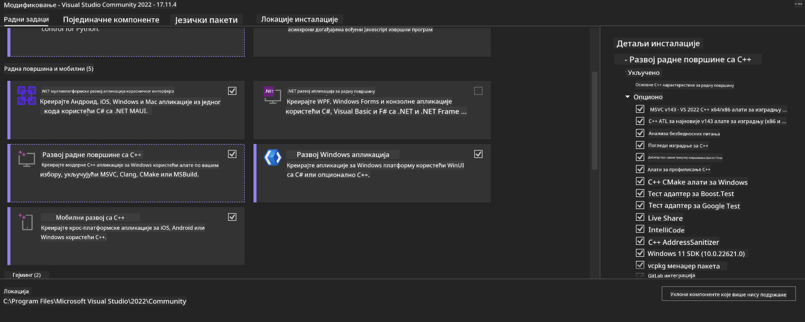
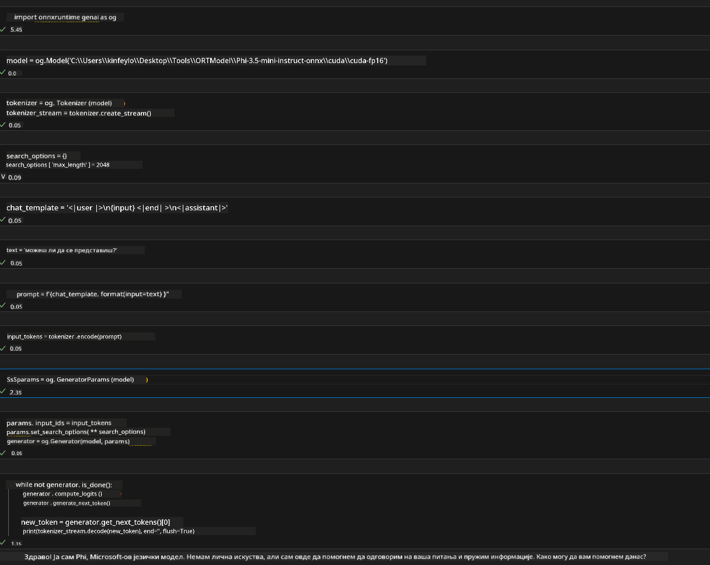
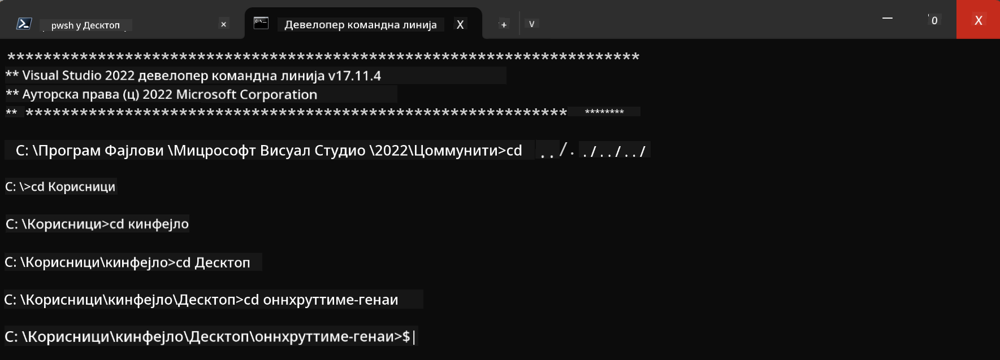

<!--
CO_OP_TRANSLATOR_METADATA:
{
  "original_hash": "b066fc29c1b2129df84e027cb75119ce",
  "translation_date": "2025-05-09T18:47:02+00:00",
  "source_file": "md/02.Application/01.TextAndChat/Phi3/ORTWindowGPUGuideline.md",
  "language_code": "sr"
}
-->
# **Uputstvo za OnnxRuntime GenAI Windows GPU**

Ovo uputstvo daje korake za postavljanje i korišćenje ONNX Runtime (ORT) sa GPU-ovima na Windowsu. Namenjeno je da vam pomogne da iskoristite ubrzanje preko GPU-a za vaše modele, poboljšavajući performanse i efikasnost.

Dokument pruža smernice o:

- Podešavanju okruženja: Uputstva za instalaciju neophodnih zavisnosti kao što su CUDA, cuDNN i ONNX Runtime.
- Konfiguraciji: Kako da podesite okruženje i ONNX Runtime da efikasno koristi GPU resurse.
- Savetima za optimizaciju: Preporuke kako da fino podesite GPU podešavanja za optimalne performanse.

### **1. Python 3.10.x /3.11.8**

   ***Note*** Preporučuje se korišćenje [miniforge](https://github.com/conda-forge/miniforge/releases/latest/download/Miniforge3-Windows-x86_64.exe) kao Python okruženja

   ```bash

   conda create -n pydev python==3.11.8

   conda activate pydev

   ```

   ***Reminder*** Ako ste instalirali bilo koju ONNX Python biblioteku, molimo vas da je deinstalirate

### **2. Instalirajte CMake preko winget**

   ```bash

   winget install -e --id Kitware.CMake

   ```

### **3. Instalirajte Visual Studio 2022 - Desktop Development sa C++**

   ***Note*** Ako ne želite da kompajlirate, ovaj korak možete preskočiti



### **4. Instalirajte NVIDIA drajver**

1. **NVIDIA GPU drajver**  [https://www.nvidia.com/en-us/drivers/](https://www.nvidia.com/en-us/drivers/)

2. **NVIDIA CUDA 12.4** [https://developer.nvidia.com/cuda-12-4-0-download-archive](https://developer.nvidia.com/cuda-12-4-0-download-archive)

3. **NVIDIA CUDNN 9.4**  [https://developer.nvidia.com/cudnn-downloads](https://developer.nvidia.com/cudnn-downloads)

***Reminder*** Molimo koristite podrazumevana podešavanja tokom instalacije

### **5. Podesite NVIDIA okruženje**

Kopirajte NVIDIA CUDNN 9.4 lib, bin, include fajlove u NVIDIA CUDA 12.4 lib, bin, include foldere

- kopirajte fajlove iz *'C:\Program Files\NVIDIA\CUDNN\v9.4\bin\12.6'* u  *'C:\Program Files\NVIDIA GPU Computing Toolkit\CUDA\v12.4\bin'*

- kopirajte fajlove iz *'C:\Program Files\NVIDIA\CUDNN\v9.4\include\12.6'* u  *'C:\Program Files\NVIDIA GPU Computing Toolkit\CUDA\v12.4\include'*

- kopirajte fajlove iz *'C:\Program Files\NVIDIA\CUDNN\v9.4\lib\12.6'* u  *'C:\Program Files\NVIDIA GPU Computing Toolkit\CUDA\v12.4\lib\x64'*

### **6. Preuzmite Phi-3.5-mini-instruct-onnx**

   ```bash

   winget install -e --id Git.Git

   winget install -e --id GitHub.GitLFS

   git lfs install

   git clone https://huggingface.co/microsoft/Phi-3.5-mini-instruct-onnx

   ```

### **7. Pokretanje InferencePhi35Instruct.ipynb**

   Otvorite [Notebook](../../../../../../code/09.UpdateSamples/Aug/ortgpu-phi35-instruct.ipynb) i izvršite



### **8. Kompajliranje ORT GenAI GPU**

   ***Note*** 
   
   1. Prvo deinstalirajte sve što je vezano za onnx, onnxruntime i onnxruntime-genai

   ```bash

   pip list 
   
   ```

   Zatim deinstalirajte sve onnxruntime biblioteke, npr. 

   ```bash

   pip uninstall onnxruntime

   pip uninstall onnxruntime-genai

   pip uninstall onnxruntume-genai-cuda
   
   ```

   2. Proverite podršku Visual Studio ekstenzije 

   Proverite da li u C:\Program Files\NVIDIA GPU Computing Toolkit\CUDA\v12.4\extras postoji folder C:\Program Files\NVIDIA GPU Computing Toolkit\CUDA\v12.4\extras\visual_studio_integration. 
   
   Ako nije pronađeno, pogledajte u drugim CUDA toolkit direktorijumima, kopirajte folder visual_studio_integration i sadržaj u C:\Program Files\NVIDIA GPU Computing Toolkit\CUDA\v12.4\extras\visual_studio_integration

   - Ako ne želite da kompajlirate, ovaj korak možete preskočiti

   ```bash

   git clone https://github.com/microsoft/onnxruntime-genai

   ```

   - Preuzmite [https://github.com/microsoft/onnxruntime/releases/download/v1.19.2/onnxruntime-win-x64-gpu-1.19.2.zip](https://github.com/microsoft/onnxruntime/releases/download/v1.19.2/onnxruntime-win-x64-gpu-1.19.2.zip)

   - Raspakujte onnxruntime-win-x64-gpu-1.19.2.zip, preimenujte folder u **ort**, i kopirajte ort folder u onnxruntime-genai

   - Koristeći Windows Terminal, otvorite Developer Command Prompt za VS 2022 i idite u onnxruntime-genai



   - Kompajlirajte koristeći vaše Python okruženje

   ```bash

   cd onnxruntime-genai

   python build.py --use_cuda  --cuda_home "C:\Program Files\NVIDIA GPU Computing Toolkit\CUDA\v12.4" --config Release
 

   cd build/Windows/Release/Wheel

   pip install .whl

   ```

**Ограничење одговорности**:  
Овај документ је преведен коришћењем AI преводилачке услуге [Co-op Translator](https://github.com/Azure/co-op-translator). Иако тежимо прецизности, имајте у виду да аутоматски преводи могу садржати грешке или нетачности. Оригинални документ на његовом изворном језику треба сматрати ауторитетним извором. За критичне информације препоручује се професионални људски превод. Нисмо одговорни за било каква неспоразума или погрешне тумачења настала употребом овог превода.