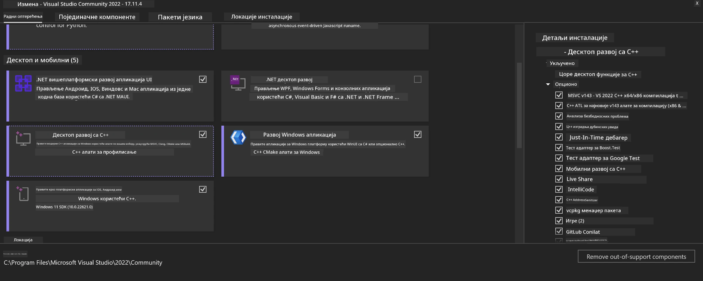
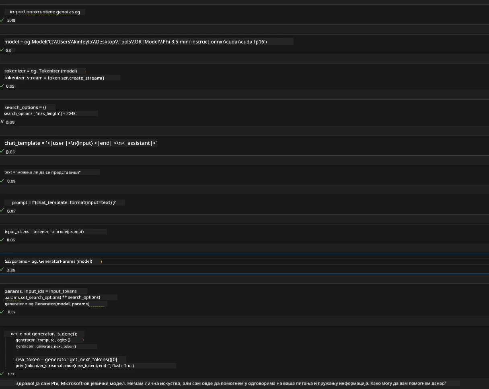
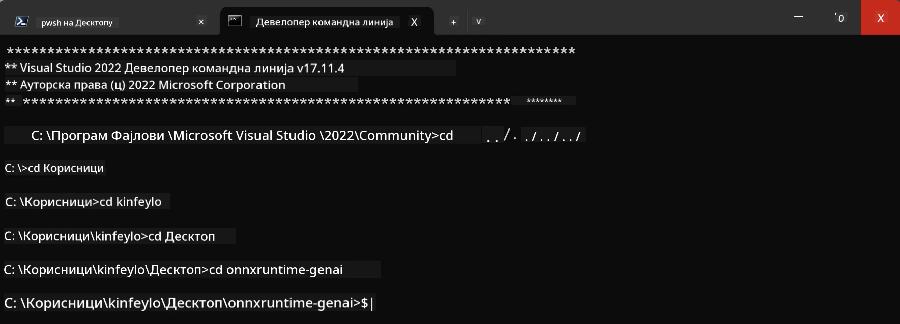

# **Упутство за OnnxRuntime GenAI Windows GPU**

Ово упутство пружа кораке за подешавање и коришћење ONNX Runtime (ORT) са GPU-овима на Windows-у. Намењено је да вам помогне да искористите GPU акцелерацију за ваше моделе, побољшавајући перформансе и ефикасност.

Документ пружа смернице за:

- Подешавање окружења: Упутства за инсталацију потребних зависности као што су CUDA, cuDNN и ONNX Runtime.
- Конфигурација: Како подесити окружење и ONNX Runtime за ефикасно коришћење GPU ресурса.
- Савети за оптимизацију: Савети како да фино подесите GPU подешавања ради оптималних перформанси.

### **1. Python 3.10.x /3.11.8**

   ***Напомена*** Препоручује се коришћење [miniforge](https://github.com/conda-forge/miniforge/releases/latest/download/Miniforge3-Windows-x86_64.exe) као вашег Python окружења

   ```bash

   conda create -n pydev python==3.11.8

   conda activate pydev

   ```

   ***Подсетник*** Ако сте инсталирали било коју ONNX библиотеку за Python, молимо деинсталирајте је

### **2. Инсталирајте CMake помоћу winget**


   ```bash

   winget install -e --id Kitware.CMake

   ```

### **3. Инсталирајте Visual Studio 2022 - Desktop Development са C++**

   ***Напомена*** Ако не желите да компајлирате, можете прескочити овај корак




### **4. Инсталирајте NVIDIA драјвер**

1. **NVIDIA GPU драјвер**  [https://www.nvidia.com/en-us/drivers/](https://www.nvidia.com/en-us/drivers/)

2. **NVIDIA CUDA 12.4** [https://developer.nvidia.com/cuda-12-4-0-download-archive](https://developer.nvidia.com/cuda-12-4-0-download-archive)

3. **NVIDIA CUDNN 9.4**  [https://developer.nvidia.com/cudnn-downloads](https://developer.nvidia.com/cudnn-downloads)

***Подсетник*** Молимо користите подразумевана подешавања током инсталације

### **5. Поставите NVIDIA окружење**

Копирајте NVIDIA CUDNN 9.4 lib, bin, include у NVIDIA CUDA 12.4 lib, bin, include

- копирајте фајлове са *'C:\Program Files\NVIDIA\CUDNN\v9.4\bin\12.6'* у  *'C:\Program Files\NVIDIA GPU Computing Toolkit\CUDA\v12.4\bin'*

- копирајте фајлове са *'C:\Program Files\NVIDIA\CUDNN\v9.4\include\12.6'* у  *'C:\Program Files\NVIDIA GPU Computing Toolkit\CUDA\v12.4\include'*

- копирајте фајлове са *'C:\Program Files\NVIDIA\CUDNN\v9.4\lib\12.6'* у  *'C:\Program Files\NVIDIA GPU Computing Toolkit\CUDA\v12.4\lib\x64'*


### **6. Преузмите Phi-3.5-mini-instruct-onnx**


   ```bash

   winget install -e --id Git.Git

   winget install -e --id GitHub.GitLFS

   git lfs install

   git clone https://huggingface.co/microsoft/Phi-3.5-mini-instruct-onnx

   ```

### **7. Покрените InferencePhi35Instruct.ipynb**

   Отворите [Notebook](../../../../code/09.UpdateSamples/Aug/ortgpu-phi35-instruct.ipynb) и извршите





### **8. Компилирајте ORT GenAI GPU**


   ***Напомена*** 
   
   1. Прво деинсталирајте све везано за onnx, onnxruntime и onnxruntime-genai

   
   ```bash

   pip list 
   
   ```

   Затим деинсталирајте све оннксртим библиотеке, нпр. 


   ```bash

   pip uninstall onnxruntime

   pip uninstall onnxruntime-genai

   pip uninstall onnxruntume-genai-cuda
   
   ```

   2. Проверите Visual Studio додатак 

   Проверите C:\Program Files\NVIDIA GPU Computing Toolkit\CUDA\v12.4\extras да ли постоји фасцикла C:\Program Files\NVIDIA GPU Computing Toolkit\CUDA\v12.4\extras\visual_studio_integration. 
   
   Ако није пронађена, проверите друге CUDA toolkit драјвер фасцикле и копирајте visual_studio_integration фасциклу и садржај у C:\Program Files\NVIDIA GPU Computing Toolkit\CUDA\v12.4\extras\visual_studio_integration


   - Ако не желите да компајлирате, можете прескочити овај корак


   ```bash

   git clone https://github.com/microsoft/onnxruntime-genai

   ```

   - Преузмите [https://github.com/microsoft/onnxruntime/releases/download/v1.19.2/onnxruntime-win-x64-gpu-1.19.2.zip](https://github.com/microsoft/onnxruntime/releases/download/v1.19.2/onnxruntime-win-x64-gpu-1.19.2.zip)

   - Распакујте onnxruntime-win-x64-gpu-1.19.2.zip, преименујте у **ort** и копирајте ort фасциклу у onnxruntime-genai

   - Користећи Windows Terminal, идите у Developer Command Prompt за VS 2022 и отворите onnxruntime-genai 



   - Компилирајте га са вашим python окружењем

   
   ```bash

   cd onnxruntime-genai

   python build.py --use_cuda  --cuda_home "C:\Program Files\NVIDIA GPU Computing Toolkit\CUDA\v12.4" --config Release
 

   cd build/Windows/Release/Wheel

   pip install .whl

   ```

---

<!-- CO-OP TRANSLATOR DISCLAIMER START -->
**Изјава о одрицању одговорности**:
Овај документ је преведен коришћењем услуге за аутоматски превод [Co-op Translator](https://github.com/Azure/co-op-translator). Иако тежимо тачности, имајте у виду да аутоматски преводи могу садржати грешке или нетачности. Оригинални документ на његовом изворном језику треба сматрати ауторитативним извором. За критичне информације препоручује се професионални људски превод. Нисмо одговорни за било каква неспоразума или погрешна тумачења која произилазе из коришћења овог превода.
<!-- CO-OP TRANSLATOR DISCLAIMER END -->