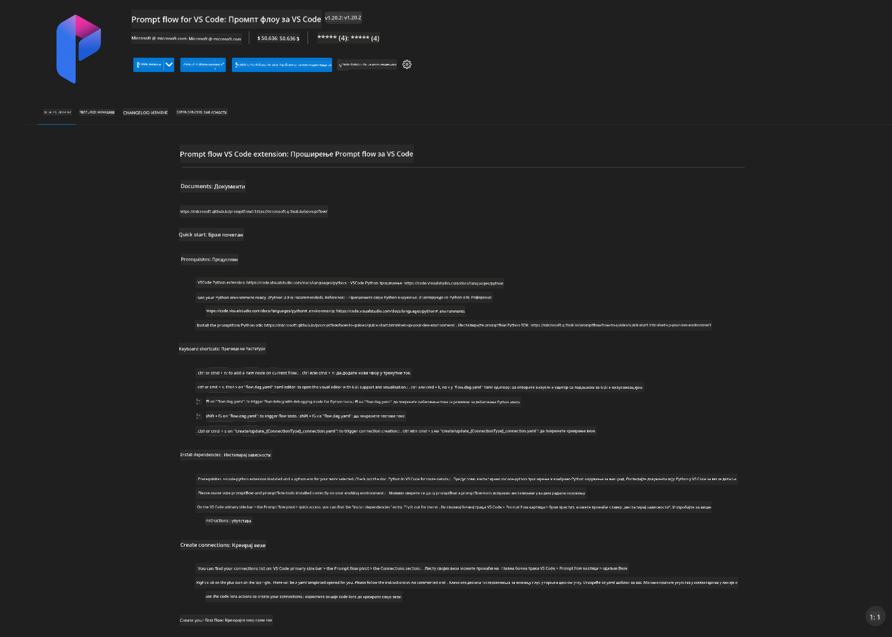
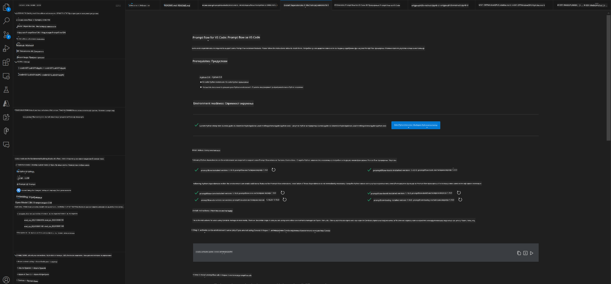
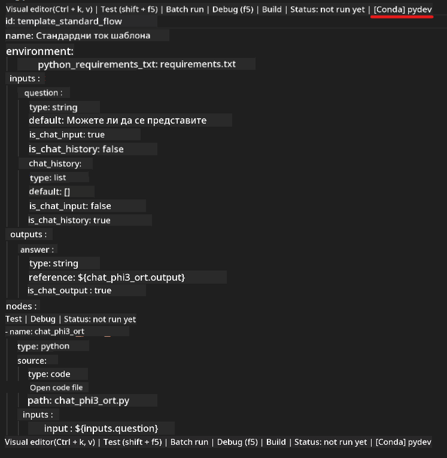
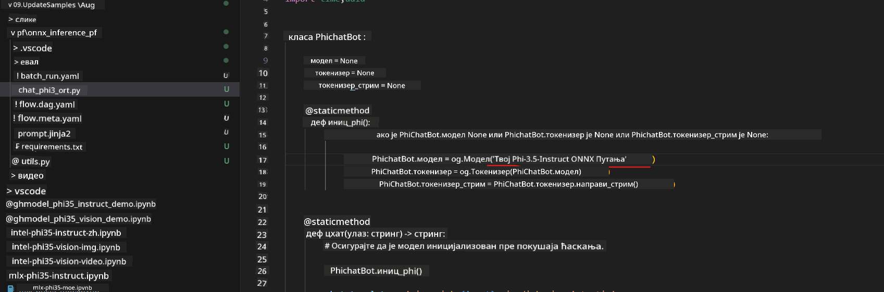
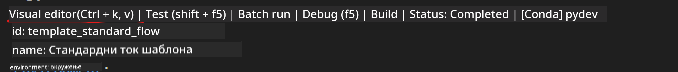
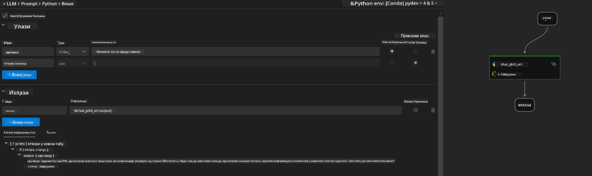
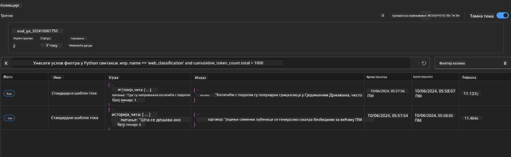

<!--
CO_OP_TRANSLATOR_METADATA:
{
  "original_hash": "92e7dac1e5af0dd7c94170fdaf6860fe",
  "translation_date": "2025-07-17T03:03:59+00:00",
  "source_file": "md/02.Application/01.TextAndChat/Phi3/UsingPromptFlowWithONNX.md",
  "language_code": "sr"
}
-->
# Коришћење Windows GPU-а за креирање Prompt flow решења са Phi-3.5-Instruct ONNX

Следећи документ је пример како користити PromptFlow са ONNX (Open Neural Network Exchange) за развој AI апликација заснованих на Phi-3 моделима.

PromptFlow је скуп алата за развој дизајниран да поједностави цео циклус развоја AI апликација заснованих на LLM-овима (Large Language Model), од идеје и прототиповања до тестирања и евалуације.

Интеграцијом PromptFlow-а са ONNX-ом, програмери могу:

- Оптимизовати перформансе модела: Искористити ONNX за ефикасно извођење и имплементацију модела.
- Поједноставити развој: Користити PromptFlow за управљање током рада и аутоматизацију понављајућих задатака.
- Побољшати сарадњу: Олакшати бољу сарадњу међу члановима тима пружајући јединствено развојно окружење.

**Prompt flow** је скуп алата за развој дизајниран да поједностави цео циклус развоја AI апликација заснованих на LLM-овима, од идеје, прототиповања, тестирања, евалуације до производног распореда и праћења. Чини инжењеринг упита знатно једноставнијим и омогућава вам да градите LLM апликације производног квалитета.

Prompt flow може да се повеже са OpenAI, Azure OpenAI Service и прилагодљивим моделима (Huggingface, локални LLM/SLM). Надамо се да ћемо имплементирати квантовани ONNX модел Phi-3.5 у локалне апликације. Prompt flow нам може помоћи да боље испланирамо пословање и завршимо локална решења заснована на Phi-3.5. У овом примеру ћемо комбиновати ONNX Runtime GenAI библиотеку да завршимо Prompt flow решење засновано на Windows GPU-у.

## **Инсталација**

### **ONNX Runtime GenAI за Windows GPU**

Прочитајте овај водич за подешавање ONNX Runtime GenAI за Windows GPU [кликните овде](./ORTWindowGPUGuideline.md)

### **Подешавање Prompt flow у VSCode**

1. Инсталирајте Prompt flow VS Code екстензију



2. Након инсталације Prompt flow VS Code екстензије, кликните на екстензију и изаберите **Installation dependencies** пратите овај водич да инсталирате Prompt flow SDK у вашем окружењу



3. Преузмите [пример кода](../../../../../../code/09.UpdateSamples/Aug/pf/onnx_inference_pf) и отворите га у VS Code-у


4. Отворите **flow.dag.yaml** да изаберете ваше Python окружење



   Отворите **chat_phi3_ort.py** да промените локацију вашег Phi-3.5-instruct ONNX модела



5. Покрените ваш prompt flow за тестирање

Отворите **flow.dag.yaml** и кликните на визуелни едитор



Након клика, покрените га за тестирање



1. Можете покренути batch у терминалу да проверите више резултата


```bash

pf run create --file batch_run.yaml --stream --name 'Your eval qa name'    

```

Резултате можете проверити у вашем подразумеваном прегледачу




**Одрицање од одговорности**:  
Овај документ је преведен коришћењем AI сервиса за превођење [Co-op Translator](https://github.com/Azure/co-op-translator). Иако тежимо прецизности, молимо вас да имате у виду да аутоматски преводи могу садржати грешке или нетачности. Оригинални документ на његовом изворном језику треба сматрати ауторитетним извором. За критичне информације препоручује се професионални људски превод. Нисмо одговорни за било каква неспоразума или погрешна тумачења која произилазе из коришћења овог превода.