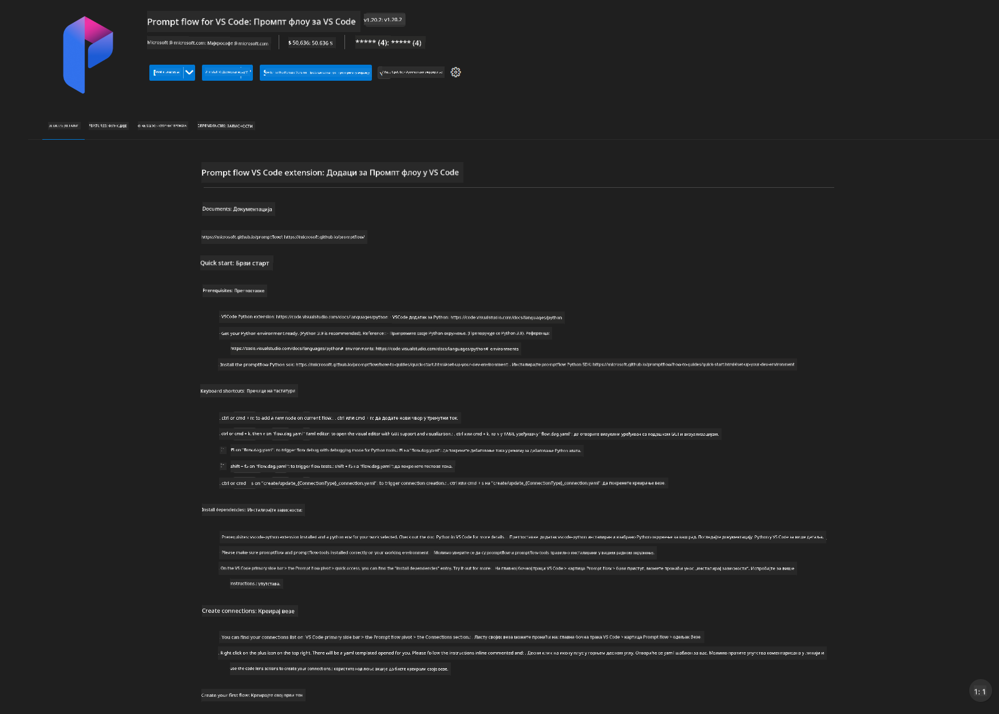
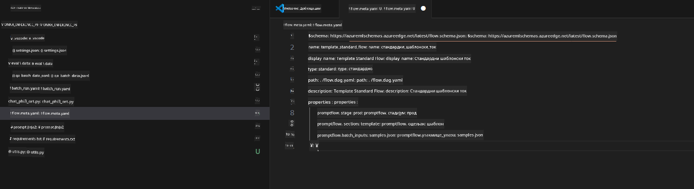
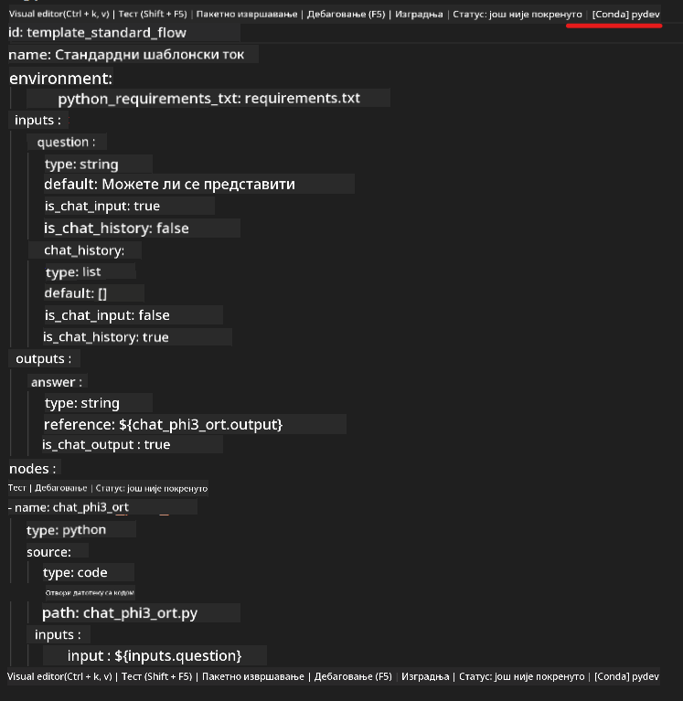
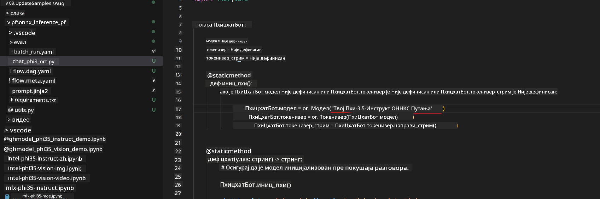
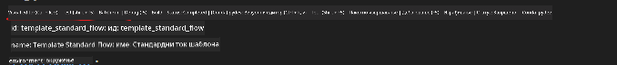
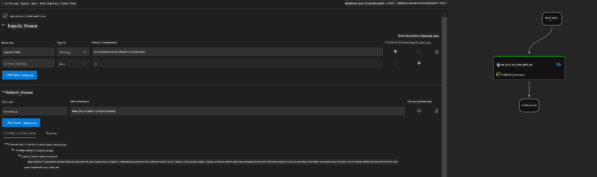
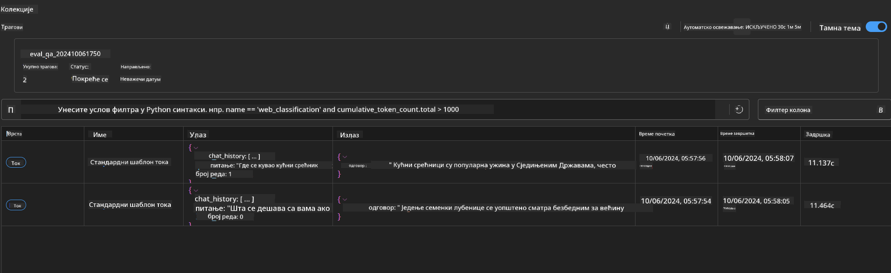

<!--
CO_OP_TRANSLATOR_METADATA:
{
  "original_hash": "92e7dac1e5af0dd7c94170fdaf6860fe",
  "translation_date": "2025-05-09T18:55:39+00:00",
  "source_file": "md/02.Application/01.TextAndChat/Phi3/UsingPromptFlowWithONNX.md",
  "language_code": "sr"
}
-->
# Korišćenje Windows GPU za kreiranje Prompt flow rešenja sa Phi-3.5-Instruct ONNX

Sledeći dokument je primer kako koristiti PromptFlow sa ONNX (Open Neural Network Exchange) za razvoj AI aplikacija zasnovanih na Phi-3 modelima.

PromptFlow je paket razvojnih alata dizajniran da pojednostavi ceo razvojni ciklus AI aplikacija zasnovanih na LLM (Large Language Model), od ideje i prototipa do testiranja i evaluacije.

Integracijom PromptFlow sa ONNX, programeri mogu:

- Optimizovati performanse modela: Iskoristiti ONNX za efikasno izvođenje modela i implementaciju.
- Pojednostaviti razvoj: Koristiti PromptFlow za upravljanje radnim tokovima i automatizaciju ponavljajućih zadataka.
- Poboljšati saradnju: Omogućiti bolju saradnju među članovima tima kroz jedinstveno razvojno okruženje.

**Prompt flow** je paket razvojnih alata dizajniran da pojednostavi ceo razvojni ciklus AI aplikacija zasnovanih na LLM, od ideje, prototipa, testiranja, evaluacije do implementacije u produkciju i praćenja. Olakšava prompt inženjering i omogućava vam da pravite LLM aplikacije sa kvalitetom za produkciju.

Prompt flow može da se poveže sa OpenAI, Azure OpenAI Service i prilagodljivim modelima (Huggingface, lokalni LLM/SLM). Planiramo da implementiramo kvantizovani Phi-3.5 ONNX model u lokalne aplikacije. Prompt flow nam može pomoći da bolje isplaniramo poslovanje i završimo lokalna rešenja bazirana na Phi-3.5. U ovom primeru ćemo kombinovati ONNX Runtime GenAI biblioteku da završimo Prompt flow rešenje bazirano na Windows GPU.

## **Instalacija**

### **ONNX Runtime GenAI za Windows GPU**

Pročitajte ovaj vodič za podešavanje ONNX Runtime GenAI za Windows GPU [kliknite ovde](./ORTWindowGPUGuideline.md)

### **Podešavanje Prompt flow u VSCode**

1. Instalirajte Prompt flow VS Code ekstenziju



2. Nakon instalacije Prompt flow VS Code ekstenzije, kliknite na ekstenziju i izaberite **Installation dependencies** pratite ovaj vodič da instalirate Prompt flow SDK u vašem okruženju


3. Preuzmite [Sample Code](../../../../../../code/09.UpdateSamples/Aug/pf/onnx_inference_pf) i otvorite ovaj primer u VS Code



4. Otvorite **flow.dag.yaml** da izaberete vaše Python okruženje



   Otvorite **chat_phi3_ort.py** da promenite lokaciju Phi-3.5-instruct ONNX modela



5. Pokrenite vaš prompt flow za testiranje

Otvorite **flow.dag.yaml** i kliknite na vizuelni editor



nakon klika, pokrenite da testirate



1. Možete pokrenuti batch u terminalu da proverite više rezultata


```bash

pf run create --file batch_run.yaml --stream --name 'Your eval qa name'    

```

Rezultate možete proveriti u vašem podrazumevanom pregledaču




**Одрицање од одговорности**:  
Овај документ је преведен коришћењем AI преводилачке услуге [Co-op Translator](https://github.com/Azure/co-op-translator). Иако тежимо тачности, молимо вас да имате у виду да аутоматски преводи могу садржати грешке или нетачности. Оригинални документ на његовом изворном језику треба сматрати ауторитетним извором. За критичне информације препоручује се професионални људски превод. Нисмо одговорни за било каква неспоразума или погрешне тумачења која произилазе из употребе овог превода.