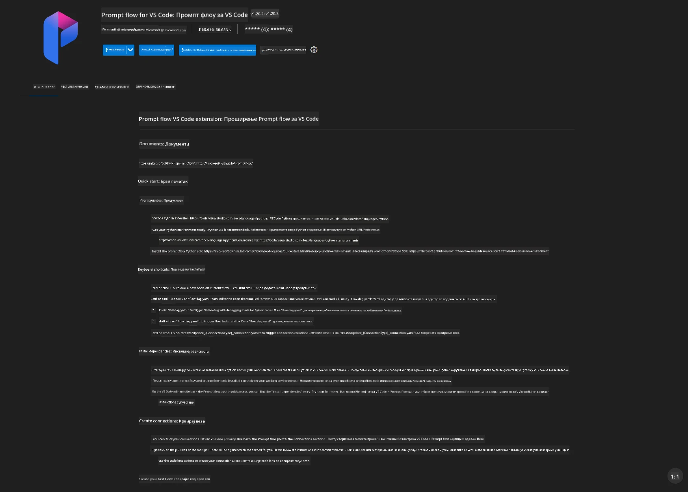
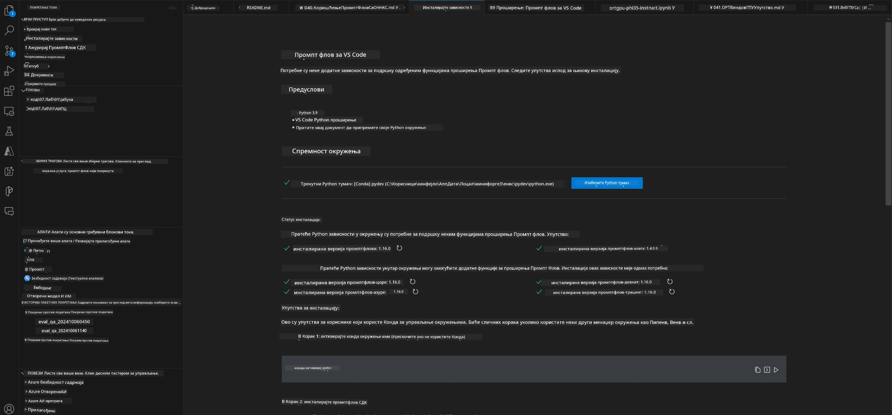
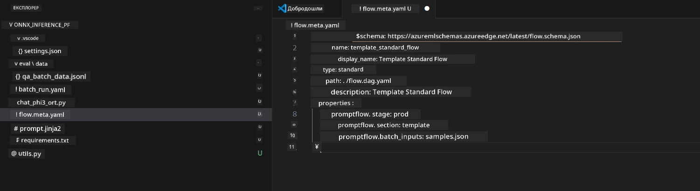
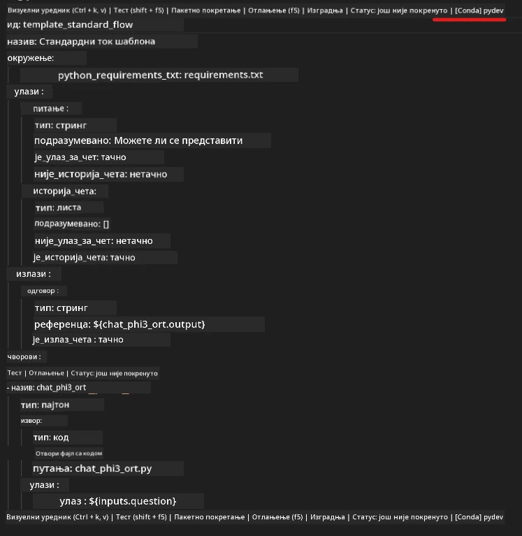
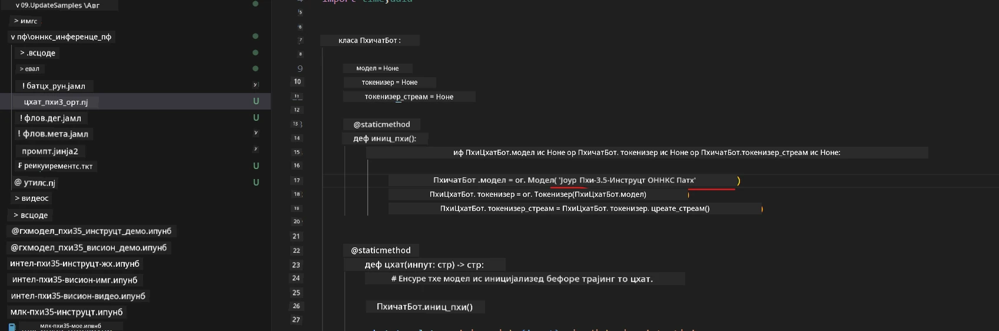
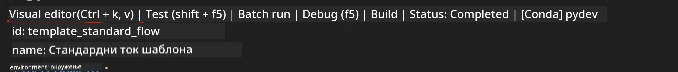
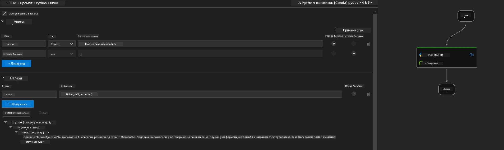
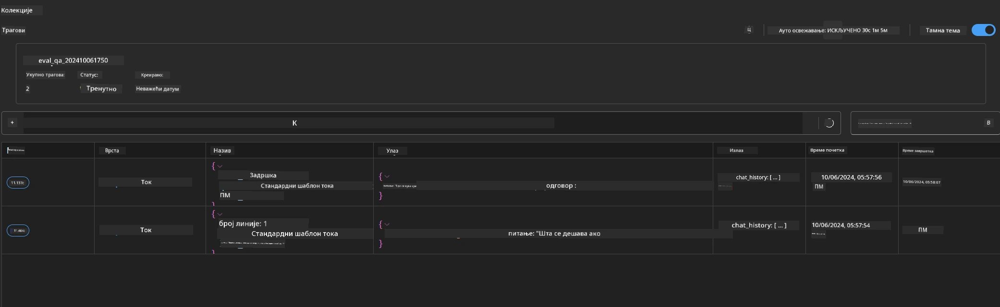

# Коришћење Windows GPU-а за креирање решења Prompt flow са Phi-3.5-Instruct ONNX 

Следећи документ је пример како користити PromptFlow са ONNX (Open Neural Network Exchange) за развој AI апликација на бази Phi-3 модела.

PromptFlow је скуп развојних алата дизајниран да поједностави крајњи развојни циклус AI апликација заснованих на LLM-овима (Large Language Model), од идеје и прототипа до тестирања и евалуације.

Интеграцијом PromptFlow са ONNX-ом, програмери могу:

- Оптимизовати перформансе модела: Искористити ONNX за ефикасно извођење и постављање модела.
- Једноставнији развој: Коришћењем PromptFlow-а за управљање током рада и аутоматизацију понављајућих задатака.
- Побољшати сарадњу: Олакшати бољу сарадњу међу члановима тима пружањем уједињеног развојног окружења.

**Prompt flow** је скуп развојних алата дизајниран да поједностави цео развојни циклус AI апликација заснованих на LLM-овима, од идеје, прототиповања, тестирања и евалуације до производног постављања и праћења. Помиње inženjering упита чини знатно лакшим и омогућава креирање LLM апликација производног квалитета.

Prompt flow може да се повеже са OpenAI, Azure OpenAI Service, и прилагодљивим моделима (Huggingface, локални LLM/SLM). Надамо се да ћемо поставити квантовани ONNX модел Phi-3.5 у локалне апликације. Prompt flow нам може помоћи да боље планирамо пословање и комплетирамо локална решења базирана на Phi-3.5. У овом примеру комбинујемо ONNX Runtime GenAI библиотеку за комплетирање Prompt flow решења на бази Windows GPU-а.

## **Инсталација**

### **ONNX Runtime GenAI за Windows GPU**

Прочитајте овај водич за подешавање ONNX Runtime GenAI за Windows GPU [кликните овде](./ORTWindowGPUGuideline.md)

### **Подешавање Prompt flow у VSCode**

1. Инсталирајте Prompt flow VS Code екстензију



2. Након инсталације Prompt flow VS Code екстензије, кликните на екстензију и изаберите **Installation dependencies**, пратите овај водич да бисте инсталирали Prompt flow SDK у вашем окружењу



3. Преузмите [Пример кода](../../../../../../code/09.UpdateSamples/Aug/pf/onnx_inference_pf) и отворите га у VS Code-у



4. Отворите **flow.dag.yaml** и изаберите ваше Python окружење



   Отворите **chat_phi3_ort.py** да промените локацију Phi-3.5-instruct ONNX модела



5. Покрените prompt flow да бисте тестирали

Отворите **flow.dag.yaml**, кликните на визуелни едитор



након клика, покрените га за тестирање



1. Можете покренути батч у терминалу за више резултата


```bash

pf run create --file batch_run.yaml --stream --name 'Your eval qa name'    

```

Резултате можете видети у вашем подразумеваном претраживачу




---

<!-- CO-OP TRANSLATOR DISCLAIMER START -->
**Изјава о одрицању одговорности**:
Овај документ је преведен коришћењем услуге за аутоматски превод [Co-op Translator](https://github.com/Azure/co-op-translator). Иако тежимо тачности, имајте у виду да аутоматски преводи могу садржати грешке или нетачности. Оригинални документ на његовом изворном језику треба сматрати ауторитативним извором. За критичне информације препоручује се професионални људски превод. Нисмо одговорни за било каква неспоразума или погрешна тумачења која произилазе из коришћења овог превода.
<!-- CO-OP TRANSLATOR DISCLAIMER END -->