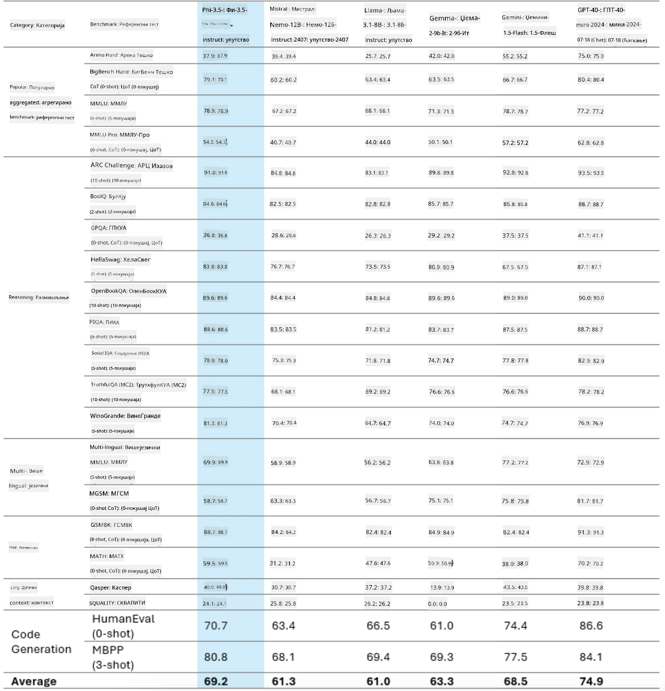
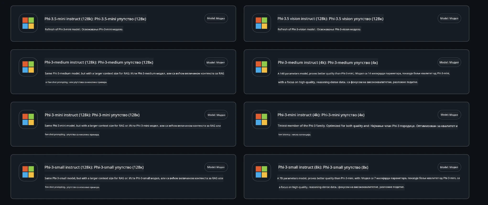
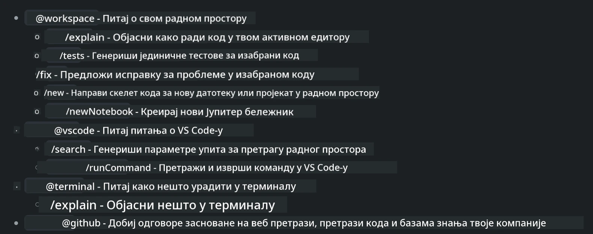
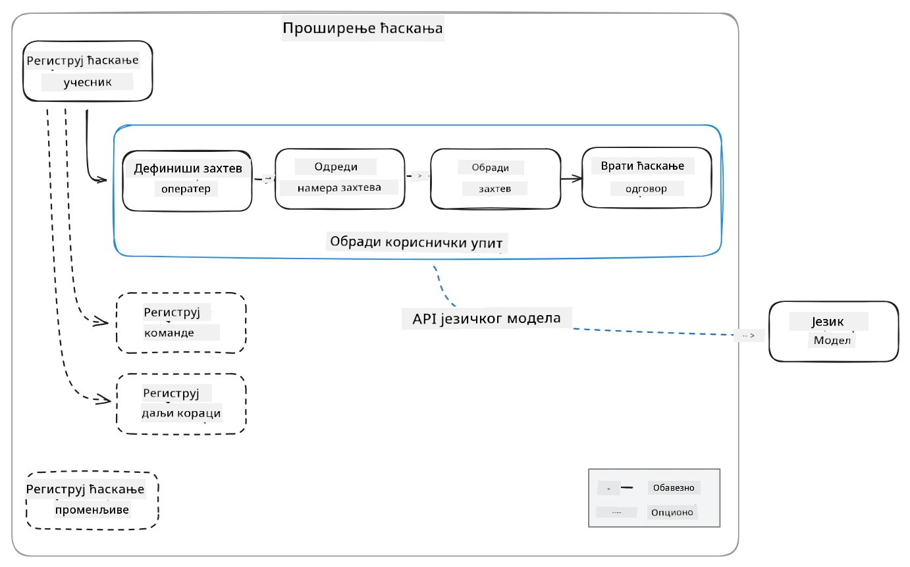
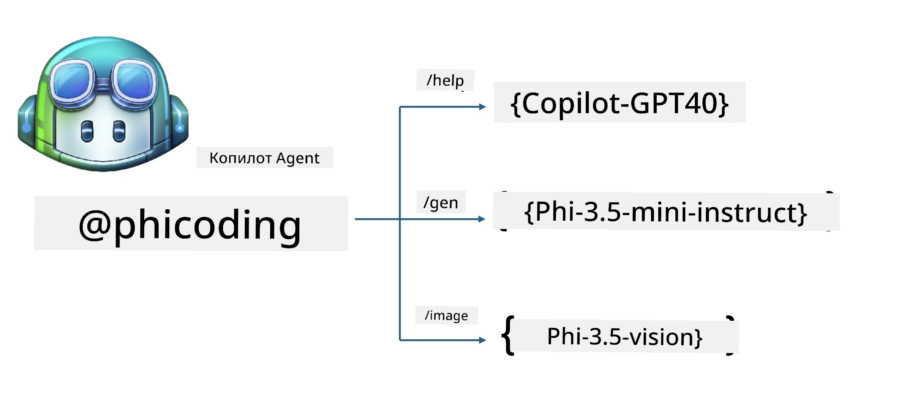
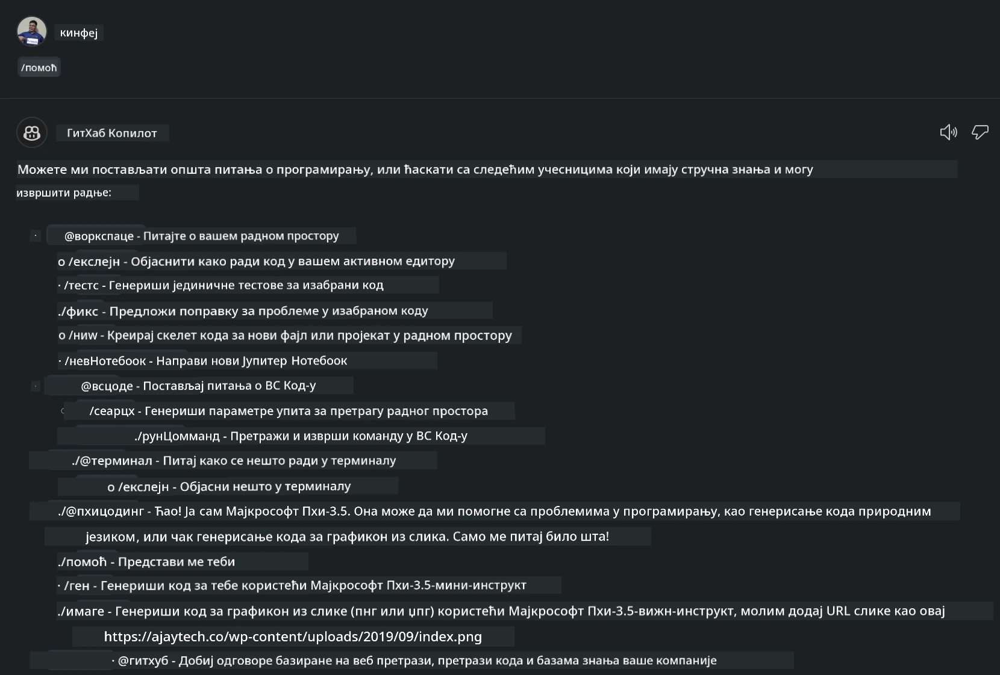
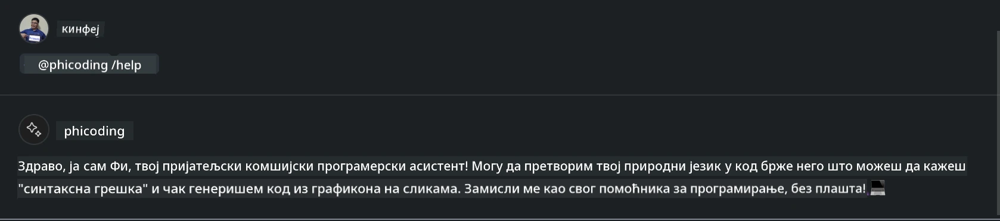
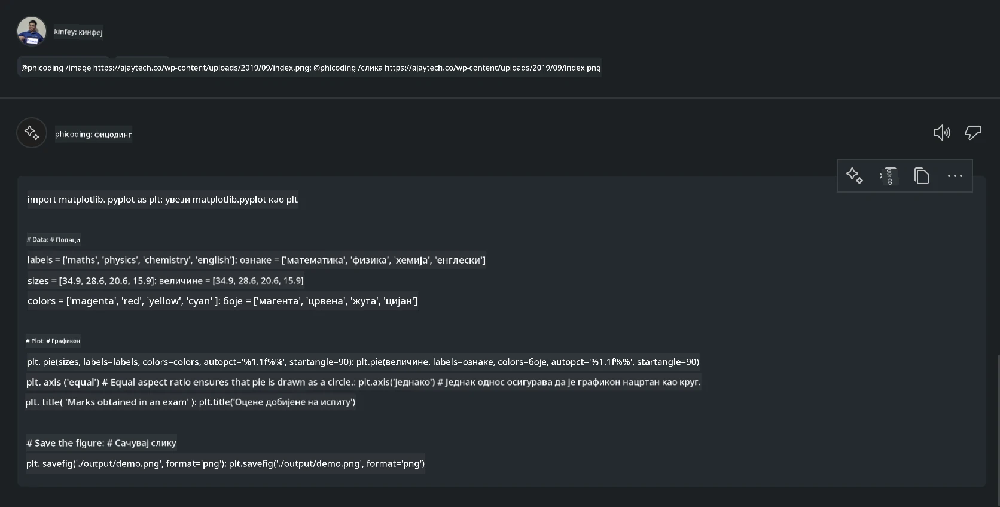

<!--
CO_OP_TRANSLATOR_METADATA:
{
  "original_hash": "35bf81388ac6917277b8d9a0c39bdc70",
  "translation_date": "2025-07-17T03:30:44+00:00",
  "source_file": "md/02.Application/02.Code/Phi3/CreateVSCodeChatAgentWithGitHubModels.md",
  "language_code": "sr"
}
-->
# **Креирајте свог Visual Studio Code Chat Copilot агента са Phi-3.5 уз GitHub Models**

Да ли користите Visual Studio Code Copilot? Посебно у Чату, можете користити различите агенте да побољшате могућности креирања, писања и одржавања пројеката у Visual Studio Code-у. Visual Studio Code пружа API који омогућава компанијама и појединцима да креирају различите агенте засноване на свом пословању како би проширили своје могућности у различитим сопственим областима. У овом чланку ћемо се фокусирати на **Phi-3.5-mini-instruct (128k)** и **Phi-3.5-vision-instruct (128k)** из GitHub Models како бисмо направили ваш Visual Studio Code агент.

## **О Phi-3.5 на GitHub Models**

Знамо да Phi-3/3.5-mini-instruct из Phi-3/3.5 породице има јаке способности разумевања и генерисања кода, и има предности у односу на Gemma-2-9b и Mistral-Nemo-12B-instruct-2407.



Најновији GitHub Models већ пружају приступ моделима Phi-3.5-mini-instruct (128k) и Phi-3.5-vision-instruct (128k). Програмери им могу приступити преко OpenAI SDK, Azure AI Inference SDK и REST API-ја.



***Note: *** Препоручује се коришћење Azure AI Inference SDK овде, јер боље функционише у комбинацији са Azure Model Catalog у продукционом окружењу

Испод су резултати **Phi-3.5-mini-instruct (128k)** и **Phi-3.5-vision-instruct (128k)** у сценарију генерисања кода након интеграције са GitHub Models, као и припрема за следеће примере

**Демо: GitHub Models Phi-3.5-mini-instruct (128k) генерише код из Prompt-а** ([кликните овде](../../../../../../code/09.UpdateSamples/Aug/ghmodel_phi35_instruct_demo.ipynb))

**Демо: GitHub Models Phi-3.5-vision-instruct (128k) генерише код из слике** ([кликните овде](../../../../../../code/09.UpdateSamples/Aug/ghmodel_phi35_vision_demo.ipynb))


## **О GitHub Copilot Chat агенту**

GitHub Copilot Chat агент може да обави различите задатке у различитим пројектним сценаријима на основу кода. Систем има четири агента: workspace, github, terminal, vscode



Додавањем имена агента уз ‘@’, можете брзо обавити одговарајући посао. За предузећа, ако додате своје пословне садржаје као што су захтеви, кодирање, тест спецификације и пуштање у рад, можете имати моћније приватне функције засноване на GitHub Copilot-у.

Visual Studio Code Chat агент је сада званично објавио свој API, омогућавајући предузећима или програмерима у предузећима да развијају агенте засноване на различитим софтверским пословним екосистемима. На основу начина развоја Visual Studio Code Extension Development, лако можете приступити интерфејсу Visual Studio Code Chat Agent API-ја. Можемо развијати у складу са овим процесом



Развојни сценарио може подржати приступ API-јима трећих страна (као што су GitHub Models, Azure Model Catalog и самостално изграђене услуге засноване на open source моделима) и такође може користити моделе gpt-35-turbo, gpt-4 и gpt-4o које пружа GitHub Copilot.

## **Додавање агента @phicoding заснованог на Phi-3.5**

Покушавамо да интегришемо програмерске способности Phi-3.5 за писање кода, генерисање кода из слика и друге задатке. Креирајте агента базираног на Phi-3.5 - @PHI, ево неких функција

1. Генерише самоувод на основу GPT-4o који пружа GitHub Copilot преко команде **@phicoding /help**

2. Генерише код за различите програмске језике на основу **Phi-3.5-mini-instruct (128k)** преко команде **@phicoding /gen**

3. Генерише код на основу **Phi-3.5-vision-instruct (128k)** и допуњује код из слике преко команде **@phicoding /image**



## **Повезани кораци**

1. Инсталирајте подршку за развој Visual Studio Code Extension-а користећи npm

```bash

npm install --global yo generator-code 

```
2. Креирајте Visual Studio Code Extension плагин (користећи Typescript режим развоја, назван phiext)

```bash

yo code 

```

3. Отворите креирани пројекат и измените package.json. Овде су повезана упутства и конфигурације, као и конфигурација GitHub Models. Имајте на уму да овде треба да додате свој GitHub Models token.

```json

{
  "name": "phiext",
  "displayName": "phiext",
  "description": "",
  "version": "0.0.1",
  "engines": {
    "vscode": "^1.93.0"
  },
  "categories": [
    "AI",
    "Chat"
  ],
  "activationEvents": [],
  "enabledApiProposals": [
      "chatVariableResolver"
  ],
  "main": "./dist/extension.js",
  "contributes": {
    "chatParticipants": [
        {
            "id": "chat.phicoding",
            "name": "phicoding",
            "description": "Hey! I am Microsoft Phi-3.5, She can help me with coding problems, such as generation code with your natural language, or even generation code about chart from images. Just ask me anything!",
            "isSticky": true,
            "commands": [
                {
                    "name": "help",
                    "description": "Introduce myself to you"
                },
                {
                    "name": "gen",
                    "description": "Generate code for you with Microsoft Phi-3.5-mini-instruct"
                },
                {
                    "name": "image",
                    "description": "Generate code for chart from image(png or jpg) with Microsoft Phi-3.5-vision-instruct, please add image url like this : https://ajaytech.co/wp-content/uploads/2019/09/index.png"
                }
            ]
        }
    ],
    "commands": [
        {
            "command": "phicoding.namesInEditor",
            "title": "Use Microsoft Phi 3.5 in Editor"
        }
    ],
    "configuration": {
      "type": "object",
      "title": "githubmodels",
      "properties": {
        "githubmodels.endpoint": {
          "type": "string",
          "default": "https://models.inference.ai.azure.com",
          "description": "Your GitHub Models Endpoint",
          "order": 0
        },
        "githubmodels.api_key": {
          "type": "string",
          "default": "Your GitHub Models Token",
          "description": "Your GitHub Models Token",
          "order": 1
        },
        "githubmodels.phi35instruct": {
          "type": "string",
          "default": "Phi-3.5-mini-instruct",
          "description": "Your Phi-35-Instruct Model",
          "order": 2
        },
        "githubmodels.phi35vision": {
          "type": "string",
          "default": "Phi-3.5-vision-instruct",
          "description": "Your Phi-35-Vision Model",
          "order": 3
        }
      }
    }
  },
  "scripts": {
    "vscode:prepublish": "npm run package",
    "compile": "webpack",
    "watch": "webpack --watch",
    "package": "webpack --mode production --devtool hidden-source-map",
    "compile-tests": "tsc -p . --outDir out",
    "watch-tests": "tsc -p . -w --outDir out",
    "pretest": "npm run compile-tests && npm run compile && npm run lint",
    "lint": "eslint src",
    "test": "vscode-test"
  },
  "devDependencies": {
    "@types/vscode": "^1.93.0",
    "@types/mocha": "^10.0.7",
    "@types/node": "20.x",
    "@typescript-eslint/eslint-plugin": "^8.3.0",
    "@typescript-eslint/parser": "^8.3.0",
    "eslint": "^9.9.1",
    "typescript": "^5.5.4",
    "ts-loader": "^9.5.1",
    "webpack": "^5.94.0",
    "webpack-cli": "^5.1.4",
    "@vscode/test-cli": "^0.0.10",
    "@vscode/test-electron": "^2.4.1"
  },
  "dependencies": {
    "@types/node-fetch": "^2.6.11",
    "node-fetch": "^3.3.2",
    "@azure-rest/ai-inference": "latest",
    "@azure/core-auth": "latest",
    "@azure/core-sse": "latest"
  }
}


```

4. Измените src/extension.ts

```typescript

// The module 'vscode' contains the VS Code extensibility API
// Import the module and reference it with the alias vscode in your code below
import * as vscode from 'vscode';
import ModelClient from "@azure-rest/ai-inference";
import { AzureKeyCredential } from "@azure/core-auth";


interface IPhiChatResult extends vscode.ChatResult {
    metadata: {
        command: string;
    };
}


const MODEL_SELECTOR: vscode.LanguageModelChatSelector = { vendor: 'copilot', family: 'gpt-4o' };

function isValidImageUrl(url: string): boolean {
    const regex = /^(https?:\/\/.*\.(?:png|jpg))$/i;
    return regex.test(url);
}
  

// This method is called when your extension is activated
// Your extension is activated the very first time the command is executed
export function activate(context: vscode.ExtensionContext) {

    const codinghandler: vscode.ChatRequestHandler = async (request: vscode.ChatRequest, context: vscode.ChatContext, stream: vscode.ChatResponseStream, token: vscode.CancellationToken): Promise<IPhiChatResult> => {


        const config : any = vscode.workspace.getConfiguration('githubmodels');
        const endPoint: string = config.get('endpoint');
        const apiKey: string = config.get('api_key');
        const phi35instruct: string = config.get('phi35instruct');
        const phi35vision: string = config.get('phi35vision');
        
        if (request.command === 'help') {

            const content = "Welcome to Coding assistant with Microsoft Phi-3.5"; 
            stream.progress(content);


            try {
                const [model] = await vscode.lm.selectChatModels(MODEL_SELECTOR);
                if (model) {
                    const messages = [
                        vscode.LanguageModelChatMessage.User("Please help me express this content in a humorous way: I am a programming assistant who can help you convert natural language into code and generate code based on the charts in the images. output format like this : Hey I am Phi ......")
                    ];
                    const chatResponse = await model.sendRequest(messages, {}, token);
                    for await (const fragment of chatResponse.text) {
                        stream.markdown(fragment);
                    }
                }
            } catch(err) {
                console.log(err);
            }


            return { metadata: { command: 'help' } };

        }

        
        if (request.command === 'gen') {

            const content = "Welcome to use phi-3.5 to generate code";

            stream.progress(content);

            const client = new ModelClient(endPoint, new AzureKeyCredential(apiKey));

            const response = await client.path("/chat/completions").post({
              body: {
                messages: [
                  { role:"system", content: "You are a coding assistant.Help answer all code generation questions." },
                  { role:"user", content: request.prompt }
                ],
                model: phi35instruct,
                temperature: 0.4,
                max_tokens: 1000,
                top_p: 1.
              }
            });

            stream.markdown(response.body.choices[0].message.content);

            return { metadata: { command: 'gen' } };

        }


        
        if (request.command === 'image') {


            const content = "Welcome to use phi-3.5 to generate code from image(png or jpg),image url like this:https://ajaytech.co/wp-content/uploads/2019/09/index.png";

            stream.progress(content);

            if (!isValidImageUrl(request.prompt)) {
                stream.markdown('Please provide a valid image URL');
                return { metadata: { command: 'image' } };
            }
            else
            {

                const client = new ModelClient(endPoint, new AzureKeyCredential(apiKey));
    
                const response = await client.path("/chat/completions").post({
                    body: {
                      messages: [
                        { role: "system", content: "You are a helpful assistant that describes images in details." },
                        { role: "user", content: [
                            { type: "text", text: "Please generate code according to the chart in the picture according to the following requirements\n1. Keep all information in the chart, including data and text\n2. Do not generate additional information that is not included in the chart\n3. Please extract data from the picture, do not generate it from csv\n4. Please save the regenerated chart as a chart and save it to ./output/demo.png"},
                            { type: "image_url", image_url: {url: request.prompt}
                            }
                          ]
                        }
                      ],
                      model: phi35vision,
                      temperature: 0.4,
                      max_tokens: 2048,
                      top_p: 1.
                    }
                  });
    
                
                stream.markdown(response.body.choices[0].message.content);
    
                return { metadata: { command: 'image' } };
            }


        }


        return { metadata: { command: '' } };
    };


    const phi_ext = vscode.chat.createChatParticipant("chat.phicoding", codinghandler);

    phi_ext.iconPath = new vscode.ThemeIcon('sparkle');


    phi_ext.followupProvider = {
        provideFollowups(result: IPhiChatResult, context: vscode.ChatContext, token: vscode.CancellationToken) {
            return [{
                prompt: 'Let us coding with Phi-3.5 😋😋😋😋',
                label: vscode.l10n.t('Enjoy coding with Phi-3.5'),
                command: 'help'
            } satisfies vscode.ChatFollowup];
        }
    };

    context.subscriptions.push(phi_ext);
}

// This method is called when your extension is deactivated
export function deactivate() {}


```

6. Покретање

***/help***



***@phicoding /help***



***@phicoding /gen***


***@phicoding /image***



Можете преузети пример кода: [кликните овде](../../../../../../code/09.UpdateSamples/Aug/vscode)

## **Ресурси**

1. Региструјте се на GitHub Models [https://gh.io/models](https://gh.io/models)

2. Упознајте се са развојем Visual Studio Code Extension-а [https://code.visualstudio.com/api/get-started/your-first-extension](https://code.visualstudio.com/api/get-started/your-first-extension)

3. Сазнајте више о Visual Studio Code Copilot Chat API-ју [https://code.visualstudio.com/api/extension-guides/chat](https://code.visualstudio.com/api/extension-guides/chat)

**Одрицање од одговорности**:  
Овај документ је преведен коришћењем AI сервиса за превођење [Co-op Translator](https://github.com/Azure/co-op-translator). Иако се трудимо да превод буде тачан, молимо вас да имате у виду да аутоматски преводи могу садржати грешке или нетачности. Оригинални документ на његовом изворном језику треба сматрати ауторитетним извором. За критичне информације препоручује се професионални људски превод. Нисмо одговорни за било каква неспоразума или погрешна тумачења настала коришћењем овог превода.