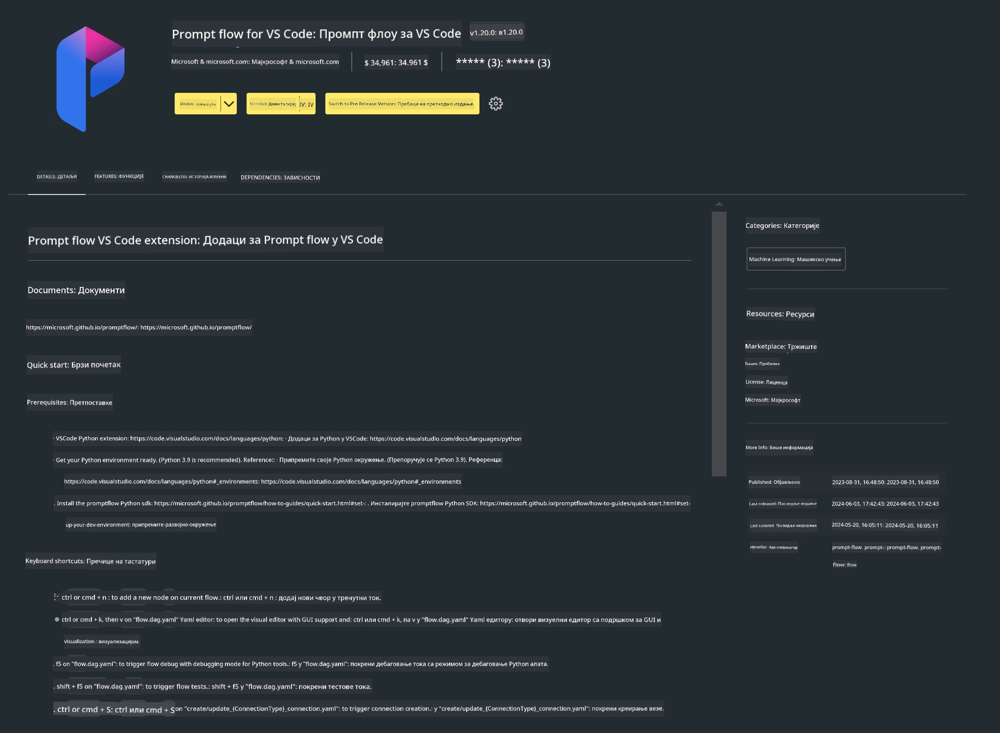

<!--
CO_OP_TRANSLATOR_METADATA:
{
  "original_hash": "a4ef39027902e82f2c33d568d2a2259a",
  "translation_date": "2025-07-17T03:52:52+00:00",
  "source_file": "md/02.Application/02.Code/Phi3/VSCodeExt/HOL/AIPC/01.Installations.md",
  "language_code": "sr"
}
-->
# **Лабораторија 0 - Инсталација**

Када уђемо у лабораторију, потребно је да конфигуришемо одговарајуће окружење:


### **1. Python 3.11+**

Препоручује се коришћење miniforge за подешавање вашег Python окружења

За конфигурисање miniforge-а, погледајте [https://github.com/conda-forge/miniforge](https://github.com/conda-forge/miniforge)

Након конфигурисања miniforge-а, покрените следећу команду у Power Shell-у

```bash

conda create -n pyenv python==3.11.8 -y

conda activate pyenv

```


### **2. Инсталирајте Prompt flow SDK**

У Лабораторији 1 користимо Prompt flow, па је потребно да конфигуришете Prompt flow SDK.

```bash

pip install promptflow --upgrade

```

Можете проверити promptflow sdk овом командом


```bash

pf --version

```

### **3. Инсталирајте Visual Studio Code Prompt flow екстензију**




### **4. Intel NPU Acceleration Library**

Нова генерација Intel процесора подржава NPU. Ако желите да користите NPU за покретање LLM / SLM модела локално, можете користити ***Intel NPU Acceleration Library***. Ако желите да сазнате више, можете прочитати [https://github.com/microsoft/PhiCookBook/blob/main/md/01.Introduction/03/AIPC_Inference.md](https://github.com/microsoft/PhiCookBook/blob/main/md/01.Introduction/03/AIPC_Inference.md).

Инсталирајте Intel NPU Acceleration Library у bash-у


```bash

pip install intel-npu-acceleration-library

```

***Напомена***: Имајте у виду да ова библиотека подржава transformers верзију ***4.40.2***, молимо проверите верзију


### **5. Остале Python библиотеке**


направите requirements.txt и додајте овај садржај

```txt

notebook
numpy 
scipy 
scikit-learn 
matplotlib 
pandas 
pillow 
graphviz

```


### **6. Инсталирајте NVM**

инсталирајте nvm у Powershell-у


```bash

winget install -e --id CoreyButler.NVMforWindows

```

инсталирајте nodejs 18.20


```bash

nvm install 18.20.0

nvm use 18.20.0

```

### **7. Инсталирајте Visual Studio Code Development Support**


```bash

npm install --global yo generator-code

```

Честитамо! Успешно сте конфигурисали SDK. Следећи корак је да наставите са практичним задацима.

**Одрицање од одговорности**:  
Овај документ је преведен коришћењем AI сервиса за превођење [Co-op Translator](https://github.com/Azure/co-op-translator). Иако тежимо прецизности, молимо вас да имате у виду да аутоматски преводи могу садржати грешке или нетачности. Оригинални документ на његовом изворном језику треба сматрати ауторитетним извором. За критичне информације препоручује се професионални људски превод. Нисмо одговорни за било каква неспоразума или погрешна тумачења која произилазе из коришћења овог превода.