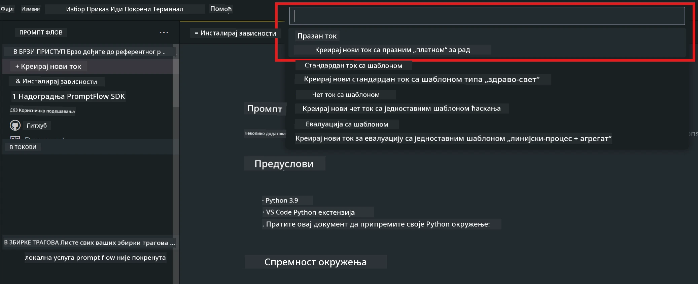
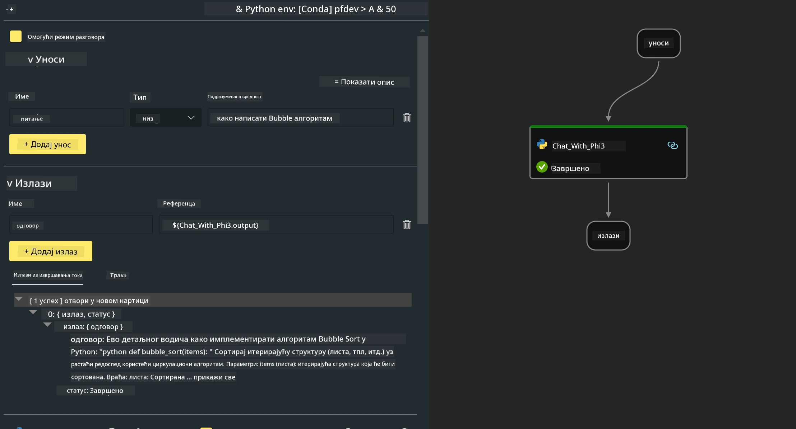

# **Лабораторија 2 - Покретање Prompt flow са Phi-3-mini на AIPC**

## **Шта је Prompt flow**

Prompt flow је скуп алата за развој дизајниран да поједностави цео циклус развоја AI апликација заснованих на LLM-овима, од идеје, прототиповања, тестирања, евалуације до производног пуштања и праћења. Олакшава рад са prompt engineering-ом и омогућава вам да направите LLM апликације квалитета погодног за производњу.

Са prompt flow-ом ћете моћи да:

- Креирате токове који повезују LLM-ове, промптове, Python код и друге алате у извршни радни процес.

- Лако дебагујете и унапређујете своје токове, посебно интеракцију са LLM-овима.

- Процените своје токове, израчунате метрике квалитета и перформанси са већим скупом података.

- Интегришете тестирање и евалуацију у ваш CI/CD систем како бисте осигурали квалитет вашег тока.

- Лако имплементирате своје токове на платформу за сервисирање коју одаберете или их интегришете у код ваше апликације.

- (Опционо, али препоручљиво) Сарађујете са тимом користећи cloud верзију Prompt flow-а у Azure AI.

## **Шта је AIPC**

AI PC има CPU, GPU и NPU, сваки са специфичним могућностима за убрзање AI задатака. NPU, или неуронски процесор, је специјализовани убрзавач који обрађује вештачку интелигенцију (AI) и машинско учење (ML) директно на вашем рачунару, уместо да шаље податке у cloud на обраду. GPU и CPU такође могу обрађивати ове задатке, али NPU је посебно ефикасан за AI израчунавања са ниском потрошњом енергије. AI PC представља фундаменталну промену у начину рада наших рачунара. Није решење за проблем који раније није постојао, већ обећава значајно побољшање у свакодневној употреби рачунара.

Како то функционише? У поређењу са генеративном AI и огромним LLM моделима обученим на огромним јавним подацима, AI који ће се изводити на вашем рачунару је приступачнији на скоро сваком нивоу. Концепт је лакши за разумевање, а пошто је обучен на вашим подацима, без потребе за приступом cloud-у, предности су одмах примамљивије широј публици.

У блиској будућности, свет AI PC укључује личне асистенте и мање AI моделе који раде директно на вашем рачунару, користећи ваше податке да понуде персоналне, приватне и безбедније AI функције за ствари које већ радите свакодневно – вођење записника са састанака, организовање фудбалске лиге, аутоматизацију побољшања за уређивање фотографија и видео снимака, или креирање савршеног распореда за породични скуп на основу времена доласка и одласка свих учесника.

## **Креирање генеративних токова кода на AIPC**

***Note*** ：Ако нисте завршили инсталацију окружења, молимо посетите [Lab 0 -Installations](./01.Installations.md)

1. Отворите Prompt flow екстензију у Visual Studio Code-у и креирајте празан flow пројекат



2. Додајте параметре за улаз и излаз и додајте Python код као нови flow



Можете се послужити овом структуром (flow.dag.yaml) за конструисање свог тока

```yaml

inputs:
  question:
    type: string
    default: how to write Bubble Algorithm
outputs:
  answer:
    type: string
    reference: ${Chat_With_Phi3.output}
nodes:
- name: Chat_With_Phi3
  type: python
  source:
    type: code
    path: Chat_With_Phi3.py
  inputs:
    question: ${inputs.question}


```

3. Додајте код у ***Chat_With_Phi3.py***

```python


from promptflow.core import tool

# import torch
from transformers import AutoTokenizer, pipeline,TextStreamer
import intel_npu_acceleration_library as npu_lib

import warnings

import asyncio
import platform

class Phi3CodeAgent:
    
    model = None
    tokenizer = None
    text_streamer = None
    
    model_id = "microsoft/Phi-3-mini-4k-instruct"

    @staticmethod
    def init_phi3():
        
        if Phi3CodeAgent.model is None or Phi3CodeAgent.tokenizer is None or Phi3CodeAgent.text_streamer is None:
            Phi3CodeAgent.model = npu_lib.NPUModelForCausalLM.from_pretrained(
                                    Phi3CodeAgent.model_id,
                                    torch_dtype="auto",
                                    dtype=npu_lib.int4,
                                    trust_remote_code=True
                                )
            Phi3CodeAgent.tokenizer = AutoTokenizer.from_pretrained(Phi3CodeAgent.model_id)
            Phi3CodeAgent.text_streamer = TextStreamer(Phi3CodeAgent.tokenizer, skip_prompt=True)

    

    @staticmethod
    def chat_with_phi3(prompt):
        
        Phi3CodeAgent.init_phi3()

        messages = "<|system|>You are a AI Python coding assistant. Please help me to generate code in Python.The answer only genertated Python code, but any comments and instructions do not need to be generated<|end|><|user|>" + prompt +"<|end|><|assistant|>"


        generation_args = {
            "max_new_tokens": 1024,
            "return_full_text": False,
            "temperature": 0.3,
            "do_sample": False,
            "streamer": Phi3CodeAgent.text_streamer,
        }

        pipe = pipeline(
            "text-generation",
            model=Phi3CodeAgent.model,
            tokenizer=Phi3CodeAgent.tokenizer,
            # **generation_args
        )

        result = ''

        with warnings.catch_warnings():
            warnings.simplefilter("ignore")
            response = pipe(messages, **generation_args)
            result =response[0]['generated_text']
            return result


@tool
def my_python_tool(question: str) -> str:
    if platform.system() == 'Windows':
        asyncio.set_event_loop_policy(asyncio.WindowsSelectorEventLoopPolicy())
    return Phi3CodeAgent.chat_with_phi3(question)


```

4. Можете тестирати ток преко Debug или Run да проверите да ли генерисање кода ради исправно


5. Покрените ток као развојни API у терминалу

```

pf flow serve --source ./ --port 8080 --host localhost   

```

Можете га тестирати у Postman-у / Thunder Client-у

### **Note**

1. Прво покретање траје дуже. Препоручује се да преузмете phi-3 модел преко Hugging face CLI.

2. Имајући у виду ограничену рачунску снагу Intel NPU-а, препоручује се коришћење Phi-3-mini-4k-instruct

3. Користимо Intel NPU Acceleration за квантовање INT4 конверзије, али ако поново покренете сервис, потребно је да обришете кеш и nc_workshop фасцикле.

## **Ресурси**

1. Учите Promptflow [https://microsoft.github.io/promptflow/](https://microsoft.github.io/promptflow/)

2. Учите Intel NPU Acceleration [https://github.com/intel/intel-npu-acceleration-library](https://github.com/intel/intel-npu-acceleration-library)

3. Пример кода, преузмите [Local NPU Agent Sample Code](../../../../../../../../../code/07.Lab/01/AIPC)

**Одрицање од одговорности**:  
Овај документ је преведен коришћењем AI сервиса за превођење [Co-op Translator](https://github.com/Azure/co-op-translator). Иако тежимо прецизности, молимо вас да имате у виду да аутоматски преводи могу садржати грешке или нетачности. Оригинални документ на његовом изворном језику треба сматрати ауторитетним извором. За критичне информације препоручује се професионални људски превод. Нисмо одговорни за било каква неспоразума или погрешна тумачења која произилазе из коришћења овог превода.