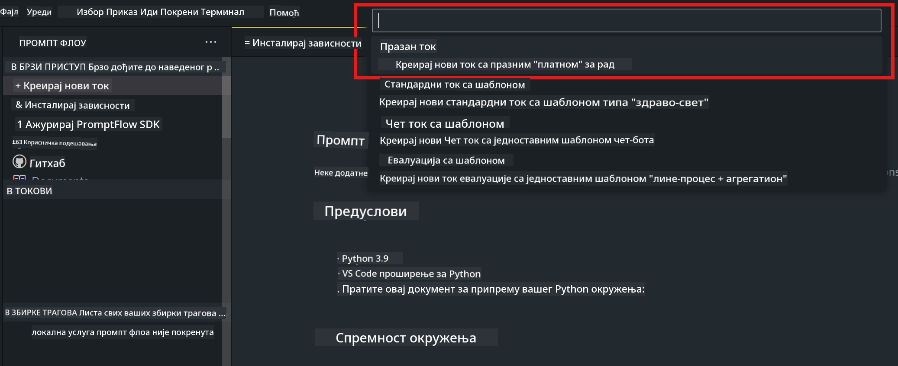

<!--
CO_OP_TRANSLATOR_METADATA:
{
  "original_hash": "bc29f7fe7fc16bed6932733eac8c81b8",
  "translation_date": "2025-05-09T19:26:40+00:00",
  "source_file": "md/02.Application/02.Code/Phi3/VSCodeExt/HOL/AIPC/02.PromptflowWithNPU.md",
  "language_code": "sr"
}
-->
# **Lab 2 - Pokretanje Prompt flow sa Phi-3-mini na AIPC**

## **Šta je Prompt flow**

Prompt flow je skup alata za razvoj dizajniran da pojednostavi ceo razvojni ciklus AI aplikacija zasnovanih na LLM-ovima, od ideje, prototipa, testiranja, evaluacije do produkcijskog puštanja i praćenja. Olakšava prompt inženjering i omogućava vam da pravite LLM aplikacije profesionalnog kvaliteta.

Uz prompt flow, moći ćete da:

- Kreirate tokove koji povezuju LLM-ove, promptove, Python kod i druge alate u izvršni radni tok.

- Debugujete i iterirate svoje tokove, naročito interakciju sa LLM-ovima, lako i brzo.

- Evaluirate tokove, izračunavate metrike kvaliteta i performansi sa većim skupovima podataka.

- Integrirate testiranje i evaluaciju u vaš CI/CD sistem da biste osigurali kvalitet toka.

- Deploy-ujete tokove na platformu za serviranje po izboru ili ih lako integrišete u kod vaše aplikacije.

- (Opcionalno, ali preporučljivo) Saradjujete sa timom koristeći cloud verziju Prompt flow u Azure AI.

## **Šta je AIPC**

AI PC ima CPU, GPU i NPU, svaki sa specifičnim AI akceleracionim mogućnostima. NPU, ili neural processing unit, je specijalizovani akcelerator koji obrađuje zadatke veštačke inteligencije (AI) i mašinskog učenja (ML) direktno na vašem računaru, umesto da šalje podatke na obradu u cloud. GPU i CPU takođe mogu obrađivati ove zadatke, ali NPU je posebno dobar za AI proračune sa malom potrošnjom energije. AI PC predstavlja osnovnu promenu u načinu na koji naši računari funkcionišu. Nije rešenje za problem koji ranije nije postojao, već predstavlja veliki napredak za svakodnevnu upotrebu računara.

Kako to funkcioniše? U poređenju sa generativnom AI i ogromnim LLM modelima treniranim na ogromnim javnim podacima, AI koji se odvija na vašem računaru je pristupačniji na gotovo svim nivoima. Koncept je lakše razumljiv, a pošto je treniran na vašim podacima i ne zahteva pristup cloud-u, koristi su odmah primamljivije široj populaciji.

U skorijoj budućnosti, svet AI PC podrazumeva lične asistente i manje AI modele koji rade direktno na vašem računaru, koristeći vaše podatke da ponude lična, privatna i sigurnija AI poboljšanja za stvari koje već radite svakodnevno – pravljenje beleški sa sastanaka, organizovanje fantazija fudbalskih liga, automatizaciju poboljšanja za obradu fotografija i video zapisa ili pravljenje savršenog rasporeda za porodični skup na osnovu dolazaka i odlazaka svih učesnika.

## **Pravljenje generativnih tokova koda na AIPC**

***Note*** ：Ako niste završili instalaciju okruženja, posetite [Lab 0 -Installations](./01.Installations.md)

1. Otvorite Prompt flow ekstenziju u Visual Studio Code i kreirajte prazan flow projekat



2. Dodajte ulazne i izlazne parametre i dodajte Python kod kao novi tok


Možete se poslužiti ovom strukturom (flow.dag.yaml) za pravljenje vašeg toka

```yaml

inputs:
  question:
    type: string
    default: how to write Bubble Algorithm
outputs:
  answer:
    type: string
    reference: ${Chat_With_Phi3.output}
nodes:
- name: Chat_With_Phi3
  type: python
  source:
    type: code
    path: Chat_With_Phi3.py
  inputs:
    question: ${inputs.question}


```

3. Dodajte kod u ***Chat_With_Phi3.py***

```python


from promptflow.core import tool

# import torch
from transformers import AutoTokenizer, pipeline,TextStreamer
import intel_npu_acceleration_library as npu_lib

import warnings

import asyncio
import platform

class Phi3CodeAgent:
    
    model = None
    tokenizer = None
    text_streamer = None
    
    model_id = "microsoft/Phi-3-mini-4k-instruct"

    @staticmethod
    def init_phi3():
        
        if Phi3CodeAgent.model is None or Phi3CodeAgent.tokenizer is None or Phi3CodeAgent.text_streamer is None:
            Phi3CodeAgent.model = npu_lib.NPUModelForCausalLM.from_pretrained(
                                    Phi3CodeAgent.model_id,
                                    torch_dtype="auto",
                                    dtype=npu_lib.int4,
                                    trust_remote_code=True
                                )
            Phi3CodeAgent.tokenizer = AutoTokenizer.from_pretrained(Phi3CodeAgent.model_id)
            Phi3CodeAgent.text_streamer = TextStreamer(Phi3CodeAgent.tokenizer, skip_prompt=True)

    

    @staticmethod
    def chat_with_phi3(prompt):
        
        Phi3CodeAgent.init_phi3()

        messages = "<|system|>You are a AI Python coding assistant. Please help me to generate code in Python.The answer only genertated Python code, but any comments and instructions do not need to be generated<|end|><|user|>" + prompt +"<|end|><|assistant|>"


        generation_args = {
            "max_new_tokens": 1024,
            "return_full_text": False,
            "temperature": 0.3,
            "do_sample": False,
            "streamer": Phi3CodeAgent.text_streamer,
        }

        pipe = pipeline(
            "text-generation",
            model=Phi3CodeAgent.model,
            tokenizer=Phi3CodeAgent.tokenizer,
            # **generation_args
        )

        result = ''

        with warnings.catch_warnings():
            warnings.simplefilter("ignore")
            response = pipe(messages, **generation_args)
            result =response[0]['generated_text']
            return result


@tool
def my_python_tool(question: str) -> str:
    if platform.system() == 'Windows':
        asyncio.set_event_loop_policy(asyncio.WindowsSelectorEventLoopPolicy())
    return Phi3CodeAgent.chat_with_phi3(question)


```

4. Možete testirati tok iz Debug ili Run opcije da proverite da li generisanje koda radi kako treba


5. Pokrenite tok kao razvojni API u terminalu

```

pf flow serve --source ./ --port 8080 --host localhost   

```

Možete ga testirati u Postman-u ili Thunder Client-u

### **Note**

1. Prvo pokretanje traje duže. Preporučuje se da preuzmete phi-3 model koristeći Hugging face CLI.

2. Zbog ograničene računarske snage Intel NPU, preporučuje se korišćenje Phi-3-mini-4k-instruct modela.

3. Koristimo Intel NPU akceleraciju za kvantizaciju u INT4 konverziju, ali ako ponovo pokrećete servis, potrebno je obrisati cache i nc_workshop foldere.

## **Resursi**

1. Naučite Promptflow [https://microsoft.github.io/promptflow/](https://microsoft.github.io/promptflow/)

2. Naučite Intel NPU akceleraciju [https://github.com/intel/intel-npu-acceleration-library](https://github.com/intel/intel-npu-acceleration-library)

3. Primer koda, preuzmite [Local NPU Agent Sample Code](../../../../../../../../../code/07.Lab/01/AIPC)

**Одрицање од одговорности**:  
Овај документ је преведен помоћу АИ сервиса за превођење [Co-op Translator](https://github.com/Azure/co-op-translator). Иако се трудимо да превод буде прецизан, молимо вас да имате у виду да аутоматски преводи могу садржати грешке или нетачности. Изворни документ на његовом оригиналном језику треба сматрати ауторитетним извором. За критичне информације препоручује се професионални људски превод. Нисмо одговорни за било каква неспоразума или погрешне тумачења која произлазе из коришћења овог превода.