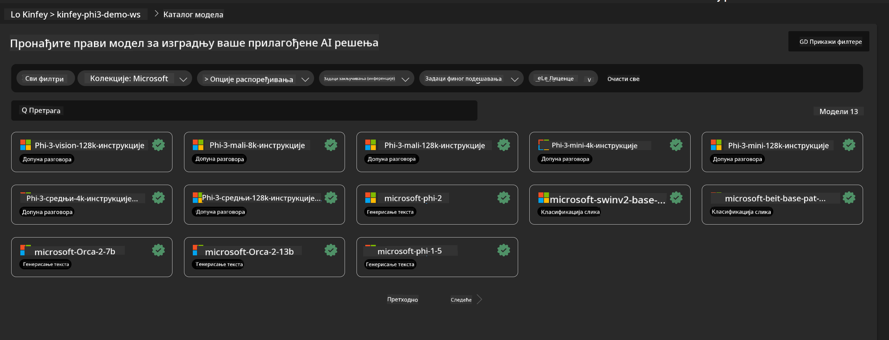
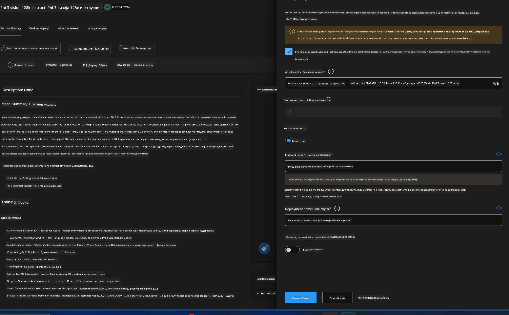
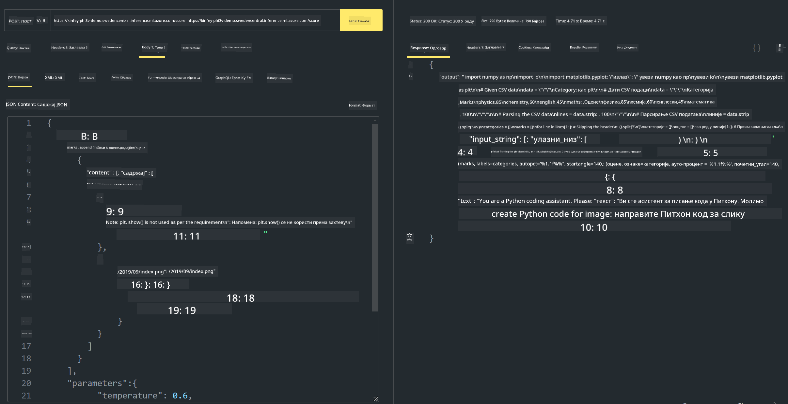

<!--
CO_OP_TRANSLATOR_METADATA:
{
  "original_hash": "20cb4e6ac1686248e8be913ccf6c2bc2",
  "translation_date": "2025-05-09T19:30:27+00:00",
  "source_file": "md/02.Application/02.Code/Phi3/VSCodeExt/HOL/AIPC/03.DeployPhi3VisionOnAzure.md",
  "language_code": "sr"
}
-->
# **Lab 3 - Deploy Phi-3-vision na Azure Machine Learning Service**

Koristimo NPU za završetak produkcijskog postavljanja lokalnog koda, a zatim želimo da uvedemo mogućnost korišćenja PHI-3-VISION-a kako bismo generisali kod na osnovu slika.

U ovom uputstvu brzo možemo napraviti Model As Service Phi-3 Vision servis u Azure Machine Learning Service.

***Note***： Phi-3 Vision zahteva računske resurse za bržu generaciju sadržaja. Potrebna nam je cloud računarska snaga da bismo to postigli.


### **1. Kreirajte Azure Machine Learning Service**

Potrebno je da kreirate Azure Machine Learning Service u Azure Portalu. Ako želite da naučite kako, posetite ovaj link [https://learn.microsoft.com/azure/machine-learning/quickstart-create-resources?view=azureml-api-2](https://learn.microsoft.com/azure/machine-learning/quickstart-create-resources?view=azureml-api-2)


### **2. Izaberite Phi-3 Vision u Azure Machine Learning Service**




### **3. Postavite Phi-3-Vision na Azure**





### **4. Testirajte Endpoint u Postman-u**





***Note***

1. Parametri koji se šalju moraju da sadrže Authorization, azureml-model-deployment i Content-Type. Potrebno je da proverite informacije o postavljanju da biste ih dobili.

2. Za slanje parametara, Phi-3-Vision zahteva link ka slici. Pogledajte način slanja parametara kao kod GPT-4-Vision, na primer

```json

{
  "input_data":{
    "input_string":[
      {
        "role":"user",
        "content":[ 
          {
            "type": "text",
            "text": "You are a Python coding assistant.Please create Python code for image "
          },
          {
              "type": "image_url",
              "image_url": {
                "url": "https://ajaytech.co/wp-content/uploads/2019/09/index.png"
              }
          }
        ]
      }
    ],
    "parameters":{
          "temperature": 0.6,
          "top_p": 0.9,
          "do_sample": false,
          "max_new_tokens": 2048
    }
  }
}

```

3. Pozovite **/score** koristeći Post metodu

**Čestitamo**! Uspešno ste završili brzo postavljanje PHI-3-VISION-a i isprobali kako se slike mogu koristiti za generisanje koda. Sledeći korak je da pravimo aplikacije u kombinaciji sa NPU-ima i cloudom.

**Одрицање од одговорности**:  
Овај документ је преведен коришћењем AI сервиса за превођење [Co-op Translator](https://github.com/Azure/co-op-translator). Иако тежимо прецизности, молимо имајте у виду да аутоматски преводи могу садржати грешке или нетачности. Оригинални документ на његовом изворном језику треба сматрати ауторитетним извором. За критичне информације препоручује се професионални људски превод. Нисмо одговорни за било каква неспоразума или погрешна тумачења настала коришћењем овог превода.