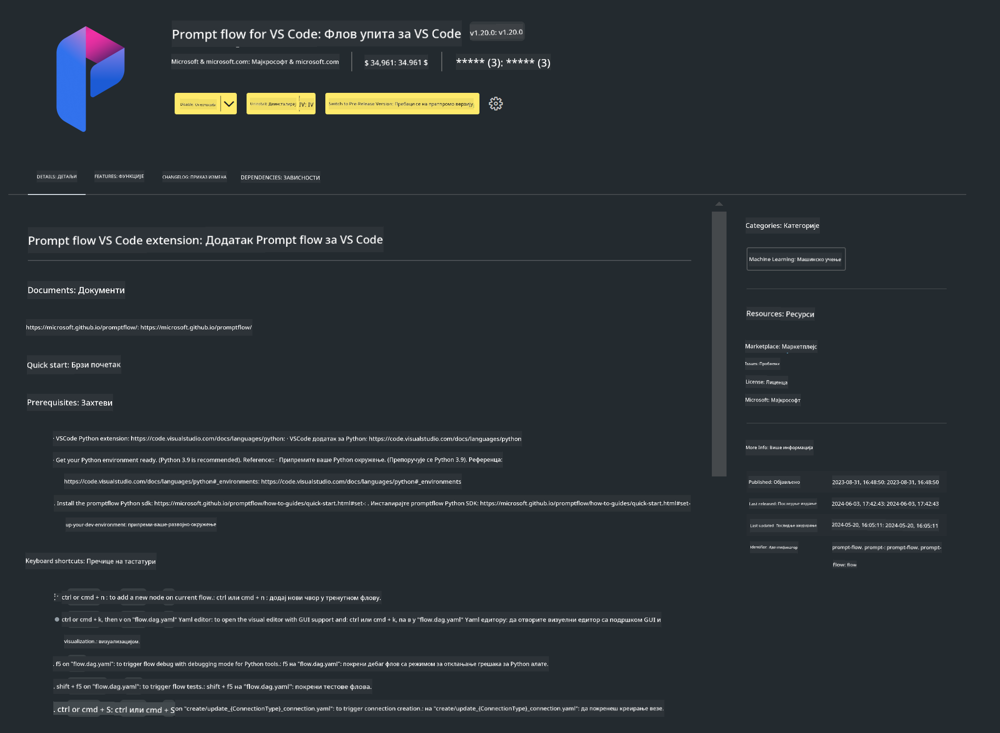

<!--
CO_OP_TRANSLATOR_METADATA:
{
  "original_hash": "4b16264917d9b93169745d92b8ce8c65",
  "translation_date": "2025-05-09T19:37:28+00:00",
  "source_file": "md/02.Application/02.Code/Phi3/VSCodeExt/HOL/Apple/01.Installations.md",
  "language_code": "sr"
}
-->
# **Lab 0 - Instalacija**

Kada uđemo u Lab, potrebno je da konfigurišemo odgovarajuće okruženje:


### **1. Python 3.11+**

Preporučuje se korišćenje miniforge za podešavanje Python okruženja

Za podešavanje miniforge-a, pogledajte [https://github.com/conda-forge/miniforge](https://github.com/conda-forge/miniforge)

Nakon podešavanja miniforge-a, pokrenite sledeću komandu u Power Shell-u

```bash

conda create -n pyenv python==3.11.8 -y

conda activate pyenv

```


### **2. Instalirajte Prompt flow SDK**

U Lab 1 koristimo Prompt flow, pa je potrebno da konfigurišete Prompt flow SDK.

```bash

pip install promptflow --upgrade

```

Promptflow sdk možete proveriti ovom komandom


```bash

pf --version

```

### **3. Instalirajte Visual Studio Code Prompt flow ekstenziju**



### **4. Apple MLX Framework**

MLX je framework za mašinsko učenje na Apple silikonu, koji dolazi iz Apple istraživanja mašinskog učenja. Možete koristiti **Apple MLX framework** za ubrzavanje LLM / SLM sa Apple Silicon-om. Ako želite da saznate više, pročitajte [https://github.com/microsoft/PhiCookBook/blob/main/md/01.Introduction/03/MLX_Inference.md](https://github.com/microsoft/PhiCookBook/blob/main/md/01.Introduction/03/MLX_Inference.md).

Instalirajte MLX framework biblioteku u bash-u


```bash

pip install mlx-lm

```


### **5. Ostale Python biblioteke**

Napravite requirements.txt i dodajte sledeći sadržaj

```txt

notebook
numpy 
scipy 
scikit-learn 
matplotlib 
pandas 
pillow 
graphviz

```


### **6. Instalirajte NVM**

Instalirajte nvm u Powershell-u


```bash

brew install nvm

```

Instalirajte nodejs 18.20


```bash

nvm install 18.20.0

nvm use 18.20.0

```

### **7. Instalirajte Visual Studio Code podršku za razvoj**

```bash

npm install --global yo generator-code

```

Čestitamo! Uspešno ste konfigurisali SDK. Sledeći korak je da pređete na praktične zadatke.

**Ограничење одговорности**:  
Овај документ је преведен помоћу AI сервиса за превођење [Co-op Translator](https://github.com/Azure/co-op-translator). Иако се трудимо да превод буде тачан, молимо вас да имате у виду да аутоматизовани преводи могу садржати грешке или нетачности. Изворни документ на његовом оригиналном језику треба сматрати ауторитетним извором. За критичне информације препоручује се професионални превод од стране људског преводиоца. Нисмо одговорни за било каква неспоразума или погрешна тумачења настала коришћењем овог превода.