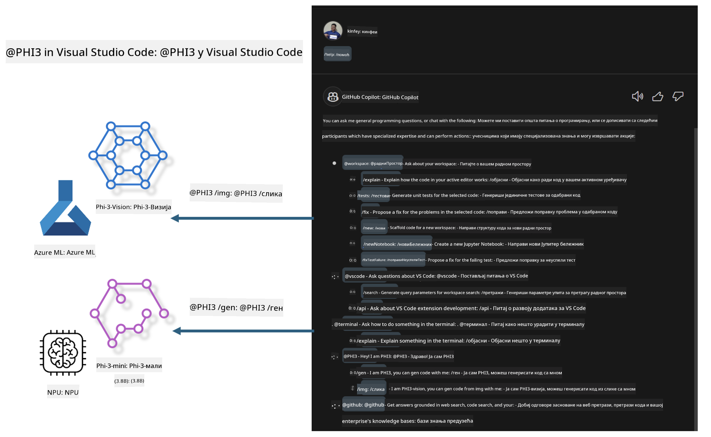

<!--
CO_OP_TRANSLATOR_METADATA:
{
  "original_hash": "00b7a699de8ac405fa821f4c0f7fc0ab",
  "translation_date": "2025-05-09T19:17:47+00:00",
  "source_file": "md/02.Application/02.Code/Phi3/VSCodeExt/README.md",
  "language_code": "sr"
}
-->
# **Napravite sopstveni Visual Studio Code GitHub Copilot Chat sa Microsoft Phi-3 Family**

Da li ste koristili workspace agenta u GitHub Copilot Chat-u? Želite li da napravite agenta za kod vaše tima? Ova praktična radionica ima za cilj da kombinuje open source model za izgradnju poslovnog agenta za kod na nivou preduzeća.

## **Osnove**

### **Zašto odabrati Microsoft Phi-3**

Phi-3 je serija modela, koja uključuje phi-3-mini, phi-3-small i phi-3-medium, zasnovane na različitim parametrima treniranja za generisanje teksta, završavanje dijaloga i generisanje koda. Tu je i phi-3-vision baziran na Vision-u. Pogodan je za preduzeća ili različite timove za kreiranje offline generativnih AI rešenja.

Preporučuje se da pročitate ovaj link [https://github.com/microsoft/PhiCookBook/blob/main/md/01.Introduction/01/01.PhiFamily.md](https://github.com/microsoft/PhiCookBook/blob/main/md/01.Introduction/01/01.PhiFamily.md)

### **Microsoft GitHub Copilot Chat**

GitHub Copilot Chat ekstenzija vam pruža chat interfejs koji vam omogućava da komunicirate sa GitHub Copilot-om i dobijete odgovore na pitanja vezana za kodiranje direktno u VS Code, bez potrebe da pretražujete dokumentaciju ili online forume.

Copilot Chat može koristiti isticanje sintakse, uvlačenje i druge formate kako bi odgovor bio jasniji. U zavisnosti od tipa pitanja korisnika, rezultat može sadržavati linkove ka kontekstu koji je Copilot koristio za generisanje odgovora, poput fajlova izvornog koda ili dokumentacije, ili dugmad za pristup funkcionalnostima VS Code-a.

- Copilot Chat se integriše u vaš razvojni tok i pruža pomoć tamo gde vam treba:

- Pokrenite inline chat razgovor direktno iz editora ili terminala za pomoć dok kodirate

- Koristite Chat prikaz da imate AI asistenta pored sebe koji vam može pomoći u svakom trenutku

- Pokrenite Quick Chat da postavite brzo pitanje i vratite se na posao

Možete koristiti GitHub Copilot Chat u različitim scenarijima, kao što su:

- Odgovaranje na pitanja o kodiranju kako najbolje rešiti problem

- Objašnjavanje tuđeg koda i predlaganje poboljšanja

- Predlaganje ispravki koda

- Generisanje test slučajeva

- Generisanje dokumentacije koda

Preporučuje se da pročitate ovaj link [https://code.visualstudio.com/docs/copilot/copilot-chat](https://code.visualstudio.com/docs/copilot/copilot-chat?WT.mc_id=aiml-137032-kinfeylo)

###  **Microsoft GitHub Copilot Chat @workspace**

Korišćenje **@workspace** u Copilot Chat-u vam omogućava da postavljate pitanja u vezi sa celokupnim kodom vašeg projekta. Na osnovu pitanja, Copilot inteligentno pronalazi relevantne fajlove i simbole, koje zatim u svom odgovoru prikazuje kao linkove i primere koda.

Da bi odgovorio na vaše pitanje, **@workspace** pretražuje iste izvore koje bi developer koristio prilikom navigacije kroz kod u VS Code-u:

- Svi fajlovi u workspace-u, osim onih koje .gitignore ignoriše

- Struktura direktorijuma sa ugnježdenim imenima foldera i fajlova

- GitHub-ov indeks pretrage koda, ako je workspace GitHub repozitorijum i indeksiran je

- Simboli i definicije u workspace-u

- Trenutno selektovani ili vidljivi tekst u aktivnom editoru

Napomena: .gitignore se zaobilazi ako imate otvoren fajl ili selektovan tekst u ignorisanom fajlu.

Preporučuje se da pročitate ovaj link [[https://code.visualstudio.com/docs/copilot/copilot-chat](https://code.visualstudio.com/docs/copilot/workspace-context?WT.mc_id=aiml-137032-kinfeylo)]

## **Više o ovoj radionici**

GitHub Copilot je značajno unapredio efikasnost programiranja u preduzećima, i svako preduzeće želi da prilagodi relevantne funkcije GitHub Copilot-a. Mnoge firme su napravile prilagođene ekstenzije slične GitHub Copilot-u bazirane na svojim poslovnim scenarijima i open source modelima. Za preduzeća, prilagođene ekstenzije su lakše za kontrolu, ali to može uticati na korisničko iskustvo. GitHub Copilot ima snažnije funkcije za rad sa opštim scenarijima i profesionalnost. Ako se iskustvo može održati konzistentnim, bolje je napraviti sopstvenu prilagođenu ekstenziju. GitHub Copilot Chat pruža relevantne API-je za preduzeća da prošire Chat iskustvo. Održavanje konzistentnog iskustva uz prilagođene funkcije pruža bolje korisničko iskustvo.

Ova radionica uglavnom koristi Phi-3 model u kombinaciji sa lokalnim NPU i Azure hibridom za izgradnju prilagođenog agenta u GitHub Copilot Chat-u ***@PHI3*** koji pomaže programerima u preduzećima u generisanju koda***(@PHI3 /gen)*** i generisanju koda na osnovu slika ***(@PHI3 /img)***.

### ***Napomena:***

Ova radionica je trenutno implementirana na AIPC Intel CPU i Apple Silicon platformama. Nastavićemo da ažuriramo verziju za Qualcomm NPU.

## **Radionica**

| Ime | Opis | AIPC | Apple |
| ------------ | ----------- | -------- |-------- |
| Lab0 - Instalacije(✅) | Konfigurisanje i instalacija potrebnih okruženja i alata | [Idi](./HOL/AIPC/01.Installations.md) |[Idi](./HOL/Apple/01.Installations.md) |
| Lab1 - Pokretanje Prompt flow sa Phi-3-mini (✅) | Kombinacija sa AIPC / Apple Silicon, korišćenje lokalnog NPU za kreiranje generisanja koda kroz Phi-3-mini | [Idi](./HOL/AIPC/02.PromptflowWithNPU.md) |  [Idi](./HOL/Apple/02.PromptflowWithMLX.md) |
| Lab2 - Deploy Phi-3-vision na Azure Machine Learning Service(✅) | Generisanje koda postavljanjem Model Catalog-a Azure Machine Learning Service - Phi-3-vision slike | [Idi](./HOL/AIPC/03.DeployPhi3VisionOnAzure.md) |[Idi](./HOL/Apple/03.DeployPhi3VisionOnAzure.md) |
| Lab3 - Kreiranje @phi-3 agenta u GitHub Copilot Chat(✅)  | Kreiranje prilagođenog Phi-3 agenta u GitHub Copilot Chat-u za generisanje koda, generisanje grafova, RAG i slično | [Idi](./HOL/AIPC/04.CreatePhi3AgentInVSCode.md) | [Idi](./HOL/Apple/04.CreatePhi3AgentInVSCode.md) |
| Sample Code (✅)  | Preuzimanje primera koda | [Idi](../../../../../../../code/07.Lab/01/AIPC) | [Idi](../../../../../../../code/07.Lab/01/Apple) |

## **Resursi**

1. Phi-3 Cookbook [https://github.com/microsoft/Phi-3CookBook](https://github.com/microsoft/Phi-3CookBook)

2. Saznajte više o GitHub Copilot-u [https://learn.microsoft.com/training/paths/copilot/](https://learn.microsoft.com/training/paths/copilot/?WT.mc_id=aiml-137032-kinfeylo)

3. Saznajte više o GitHub Copilot Chat-u [https://learn.microsoft.com/training/paths/accelerate-app-development-using-github-copilot/](https://learn.microsoft.com/training/paths/accelerate-app-development-using-github-copilot/?WT.mc_id=aiml-137032-kinfeylo)

4. Saznajte više o GitHub Copilot Chat API-ju [https://code.visualstudio.com/api/extension-guides/chat](https://code.visualstudio.com/api/extension-guides/chat?WT.mc_id=aiml-137032-kinfeylo)

5. Saznajte više o Azure AI Foundry [https://learn.microsoft.com/training/paths/create-custom-copilots-ai-studio/](https://learn.microsoft.com/training/paths/create-custom-copilots-ai-studio/?WT.mc_id=aiml-137032-kinfeylo)

6. Saznajte više o Azure AI Foundry Model Catalog-u [https://learn.microsoft.com/azure/ai-studio/how-to/model-catalog-overview](https://learn.microsoft.com/azure/ai-studio/how-to/model-catalog-overview)

**Одрицање од одговорности**:  
Овај документ је преведен коришћењем AI преводилачке услуге [Co-op Translator](https://github.com/Azure/co-op-translator). Иако тежимо прецизности, имајте у виду да аутоматски преводи могу садржати грешке или нетачности. Оригинални документ на његовом изворном језику треба сматрати ауторитетним извором. За критичне информације препоручује се професионални људски превод. Нисмо одговорни за било каква неспоразума или погрешна тумачења настала употребом овог превода.